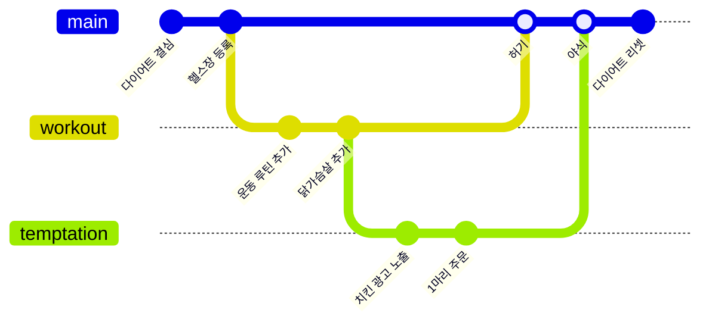

## Skills
<div align="start">

<h5>Frontend</h3>


<h5>Web Basics</h3>


<h5>DevOps & Cloud</h3>


<h5>CI / CD</h3>


</div>


## Interest

### 기계식 키보드 & 3D렌더링

```stl
solid 
facet normal -0.008970544673502445 -0.9198219180107117 0.39223355054855347
outer loop
vertex -5.5248003005981445 -3.025355815887451 0.5074313282966614
vertex -5.580819129943848 -2.809497594833374 1.0123565196990967
vertex -5.729198455810547 -2.8097236156463623 1.0084329843521118
endloop
endfacet
facet normal 0.0 -0.918535053730011 0.3953394889831543
outer loop
vertex -5.5248003005981445 -3.025355815887451 0.5074313282966614
vertex -5.729198455810547 -2.8097236156463623 1.0084329843521118
vertex -5.729197978973389 -3.025355815887451 0.5074313282966614
endloop
endfacet
facet normal -0.024394087493419647 -0.9232792854309082 0.38335394859313965
outer loop
vertex -5.345829010009766 -3.025355815887451 0.5074313282966614
vertex -5.457911014556885 -2.8089733123779297 1.0214402675628662
vertex -5.580819129943848 -2.809497594833374 1.0123565196990967
endloop
endfacet
facet normal 0.0 -0.9194995760917664 0.39309099316596985
outer loop
vertex -5.345829010009766 -3.025355815887451 0.5074313282966614
vertex -5.580819129943848 -2.809497594833374 1.0123565196990967
vertex -5.5248003005981445 -3.025355815887451 0.5074313282966614
endloop
endfacet
facet normal -0.0004995812196284533 0.9995493292808533 -0.030015144497156143
outer loop
vertex -5.729198455810547 -1.9578615427017212 0.4547179341316223
vertex -5.729198455810547 -1.94253671169281 0.9650577902793884
vertex -5.580760955810547 -1.942344069480896 0.9690024256706238
endloop
endfacet
facet normal 0.0 0.9995450973510742 -0.03015921078622341
outer loop
vertex -5.729198455810547 -1.9578615427017212 0.4547179341316223
vertex -5.580760955810547 -1.942344069480896 0.9690024256706238
vertex -5.5248003005981445 -1.9578615427017212 0.4547179341316223
endloop
endfacet
facet normal 0.0 -0.9227567315101624 0.38538292050361633
outer loop
vertex -6.261713981628418 -3.025355815887451 0.5074313282966614
vertex -6.183696269989014 -2.808669090270996 1.02626371383667
vertex -6.348337650299072 -3.025355815887451 0.5074313282966614
endloop
endfacet
facet normal 0.0 -0.9216625094413757 0.3879925608634949
outer loop
vertex -5.259205341339111 -3.025355815887451 0.5074313282966614
vertex -5.457911014556885 -2.8089733123779297 1.0214402675628662
vertex -5.345829010009766 -3.025355815887451 0.5074313282966614
endloop
endfacet
facet normal 0.024944650009274483 -0.9202107787132263 0.39062756299972534
outer loop
vertex -6.082742691040039 -3.025355815887451 0.5074313282966614
vertex -6.026723861694336 -2.809497594833374 1.0123565196990967
vertex -6.149632453918457 -2.8089733123779297 1.0214402675628662
endloop
endfacet
facet normal 0.0 -0.9216625094413757 0.3879925608634949
outer loop
vertex -6.082742691040039 -3.025355815887451 0.5074313282966614
vertex -6.149632453918457 -2.8089733123779297 1.0214402675628662
vertex -6.261713981628418 -3.025355815887451 0.5074313282966614
endloop
endfacet
facet normal 0.009054262191057205 -0.9184974431991577 0.3953232765197754
outer loop
vertex -5.878345012664795 -3.025355815887451 0.5074313282966614
vertex -5.878344535827637 -2.8097236156463623 1.0084329843521118
vertex -6.026723861694336 -2.809497594833374 1.0123565196990967
endloop
endfacet
facet normal 0.0 -0.9194995760917664 0.39309099316596985
outer loop
vertex -5.878345012664795 -3.025355815887451 0.5074313282966614
vertex -6.026723861694336 -2.809497594833374 1.0123565196990967
vertex -6.082742691040039 -3.025355815887451 0.5074313282966614
endloop
endfacet
facet normal 0.0004943170351907611 0.9995433688163757 -0.030212946236133575
outer loop
vertex -6.082742691040039 -1.9578615427017212 0.4547179341316223
vertex -6.026782035827637 -1.942344069480896 0.9690024256706238
vertex -5.878344535827637 -1.94253671169281 0.9650577902793884
endloop
endfacet
facet normal 0.0 0.9995494484901428 -0.03001514822244644
outer loop
vertex -6.082742691040039 -1.9578615427017212 0.4547179341316223
vertex -5.878344535827637 -1.94253671169281 0.9650577902793884
vertex -5.878344535827637 -1.9578615427017212 0.4547179341316223
endloop
endfacet
facet normal -0.0013745991745963693 0.9995396137237549 -0.030308619141578674
outer loop
vertex -5.5248003005981445 -1.9578615427017212 0.4547179341316223
vertex -5.580760955810547 -1.942344069480896 0.9690024256706238
vertex -5.45780611038208 -1.9418981075286865 0.9781332612037659
endloop
endfacet
facet normal 0.0 0.9995352625846863 -0.030484426766633987
outer loop
vertex -5.5248003005981445 -1.9578615427017212 0.4547179341316223
vertex -5.45780611038208 -1.9418981075286865 0.9781332612037659
vertex -5.345829010009766 -1.9578615427017212 0.4547179341316223
endloop
endfacet
facet normal -0.07402926683425903 0.04918499290943146 0.9960424304008484
outer loop
vertex -5.459897994995117 -1.9515876770019531 0.9884046316146851
vertex -5.58183479309082 -1.9520341157913208 0.9793639183044434
vertex -5.58183479309082 -2.795595645904541 1.0210193395614624
endloop
endfacet
facet normal -0.07403028756380081 0.0491851344704628 0.9960423111915588
outer loop
vertex -5.459897994995117 -1.9515876770019531 0.9884046316146851
vertex -5.58183479309082 -2.795595645904541 1.0210193395614624
vertex -5.459897994995117 -2.795149087905884 1.0300601720809937
endloop
endfacet
facet normal -0.9549729228019714 0.014633424580097198 0.29633182287216187
outer loop
vertex -6.440685272216797 -2.9319605827331543 0.5028194189071655
vertex -6.27250862121582 -2.714665174484253 1.0340629816055298
vertex -6.27252197265625 -2.0295636653900146 1.0001883506774902
endloop
endfacet
facet normal -0.9549727439880371 0.014633040875196457 0.296332448720932
outer loop
vertex -6.440685272216797 -2.9319605827331543 0.5028194189071655
vertex -6.27252197265625 -2.0295636653900146 1.0001883506774902
vertex -6.440685272216797 -2.046388864517212 0.459089457988739
endloop
endfacet
facet normal 0.0 0.9995494484901428 -0.03001514822244644
outer loop
vertex -5.729198455810547 -1.94253671169281 0.9650577902793884
vertex -5.729198455810547 -1.9578615427017212 0.4547179341316223
vertex -5.878344535827637 -1.9578615427017212 0.4547179341316223
endloop
endfacet
facet normal 0.0 0.9995494484901428 -0.03001514822244644
outer loop
vertex -5.729198455810547 -1.94253671169281 0.9650577902793884
vertex -5.878344535827637 -1.9578615427017212 0.4547179341316223
vertex -5.878344535827637 -1.94253671169281 0.9650577902793884
endloop
endfacet
facet normal 0.9549727439880371 0.014633454382419586 0.296332448720932
outer loop
vertex -5.166857719421387 -2.046388864517212 0.459089457988739
vertex -5.335021018981934 -2.0295636653900146 1.0001883506774902
vertex -5.335034370422363 -2.714665174484253 1.0340629816055298
endloop
endfacet
facet normal 0.9549729228019714 0.014633016660809517 0.2963319718837738
outer loop
vertex -5.166857719421387 -2.046388864517212 0.459089457988739
vertex -5.335034370422363 -2.714665174484253 1.0340629816055298
vertex -5.166857719421387 -2.9319605827331543 0.5028194189071655
endloop
endfacet
facet normal 0.0 -0.918535053730011 0.3953394889831543
outer loop
vertex -5.878344535827637 -2.8097236156463623 1.0084329843521118
vertex -5.878345012664795 -3.025355815887451 0.5074313282966614
vertex -5.729197978973389 -3.025355815887451 0.5074313282966614
endloop
endfacet
facet normal 0.0 -0.918535053730011 0.3953394889831543
outer loop
vertex -5.878344535827637 -2.8097236156463623 1.0084329843521118
vertex -5.729197978973389 -3.025355815887451 0.5074313282966614
vertex -5.729198455810547 -2.8097236156463623 1.0084329843521118
endloop
endfacet
facet normal -0.02654668688774109 0.04930294677615166 0.9984310269355774
outer loop
vertex -5.58183479309082 -1.9520341157913208 0.9793639183044434
vertex -5.729198455810547 -1.9522271156311035 0.9754552841186523
vertex -5.729198455810547 -2.795788526535034 1.0171107053756714
endloop
endfacet
facet normal -0.026546647772192955 0.04930294305086136 0.9984310269355774
outer loop
vertex -5.58183479309082 -1.9520341157913208 0.9793639183044434
vertex -5.729198455810547 -2.795788526535034 1.0171107053756714
vertex -5.58183479309082 -2.795595645904541 1.0210193395614624
endloop
endfacet
facet normal 0.0 0.9991329908370972 0.04163242504000664
outer loop
vertex 7.323099613189697 1.3343266248703003 1.0239226818084717
vertex 7.323104381561279 1.3560185432434082 0.5033401846885681
vertex 7.151397228240967 1.3560185432434082 0.5033401846885681
endloop
endfacet
facet normal -0.0003161983622703701 0.9991285800933838 0.041736532002687454
outer loop
vertex 7.323099613189697 1.3343266248703003 1.0239226818084717
vertex 7.151397228240967 1.3560185432434082 0.5033401846885681
vertex 7.151397228240967 1.3343932628631592 1.021026611328125
endloop
endfacet
facet normal 0.0 0.9991329908370972 0.04163242504000664
outer loop
vertex 7.323099613189697 1.3343266248703003 1.0239226818084717
vertex 7.612001895904541 1.3560185432434082 0.5033401846885681
vertex 7.323104381561279 1.3560185432434082 0.5033401846885681
endloop
endfacet
facet normal -0.9598517417907715 -0.006368436850607395 0.2804354429244995
outer loop
vertex 6.3793625831604 0.3805570602416992 0.48118704557418823
vertex 6.540866374969482 0.5588365793228149 1.038017749786377
vertex 6.5408525466918945 1.2452175617218018 1.0535575151443481
endloop
endfacet
facet normal -0.9598516225814819 -0.00636880612000823 0.2804359495639801
outer loop
vertex 6.3793625831604 0.3805570602416992 0.48118704557418823
vertex 6.5408525466918945 1.2452175617218018 1.0535575151443481
vertex 6.3793625831604 1.267646312713623 0.5013331770896912
endloop
endfacet
facet normal 0.0 0.9991474151611328 0.041284944862127304
outer loop
vertex 6.819798946380615 1.3340911865234375 1.0340096950531006
vertex 6.690792560577393 1.3560185432434082 0.5033401846885681
vertex 6.503493785858154 1.3560185432434082 0.5033401846885681
endloop
endfacet
facet normal 0.0014664632035419345 0.9991819858551025 0.0404122918844223
outer loop
vertex 6.819798946380615 1.3340911865234375 1.0340096950531006
vertex 6.503493785858154 1.3560185432434082 0.5033401846885681
vertex 6.658225059509277 1.3337757587432861 1.0476716756820679
endloop
endfacet
facet normal 0.9598515629768372 -0.006368305534124374 0.28043606877326965
outer loop
vertex 7.923431873321533 1.267646312713623 0.5013331770896912
vertex 7.761941909790039 1.2452175617218018 1.053557276725769
vertex 7.761928081512451 0.5588365793228149 1.0380178689956665
endloop
endfacet
facet normal 0.9598517417907715 -0.0063688140362501144 0.2804354727268219
outer loop
vertex 7.923431873321533 1.267646312713623 0.5013331770896912
vertex 7.761928081512451 0.5588365793228149 1.0380178689956665
vertex 7.923431873321533 0.3805570602416992 0.48118698596954346
endloop
endfacet
facet normal 0.06293953210115433 -0.022659437730908394 0.9977600574493408
outer loop
vertex 6.979695796966553 0.4795427918434143 1.0144671201705933
vertex 6.979694843292236 1.3239147663116455 1.033643126487732
vertex 6.822179317474365 1.3236892223358154 1.0435742139816284
endloop
endfacet
facet normal 0.06293877214193344 -0.022659579291939735 0.9977601170539856
outer loop
vertex 6.979695796966553 0.4795427918434143 1.0144671201705933
vertex 6.822179317474365 1.3236892223358154 1.0435742139816284
vertex 6.822178363800049 0.47931724786758423 1.0243982076644897
endloop
endfacet
facet normal 0.0 0.9991329908370972 0.04163242504000664
outer loop
vertex 6.979694843292236 1.3343266248703003 1.0239226818084717
vertex 6.979690074920654 1.3560185432434082 0.5033401846885681
vertex 6.690792560577393 1.3560185432434082 0.5033401846885681
endloop
endfacet
facet normal 0.0011161579750478268 0.9991579651832581 0.041014041751623154
outer loop
vertex 6.979694843292236 1.3343266248703003 1.0239226818084717
vertex 6.690792560577393 1.3560185432434082 0.5033401846885681
vertex 6.819798946380615 1.3340911865234375 1.0340096950531006
endloop
endfacet
facet normal 0.0 0.9991658329963684 0.04083650931715965
outer loop
vertex 7.641056537628174 1.3337807655334473 1.0474421977996826
vertex 7.795206546783447 1.3560185432434082 0.5033401846885681
vertex 7.612001895904541 1.3560185432434082 0.5033401846885681
endloop
endfacet
facet normal 0.0 0.9991286396980286 0.04173653572797775
outer loop
vertex 7.151397228240967 1.3343932628631592 1.021026611328125
vertex 7.151397228240967 1.3560185432434082 0.5033401846885681
vertex 6.979690074920654 1.3560185432434082 0.5033401846885681
endloop
endfacet
facet normal 0.0003144406364299357 0.9991329312324524 0.04163241758942604
outer loop
vertex 7.151397228240967 1.3343932628631592 1.021026611328125
vertex 6.979690074920654 1.3560185432434082 0.5033401846885681
vertex 6.979694843292236 1.3343266248703003 1.0239226818084717
endloop
endfacet
facet normal 0.016859136521816254 -0.02270127646625042 0.9996001124382019
outer loop
vertex 6.979694843292236 1.3239147663116455 1.033643126487732
vertex 6.979695796966553 0.4795427918434143 1.0144671201705933
vertex 7.151397228240967 0.47960859537124634 1.0115727186203003
endloop
endfacet
facet normal 0.016859011724591255 -0.02270130254328251 0.9996001124382019
outer loop
vertex 6.979694843292236 1.3239147663116455 1.033643126487732
vertex 7.151397228240967 0.47960859537124634 1.0115727186203003
vertex 7.151397228240967 1.3239803314208984 1.030748724937439
endloop
endfacet
facet normal 0.0841919481754303 -0.022628488019108772 0.9961925745010376
outer loop
vertex 6.660993576049805 1.3233799934387207 1.057193398475647
vertex 6.660798072814941 0.4790077805519104 1.0380300283432007
vertex 6.822178363800049 0.47931724786758423 1.0243982076644897
endloop
endfacet
facet normal 0.08421527594327927 -0.02262396179139614 0.9961907267570496
outer loop
vertex 6.660993576049805 1.3233799934387207 1.057193398475647
vertex 6.822178363800049 0.47931724786758423 1.0243982076644897
vertex 6.822179317474365 1.3236892223358154 1.0435742139816284
endloop
endfacet
facet normal 0.0 0.9991329908370972 0.04163234680891037
outer loop
vertex -6.801387310028076 1.3343267440795898 1.0239207744598389
vertex -6.801382541656494 1.3560185432434082 0.5033401846885681
vertex -6.970890045166016 1.3560185432434082 0.5033401846885681
endloop
endfacet
facet normal -0.00032027089037001133 0.9991285800933838 0.04173644632101059
outer loop
vertex -6.801387310028076 1.3343267440795898 1.0239207744598389
vertex -6.970890045166016 1.3560185432434082 0.5033401846885681
vertex -6.970890045166016 1.3343933820724487 1.0210248231887817
endloop
endfacet
facet normal -0.0011306017404422164 0.9991579055786133 0.04101398587226868
outer loop
vertex -6.801387310028076 1.3343267440795898 1.0239207744598389
vertex -6.643538951873779 1.334091305732727 1.0340076684951782
vertex -6.516186714172363 1.3560185432434082 0.5033401846885681
endloop
endfacet
facet normal 0.0 0.9991329908370972 0.04163234680891037
outer loop
vertex -6.801387310028076 1.3343267440795898 1.0239207744598389
vertex -6.516186714172363 1.3560185432434082 0.5033401846885681
vertex -6.801382541656494 1.3560185432434082 0.5033401846885681
endloop
endfacet
facet normal -0.9608145356178284 -0.006293619982898235 0.27712056040763855
outer loop
vertex -7.733033657073975 0.3805570602416992 0.48118704557418823
vertex -7.573601245880127 0.5588339567184448 1.0380096435546875
vertex -7.573615074157715 1.2452179193496704 1.0535500049591064
endloop
endfacet
facet normal -0.9608145952224731 -0.006293508689850569 0.2771204113960266
outer loop
vertex -7.733033657073975 0.3805570602416992 0.48118704557418823
vertex -7.573615074157715 1.2452179193496704 1.0535500049591064
vertex -7.733033657073975 1.267646312713623 0.5013331770896912
endloop
endfacet
facet normal 0.0 0.9991474151611328 0.04128487780690193
outer loop
vertex -7.298240661621094 1.334091305732727 1.0340076684951782
vertex -7.425593376159668 1.3560185432434082 0.5033401846885681
vertex -7.610492706298828 1.3560185432434082 0.5033401846885681
endloop
endfacet
facet normal 0.0014846913982182741 0.9991819858551025 0.040412694215774536
outer loop
vertex -7.298240661621094 1.334091305732727 1.0340076684951782
vertex -7.610492706298828 1.3560185432434082 0.5033401846885681
vertex -7.457744598388672 1.3337757587432861 1.0476692914962769
endloop
endfacet
facet normal 0.9608145356178284 -0.006293523125350475 0.2771205008029938
outer loop
vertex -6.208745956420898 1.267646312713623 0.5013331770896912
vertex -6.368164539337158 1.2452179193496704 1.0535497665405273
vertex -6.368178367614746 0.5588339567184448 1.0380096435546875
endloop
endfacet
facet normal 0.9608145356178284 -0.006293529644608498 0.2771205008029938
outer loop
vertex -6.208745956420898 1.267646312713623 0.5013331770896912
vertex -6.368178367614746 0.5588339567184448 1.0380096435546875
vertex -6.208745956420898 0.3805570602416992 0.48118698596954346
endloop
endfacet
facet normal -0.06375225633382797 -0.022658228874206543 0.9977084994316101
outer loop
vertex -6.801387310028076 1.3239147663116455 1.033643126487732
vertex -6.801388740539551 0.4795427918434143 1.0144671201705933
vertex -6.6458892822265625 0.47931724786758423 1.0243982076644897
endloop
endfacet
facet normal -0.06375283747911453 -0.02265833504498005 0.9977084398269653
outer loop
vertex -6.801387310028076 1.3239147663116455 1.033643126487732
vertex -6.6458892822265625 0.47931724786758423 1.0243982076644897
vertex -6.6458892822265625 1.3236892223358154 1.0435742139816284
endloop
endfacet
facet normal 0.0 0.9991329908370972 0.04163234680891037
outer loop
vertex -7.140392303466797 1.3343267440795898 1.0239207744598389
vertex -7.140397071838379 1.3560185432434082 0.5033401846885681
vertex -7.425593376159668 1.3560185432434082 0.5033401846885681
endloop
endfacet
facet normal -0.08570339530706406 -0.02262098714709282 0.9960638880729675
outer loop
vertex -6.6458892822265625 1.3236892223358154 1.0435742139816284
vertex -6.6458892822265625 0.47931724786758423 1.0243982076644897
vertex -6.490039825439453 0.47901302576065063 1.037800908088684
endloop
endfacet
facet normal -0.08572732657194138 -0.022625386714935303 0.9960616827011108
outer loop
vertex -6.6458892822265625 1.3236892223358154 1.0435742139816284
vertex -6.490039825439453 0.47901302576065063 1.037800908088684
vertex -6.490227699279785 1.3233850002288818 1.0569645166397095
endloop
endfacet
facet normal 0.0 0.9991658329963684 0.04083646088838577
outer loop
vertex -6.487502574920654 1.3337808847427368 1.0474399328231812
vertex -6.335328578948975 1.3560185432434082 0.5033401846885681
vertex -6.516186714172363 1.3560185432434082 0.5033401846885681
endloop
endfacet
facet normal -0.0015345761785283685 0.9991613626480103 0.040917180478572845
outer loop
vertex -6.487502574920654 1.3337808847427368 1.0474399328231812
vertex -6.516186714172363 1.3560185432434082 0.5033401846885681
vertex -6.643538951873779 1.334091305732727 1.0340076684951782
endloop
endfacet
facet normal 0.0 0.9991286396980286 0.04173645004630089
outer loop
vertex -6.970890045166016 1.3343933820724487 1.0210248231887817
vertex -6.970890045166016 1.3560185432434082 0.5033401846885681
vertex -7.140397071838379 1.3560185432434082 0.5033401846885681
endloop
endfacet
facet normal 0.0003184914530720562 0.9991329312324524 0.04163234308362007
outer loop
vertex -6.970890045166016 1.3343933820724487 1.0210248231887817
vertex -7.140397071838379 1.3560185432434082 0.5033401846885681
vertex -7.140392303466797 1.3343267440795898 1.0239207744598389
endloop
endfacet
facet normal 0.0006301358807832003 0.9999991059303284 -0.001181829022243619
outer loop
vertex -7.107405185699463 -0.8491675853729248 0.4541527032852173
vertex -7.0066423416137695 -0.8486123085021973 0.9777230620384216
vertex -6.7762451171875 -0.8487668633460999 0.9697920083999634
endloop
endfacet
facet normal 0.0 0.9999997019767761 -0.000777136068791151
outer loop
vertex -7.107405185699463 -0.8491675853729248 0.4541527032852173
vertex -6.7762451171875 -0.8487668633460999 0.9697920083999634
vertex -6.850039482116699 -0.8491675853729248 0.4541527032852173
endloop
endfacet
facet normal -0.01707790605723858 -0.022701218724250793 0.9995964169502258
outer loop
vertex -6.970890045166016 1.3239803314208984 1.030748724937439
vertex -6.970890045166016 0.47960859537124634 1.0115727186203003
vertex -6.801388740539551 0.4795427918434143 1.0144671201705933
endloop
endfacet
facet normal -0.017077729105949402 -0.022701183333992958 0.9995964169502258
outer loop
vertex -6.970890045166016 1.3239803314208984 1.030748724937439
vertex -6.801388740539551 0.4795427918434143 1.0144671201705933
vertex -6.801387310028076 1.3239147663116455 1.033643126487732
endloop
endfacet
facet normal -0.005074090790003538 -0.9301724433898926 0.36708778142929077
outer loop
vertex -6.2941508293151855 -1.7167925834655762 0.9881120920181274
vertex -6.544928073883057 -1.7168958187103271 0.9843841195106506
vertex -6.544927597045898 -1.9177507162094116 0.4754331111907959
endloop
endfacet
facet normal 0.0 -0.9310302734375 0.3649420142173767
outer loop
vertex -6.2941508293151855 -1.7167925834655762 0.9881120920181274
vertex -6.544927597045898 -1.9177507162094116 0.4754331111907959
vertex -6.217986106872559 -1.9177507162094116 0.4754331111907959
endloop
endfacet
facet normal -0.0006912469398230314 0.9999990463256836 -0.0011935889488086104
outer loop
vertex -5.982450485229492 -0.8491675853729248 0.4541527032852173
vertex -6.0832133293151855 -0.8486123085021973 0.9777235388755798
vertex -5.799551486968994 -0.8484034538269043 0.9884257912635803
endloop
endfacet
facet normal 0.0 0.9999989867210388 -0.0014302250929176807
outer loop
vertex -5.982450485229492 -0.8491675853729248 0.4541527032852173
vertex -5.799551486968994 -0.8484034538269043 0.9884257912635803
vertex -5.665175437927246 -0.8491675853729248 0.4541527032852173
endloop
endfacet
facet normal 0.0002658703306224197 0.9999997615814209 -0.0006578657776117325
outer loop
vertex -6.7762451171875 -0.8487668633460999 0.9697920083999634
vertex -6.544927597045898 -0.84883052110672 0.9665127992630005
vertex -6.544927597045898 -0.8491675853729248 0.4541527032852173
endloop
endfacet
facet normal 0.0 0.9999997019767761 -0.000777136068791151
outer loop
vertex -6.7762451171875 -0.8487668633460999 0.9697920083999634
vertex -6.544927597045898 -0.8491675853729248 0.4541527032852173
vertex -6.850039482116699 -0.8491675853729248 0.4541527032852173
endloop
endfacet
facet normal 0.037655506283044815 0.01989666186273098 0.999092698097229
outer loop
vertex -7.004743576049805 -0.858599841594696 0.9877875447273254
vertex -7.287832260131836 -0.8583874106407166 0.9984528422355652
vertex -7.287832260131836 -1.702809453010559 1.0152692794799805
endloop
endfacet
facet normal 0.037655916064977646 0.019896522164344788 0.999092698097229
outer loop
vertex -7.004743576049805 -0.858599841594696 0.9877875447273254
vertex -7.287832260131836 -1.702809453010559 1.0152692794799805
vertex -7.004743576049805 -1.703021764755249 1.0046038627624512
endloop
endfacet
facet normal -0.037655506283044815 0.019896524026989937 0.999092698097229
outer loop
vertex -5.802023410797119 -0.8583874106407166 0.9984528422355652
vertex -6.08511209487915 -0.858599841594696 0.9877875447273254
vertex -6.08511209487915 -1.703021764755249 1.0046038627624512
endloop
endfacet
facet normal -0.037655916064977646 0.01989666186273098 0.9990926384925842
outer loop
vertex -5.802023410797119 -0.8583874106407166 0.9984528422355652
vertex -6.08511209487915 -1.703021764755249 1.0046038627624512
vertex -5.802023410797119 -1.702809453010559 1.0152692794799805
endloop
endfacet
facet normal -0.014903687871992588 0.019908368587493896 0.9996907114982605
outer loop
vertex -6.544927597045898 -0.8588220477104187 0.9766270518302917
vertex -6.544928073883057 -1.7032440900802612 0.9934433102607727
vertex -6.295524597167969 -1.7031700611114502 0.997160017490387
endloop
endfacet
facet normal -0.014903228729963303 0.01990850269794464 0.9996907114982605
outer loop
vertex -6.544927597045898 -0.8588220477104187 0.9766270518302917
vertex -6.295524597167969 -1.7031700611114502 0.997160017490387
vertex -6.295524597167969 -0.8587481379508972 0.9803436398506165
endloop
endfacet
facet normal 0.004785226657986641 -0.9311500191688538 0.3646048605442047
outer loop
vertex -6.544928073883057 -1.7168958187103271 0.9843841195106506
vertex -6.776163101196289 -1.7168049812316895 0.9876509308815002
vertex -6.850039482116699 -1.9177507162094116 0.4754331111907959
endloop
endfacet
facet normal 0.0 -0.9301844239234924 0.367092490196228
outer loop
vertex -6.544928073883057 -1.7168958187103271 0.9843841195106506
vertex -6.850039482116699 -1.9177507162094116 0.4754331111907959
vertex -6.544927597045898 -1.9177507162094116 0.4754331111907959
endloop
endfacet
facet normal 0.0006759040406905115 0.9999985098838806 -0.001600222778506577
outer loop
vertex -7.424679756164551 -0.8491675853729248 0.4541527032852173
vertex -7.290304183959961 -0.8484034538269043 0.9884254336357117
vertex -7.0066423416137695 -0.8486123085021973 0.9777230620384216
endloop
endfacet
facet normal 0.0 0.999999463558197 -0.0010605576680973172
outer loop
vertex -7.424679756164551 -0.8491675853729248 0.4541527032852173
vertex -7.0066423416137695 -0.8486123085021973 0.9777230620384216
vertex -7.107405185699463 -0.8491675853729248 0.4541527032852173
endloop
endfacet
facet normal -0.012316429056227207 -0.9358991980552673 0.3520525097846985
outer loop
vertex -5.6651716232299805 -1.9177507162094116 0.4754331111907959
vertex -5.799681186676025 -1.7163150310516357 1.0062255859375
vertex -6.083319187164307 -1.7165954113006592 0.9955572485923767
endloop
endfacet
facet normal 0.0 -0.9326785802841187 0.3607085943222046
outer loop
vertex -5.6651716232299805 -1.9177507162094116 0.4754331111907959
vertex -6.083319187164307 -1.7165954113006592 0.9955572485923767
vertex -5.982450485229492 -1.9177507162094116 0.4754331111907959
endloop
endfacet
facet normal 0.01163596473634243 -0.9314326643943787 0.3637276589870453
outer loop
vertex -6.850039482116699 -1.9177507162094116 0.4754331111907959
vertex -6.776163101196289 -1.7168049812316895 0.9876509308815002
vertex -7.006536483764648 -1.7165956497192383 0.9955568313598633
endloop
endfacet
facet normal 0.0 -0.9326786398887634 0.36070847511291504
outer loop
vertex -6.850039482116699 -1.9177507162094116 0.4754331111907959
vertex -7.006536483764648 -1.7165956497192383 0.9955568313598633
vertex -7.107405185699463 -1.9177507162094116 0.4754331111907959
endloop
endfacet
facet normal 0.014163308776915073 0.019908715039491653 0.9997014999389648
outer loop
vertex -6.774829387664795 -0.8587571978569031 0.9798827767372131
vertex -6.774829387664795 -1.7031792402267456 0.9966991543769836
vertex -6.544928073883057 -1.7032440900802612 0.9934433102607727
endloop
endfacet
facet normal 0.0141627611592412 0.019908566027879715 0.9997014999389648
outer loop
vertex -6.774829387664795 -0.8587571978569031 0.9798827767372131
vertex -6.544928073883057 -1.7032440900802612 0.9934433102607727
vertex -6.544927597045898 -0.8588220477104187 0.9766270518302917
endloop
endfacet
facet normal 0.012563459575176239 -0.9334222674369812 0.35855960845947266
outer loop
vertex -7.107405185699463 -1.9177507162094116 0.4754331111907959
vertex -7.006536483764648 -1.7165956497192383 0.9955568313598633
vertex -7.29017448425293 -1.7163151502609253 1.006225347518921
endloop
endfacet
facet normal 0.0 -0.9349387884140015 0.35480910539627075
outer loop
vertex -7.107405185699463 -1.9177507162094116 0.4754331111907959
vertex -7.29017448425293 -1.7163151502609253 1.006225347518921
vertex -7.424683570861816 -1.9177507162094116 0.4754331111907959
endloop
endfacet
facet normal 0.0343678817152977 0.019898882135748863 0.9992111325263977
outer loop
vertex -6.774829387664795 -0.8587571978569031 0.9798827767372131
vertex -7.004743576049805 -0.858599841594696 0.9877875447273254
vertex -7.004743576049805 -1.703021764755249 1.0046038627624512
endloop
endfacet
facet normal 0.0343676321208477 0.019898949190974236 0.9992111325263977
outer loop
vertex -6.774829387664795 -0.8587571978569031 0.9798827767372131
vertex -7.004743576049805 -1.703021764755249 1.0046038627624512
vertex -6.774829387664795 -1.7031792402267456 0.9966991543769836
endloop
endfacet
facet normal -0.0006593214347958565 0.9999994039535522 -0.0008908407762646675
outer loop
vertex -6.2179856300354 -0.8491675853729248 0.4541527032852173
vertex -6.294066429138184 -0.8487579822540283 0.9702545404434204
vertex -6.0832133293151855 -0.8486123085021973 0.9777235388755798
endloop
endfacet
facet normal 0.0 0.999999463558197 -0.0010605567367747426
outer loop
vertex -6.2179856300354 -0.8491675853729248 0.4541527032852173
vertex -6.0832133293151855 -0.8486123085021973 0.9777235388755798
vertex -5.982450485229492 -0.8491675853729248 0.4541527032852173
endloop
endfacet
facet normal -0.03536256030201912 0.01989826187491417 0.9991764426231384
outer loop
vertex -6.08511209487915 -0.858599841594696 0.9877875447273254
vertex -6.295524597167969 -0.8587481379508972 0.9803436398506165
vertex -6.295524597167969 -1.7031700611114502 0.997160017490387
endloop
endfacet
facet normal -0.035362280905246735 0.0198981910943985 0.9991764426231384
outer loop
vertex -6.08511209487915 -0.858599841594696 0.9877875447273254
vertex -6.295524597167969 -1.7031700611114502 0.997160017490387
vertex -6.08511209487915 -1.703021764755249 1.0046038627624512
endloop
endfacet
facet normal -0.9566628336906433 0.0057979486882686615 0.2911401093006134
outer loop
vertex -7.749056816101074 -1.8246872425079346 0.4735798239707947
vertex -7.580833435058594 -1.6228383779525757 1.022328495979309
vertex -7.580848693847656 -0.9364256262779236 1.0086086988449097
endloop
endfacet
facet normal -0.9566628336906433 0.005797951016575098 0.2911401093006134
outer loop
vertex -7.749056816101074 -1.8246872425079346 0.4735798239707947
vertex -7.580848693847656 -0.9364256262779236 1.0086086988449097
vertex -7.749056816101074 -0.9375452995300293 0.455912709236145
endloop
endfacet
facet normal 0.9566628932952881 0.005797896534204483 0.29114004969596863
outer loop
vertex -5.340798854827881 -0.9375452995300293 0.455912709236145
vertex -5.509006977081299 -0.9364256262779236 1.0086088180541992
vertex -5.509022235870361 -1.6228383779525757 1.022328495979309
endloop
endfacet
facet normal 0.9566628336906433 0.005797951482236385 0.2911401093006134
outer loop
vertex -5.340798854827881 -0.9375452995300293 0.455912709236145
vertex -5.509022235870361 -1.6228383779525757 1.022328495979309
vertex -5.340798854827881 -1.8246872425079346 0.4735798239707947
endloop
endfacet
facet normal 0.0 -0.9349387288093567 0.3548091650009155
outer loop
vertex -5.799681186676025 -1.7163150310516357 1.0062255859375
vertex -5.6651716232299805 -1.9177507162094116 0.4754331111907959
vertex -5.474014759063721 -1.9177507162094116 0.4754331111907959
endloop
endfacet
facet normal -0.019830049946904182 -0.9387304186820984 0.34408140182495117
outer loop
vertex -5.799681186676025 -1.7163150310516357 1.0062255859375
vertex -5.474014759063721 -1.9177507162094116 0.4754331111907959
vertex -5.634841442108154 -1.7160457372665405 1.0164602994918823
endloop
endfacet
facet normal 0.0 0.9999984502792358 -0.0017707410734146833
outer loop
vertex -5.634904861450195 -0.8482033610343933 0.9986833930015564
vertex -5.4743547439575195 -0.8491675853729248 0.4541527032852173
vertex -5.665175437927246 -0.8491675853729248 0.4541527032852173
endloop
endfacet
facet normal -0.001108805532567203 0.9999979138374329 -0.001709101372398436
outer loop
vertex -5.634904861450195 -0.8482033610343933 0.9986833930015564
vertex -5.665175437927246 -0.8491675853729248 0.4541527032852173
vertex -5.799551486968994 -0.8484034538269043 0.9884257912635803
endloop
endfacet
facet normal 0.0 -0.9370445013046265 0.34920990467071533
outer loop
vertex -7.458677768707275 -1.7160398960113525 1.0166893005371094
vertex -7.620113372802734 -1.9177507162094116 0.4754331111907959
vertex -7.424683570861816 -1.9177507162094116 0.4754331111907959
endloop
endfacet
facet normal 0.020220832899212837 -0.9364367127418518 0.3502533733844757
outer loop
vertex -7.458677768707275 -1.7160398960113525 1.0166893005371094
vertex -7.424683570861816 -1.9177507162094116 0.4754331111907959
vertex -7.29017448425293 -1.7163151502609253 1.006225347518921
endloop
endfacet
facet normal -1.0 0.0 0.0
outer loop
vertex -7.441245079040527 -1.2231513261795044 0.010831126943230629
vertex -7.441245079040527 -2.806506872177124 0.010831127874553204
vertex -7.441245079040527 -2.806506872177124 0.08950746059417725
endloop
endfacet
facet normal -1.0 0.0 0.0
outer loop
vertex -7.441245079040527 -1.2231513261795044 0.010831126943230629
vertex -7.441245079040527 -2.806506872177124 0.08950746059417725
vertex -7.441245079040527 -1.2231513261795044 0.08950746059417725
endloop
endfacet
facet normal -0.06207180395722389 0.019872387871146202 0.997873842716217
outer loop
vertex -5.802023410797119 -0.8583874106407166 0.9984528422355652
vertex -5.802023410797119 -1.702809453010559 1.0152692794799805
vertex -5.6375885009765625 -1.7026057243347168 1.0254937410354614
endloop
endfacet
facet normal -0.062070321291685104 0.019872678443789482 0.9978739023208618
outer loop
vertex -5.802023410797119 -0.8583874106407166 0.9984528422355652
vertex -5.6375885009765625 -1.7026057243347168 1.0254937410354614
vertex -5.637786865234375 -0.8581840395927429 1.0086647272109985
endloop
endfacet
facet normal -0.011793720535933971 -0.9333810210227966 0.35869309306144714
outer loop
vertex -5.982450485229492 -1.9177507162094116 0.4754331111907959
vertex -6.083319187164307 -1.7165954113006592 0.9955572485923767
vertex -6.2941508293151855 -1.7167925834655762 0.9881120920181274
endloop
endfacet
facet normal 0.0 -0.9310302734375 0.3649420142173767
outer loop
vertex -5.982450485229492 -1.9177507162094116 0.4754331111907959
vertex -6.2941508293151855 -1.7167925834655762 0.9881120920181274
vertex -6.217986106872559 -1.9177507162094116 0.4754331111907959
endloop
endfacet
facet normal -0.0002767130790743977 0.9999996423721313 -0.0008344390080310404
outer loop
vertex -6.544927597045898 -0.84883052110672 0.9665127992630005
vertex -6.294066429138184 -0.8487579822540283 0.9702545404434204
vertex -6.2179856300354 -0.8491675853729248 0.4541527032852173
endloop
endfacet
facet normal 0.0 0.9999997615814209 -0.0006578658358193934
outer loop
vertex -6.544927597045898 -0.84883052110672 0.9665127992630005
vertex -6.2179856300354 -0.8491675853729248 0.4541527032852173
vertex -6.544927597045898 -0.8491675853729248 0.4541527032852173
endloop
endfacet
facet normal 0.0 -1.0 0.0
outer loop
vertex -7.431244850158691 -2.816506862640381 0.010831126943230629
vertex 7.626713275909424 -2.816506862640381 0.010831127874553204
vertex 7.626713275909424 -2.816506862640381 0.08950746059417725
endloop
endfacet
facet normal 0.0 -1.0 0.0
outer loop
vertex -7.431244850158691 -2.816506862640381 0.010831126943230629
vertex 7.626713275909424 -2.816506862640381 0.08950746059417725
vertex -7.431244850158691 -2.816506862640381 0.08950746059417725
endloop
endfacet
facet normal 0.0 1.0 0.0
outer loop
vertex 7.626713275909424 -1.2131513357162476 0.010831126943230629
vertex -7.431244850158691 -1.2131513357162476 0.010831127874553204
vertex -7.431244850158691 -1.2131513357162476 0.08950746059417725
endloop
endfacet
facet normal 0.0 1.0 -0.0
outer loop
vertex 7.626713275909424 -1.2131513357162476 0.010831126943230629
vertex -7.431244850158691 -1.2131513357162476 0.08950746059417725
vertex 7.626713275909424 -1.2131513357162476 0.08950746059417725
endloop
endfacet
facet normal 0.0 0.0 -1.0
outer loop
vertex -7.431244850158691 -2.806506872177124 0.0008311271667480469
vertex -7.431244850158691 -1.2231513261795044 0.0008311271667480469
vertex 7.626713275909424 -1.2231513261795044 0.0008311271667480469
endloop
endfacet
facet normal 0.0 0.0 -1.0
outer loop
vertex -7.431244850158691 -2.806506872177124 0.0008311271667480469
vertex 7.626713275909424 -1.2231513261795044 0.0008311271667480469
vertex 7.626713275909424 -2.806506872177124 0.0008311271667480469
endloop
endfacet
facet normal -1.0 0.0 0.0
outer loop
vertex -7.441245079040527 2.2661678791046143 0.010831126943230629
vertex -7.441245079040527 0.6828124523162842 0.010831127874553204
vertex -7.441245079040527 0.6828124523162842 0.08950746059417725
endloop
endfacet
facet normal -1.0 0.0 0.0
outer loop
vertex -7.441245079040527 2.2661678791046143 0.010831126943230629
vertex -7.441245079040527 0.6828124523162842 0.08950746059417725
vertex -7.441245079040527 2.2661678791046143 0.08950746059417725
endloop
endfacet
facet normal 1.0 0.0 0.0
outer loop
vertex 7.63671350479126 -2.806506872177124 0.010831126943230629
vertex 7.63671350479126 -1.2231513261795044 0.010831127874553204
vertex 7.63671350479126 -1.2231513261795044 0.08950746059417725
endloop
endfacet
facet normal 1.0 0.0 0.0
outer loop
vertex 7.63671350479126 -2.806506872177124 0.010831126943230629
vertex 7.63671350479126 -1.2231513261795044 0.08950746059417725
vertex 7.63671350479126 -2.806506872177124 0.08950746059417725
endloop
endfacet
facet normal 0.0 -1.0 0.0
outer loop
vertex -7.431244850158691 0.6728124618530273 0.010831126943230629
vertex 7.626713275909424 0.6728124618530273 0.010831127874553204
vertex 7.626713275909424 0.6728124618530273 0.08950746059417725
endloop
endfacet
facet normal 0.0 -1.0 0.0
outer loop
vertex -7.431244850158691 0.6728124618530273 0.010831126943230629
vertex 7.626713275909424 0.6728124618530273 0.08950746059417725
vertex -7.431244850158691 0.6728124618530273 0.08950746059417725
endloop
endfacet
facet normal 0.0 1.0 0.0
outer loop
vertex 7.626713275909424 2.276167869567871 0.010831126943230629
vertex -7.431244850158691 2.276167869567871 0.010831127874553204
vertex -7.431244850158691 2.276167869567871 0.08950746059417725
endloop
endfacet
facet normal 0.0 1.0 -0.0
outer loop
vertex 7.626713275909424 2.276167869567871 0.010831126943230629
vertex -7.431244850158691 2.276167869567871 0.08950746059417725
vertex 7.626713275909424 2.276167869567871 0.08950746059417725
endloop
endfacet
facet normal 0.0 0.0 -1.0
outer loop
vertex -7.431244850158691 0.6828124523162842 0.0008311271667480469
vertex -7.431244850158691 2.2661678791046143 0.0008311271667480469
vertex 7.626713275909424 2.2661678791046143 0.0008311271667480469
endloop
endfacet
facet normal 0.0 0.0 -1.0
outer loop
vertex -7.431244850158691 0.6828124523162842 0.0008311271667480469
vertex 7.626713275909424 2.2661678791046143 0.0008311271667480469
vertex 7.626713275909424 0.6828124523162842 0.0008311271667480469
endloop
endfacet
facet normal 0.0014557611430063844 0.9978931546211243 0.06486198306083679
outer loop
vertex -7.579265594482422 2.4693126678466797 0.558246374130249
vertex -7.476343154907227 2.435199022293091 1.0807703733444214
vertex -7.363322734832764 2.4356274604797363 1.071642279624939
endloop
endfacet
facet normal -0.0 0.9978544116020203 0.06547176092863083
outer loop
vertex -7.579265594482422 2.4693126678466797 0.558246374130249
vertex -7.363322734832764 2.4356274604797363 1.071642279624939
vertex -7.414758682250977 2.4693126678466797 0.558246374130249
endloop
endfacet
facet normal 1.0 0.0 0.0
outer loop
vertex 7.63671350479126 0.6828124523162842 0.010831126943230629
vertex 7.63671350479126 2.2661678791046143 0.010831127874553204
vertex 7.63671350479126 2.2661678791046143 0.08950746059417725
endloop
endfacet
facet normal 1.0 0.0 0.0
outer loop
vertex 7.63671350479126 0.6828124523162842 0.010831126943230629
vertex 7.63671350479126 2.2661678791046143 0.08950746059417725
vertex 7.63671350479126 0.6828124523162842 0.08950746059417725
endloop
endfacet
facet normal 0.0 -0.952848494052887 0.3034464716911316
outer loop
vertex -7.24105978012085 1.4016656875610352 0.5087329149246216
vertex -7.058169364929199 1.4016656875610352 0.5087329149246216
vertex -7.10965633392334 1.5682859420776367 1.0319350957870483
endloop
endfacet
facet normal 0.0 -0.952848494052887 0.3034464716911316
outer loop
vertex -6.893661975860596 1.4016656875610352 0.5087329149246216
vertex -7.10965633392334 1.5682859420776367 1.0319350957870483
vertex -7.058169364929199 1.4016656875610352 0.5087329149246216
endloop
endfacet
facet normal -2.6824645260603575e-07 0.9978544116020203 0.06547173112630844
outer loop
vertex -7.24105978012085 2.4356276988983154 1.0716381072998047
vertex -7.109604835510254 2.4356274604797363 1.071642279624939
vertex -7.058169364929199 2.4693126678466797 0.558246374130249
endloop
endfacet
facet normal 0.0 0.9978544116020203 0.0654718279838562
outer loop
vertex -7.24105978012085 2.4356276988983154 1.0716381072998047
vertex -7.058169364929199 2.4693126678466797 0.558246374130249
vertex -7.24105978012085 2.4693126678466797 0.558246374130249
endloop
endfacet
facet normal 0.0 -0.9545144438743591 0.2981646955013275
outer loop
vertex -7.414758682250977 1.4016656875610352 0.5087329149246216
vertex -7.476249694824219 1.5679391622543335 1.041024088859558
vertex -7.579265594482422 1.4016656875610352 0.5087329149246216
endloop
endfacet
facet normal 0.0 -0.9528484344482422 0.30344659090042114
outer loop
vertex -7.414758682250977 1.4016656875610352 0.5087329149246216
vertex -7.24105978012085 1.4016656875610352 0.5087329149246216
vertex -7.24105978012085 1.5682859420776367 1.0319348573684692
endloop
endfacet
facet normal 2.8841705557169917e-07 0.9978544116020203 0.0654718279838562
outer loop
vertex -7.363322734832764 2.4356274604797363 1.071642279624939
vertex -7.24105978012085 2.4356276988983154 1.0716381072998047
vertex -7.24105978012085 2.4693126678466797 0.558246374130249
endloop
endfacet
facet normal 0.0 0.9978544116020203 0.06547176092863083
outer loop
vertex -7.363322734832764 2.4356274604797363 1.071642279624939
vertex -7.24105978012085 2.4693126678466797 0.558246374130249
vertex -7.414758682250977 2.4693126678466797 0.558246374130249
endloop
endfacet
facet normal -0.0014930880861356854 0.9978630542755127 0.06532274186611176
outer loop
vertex -7.058169364929199 2.4693126678466797 0.558246374130249
vertex -7.109604835510254 2.4356274604797363 1.071642279624939
vertex -6.996584415435791 2.435199022293091 1.0807703733444214
endloop
endfacet
facet normal -0.0 0.9978756308555603 0.06514758616685867
outer loop
vertex -7.058169364929199 2.4693126678466797 0.558246374130249
vertex -6.996584415435791 2.435199022293091 1.0807703733444214
vertex -6.893661975860596 2.4693126678466797 0.558246374130249
endloop
endfacet
facet normal -0.961559534072876 -0.012721177190542221 0.2743016183376312
outer loop
vertex -7.743772983551025 1.4950740337371826 0.5130648612976074
vertex -7.589205741882324 1.6606025695800781 1.0625742673873901
vertex -7.589217185974121 2.345829963684082 1.0943126678466797
endloop
endfacet
facet normal -0.9615595936775208 -0.012721077539026737 0.2743014991283417
outer loop
vertex -7.743772983551025 1.4950740337371826 0.5130648612976074
vertex -7.589217185974121 2.345829963684082 1.0943126678466797
vertex -7.743772983551025 2.3807730674743652 0.5541402697563171
endloop
endfacet
facet normal 0.0014557550894096494 0.9978931546211243 0.06486198306083679
outer loop
vertex -6.534209251403809 2.4693126678466797 0.558246374130249
vertex -6.431286811828613 2.435199022293091 1.0807703733444214
vertex -6.318265914916992 2.4356274604797363 1.071642279624939
endloop
endfacet
facet normal -0.0 0.9978544116020203 0.06547176092863083
outer loop
vertex -6.534209251403809 2.4693126678466797 0.558246374130249
vertex -6.318265914916992 2.4356274604797363 1.071642279624939
vertex -6.369702339172363 2.4693126678466797 0.558246374130249
endloop
endfacet
facet normal 0.9615593552589417 -0.012721206992864609 0.27430227398872375
outer loop
vertex -6.729154586791992 2.3807730674743652 0.5541402697563171
vertex -6.883710861206055 2.345829963684082 1.0943126678466797
vertex -6.883722305297852 1.6606025695800781 1.0625742673873901
endloop
endfacet
facet normal 0.9615593552589417 -0.01272111851722002 0.2743023931980133
outer loop
vertex -6.729154586791992 2.3807730674743652 0.5541402697563171
vertex -6.883722305297852 1.6606025695800781 1.0625742673873901
vertex -6.729154586791992 1.4950740337371826 0.5130648612976074
endloop
endfacet
facet normal 0.0 -0.952848494052887 0.3034464716911316
outer loop
vertex -6.196002960205078 1.4016656875610352 0.5087329149246216
vertex -6.013112545013428 1.4016656875610352 0.5087329149246216
vertex -6.064599990844727 1.5682859420776367 1.0319350957870483
endloop
endfacet
facet normal 0.0 -0.952848494052887 0.3034464716911316
outer loop
vertex -5.848605155944824 1.4016656875610352 0.5087329149246216
vertex -6.064599990844727 1.5682859420776367 1.0319350957870483
vertex -6.013112545013428 1.4016656875610352 0.5087329149246216
endloop
endfacet
facet normal -2.682474189441564e-07 0.9978544116020203 0.06547173112630844
outer loop
vertex -6.196002960205078 2.4356276988983154 1.0716381072998047
vertex -6.064548492431641 2.4356274604797363 1.071642279624939
vertex -6.013112545013428 2.4693126678466797 0.558246374130249
endloop
endfacet
facet normal 0.0 0.9978544116020203 0.0654718279838562
outer loop
vertex -6.196002960205078 2.4356276988983154 1.0716381072998047
vertex -6.013112545013428 2.4693126678466797 0.558246374130249
vertex -6.196002960205078 2.4693126678466797 0.558246374130249
endloop
endfacet
facet normal 0.0 -0.9545144438743591 0.2981646955013275
outer loop
vertex -6.369701862335205 1.4016656875610352 0.5087329149246216
vertex -6.4311933517456055 1.5679391622543335 1.041024088859558
vertex -6.534209251403809 1.4016656875610352 0.5087329149246216
endloop
endfacet
facet normal 0.0 -0.9528484344482422 0.30344659090042114
outer loop
vertex -6.369701862335205 1.4016656875610352 0.5087329149246216
vertex -6.196002960205078 1.4016656875610352 0.5087329149246216
vertex -6.196002960205078 1.5682859420776367 1.0319348573684692
endloop
endfacet
facet normal 2.8841705557169917e-07 0.9978544116020203 0.0654718279838562
outer loop
vertex -6.318265914916992 2.4356274604797363 1.071642279624939
vertex -6.196002960205078 2.4356276988983154 1.0716381072998047
vertex -6.196002960205078 2.4693126678466797 0.558246374130249
endloop
endfacet
facet normal 0.0 0.9978544116020203 0.06547176092863083
outer loop
vertex -6.318265914916992 2.4356274604797363 1.071642279624939
vertex -6.196002960205078 2.4693126678466797 0.558246374130249
vertex -6.369702339172363 2.4693126678466797 0.558246374130249
endloop
endfacet
facet normal -0.001493081683292985 0.9978630542755127 0.06532274186611176
outer loop
vertex -6.013112545013428 2.4693126678466797 0.558246374130249
vertex -6.064548492431641 2.4356274604797363 1.071642279624939
vertex -5.9515275955200195 2.435199022293091 1.0807703733444214
endloop
endfacet
facet normal -0.0 0.9978756308555603 0.06514758616685867
outer loop
vertex -6.013112545013428 2.4693126678466797 0.558246374130249
vertex -5.9515275955200195 2.435199022293091 1.0807703733444214
vertex -5.848605155944824 2.4693126678466797 0.558246374130249
endloop
endfacet
facet normal -0.961559534072876 -0.012721177190542221 0.2743016183376312
outer loop
vertex -6.698716163635254 1.4950740337371826 0.5130648612976074
vertex -6.544148921966553 1.6606025695800781 1.0625742673873901
vertex -6.54416036605835 2.345829963684082 1.0943126678466797
endloop
endfacet
facet normal -0.9615595936775208 -0.012721077539026737 0.2743014991283417
outer loop
vertex -6.698716163635254 1.4950740337371826 0.5130648612976074
vertex -6.54416036605835 2.345829963684082 1.0943126678466797
vertex -6.698716163635254 2.3807730674743652 0.5541402697563171
endloop
endfacet
facet normal 0.0014557611430063844 0.9978931546211243 0.06486198306083679
outer loop
vertex -5.489152431488037 2.4693126678466797 0.558246374130249
vertex -5.386229991912842 2.435199022293091 1.0807703733444214
vertex -5.273209571838379 2.4356274604797363 1.071642279624939
endloop
endfacet
facet normal -0.0 0.9978544116020203 0.06547176092863083
outer loop
vertex -5.489152431488037 2.4693126678466797 0.558246374130249
vertex -5.273209571838379 2.4356274604797363 1.071642279624939
vertex -5.324645519256592 2.4693126678466797 0.558246374130249
endloop
endfacet
facet normal 0.9615595936775208 -0.012721170671284199 0.2743014991283417
outer loop
vertex -5.684098243713379 2.3807730674743652 0.5541402697563171
vertex -5.838654041290283 2.345829963684082 1.0943126678466797
vertex -5.83866548538208 1.6606025695800781 1.0625742673873901
endloop
endfacet
facet normal 0.9615595936775208 -0.01272108219563961 0.2743016183376312
outer loop
vertex -5.684098243713379 2.3807730674743652 0.5541402697563171
vertex -5.83866548538208 1.6606025695800781 1.0625742673873901
vertex -5.684098243713379 1.4950740337371826 0.5130648612976074
endloop
endfacet
facet normal 0.0 -0.952848494052887 0.3034464716911316
outer loop
vertex -5.150946617126465 1.4016656875610352 0.5087329149246216
vertex -4.968055725097656 1.4016656875610352 0.5087329149246216
vertex -5.019543170928955 1.5682859420776367 1.0319350957870483
endloop
endfacet
facet normal -5.505738727151765e-07 -0.9528484344482422 0.30344659090042114
outer loop
vertex -5.150946617126465 1.4016656875610352 0.5087329149246216
vertex -5.019543170928955 1.5682859420776367 1.0319350957870483
vertex -5.150946617126465 1.5682859420776367 1.0319348573684692
endloop
endfacet
facet normal 0.0 -0.952848494052887 0.3034464716911316
outer loop
vertex -4.803548812866211 1.4016656875610352 0.5087329149246216
vertex -5.019543170928955 1.5682859420776367 1.0319350957870483
vertex -4.968055725097656 1.4016656875610352 0.5087329149246216
endloop
endfacet
facet normal -2.6824645260603575e-07 0.9978544116020203 0.06547173112630844
outer loop
vertex -5.150946617126465 2.4356276988983154 1.0716381072998047
vertex -5.019491672515869 2.4356274604797363 1.071642279624939
vertex -4.968055725097656 2.4693126678466797 0.558246374130249
endloop
endfacet
facet normal 0.0 0.9978544116020203 0.0654718279838562
outer loop
vertex -5.150946617126465 2.4356276988983154 1.0716381072998047
vertex -4.968055725097656 2.4693126678466797 0.558246374130249
vertex -5.150946617126465 2.4693126678466797 0.558246374130249
endloop
endfacet
facet normal 0.0 -0.9545144438743591 0.2981646955013275
outer loop
vertex -5.324645519256592 1.4016656875610352 0.5087329149246216
vertex -5.386136531829834 1.5679391622543335 1.041024088859558
vertex -5.489152431488037 1.4016656875610352 0.5087329149246216
endloop
endfacet
facet normal 0.0 -0.9528484344482422 0.30344659090042114
outer loop
vertex -5.324645519256592 1.4016656875610352 0.5087329149246216
vertex -5.150946617126465 1.4016656875610352 0.5087329149246216
vertex -5.150946617126465 1.5682859420776367 1.0319348573684692
endloop
endfacet
facet normal 2.8841705557169917e-07 0.9978544116020203 0.0654718279838562
outer loop
vertex -5.273209571838379 2.4356274604797363 1.071642279624939
vertex -5.150946617126465 2.4356276988983154 1.0716381072998047
vertex -5.150946617126465 2.4693126678466797 0.558246374130249
endloop
endfacet
facet normal 0.0 0.9978544116020203 0.06547176092863083
outer loop
vertex -5.273209571838379 2.4356274604797363 1.071642279624939
vertex -5.150946617126465 2.4693126678466797 0.558246374130249
vertex -5.324645519256592 2.4693126678466797 0.558246374130249
endloop
endfacet
facet normal -0.0014930879697203636 0.9978630542755127 0.06532273441553116
outer loop
vertex -4.968055725097656 2.4693126678466797 0.558246374130249
vertex -5.019491672515869 2.4356274604797363 1.071642279624939
vertex -4.906471252441406 2.435199022293091 1.0807703733444214
endloop
endfacet
facet normal -0.0 0.9978756308555603 0.06514758616685867
outer loop
vertex -4.968055725097656 2.4693126678466797 0.558246374130249
vertex -4.906471252441406 2.435199022293091 1.0807703733444214
vertex -4.803548812866211 2.4693126678466797 0.558246374130249
endloop
endfacet
facet normal -0.0804959312081337 -0.04617618769407272 0.9956847429275513
outer loop
vertex -4.908398628234863 2.4245710372924805 1.0900912284851074
vertex -5.020480632781982 2.424990653991699 1.0810494422912598
vertex -5.020480632781982 1.581308364868164 1.0419225692749023
endloop
endfacet
facet normal -0.0804959312081337 -0.04617618769407272 0.9956847429275513
outer loop
vertex -4.908398628234863 2.4245710372924805 1.0900912284851074
vertex -5.020480632781982 1.581308364868164 1.0419225692749023
vertex -4.908398628234863 1.5808887481689453 1.05096435546875
endloop
endfacet
facet normal -0.9615593552589417 -0.012721213512122631 0.2743024230003357
outer loop
vertex -5.653659820556641 1.4950740337371826 0.5130648612976074
vertex -5.499092102050781 1.6606025695800781 1.0625742673873901
vertex -5.499103546142578 2.345829963684082 1.0943126678466797
endloop
endfacet
facet normal -0.9615593552589417 -0.012721113860607147 0.27430227398872375
outer loop
vertex -5.653659820556641 1.4950740337371826 0.5130648612976074
vertex -5.499103546142578 2.345829963684082 1.0943126678466797
vertex -5.653659820556641 2.3807730674743652 0.5541402697563171
endloop
endfacet
facet normal 0.0014557611430063844 0.9978931546211243 0.06486198306083679
outer loop
vertex -4.444095611572266 2.4693126678466797 0.558246374130249
vertex -4.34117317199707 2.435199022293091 1.0807703733444214
vertex -4.228152751922607 2.4356274604797363 1.071642279624939
endloop
endfacet
facet normal -0.0 0.9978544116020203 0.06547176092863083
outer loop
vertex -4.444095611572266 2.4693126678466797 0.558246374130249
vertex -4.228152751922607 2.4356274604797363 1.071642279624939
vertex -4.27958869934082 2.4693126678466797 0.558246374130249
endloop
endfacet
facet normal 0.9615595936775208 -0.012721170671284199 0.2743014991283417
outer loop
vertex -4.639041423797607 2.3807730674743652 0.5541402697563171
vertex -4.793597221374512 2.345829963684082 1.0943126678466797
vertex -4.793608665466309 1.6606025695800781 1.0625742673873901
endloop
endfacet
facet normal 0.9615595936775208 -0.01272108219563961 0.2743016183376312
outer loop
vertex -4.639041423797607 2.3807730674743652 0.5541402697563171
vertex -4.793608665466309 1.6606025695800781 1.0625742673873901
vertex -4.639041423797607 1.4950740337371826 0.5130648612976074
endloop
endfacet
facet normal 0.0 -0.952848494052887 0.3034464716911316
outer loop
vertex -4.105889797210693 1.4016656875610352 0.5087329149246216
vertex -3.922999143600464 1.4016656875610352 0.5087329149246216
vertex -3.974486827850342 1.5682859420776367 1.0319350957870483
endloop
endfacet
facet normal -5.505759190782555e-07 -0.9528484344482422 0.30344659090042114
outer loop
vertex -4.105889797210693 1.4016656875610352 0.5087329149246216
vertex -3.974486827850342 1.5682859420776367 1.0319350957870483
vertex -4.105889797210693 1.5682859420776367 1.0319348573684692
endloop
endfacet
facet normal 0.0 -0.046326521784067154 0.9989263415336609
outer loop
vertex -4.105889797210693 1.581308364868164 1.0419225692749023
vertex -4.105889797210693 2.424990653991699 1.0810494422912598
vertex -4.227163791656494 2.424990653991699 1.0810494422912598
endloop
endfacet
facet normal 0.0 -0.046326521784067154 0.9989263415336609
outer loop
vertex -4.105889797210693 1.581308364868164 1.0419225692749023
vertex -4.227163791656494 2.424990653991699 1.0810494422912598
vertex -4.227163791656494 1.581308364868164 1.0419225692749023
endloop
endfacet
facet normal -0.026534950360655785 -0.9556283950805664 0.2933772802352905
outer loop
vertex -3.7584919929504395 1.4016656875610352 0.5087329149246216
vertex -3.8615076541900635 1.5679391622543335 1.041024088859558
vertex -3.974486827850342 1.5682859420776367 1.0319350957870483
endloop
endfacet
facet normal 0.0 -0.952848494052887 0.3034464716911316
outer loop
vertex -3.7584919929504395 1.4016656875610352 0.5087329149246216
vertex -3.974486827850342 1.5682859420776367 1.0319350957870483
vertex -3.922999143600464 1.4016656875610352 0.5087329149246216
endloop
endfacet
facet normal -2.6824693577509606e-07 0.9978544116020203 0.06547173112630844
outer loop
vertex -4.105889797210693 2.4356276988983154 1.0716381072998047
vertex -3.9744350910186768 2.4356274604797363 1.071642279624939
vertex -3.922999143600464 2.4693126678466797 0.558246374130249
endloop
endfacet
facet normal 0.0 0.9978544116020203 0.0654718279838562
outer loop
vertex -4.105889797210693 2.4356276988983154 1.0716381072998047
vertex -3.922999143600464 2.4693126678466797 0.558246374130249
vertex -4.105889797210693 2.4693126678466797 0.558246374130249
endloop
endfacet
facet normal 0.027133822441101074 -0.9532666206359863 0.3009094297885895
outer loop
vertex -4.27958869934082 1.4016656875610352 0.5087329149246216
vertex -4.2281012535095215 1.5682859420776367 1.0319350957870483
vertex -4.3410797119140625 1.5679391622543335 1.041024088859558
endloop
endfacet
facet normal 0.0 -0.9545144438743591 0.2981646955013275
outer loop
vertex -4.27958869934082 1.4016656875610352 0.5087329149246216
vertex -4.3410797119140625 1.5679391622543335 1.041024088859558
vertex -4.444095611572266 1.4016656875610352 0.5087329149246216
endloop
endfacet
facet normal -0.0 0.9978864789009094 0.06498178094625473
outer loop
vertex -3.7584919929504395 2.4693126678466797 0.558246374130249
vertex -3.8301827907562256 2.4349701404571533 1.085624098777771
vertex -3.679283857345581 2.4693126678466797 0.558246374130249
endloop
endfacet
facet normal 0.0 -0.9528484344482422 0.30344659090042114
outer loop
vertex -4.27958869934082 1.4016656875610352 0.5087329149246216
vertex -4.105889797210693 1.4016656875610352 0.5087329149246216
vertex -4.105889797210693 1.5682859420776367 1.0319348573684692
endloop
endfacet
facet normal 5.919843033552752e-07 -0.952848494052887 0.3034464120864868
outer loop
vertex -4.27958869934082 1.4016656875610352 0.5087329149246216
vertex -4.105889797210693 1.5682859420776367 1.0319348573684692
vertex -4.2281012535095215 1.5682859420776367 1.0319350957870483
endloop
endfacet
facet normal 2.8841705557169917e-07 0.9978544116020203 0.0654718279838562
outer loop
vertex -4.228152751922607 2.4356274604797363 1.071642279624939
vertex -4.105889797210693 2.4356276988983154 1.0716381072998047
vertex -4.105889797210693 2.4693126678466797 0.558246374130249
endloop
endfacet
facet normal 0.0 0.9978544116020203 0.06547176092863083
outer loop
vertex -4.228152751922607 2.4356274604797363 1.071642279624939
vertex -4.105889797210693 2.4693126678466797 0.558246374130249
vertex -4.27958869934082 2.4693126678466797 0.558246374130249
endloop
endfacet
facet normal -0.0014930879697203636 0.9978630542755127 0.06532273441553116
outer loop
vertex -3.922999143600464 2.4693126678466797 0.558246374130249
vertex -3.9744350910186768 2.4356274604797363 1.071642279624939
vertex -3.861414670944214 2.435199022293091 1.0807703733444214
endloop
endfacet
facet normal -0.0 0.9978756308555603 0.06514758616685867
outer loop
vertex -3.922999143600464 2.4693126678466797 0.558246374130249
vertex -3.861414670944214 2.435199022293091 1.0807703733444214
vertex -3.7584919929504395 2.4693126678466797 0.558246374130249
endloop
endfacet
facet normal -0.08049575984477997 -0.04617618769407272 0.995684802532196
outer loop
vertex -3.863341808319092 2.4245710372924805 1.0900912284851074
vertex -3.97542405128479 2.424990653991699 1.0810494422912598
vertex -3.97542405128479 1.581308364868164 1.0419225692749023
endloop
endfacet
facet normal -0.08049575984477997 -0.04617618769407272 0.995684802532196
outer loop
vertex -3.863341808319092 2.4245710372924805 1.0900912284851074
vertex -3.97542405128479 1.581308364868164 1.0419225692749023
vertex -3.863341808319092 1.5808887481689453 1.05096435546875
endloop
endfacet
facet normal -0.961559534072876 -0.012721177190542221 0.2743016183376312
outer loop
vertex -4.608603000640869 1.4950740337371826 0.5130648612976074
vertex -4.454035758972168 1.6606025695800781 1.0625742673873901
vertex -4.454047203063965 2.345829963684082 1.0943126678466797
endloop
endfacet
facet normal -0.9615595936775208 -0.012721077539026737 0.2743014991283417
outer loop
vertex -4.608603000640869 1.4950740337371826 0.5130648612976074
vertex -4.454047203063965 2.345829963684082 1.0943126678466797
vertex -4.608603000640869 2.3807730674743652 0.5541402697563171
endloop
endfacet
facet normal 0.0014557610265910625 0.9978931546211243 0.06486198306083679
outer loop
vertex -3.3990390300750732 2.4693126678466797 0.558246374130249
vertex -3.296116352081299 2.435199022293091 1.0807703733444214
vertex -3.183095932006836 2.4356274604797363 1.071642279624939
endloop
endfacet
facet normal -0.0 0.9978544116020203 0.06547176092863083
outer loop
vertex -3.3990390300750732 2.4693126678466797 0.558246374130249
vertex -3.183095932006836 2.4356274604797363 1.071642279624939
vertex -3.234531879425049 2.4693126678466797 0.558246374130249
endloop
endfacet
facet normal 0.9615594744682312 -0.012720854952931404 0.2743019163608551
outer loop
vertex -3.593984842300415 2.3807730674743652 0.5541402697563171
vertex -3.7485408782958984 2.345829963684082 1.0943126678466797
vertex -3.748552083969116 1.6606025695800781 1.0625742673873901
endloop
endfacet
facet normal 0.9615595936775208 -0.01272108219563961 0.2743016183376312
outer loop
vertex -3.593984842300415 2.3807730674743652 0.5541402697563171
vertex -3.748552083969116 1.6606025695800781 1.0625742673873901
vertex -3.593984842300415 1.4950740337371826 0.5130648612976074
endloop
endfacet
facet normal 0.0 -0.046326521784067154 0.9989263415336609
outer loop
vertex -3.97542405128479 1.581308364868164 1.0419225692749023
vertex -3.97542405128479 2.424990653991699 1.0810494422912598
vertex -4.105889797210693 2.424990653991699 1.0810494422912598
endloop
endfacet
facet normal 0.0 -0.046326521784067154 0.9989263415336609
outer loop
vertex -3.97542405128479 1.581308364868164 1.0419225692749023
vertex -4.105889797210693 2.424990653991699 1.0810494422912598
vertex -4.105889797210693 1.581308364868164 1.0419225692749023
endloop
endfacet
facet normal 0.0 -0.952848494052887 0.3034464716911316
outer loop
vertex -3.060832977294922 1.4016656875610352 0.5087329149246216
vertex -2.8779420852661133 1.4016656875610352 0.5087329149246216
vertex -2.929429769515991 1.5682859420776367 1.0319350957870483
endloop
endfacet
facet normal -5.50574895896716e-07 -0.9528484344482422 0.30344659090042114
outer loop
vertex -3.060832977294922 1.4016656875610352 0.5087329149246216
vertex -2.929429769515991 1.5682859420776367 1.0319350957870483
vertex -3.060832977294922 1.5682859420776367 1.0319348573684692
endloop
endfacet
facet normal 0.0 -0.046326521784067154 0.9989263415336609
outer loop
vertex -3.060832977294922 1.581308364868164 1.0419225692749023
vertex -3.060832977294922 2.424990653991699 1.0810494422912598
vertex -3.1821069717407227 2.424990653991699 1.0810494422912598
endloop
endfacet
facet normal 0.0 -0.046326521784067154 0.9989263415336609
outer loop
vertex -3.060832977294922 1.581308364868164 1.0419225692749023
vertex -3.1821069717407227 2.424990653991699 1.0810494422912598
vertex -3.1821069717407227 1.581308364868164 1.0419225692749023
endloop
endfacet
facet normal -0.02653500624001026 -0.9556283950805664 0.2933772802352905
outer loop
vertex -2.713435173034668 1.4016656875610352 0.5087329149246216
vertex -2.816450834274292 1.5679391622543335 1.041024088859558
vertex -2.929429769515991 1.5682859420776367 1.0319350957870483
endloop
endfacet
facet normal 0.0 -0.952848494052887 0.3034464716911316
outer loop
vertex -2.713435173034668 1.4016656875610352 0.5087329149246216
vertex -2.929429769515991 1.5682859420776367 1.0319350957870483
vertex -2.8779420852661133 1.4016656875610352 0.5087329149246216
endloop
endfacet
facet normal -2.6824645260603575e-07 0.9978544116020203 0.06547173112630844
outer loop
vertex -3.060832977294922 2.4356276988983154 1.0716381072998047
vertex -2.929378032684326 2.4356274604797363 1.071642279624939
vertex -2.8779420852661133 2.4693126678466797 0.558246374130249
endloop
endfacet
facet normal 0.0 0.9978544116020203 0.0654718279838562
outer loop
vertex -3.060832977294922 2.4356276988983154 1.0716381072998047
vertex -2.8779420852661133 2.4693126678466797 0.558246374130249
vertex -3.060832977294922 2.4693126678466797 0.558246374130249
endloop
endfacet
facet normal 0.027133651077747345 -0.9532666206359863 0.30090945959091187
outer loop
vertex -3.234531879425049 1.4016656875610352 0.5087329149246216
vertex -3.183044195175171 1.5682859420776367 1.0319350957870483
vertex -3.296023368835449 1.5679391622543335 1.041024088859558
endloop
endfacet
facet normal 0.0 -0.9545144438743591 0.2981646955013275
outer loop
vertex -3.234531879425049 1.4016656875610352 0.5087329149246216
vertex -3.296023368835449 1.5679391622543335 1.041024088859558
vertex -3.3990390300750732 1.4016656875610352 0.5087329149246216
endloop
endfacet
facet normal -0.0 0.9978756308555603 0.06514758616685867
outer loop
vertex -3.4782471656799316 2.4693126678466797 0.558246374130249
vertex -3.296116352081299 2.435199022293091 1.0807703733444214
vertex -3.3990390300750732 2.4693126678466797 0.558246374130249
endloop
endfacet
facet normal -0.0 0.9978864789009094 0.06498178094625473
outer loop
vertex -2.713435173034668 2.4693126678466797 0.558246374130249
vertex -2.785126209259033 2.4349701404571533 1.085624098777771
vertex -2.6342267990112305 2.4693126678466797 0.558246374130249
endloop
endfacet
facet normal 0.0 -0.9528484344482422 0.30344659090042114
outer loop
vertex -3.234531879425049 1.4016656875610352 0.5087329149246216
vertex -3.060832977294922 1.4016656875610352 0.5087329149246216
vertex -3.060832977294922 1.5682859420776367 1.0319348573684692
endloop
endfacet
facet normal 5.919854402236524e-07 -0.952848494052887 0.3034464120864868
outer loop
vertex -3.234531879425049 1.4016656875610352 0.5087329149246216
vertex -3.060832977294922 1.5682859420776367 1.0319348573684692
vertex -3.183044195175171 1.5682859420776367 1.0319350957870483
endloop
endfacet
facet normal 2.8841705557169917e-07 0.9978544116020203 0.0654718279838562
outer loop
vertex -3.183095932006836 2.4356274604797363 1.071642279624939
vertex -3.060832977294922 2.4356276988983154 1.0716381072998047
vertex -3.060832977294922 2.4693126678466797 0.558246374130249
endloop
endfacet
facet normal 0.0 0.9978544116020203 0.06547176092863083
outer loop
vertex -3.183095932006836 2.4356274604797363 1.071642279624939
vertex -3.060832977294922 2.4693126678466797 0.558246374130249
vertex -3.234531879425049 2.4693126678466797 0.558246374130249
endloop
endfacet
facet normal -0.001493091112934053 0.9978630542755127 0.06532273441553116
outer loop
vertex -2.8779420852661133 2.4693126678466797 0.558246374130249
vertex -2.929378032684326 2.4356274604797363 1.071642279624939
vertex -2.8163578510284424 2.435199022293091 1.0807703733444214
endloop
endfacet
facet normal -0.0 0.9978756308555603 0.06514758616685867
outer loop
vertex -2.8779420852661133 2.4693126678466797 0.558246374130249
vertex -2.8163578510284424 2.435199022293091 1.0807703733444214
vertex -2.713435173034668 2.4693126678466797 0.558246374130249
endloop
endfacet
facet normal -0.0804959312081337 -0.04617618769407272 0.9956847429275513
outer loop
vertex -2.8182849884033203 2.4245710372924805 1.0900912284851074
vertex -2.9303669929504395 2.424990653991699 1.0810494422912598
vertex -2.9303669929504395 1.581308364868164 1.0419225692749023
endloop
endfacet
facet normal -0.0804959312081337 -0.04617618769407272 0.9956847429275513
outer loop
vertex -2.8182849884033203 2.4245710372924805 1.0900912284851074
vertex -2.9303669929504395 1.581308364868164 1.0419225692749023
vertex -2.8182849884033203 1.5808887481689453 1.05096435546875
endloop
endfacet
facet normal -0.9615597128868103 -0.012720820493996143 0.274301141500473
outer loop
vertex -3.5635461807250977 1.4950740337371826 0.5130648612976074
vertex -3.4089791774749756 1.6606025695800781 1.0625742673873901
vertex -3.4089903831481934 2.345829963684082 1.0943126678466797
endloop
endfacet
facet normal -0.9615595936775208 -0.012721077539026737 0.2743014991283417
outer loop
vertex -3.5635461807250977 1.4950740337371826 0.5130648612976074
vertex -3.4089903831481934 2.345829963684082 1.0943126678466797
vertex -3.5635461807250977 2.3807730674743652 0.5541402697563171
endloop
endfacet
facet normal 0.0014557639369741082 0.9978931546211243 0.06486198306083679
outer loop
vertex -2.353982448577881 2.4693126678466797 0.558246374130249
vertex -2.2510592937469482 2.435199022293091 1.0807703733444214
vertex -2.1380391120910645 2.4356274604797363 1.071642279624939
endloop
endfacet
facet normal -0.0 0.9978544116020203 0.06547176092863083
outer loop
vertex -2.353982448577881 2.4693126678466797 0.558246374130249
vertex -2.1380391120910645 2.4356274604797363 1.071642279624939
vertex -2.1894750595092773 2.4693126678466797 0.558246374130249
endloop
endfacet
facet normal 0.9615595936775208 -0.012720837257802486 0.2743014991283417
outer loop
vertex -2.5489282608032227 2.3807730674743652 0.5541402697563171
vertex -2.703484058380127 2.345829963684082 1.0943126678466797
vertex -2.7034952640533447 1.6606025695800781 1.0625742673873901
endloop
endfacet
facet normal 0.9615596532821655 -0.012721064500510693 0.2743012011051178
outer loop
vertex -2.5489282608032227 2.3807730674743652 0.5541402697563171
vertex -2.7034952640533447 1.6606025695800781 1.0625742673873901
vertex -2.5489282608032227 1.4950740337371826 0.5130648612976074
endloop
endfacet
facet normal 0.0 -0.046326521784067154 0.9989263415336609
outer loop
vertex -2.9303669929504395 1.581308364868164 1.0419225692749023
vertex -2.9303669929504395 2.424990653991699 1.0810494422912598
vertex -3.060832977294922 2.424990653991699 1.0810494422912598
endloop
endfacet
facet normal 0.0 -0.046326521784067154 0.9989263415336609
outer loop
vertex -2.9303669929504395 1.581308364868164 1.0419225692749023
vertex -3.060832977294922 2.424990653991699 1.0810494422912598
vertex -3.060832977294922 1.581308364868164 1.0419225692749023
endloop
endfacet
facet normal 0.0 -0.952848494052887 0.3034464716911316
outer loop
vertex -2.0157761573791504 1.4016656875610352 0.5087329149246216
vertex -1.8328852653503418 1.4016656875610352 0.5087329149246216
vertex -1.8843729496002197 1.5682859420776367 1.0319350957870483
endloop
endfacet
facet normal -5.50574895896716e-07 -0.9528484344482422 0.30344659090042114
outer loop
vertex -2.0157761573791504 1.4016656875610352 0.5087329149246216
vertex -1.8843729496002197 1.5682859420776367 1.0319350957870483
vertex -2.0157761573791504 1.5682859420776367 1.0319348573684692
endloop
endfacet
facet normal 0.0 -0.046326521784067154 0.9989263415336609
outer loop
vertex -2.0157761573791504 1.581308364868164 1.0419225692749023
vertex -2.0157761573791504 2.424990653991699 1.0810494422912598
vertex -2.137050151824951 2.424990653991699 1.0810494422912598
endloop
endfacet
facet normal 0.0 -0.046326521784067154 0.9989263415336609
outer loop
vertex -2.0157761573791504 1.581308364868164 1.0419225692749023
vertex -2.137050151824951 2.424990653991699 1.0810494422912598
vertex -2.137050151824951 1.581308364868164 1.0419225692749023
endloop
endfacet
facet normal -0.02653500624001026 -0.9556283950805664 0.2933772802352905
outer loop
vertex -1.6683783531188965 1.4016656875610352 0.5087329149246216
vertex -1.7713940143585205 1.5679391622543335 1.041024088859558
vertex -1.8843729496002197 1.5682859420776367 1.0319350957870483
endloop
endfacet
facet normal 0.0 -0.952848494052887 0.3034464716911316
outer loop
vertex -1.6683783531188965 1.4016656875610352 0.5087329149246216
vertex -1.8843729496002197 1.5682859420776367 1.0319350957870483
vertex -1.8328852653503418 1.4016656875610352 0.5087329149246216
endloop
endfacet
facet normal -2.682466799797112e-07 0.9978544116020203 0.06547173112630844
outer loop
vertex -2.0157761573791504 2.4356276988983154 1.0716381072998047
vertex -1.8843213319778442 2.4356274604797363 1.071642279624939
vertex -1.8328852653503418 2.4693126678466797 0.558246374130249
endloop
endfacet
facet normal 0.0 0.9978544116020203 0.0654718279838562
outer loop
vertex -2.0157761573791504 2.4356276988983154 1.0716381072998047
vertex -1.8328852653503418 2.4693126678466797 0.558246374130249
vertex -2.0157761573791504 2.4693126678466797 0.558246374130249
endloop
endfacet
facet normal 0.02713370881974697 -0.9532666206359863 0.3009094297885895
outer loop
vertex -2.1894750595092773 1.4016656875610352 0.5087329149246216
vertex -2.1379873752593994 1.5682859420776367 1.0319350957870483
vertex -2.2509663105010986 1.5679391622543335 1.041024088859558
endloop
endfacet
facet normal 0.0 -0.9545144438743591 0.2981646955013275
outer loop
vertex -2.1894750595092773 1.4016656875610352 0.5087329149246216
vertex -2.2509663105010986 1.5679391622543335 1.041024088859558
vertex -2.353982448577881 1.4016656875610352 0.5087329149246216
endloop
endfacet
facet normal -0.0 0.9978756308555603 0.06514758616685867
outer loop
vertex -2.43319034576416 2.4693126678466797 0.558246374130249
vertex -2.2510592937469482 2.435199022293091 1.0807703733444214
vertex -2.353982448577881 2.4693126678466797 0.558246374130249
endloop
endfacet
facet normal -0.0 0.9978864789009094 0.06498178094625473
outer loop
vertex -1.6683783531188965 2.4693126678466797 0.558246374130249
vertex -1.7400692701339722 2.4349701404571533 1.085624098777771
vertex -1.5891704559326172 2.4693126678466797 0.558246374130249
endloop
endfacet
facet normal 0.0 -0.9545144438743591 0.2981646955013275
outer loop
vertex -1.5887556076049805 1.4016656875610352 0.5087329149246216
vertex -1.7713940143585205 1.5679391622543335 1.041024088859558
vertex -1.6683783531188965 1.4016656875610352 0.5087329149246216
endloop
endfacet
facet normal 0.0 -0.9528484344482422 0.30344659090042114
outer loop
vertex -2.1894750595092773 1.4016656875610352 0.5087329149246216
vertex -2.0157761573791504 1.4016656875610352 0.5087329149246216
vertex -2.0157761573791504 1.5682859420776367 1.0319348573684692
endloop
endfacet
facet normal 5.919854402236524e-07 -0.952848494052887 0.3034464120864868
outer loop
vertex -2.1894750595092773 1.4016656875610352 0.5087329149246216
vertex -2.0157761573791504 1.5682859420776367 1.0319348573684692
vertex -2.1379873752593994 1.5682859420776367 1.0319350957870483
endloop
endfacet
facet normal 0.0804959312081337 -0.04617618769407272 0.9956847429275513
outer loop
vertex -2.137050151824951 2.424990653991699 1.0810494422912598
vertex -2.2491321563720703 2.4245710372924805 1.0900912284851074
vertex -2.2491321563720703 1.5808887481689453 1.05096435546875
endloop
endfacet
facet normal 0.0804959312081337 -0.04617618769407272 0.9956847429275513
outer loop
vertex -2.137050151824951 2.424990653991699 1.0810494422912598
vertex -2.2491321563720703 1.5808887481689453 1.05096435546875
vertex -2.137050151824951 1.581308364868164 1.0419225692749023
endloop
endfacet
facet normal 2.8841705557169917e-07 0.9978544116020203 0.0654718279838562
outer loop
vertex -2.1380391120910645 2.4356274604797363 1.071642279624939
vertex -2.0157761573791504 2.4356276988983154 1.0716381072998047
vertex -2.0157761573791504 2.4693126678466797 0.558246374130249
endloop
endfacet
facet normal 0.0 0.9978544116020203 0.06547176092863083
outer loop
vertex -2.1380391120910645 2.4356274604797363 1.071642279624939
vertex -2.0157761573791504 2.4693126678466797 0.558246374130249
vertex -2.1894750595092773 2.4693126678466797 0.558246374130249
endloop
endfacet
facet normal -0.0014930894831195474 0.9978630542755127 0.06532273441553116
outer loop
vertex -1.8328852653503418 2.4693126678466797 0.558246374130249
vertex -1.8843213319778442 2.4356274604797363 1.071642279624939
vertex -1.771301031112671 2.435199022293091 1.0807703733444214
endloop
endfacet
facet normal -0.0 0.9978756308555603 0.06514758616685867
outer loop
vertex -1.8328852653503418 2.4693126678466797 0.558246374130249
vertex -1.771301031112671 2.435199022293091 1.0807703733444214
vertex -1.6683783531188965 2.4693126678466797 0.558246374130249
endloop
endfacet
facet normal -0.0804959312081337 -0.04617618769407272 0.9956847429275513
outer loop
vertex -1.7732281684875488 2.4245710372924805 1.0900912284851074
vertex -1.885310173034668 2.424990653991699 1.0810494422912598
vertex -1.885310173034668 1.581308364868164 1.0419225692749023
endloop
endfacet
facet normal -0.0804959312081337 -0.04617618769407272 0.9956847429275513
outer loop
vertex -1.7732281684875488 2.4245710372924805 1.0900912284851074
vertex -1.885310173034668 1.581308364868164 1.0419225692749023
vertex -1.7732281684875488 1.5808887481689453 1.05096435546875
endloop
endfacet
facet normal -0.9615597128868103 -0.012720820493996143 0.274301141500473
outer loop
vertex -2.518489360809326 1.4950740337371826 0.5130648612976074
vertex -2.363922357559204 1.6606025695800781 1.0625742673873901
vertex -2.363933563232422 2.345829963684082 1.0943126678466797
endloop
endfacet
facet normal -0.9615595936775208 -0.012721077539026737 0.2743014991283417
outer loop
vertex -2.518489360809326 1.4950740337371826 0.5130648612976074
vertex -2.363933563232422 2.345829963684082 1.0943126678466797
vertex -2.518489360809326 2.3807730674743652 0.5541402697563171
endloop
endfacet
facet normal 0.0014557610265910625 0.9978931546211243 0.06486198306083679
outer loop
vertex -1.3089256286621094 2.4693126678466797 0.558246374130249
vertex -1.2060025930404663 2.435199022293091 1.0807703733444214
vertex -1.0929821729660034 2.4356274604797363 1.071642279624939
endloop
endfacet
facet normal -0.0 0.9978544116020203 0.06547176092863083
outer loop
vertex -1.3089256286621094 2.4693126678466797 0.558246374130249
vertex -1.0929821729660034 2.4356274604797363 1.071642279624939
vertex -1.1444182395935059 2.4693126678466797 0.558246374130249
endloop
endfacet
facet normal 0.9615594148635864 -0.012721197679638863 0.27430206537246704
outer loop
vertex -1.503870964050293 2.3807730674743652 0.5541402697563171
vertex -1.658427119255066 2.345829963684082 1.0943126678466797
vertex -1.6584385633468628 1.6606025695800781 1.0625742673873901
endloop
endfacet
facet normal 0.9615594148635864 -0.012721110135316849 0.2743021845817566
outer loop
vertex -1.503870964050293 2.3807730674743652 0.5541402697563171
vertex -1.6584385633468628 1.6606025695800781 1.0625742673873901
vertex -1.503870964050293 1.4950740337371826 0.5130648612976074
endloop
endfacet
facet normal 0.0 -0.046326521784067154 0.9989263415336609
outer loop
vertex -1.885310173034668 1.581308364868164 1.0419225692749023
vertex -1.885310173034668 2.424990653991699 1.0810494422912598
vertex -2.0157761573791504 2.424990653991699 1.0810494422912598
endloop
endfacet
facet normal 0.0 -0.046326521784067154 0.9989263415336609
outer loop
vertex -1.885310173034668 1.581308364868164 1.0419225692749023
vertex -2.0157761573791504 2.424990653991699 1.0810494422912598
vertex -2.0157761573791504 1.581308364868164 1.0419225692749023
endloop
endfacet
facet normal 0.0 -0.952848494052887 0.3034464716911316
outer loop
vertex -0.9707193374633789 1.4016656875610352 0.5087329149246216
vertex -0.7878284454345703 1.4016656875610352 0.5087329149246216
vertex -0.8393160700798035 1.5682859420776367 1.0319350957870483
endloop
endfacet
facet normal -5.505746685230406e-07 -0.9528484344482422 0.30344659090042114
outer loop
vertex -0.9707193374633789 1.4016656875610352 0.5087329149246216
vertex -0.8393160700798035 1.5682859420776367 1.0319350957870483
vertex -0.9707193374633789 1.5682859420776367 1.0319348573684692
endloop
endfacet
facet normal 0.0 -0.046326521784067154 0.9989263415336609
outer loop
vertex -0.9707193374633789 1.581308364868164 1.0419225692749023
vertex -0.9707193374633789 2.424990653991699 1.0810494422912598
vertex -1.0919933319091797 2.424990653991699 1.0810494422912598
endloop
endfacet
facet normal 0.0 -0.046326521784067154 0.9989263415336609
outer loop
vertex -0.9707193374633789 1.581308364868164 1.0419225692749023
vertex -1.0919933319091797 2.424990653991699 1.0810494422912598
vertex -1.0919933319091797 1.581308364868164 1.0419225692749023
endloop
endfacet
facet normal -0.02653503231704235 -0.9556283950805664 0.2933772802352905
outer loop
vertex -0.623321533203125 1.4016656875610352 0.5087329149246216
vertex -0.7263372540473938 1.5679391622543335 1.041024088859558
vertex -0.8393160700798035 1.5682859420776367 1.0319350957870483
endloop
endfacet
facet normal 0.0 -0.952848494052887 0.3034464716911316
outer loop
vertex -0.623321533203125 1.4016656875610352 0.5087329149246216
vertex -0.8393160700798035 1.5682859420776367 1.0319350957870483
vertex -0.7878284454345703 1.4016656875610352 0.5087329149246216
endloop
endfacet
facet normal -2.6824656629287347e-07 0.9978544116020203 0.06547173112630844
outer loop
vertex -0.9707193374633789 2.4356276988983154 1.0716381072998047
vertex -0.839264452457428 2.4356274604797363 1.071642279624939
vertex -0.7878284454345703 2.4693126678466797 0.558246374130249
endloop
endfacet
facet normal 0.0 0.9978544116020203 0.0654718279838562
outer loop
vertex -0.9707193374633789 2.4356276988983154 1.0716381072998047
vertex -0.7878284454345703 2.4693126678466797 0.558246374130249
vertex -0.9707193374633789 2.4693126678466797 0.558246374130249
endloop
endfacet
facet normal 0.02713370881974697 -0.9532666206359863 0.3009094297885895
outer loop
vertex -1.1444182395935059 1.4016656875610352 0.5087329149246216
vertex -1.092930555343628 1.5682859420776367 1.0319350957870483
vertex -1.2059094905853271 1.5679391622543335 1.041024088859558
endloop
endfacet
facet normal 0.0 -0.9545144438743591 0.2981646955013275
outer loop
vertex -1.1444182395935059 1.4016656875610352 0.5087329149246216
vertex -1.2059094905853271 1.5679391622543335 1.041024088859558
vertex -1.3089256286621094 1.4016656875610352 0.5087329149246216
endloop
endfacet
facet normal -0.0 0.9978756308555603 0.06514758616685867
outer loop
vertex -1.3881335258483887 2.4693126678466797 0.558246374130249
vertex -1.2060025930404663 2.435199022293091 1.0807703733444214
vertex -1.3089256286621094 2.4693126678466797 0.558246374130249
endloop
endfacet
facet normal -0.0 0.9978864789009094 0.06498178094625473
outer loop
vertex -0.623321533203125 2.4693126678466797 0.558246374130249
vertex -0.6950124502182007 2.4349701404571533 1.085624098777771
vertex -0.5441131591796875 2.4693126678466797 0.558246374130249
endloop
endfacet
facet normal 0.0 -0.9545144438743591 0.2981646955013275
outer loop
vertex -0.543698787689209 1.4016656875610352 0.5087329149246216
vertex -0.7263372540473938 1.5679391622543335 1.041024088859558
vertex -0.623321533203125 1.4016656875610352 0.5087329149246216
endloop
endfacet
facet normal 0.0 -0.9528484344482422 0.30344659090042114
outer loop
vertex -1.1444182395935059 1.4016656875610352 0.5087329149246216
vertex -0.9707193374633789 1.4016656875610352 0.5087329149246216
vertex -0.9707193374633789 1.5682859420776367 1.0319348573684692
endloop
endfacet
facet normal 5.919854402236524e-07 -0.952848494052887 0.3034464120864868
outer loop
vertex -1.1444182395935059 1.4016656875610352 0.5087329149246216
vertex -0.9707193374633789 1.5682859420776367 1.0319348573684692
vertex -1.092930555343628 1.5682859420776367 1.0319350957870483
endloop
endfacet
facet normal 0.0804959312081337 -0.04617618769407272 0.9956847429275513
outer loop
vertex -1.0919933319091797 2.424990653991699 1.0810494422912598
vertex -1.2040753364562988 2.4245710372924805 1.0900912284851074
vertex -1.2040753364562988 1.5808887481689453 1.05096435546875
endloop
endfacet
facet normal 0.0804959312081337 -0.04617618769407272 0.9956847429275513
outer loop
vertex -1.0919933319091797 2.424990653991699 1.0810494422912598
vertex -1.2040753364562988 1.5808887481689453 1.05096435546875
vertex -1.0919933319091797 1.581308364868164 1.0419225692749023
endloop
endfacet
facet normal 2.8841731136708404e-07 0.9978544116020203 0.0654718279838562
outer loop
vertex -1.0929821729660034 2.4356274604797363 1.071642279624939
vertex -0.9707193374633789 2.4356276988983154 1.0716381072998047
vertex -0.9707193374633789 2.4693126678466797 0.558246374130249
endloop
endfacet
facet normal 0.0 0.9978544116020203 0.06547176092863083
outer loop
vertex -1.0929821729660034 2.4356274604797363 1.071642279624939
vertex -0.9707193374633789 2.4693126678466797 0.558246374130249
vertex -1.1444182395935059 2.4693126678466797 0.558246374130249
endloop
endfacet
facet normal -0.0014930894831195474 0.9978630542755127 0.06532273441553116
outer loop
vertex -0.7878284454345703 2.4693126678466797 0.558246374130249
vertex -0.839264452457428 2.4356274604797363 1.071642279624939
vertex -0.7262441515922546 2.435199022293091 1.0807703733444214
endloop
endfacet
facet normal -0.0 0.9978756308555603 0.06514758616685867
outer loop
vertex -0.7878284454345703 2.4693126678466797 0.558246374130249
vertex -0.7262441515922546 2.435199022293091 1.0807703733444214
vertex -0.623321533203125 2.4693126678466797 0.558246374130249
endloop
endfacet
facet normal -0.0804959312081337 -0.04617618769407272 0.9956847429275513
outer loop
vertex -0.7281713485717773 2.4245710372924805 1.0900912284851074
vertex -0.8402533531188965 2.424990653991699 1.0810494422912598
vertex -0.8402533531188965 1.581308364868164 1.0419225692749023
endloop
endfacet
facet normal -0.0804959312081337 -0.04617618769407272 0.9956847429275513
outer loop
vertex -0.7281713485717773 2.4245710372924805 1.0900912284851074
vertex -0.8402533531188965 1.581308364868164 1.0419225692749023
vertex -0.7281713485717773 1.5808887481689453 1.05096435546875
endloop
endfacet
facet normal -0.9615595936775208 -0.012721167877316475 0.2743014395236969
outer loop
vertex -1.4734325408935547 1.4950740337371826 0.5130648612976074
vertex -1.318865418434143 1.6606025695800781 1.0625742673873901
vertex -1.31887686252594 2.345829963684082 1.0943126678466797
endloop
endfacet
facet normal -0.9615596532821655 -0.012721068225800991 0.27430129051208496
outer loop
vertex -1.4734325408935547 1.4950740337371826 0.5130648612976074
vertex -1.31887686252594 2.345829963684082 1.0943126678466797
vertex -1.4734325408935547 2.3807730674743652 0.5541402697563171
endloop
endfacet
facet normal 0.0014557624235749245 0.9978931546211243 0.06486198306083679
outer loop
vertex -0.2638688087463379 2.4693126678466797 0.558246374130249
vertex -0.16094571352005005 2.435199022293091 1.0807703733444214
vertex -0.04792540520429611 2.4356274604797363 1.071642279624939
endloop
endfacet
facet normal -0.0 0.9978544116020203 0.06547176092863083
outer loop
vertex -0.2638688087463379 2.4693126678466797 0.558246374130249
vertex -0.04792540520429611 2.4356274604797363 1.071642279624939
vertex -0.09936141967773438 2.4693126678466797 0.558246374130249
endloop
endfacet
facet normal 0.9615596532821655 -0.01272099930793047 0.2743014097213745
outer loop
vertex -0.4588146209716797 2.3807730674743652 0.5541402697563171
vertex -0.6133703589439392 2.345829963684082 1.0943126678466797
vertex -0.6133816838264465 1.6606025695800781 1.0625742673873901
endloop
endfacet
facet normal 0.9615596532821655 -0.012721069157123566 0.27430132031440735
outer loop
vertex -0.4588146209716797 2.3807730674743652 0.5541402697563171
vertex -0.6133816838264465 1.6606025695800781 1.0625742673873901
vertex -0.4588146209716797 1.4950740337371826 0.5130648612976074
endloop
endfacet
facet normal 0.0 -0.046326521784067154 0.9989263415336609
outer loop
vertex -0.8402533531188965 1.581308364868164 1.0419225692749023
vertex -0.8402533531188965 2.424990653991699 1.0810494422912598
vertex -0.9707193374633789 2.424990653991699 1.0810494422912598
endloop
endfacet
facet normal 0.0 -0.046326521784067154 0.9989263415336609
outer loop
vertex -0.8402533531188965 1.581308364868164 1.0419225692749023
vertex -0.9707193374633789 2.424990653991699 1.0810494422912598
vertex -0.9707193374633789 1.581308364868164 1.0419225692749023
endloop
endfacet
facet normal 0.0 -0.9553544521331787 0.29546210169792175
outer loop
vertex -1.3089256286621094 1.4016656875610352 0.5087329149246216
vertex -1.2372256517410278 1.5677796602249146 1.0458499193191528
vertex -1.3885483741760254 1.4016656875610352 0.5087329149246216
endloop
endfacet
facet normal 0.0 -0.952848494052887 0.3034464716911316
outer loop
vertex 0.07433748245239258 1.4016656875610352 0.5087329149246216
vertex 0.25722837448120117 1.4016656875610352 0.5087329149246216
vertex 0.20574073493480682 1.5682859420776367 1.0319350957870483
endloop
endfacet
facet normal -5.505747253664595e-07 -0.9528484344482422 0.30344659090042114
outer loop
vertex 0.07433748245239258 1.4016656875610352 0.5087329149246216
vertex 0.20574073493480682 1.5682859420776367 1.0319350957870483
vertex 0.07433748245239258 1.5682859420776367 1.0319348573684692
endloop
endfacet
facet normal 0.0 -0.046326521784067154 0.9989263415336609
outer loop
vertex 0.07433748245239258 1.581308364868164 1.0419225692749023
vertex 0.07433748245239258 2.424990653991699 1.0810494422912598
vertex -0.0469365119934082 2.424990653991699 1.0810494422912598
endloop
endfacet
facet normal 0.0 -0.046326521784067154 0.9989263415336609
outer loop
vertex 0.07433748245239258 1.581308364868164 1.0419225692749023
vertex -0.0469365119934082 2.424990653991699 1.0810494422912598
vertex -0.0469365119934082 1.581308364868164 1.0419225692749023
endloop
endfacet
facet normal -0.0265350304543972 -0.9556283950805664 0.2933772802352905
outer loop
vertex 0.4217352867126465 1.4016656875610352 0.5087329149246216
vertex 0.3187195658683777 1.5679391622543335 1.041024088859558
vertex 0.20574073493480682 1.5682859420776367 1.0319350957870483
endloop
endfacet
facet normal 0.0 -0.952848494052887 0.3034464716911316
outer loop
vertex 0.4217352867126465 1.4016656875610352 0.5087329149246216
vertex 0.20574073493480682 1.5682859420776367 1.0319350957870483
vertex 0.25722837448120117 1.4016656875610352 0.5087329149246216
endloop
endfacet
facet normal -2.6824656629287347e-07 0.9978544116020203 0.06547173112630844
outer loop
vertex 0.07433748245239258 2.4356276988983154 1.0716381072998047
vertex 0.2057923674583435 2.4356274604797363 1.071642279624939
vertex 0.25722837448120117 2.4693126678466797 0.558246374130249
endloop
endfacet
facet normal 0.0 0.9978544116020203 0.0654718279838562
outer loop
vertex 0.07433748245239258 2.4356276988983154 1.0716381072998047
vertex 0.25722837448120117 2.4693126678466797 0.558246374130249
vertex 0.07433748245239258 2.4693126678466797 0.558246374130249
endloop
endfacet
facet normal 0.027133729308843613 -0.9532666206359863 0.3009094297885895
outer loop
vertex -0.09936141967773438 1.4016656875610352 0.5087329149246216
vertex -0.04787378013134003 1.5682859420776367 1.0319350957870483
vertex -0.16085262596607208 1.5679391622543335 1.041024088859558
endloop
endfacet
facet normal 0.0 -0.9545144438743591 0.2981646955013275
outer loop
vertex -0.09936141967773438 1.4016656875610352 0.5087329149246216
vertex -0.16085262596607208 1.5679391622543335 1.041024088859558
vertex -0.2638688087463379 1.4016656875610352 0.5087329149246216
endloop
endfacet
facet normal -0.0 0.9978756308555603 0.06514758616685867
outer loop
vertex -0.3430767059326172 2.4693126678466797 0.558246374130249
vertex -0.16094571352005005 2.435199022293091 1.0807703733444214
vertex -0.2638688087463379 2.4693126678466797 0.558246374130249
endloop
endfacet
facet normal -0.0 0.9978864789009094 0.06498178094625473
outer loop
vertex 0.4217352867126465 2.4693126678466797 0.558246374130249
vertex 0.3500443696975708 2.4349701404571533 1.085624098777771
vertex 0.5009431838989258 2.4693126678466797 0.558246374130249
endloop
endfacet
facet normal 0.0 -0.9545144438743591 0.2981646955013275
outer loop
vertex 0.5013580322265625 1.4016656875610352 0.5087329149246216
vertex 0.3187195658683777 1.5679391622543335 1.041024088859558
vertex 0.4217352867126465 1.4016656875610352 0.5087329149246216
endloop
endfacet
facet normal 0.0 -0.9528484344482422 0.30344659090042114
outer loop
vertex -0.09936141967773438 1.4016656875610352 0.5087329149246216
vertex 0.07433748245239258 1.4016656875610352 0.5087329149246216
vertex 0.07433748245239258 1.5682859420776367 1.0319348573684692
endloop
endfacet
facet normal 5.919852696933958e-07 -0.952848494052887 0.3034464120864868
outer loop
vertex -0.09936141967773438 1.4016656875610352 0.5087329149246216
vertex 0.07433748245239258 1.5682859420776367 1.0319348573684692
vertex -0.04787378013134003 1.5682859420776367 1.0319350957870483
endloop
endfacet
facet normal 0.0804959312081337 -0.04617618769407272 0.9956847429275513
outer loop
vertex -0.0469365119934082 2.424990653991699 1.0810494422912598
vertex -0.15901851654052734 2.4245710372924805 1.0900912284851074
vertex -0.15901851654052734 1.5808887481689453 1.05096435546875
endloop
endfacet
facet normal 0.0804959312081337 -0.04617618769407272 0.9956847429275513
outer loop
vertex -0.0469365119934082 2.424990653991699 1.0810494422912598
vertex -0.15901851654052734 1.5808887481689453 1.05096435546875
vertex -0.0469365119934082 1.581308364868164 1.0419225692749023
endloop
endfacet
facet normal 2.884171976802463e-07 0.9978544116020203 0.0654718279838562
outer loop
vertex -0.04792540520429611 2.4356274604797363 1.071642279624939
vertex 0.07433748245239258 2.4356276988983154 1.0716381072998047
vertex 0.07433748245239258 2.4693126678466797 0.558246374130249
endloop
endfacet
facet normal 0.0 0.9978544116020203 0.06547176092863083
outer loop
vertex -0.04792540520429611 2.4356274604797363 1.071642279624939
vertex 0.07433748245239258 2.4693126678466797 0.558246374130249
vertex -0.09936141967773438 2.4693126678466797 0.558246374130249
endloop
endfacet
facet normal -0.0014930894831195474 0.9978630542755127 0.06532273441553116
outer loop
vertex 0.25722837448120117 2.4693126678466797 0.558246374130249
vertex 0.2057923674583435 2.4356274604797363 1.071642279624939
vertex 0.31881266832351685 2.435199022293091 1.0807703733444214
endloop
endfacet
facet normal -0.0 0.9978756308555603 0.06514758616685867
outer loop
vertex 0.25722837448120117 2.4693126678466797 0.558246374130249
vertex 0.31881266832351685 2.435199022293091 1.0807703733444214
vertex 0.4217352867126465 2.4693126678466797 0.558246374130249
endloop
endfacet
facet normal -0.0804959312081337 -0.04617618769407272 0.9956847429275513
outer loop
vertex 0.31688547134399414 2.4245710372924805 1.0900912284851074
vertex 0.204803466796875 2.424990653991699 1.0810494422912598
vertex 0.204803466796875 1.581308364868164 1.0419225692749023
endloop
endfacet
facet normal -0.0804959312081337 -0.04617618769407272 0.9956847429275513
outer loop
vertex 0.31688547134399414 2.4245710372924805 1.0900912284851074
vertex 0.204803466796875 1.581308364868164 1.0419225692749023
vertex 0.31688547134399414 1.5808887481689453 1.05096435546875
endloop
endfacet
facet normal -0.9615596532821655 -0.012721039354801178 0.27430135011672974
outer loop
vertex -0.4283757209777832 1.4950740337371826 0.5130648612976074
vertex -0.27380862832069397 1.6606025695800781 1.0625742673873901
vertex -0.2738199830055237 2.345829963684082 1.0943126678466797
endloop
endfacet
facet normal -0.9615596532821655 -0.012721072882413864 0.2743014097213745
outer loop
vertex -0.4283757209777832 1.4950740337371826 0.5130648612976074
vertex -0.2738199830055237 2.345829963684082 1.0943126678466797
vertex -0.4283757209777832 2.3807730674743652 0.5541402697563171
endloop
endfacet
facet normal 0.0014557685935869813 0.9978931546211243 0.06486198306083679
outer loop
vertex 0.7811880111694336 2.4693126678466797 0.558246374130249
vertex 0.8841106295585632 2.435199022293091 1.0807703733444214
vertex 0.9971304535865784 2.4356274604797363 1.071642279624939
endloop
endfacet
facet normal -0.0 0.9978544116020203 0.06547176092863083
outer loop
vertex 0.7811880111694336 2.4693126678466797 0.558246374130249
vertex 0.9971304535865784 2.4356274604797363 1.071642279624939
vertex 0.9456949234008789 2.4693126678466797 0.558246374130249
endloop
endfacet
facet normal 0.9615594148635864 -0.01272103562951088 0.2743021845817566
outer loop
vertex 0.58624267578125 2.3807730674743652 0.5541402697563171
vertex 0.4316864609718323 2.345829963684082 1.0943126678466797
vertex 0.43167513608932495 1.6606025695800781 1.0625742673873901
endloop
endfacet
facet normal 0.9615594148635864 -0.012721105478703976 0.27430209517478943
outer loop
vertex 0.58624267578125 2.3807730674743652 0.5541402697563171
vertex 0.43167513608932495 1.6606025695800781 1.0625742673873901
vertex 0.58624267578125 1.4950740337371826 0.5130648612976074
endloop
endfacet
facet normal 0.0 -0.046326521784067154 0.9989263415336609
outer loop
vertex 0.204803466796875 1.581308364868164 1.0419225692749023
vertex 0.204803466796875 2.424990653991699 1.0810494422912598
vertex 0.07433748245239258 2.424990653991699 1.0810494422912598
endloop
endfacet
facet normal 0.0 -0.046326521784067154 0.9989263415336609
outer loop
vertex 0.204803466796875 1.581308364868164 1.0419225692749023
vertex 0.07433748245239258 2.424990653991699 1.0810494422912598
vertex 0.07433748245239258 1.581308364868164 1.0419225692749023
endloop
endfacet
facet normal 0.0 -0.9553544521331787 0.29546210169792175
outer loop
vertex -0.2638688087463379 1.4016656875610352 0.5087329149246216
vertex -0.19216878712177277 1.5677796602249146 1.0458499193191528
vertex -0.3434915542602539 1.4016656875610352 0.5087329149246216
endloop
endfacet
facet normal 0.0 -0.952848494052887 0.3034464716911316
outer loop
vertex 1.1193933486938477 1.4016656875610352 0.5087329149246216
vertex 1.3022842407226562 1.4016656875610352 0.5087329149246216
vertex 1.2507970333099365 1.5682859420776367 1.0319350957870483
endloop
endfacet
facet normal -5.505729063770559e-07 -0.9528484344482422 0.30344659090042114
outer loop
vertex 1.1193933486938477 1.4016656875610352 0.5087329149246216
vertex 1.2507970333099365 1.5682859420776367 1.0319350957870483
vertex 1.1193933486938477 1.5682859420776367 1.0319348573684692
endloop
endfacet
facet normal 0.0 -0.046326521784067154 0.9989263415336609
outer loop
vertex 1.1193933486938477 1.581308364868164 1.0419225692749023
vertex 1.1193933486938477 2.424990653991699 1.0810494422912598
vertex 0.9981193542480469 2.424990653991699 1.0810494422912598
endloop
endfacet
facet normal 0.0 -0.046326521784067154 0.9989263415336609
outer loop
vertex 1.1193933486938477 1.581308364868164 1.0419225692749023
vertex 0.9981193542480469 2.424990653991699 1.0810494422912598
vertex 0.9981193542480469 1.581308364868164 1.0419225692749023
endloop
endfacet
facet normal -0.026535112410783768 -0.9556284546852112 0.29337722063064575
outer loop
vertex 1.466792106628418 1.4016656875610352 0.5087329149246216
vertex 1.3637754917144775 1.5679391622543335 1.041024088859558
vertex 1.2507970333099365 1.5682859420776367 1.0319350957870483
endloop
endfacet
facet normal 0.0 -0.952848494052887 0.3034464716911316
outer loop
vertex 1.466792106628418 1.4016656875610352 0.5087329149246216
vertex 1.2507970333099365 1.5682859420776367 1.0319350957870483
vertex 1.3022842407226562 1.4016656875610352 0.5087329149246216
endloop
endfacet
facet normal -2.6824571364159056e-07 0.9978544116020203 0.06547173112630844
outer loop
vertex 1.1193933486938477 2.4356276988983154 1.0716381072998047
vertex 1.250848650932312 2.4356274604797363 1.071642279624939
vertex 1.3022842407226562 2.4693126678466797 0.558246374130249
endloop
endfacet
facet normal 0.0 0.9978544116020203 0.0654718279838562
outer loop
vertex 1.1193933486938477 2.4356276988983154 1.0716381072998047
vertex 1.3022842407226562 2.4693126678466797 0.558246374130249
vertex 1.1193933486938477 2.4693126678466797 0.558246374130249
endloop
endfacet
facet normal 0.027133852243423462 -0.9532666206359863 0.30090945959091187
outer loop
vertex 0.9456949234008789 1.4016656875610352 0.5087329149246216
vertex 0.9971820712089539 1.5682859420776367 1.0319350957870483
vertex 0.8842037320137024 1.5679391622543335 1.041024088859558
endloop
endfacet
facet normal 0.0 -0.9545144438743591 0.2981646955013275
outer loop
vertex 0.9456949234008789 1.4016656875610352 0.5087329149246216
vertex 0.8842037320137024 1.5679391622543335 1.041024088859558
vertex 0.7811880111694336 1.4016656875610352 0.5087329149246216
endloop
endfacet
facet normal -0.0 0.9978756308555603 0.06514758616685867
outer loop
vertex 0.7019796371459961 2.4693126678466797 0.558246374130249
vertex 0.8841106295585632 2.435199022293091 1.0807703733444214
vertex 0.7811880111694336 2.4693126678466797 0.558246374130249
endloop
endfacet
facet normal -0.0 0.9978864789009094 0.06498178094625473
outer loop
vertex 1.4667911529541016 2.4693126678466797 0.558246374130249
vertex 1.3951011896133423 2.4349701404571533 1.085624098777771
vertex 1.545999526977539 2.4693126678466797 0.558246374130249
endloop
endfacet
facet normal 0.0 -0.9545144438743591 0.2981646955013275
outer loop
vertex 1.5464143753051758 1.4016656875610352 0.5087329149246216
vertex 1.3637754917144775 1.5679391622543335 1.041024088859558
vertex 1.466792106628418 1.4016656875610352 0.5087329149246216
endloop
endfacet
facet normal 0.0 -0.9528484344482422 0.30344659090042114
outer loop
vertex 0.9456949234008789 1.4016656875610352 0.5087329149246216
vertex 1.1193933486938477 1.4016656875610352 0.5087329149246216
vertex 1.1193933486938477 1.5682859420776367 1.0319348573684692
endloop
endfacet
facet normal 5.919851560065581e-07 -0.952848494052887 0.3034464120864868
outer loop
vertex 0.9456949234008789 1.4016656875610352 0.5087329149246216
vertex 1.1193933486938477 1.5682859420776367 1.0319348573684692
vertex 0.9971820712089539 1.5682859420776367 1.0319350957870483
endloop
endfacet
facet normal 0.08049626648426056 -0.04617618769407272 0.9956847429275513
outer loop
vertex 0.9981193542480469 2.424990653991699 1.0810494422912598
vertex 0.8860378265380859 2.4245710372924805 1.0900912284851074
vertex 0.8860378265380859 1.5808887481689453 1.05096435546875
endloop
endfacet
facet normal 0.08049626648426056 -0.04617618769407272 0.9956847429275513
outer loop
vertex 0.9981193542480469 2.424990653991699 1.0810494422912598
vertex 0.8860378265380859 1.5808887481689453 1.05096435546875
vertex 0.9981193542480469 1.581308364868164 1.0419225692749023
endloop
endfacet
facet normal 2.884171692585369e-07 0.9978544116020203 0.0654718279838562
outer loop
vertex 0.9971304535865784 2.4356274604797363 1.071642279624939
vertex 1.1193933486938477 2.4356276988983154 1.0716381072998047
vertex 1.1193933486938477 2.4693126678466797 0.558246374130249
endloop
endfacet
facet normal 0.0 0.9978544116020203 0.06547176092863083
outer loop
vertex 0.9971304535865784 2.4356274604797363 1.071642279624939
vertex 1.1193933486938477 2.4693126678466797 0.558246374130249
vertex 0.9456949234008789 2.4693126678466797 0.558246374130249
endloop
endfacet
facet normal -0.0014930958859622478 0.9978630542755127 0.06532273441553116
outer loop
vertex 1.3022842407226562 2.4693126678466797 0.558246374130249
vertex 1.250848650932312 2.4356274604797363 1.071642279624939
vertex 1.3638684749603271 2.435199022293091 1.0807703733444214
endloop
endfacet
facet normal -0.0 0.9978756308555603 0.06514758616685867
outer loop
vertex 1.3022842407226562 2.4693126678466797 0.558246374130249
vertex 1.3638684749603271 2.435199022293091 1.0807703733444214
vertex 1.4667911529541016 2.4693126678466797 0.558246374130249
endloop
endfacet
facet normal -0.08049626648426056 -0.04617618769407272 0.9956847429275513
outer loop
vertex 1.3619413375854492 2.4245710372924805 1.0900912284851074
vertex 1.2498598098754883 2.424990653991699 1.0810494422912598
vertex 1.2498598098754883 1.581308364868164 1.0419225692749023
endloop
endfacet
facet normal -0.08049626648426056 -0.04617618769407272 0.9956847429275513
outer loop
vertex 1.3619413375854492 2.4245710372924805 1.0900912284851074
vertex 1.2498598098754883 1.581308364868164 1.0419225692749023
vertex 1.3619413375854492 1.5808887481689453 1.05096435546875
endloop
endfacet
facet normal -0.9615596532821655 -0.012720994651317596 0.27430129051208496
outer loop
vertex 0.6166806221008301 1.4950740337371826 0.5130648612976074
vertex 0.7712476849555969 1.6606025695800781 1.0625742673873901
vertex 0.7712363600730896 2.345829963684082 1.0943126678466797
endloop
endfacet
facet normal -0.9615596532821655 -0.012721072882413864 0.2743014097213745
outer loop
vertex 0.6166806221008301 1.4950740337371826 0.5130648612976074
vertex 0.7712363600730896 2.345829963684082 1.0943126678466797
vertex 0.6166806221008301 2.3807730674743652 0.5541402697563171
endloop
endfacet
facet normal 0.001455770106986165 0.9978931546211243 0.06486198306083679
outer loop
vertex 1.8262443542480469 2.4693126678466797 0.558246374130249
vertex 1.9291670322418213 2.435199022293091 1.0807703733444214
vertex 2.042186737060547 2.4356274604797363 1.071642279624939
endloop
endfacet
facet normal -0.0 0.9978544116020203 0.06547176092863083
outer loop
vertex 1.8262443542480469 2.4693126678466797 0.558246374130249
vertex 2.042186737060547 2.4356274604797363 1.071642279624939
vertex 1.9907512664794922 2.4693126678466797 0.558246374130249
endloop
endfacet
facet normal 0.9615594148635864 -0.012721197679638863 0.27430206537246704
outer loop
vertex 1.6312990188598633 2.3807730674743652 0.5541402697563171
vertex 1.4767428636550903 2.345829963684082 1.0943126678466797
vertex 1.4767314195632935 1.6606025695800781 1.0625742673873901
endloop
endfacet
facet normal 0.9615594148635864 -0.012721110135316849 0.2743021845817566
outer loop
vertex 1.6312990188598633 2.3807730674743652 0.5541402697563171
vertex 1.4767314195632935 1.6606025695800781 1.0625742673873901
vertex 1.6312990188598633 1.4950740337371826 0.5130648612976074
endloop
endfacet
facet normal 0.0 -0.046326521784067154 0.9989263415336609
outer loop
vertex 1.2498598098754883 1.581308364868164 1.0419225692749023
vertex 1.2498598098754883 2.424990653991699 1.0810494422912598
vertex 1.1193933486938477 2.424990653991699 1.0810494422912598
endloop
endfacet
facet normal 0.0 -0.046326521784067154 0.9989263415336609
outer loop
vertex 1.2498598098754883 1.581308364868164 1.0419225692749023
vertex 1.1193933486938477 2.424990653991699 1.0810494422912598
vertex 1.1193933486938477 1.581308364868164 1.0419225692749023
endloop
endfacet
facet normal 0.0 -0.9553544521331787 0.29546210169792175
outer loop
vertex 0.7811880111694336 1.4016656875610352 0.5087329149246216
vertex 0.8528875708580017 1.5677796602249146 1.0458499193191528
vertex 0.7015647888183594 1.4016656875610352 0.5087329149246216
endloop
endfacet
facet normal 0.0 -0.952848494052887 0.3034464716911316
outer loop
vertex 2.164449691772461 1.4016656875610352 0.5087329149246216
vertex 2.3473401069641113 1.4016656875610352 0.5087329149246216
vertex 2.295853853225708 1.5682859420776367 1.0319350957870483
endloop
endfacet
facet normal -5.505709168573958e-07 -0.9528484344482422 0.30344659090042114
outer loop
vertex 2.164449691772461 1.4016656875610352 0.5087329149246216
vertex 2.295853853225708 1.5682859420776367 1.0319350957870483
vertex 2.164449691772461 1.5682859420776367 1.0319348573684692
endloop
endfacet
facet normal 0.0 -0.046326521784067154 0.9989263415336609
outer loop
vertex 2.164449691772461 1.581308364868164 1.0419225692749023
vertex 2.164449691772461 2.424990653991699 1.0810494422912598
vertex 2.04317569732666 2.424990653991699 1.0810494422912598
endloop
endfacet
facet normal 0.0 -0.046326521784067154 0.9989263415336609
outer loop
vertex 2.164449691772461 1.581308364868164 1.0419225692749023
vertex 2.04317569732666 2.424990653991699 1.0810494422912598
vertex 2.04317569732666 1.581308364868164 1.0419225692749023
endloop
endfacet
facet normal -0.026535119861364365 -0.9556283950805664 0.2933773100376129
outer loop
vertex 2.5118470191955566 1.4016656875610352 0.5087329149246216
vertex 2.408832311630249 1.5679391622543335 1.041024088859558
vertex 2.295853853225708 1.5682859420776367 1.0319350957870483
endloop
endfacet
facet normal 0.0 -0.952848494052887 0.3034464716911316
outer loop
vertex 2.5118470191955566 1.4016656875610352 0.5087329149246216
vertex 2.295853853225708 1.5682859420776367 1.0319350957870483
vertex 2.3473401069641113 1.4016656875610352 0.5087329149246216
endloop
endfacet
facet normal -2.6824449150808505e-07 0.9978544116020203 0.06547173112630844
outer loop
vertex 2.164449691772461 2.4356276988983154 1.0716381072998047
vertex 2.295905590057373 2.4356274604797363 1.071642279624939
vertex 2.3473401069641113 2.4693126678466797 0.558246374130249
endloop
endfacet
facet normal 0.0 0.9978544116020203 0.0654718279838562
outer loop
vertex 2.164449691772461 2.4356276988983154 1.0716381072998047
vertex 2.3473401069641113 2.4693126678466797 0.558246374130249
vertex 2.164449691772461 2.4693126678466797 0.558246374130249
endloop
endfacet
facet normal 0.027133824303746223 -0.9532666206359863 0.30090945959091187
outer loop
vertex 1.9907512664794922 1.4016656875610352 0.5087329149246216
vertex 2.042238473892212 1.5682859420776367 1.0319350957870483
vertex 1.929260015487671 1.5679391622543335 1.041024088859558
endloop
endfacet
facet normal 0.0 -0.9545144438743591 0.2981646955013275
outer loop
vertex 1.9907512664794922 1.4016656875610352 0.5087329149246216
vertex 1.929260015487671 1.5679391622543335 1.041024088859558
vertex 1.8262443542480469 1.4016656875610352 0.5087329149246216
endloop
endfacet
facet normal -0.0 0.9978756308555603 0.06514758616685867
outer loop
vertex 1.7470359802246094 2.4693126678466797 0.558246374130249
vertex 1.9291670322418213 2.435199022293091 1.0807703733444214
vertex 1.8262443542480469 2.4693126678466797 0.558246374130249
endloop
endfacet
facet normal -0.0 0.9978864789009094 0.06498178094625473
outer loop
vertex 2.5118470191955566 2.4693126678466797 0.558246374130249
vertex 2.440157890319824 2.4349701404571533 1.085624098777771
vertex 2.591055393218994 2.4693126678466797 0.558246374130249
endloop
endfacet
facet normal 0.0 -0.9528484344482422 0.30344659090042114
outer loop
vertex 1.9907512664794922 1.4016656875610352 0.5087329149246216
vertex 2.164449691772461 1.4016656875610352 0.5087329149246216
vertex 2.164449691772461 1.5682859420776367 1.0319348573684692
endloop
endfacet
facet normal 5.919854402236524e-07 -0.952848494052887 0.3034464120864868
outer loop
vertex 1.9907512664794922 1.4016656875610352 0.5087329149246216
vertex 2.164449691772461 1.5682859420776367 1.0319348573684692
vertex 2.042238473892212 1.5682859420776367 1.0319350957870483
endloop
endfacet
facet normal 0.08049626648426056 -0.04617618769407272 0.9956847429275513
outer loop
vertex 2.04317569732666 2.424990653991699 1.0810494422912598
vertex 1.9310941696166992 2.4245710372924805 1.0900912284851074
vertex 1.9310941696166992 1.5808887481689453 1.05096435546875
endloop
endfacet
facet normal 0.08049626648426056 -0.04617618769407272 0.9956847429275513
outer loop
vertex 2.04317569732666 2.424990653991699 1.0810494422912598
vertex 1.9310941696166992 1.5808887481689453 1.05096435546875
vertex 2.04317569732666 1.581308364868164 1.0419225692749023
endloop
endfacet
facet normal 2.8841705557169917e-07 0.9978544116020203 0.0654718279838562
outer loop
vertex 2.042186737060547 2.4356274604797363 1.071642279624939
vertex 2.164449691772461 2.4356276988983154 1.0716381072998047
vertex 2.164449691772461 2.4693126678466797 0.558246374130249
endloop
endfacet
facet normal 0.0 0.9978544116020203 0.06547176092863083
outer loop
vertex 2.042186737060547 2.4356274604797363 1.071642279624939
vertex 2.164449691772461 2.4693126678466797 0.558246374130249
vertex 1.9907512664794922 2.4693126678466797 0.558246374130249
endloop
endfacet
facet normal -0.0014930976321920753 0.9978630542755127 0.06532274186611176
outer loop
vertex 2.3473401069641113 2.4693126678466797 0.558246374130249
vertex 2.295905590057373 2.4356274604797363 1.071642279624939
vertex 2.4089252948760986 2.435199022293091 1.0807703733444214
endloop
endfacet
facet normal -0.0 0.9978756308555603 0.06514758616685867
outer loop
vertex 2.3473401069641113 2.4693126678466797 0.558246374130249
vertex 2.4089252948760986 2.435199022293091 1.0807703733444214
vertex 2.5118470191955566 2.4693126678466797 0.558246374130249
endloop
endfacet
facet normal -0.08049626648426056 -0.04617618769407272 0.9956847429275513
outer loop
vertex 2.4069981575012207 2.4245710372924805 1.0900912284851074
vertex 2.2949166297912598 2.424990653991699 1.0810494422912598
vertex 2.2949166297912598 1.581308364868164 1.0419225692749023
endloop
endfacet
facet normal -0.08049626648426056 -0.04617618769407272 0.9956847429275513
outer loop
vertex 2.4069981575012207 2.4245710372924805 1.0900912284851074
vertex 2.2949166297912598 1.581308364868164 1.0419225692749023
vertex 2.4069981575012207 1.5808887481689453 1.05096435546875
endloop
endfacet
facet normal -0.9615594148635864 -0.012721204198896885 0.274302214384079
outer loop
vertex 1.6617364883422852 1.4950740337371826 0.5130648612976074
vertex 1.816304087638855 1.6606025695800781 1.0625742673873901
vertex 1.816292643547058 2.345829963684082 1.0943126678466797
endloop
endfacet
facet normal -0.9615594148635864 -0.012721104547381401 0.27430209517478943
outer loop
vertex 1.6617364883422852 1.4950740337371826 0.5130648612976074
vertex 1.816292643547058 2.345829963684082 1.0943126678466797
vertex 1.6617364883422852 2.3807730674743652 0.5541402697563171
endloop
endfacet
facet normal 0.0014557698741555214 0.9978931546211243 0.06486198306083679
outer loop
vertex 2.871300220489502 2.4693126678466797 0.558246374130249
vertex 2.9742238521575928 2.435199022293091 1.0807703733444214
vertex 3.0872435569763184 2.4356274604797363 1.071642279624939
endloop
endfacet
facet normal -0.0 0.9978544116020203 0.06547176092863083
outer loop
vertex 2.871300220489502 2.4693126678466797 0.558246374130249
vertex 3.0872435569763184 2.4356274604797363 1.071642279624939
vertex 3.0358071327209473 2.4693126678466797 0.558246374130249
endloop
endfacet
facet normal 0.9615589380264282 -0.012720946222543716 0.2743038535118103
outer loop
vertex 2.6763558387756348 2.3807730674743652 0.5541402697563171
vertex 2.521798610687256 2.345829963684082 1.0943126678466797
vertex 2.521787405014038 1.6606025695800781 1.0625742673873901
endloop
endfacet
facet normal 0.961558997631073 -0.012721173465251923 0.2743035554885864
outer loop
vertex 2.6763558387756348 2.3807730674743652 0.5541402697563171
vertex 2.521787405014038 1.6606025695800781 1.0625742673873901
vertex 2.6763558387756348 1.4950740337371826 0.5130648612976074
endloop
endfacet
facet normal 0.0 -0.046326521784067154 0.9989263415336609
outer loop
vertex 2.2949166297912598 1.581308364868164 1.0419225692749023
vertex 2.2949166297912598 2.424990653991699 1.0810494422912598
vertex 2.164449691772461 2.424990653991699 1.0810494422912598
endloop
endfacet
facet normal 0.0 -0.046326521784067154 0.9989263415336609
outer loop
vertex 2.2949166297912598 1.581308364868164 1.0419225692749023
vertex 2.164449691772461 2.424990653991699 1.0810494422912598
vertex 2.164449691772461 1.581308364868164 1.0419225692749023
endloop
endfacet
facet normal 0.0 -0.9553544521331787 0.29546210169792175
outer loop
vertex 1.8262443542480469 1.4016656875610352 0.5087329149246216
vertex 1.8979438543319702 1.5677796602249146 1.0458499193191528
vertex 1.7466211318969727 1.4016656875610352 0.5087329149246216
endloop
endfacet
facet normal 0.0 -0.952848494052887 0.3034464716911316
outer loop
vertex 3.209505558013916 1.4016656875610352 0.5087329149246216
vertex 3.392397403717041 1.4016656875610352 0.5087329149246216
vertex 3.340909242630005 1.5682859420776367 1.0319350957870483
endloop
endfacet
facet normal -5.505729063770559e-07 -0.9528484344482422 0.30344659090042114
outer loop
vertex 3.209505558013916 1.4016656875610352 0.5087329149246216
vertex 3.340909242630005 1.5682859420776367 1.0319350957870483
vertex 3.209505558013916 1.5682859420776367 1.0319348573684692
endloop
endfacet
facet normal 0.0 -0.046326521784067154 0.9989263415336609
outer loop
vertex 3.209505558013916 1.581308364868164 1.0419225692749023
vertex 3.209505558013916 2.424990653991699 1.0810494422912598
vertex 3.0882325172424316 2.424990653991699 1.0810494422912598
endloop
endfacet
facet normal 0.0 -0.046326521784067154 0.9989263415336609
outer loop
vertex 3.209505558013916 1.581308364868164 1.0419225692749023
vertex 3.0882325172424316 2.424990653991699 1.0810494422912598
vertex 3.0882325172424316 1.581308364868164 1.0419225692749023
endloop
endfacet
facet normal -0.026535112410783768 -0.9556284546852112 0.29337722063064575
outer loop
vertex 3.5569043159484863 1.4016656875610352 0.5087329149246216
vertex 3.453887701034546 1.5679391622543335 1.041024088859558
vertex 3.340909242630005 1.5682859420776367 1.0319350957870483
endloop
endfacet
facet normal 0.0 -0.952848494052887 0.3034464716911316
outer loop
vertex 3.5569043159484863 1.4016656875610352 0.5087329149246216
vertex 3.340909242630005 1.5682859420776367 1.0319350957870483
vertex 3.392397403717041 1.4016656875610352 0.5087329149246216
endloop
endfacet
facet normal -2.682454578462057e-07 0.9978544116020203 0.06547173112630844
outer loop
vertex 3.209505558013916 2.4356276988983154 1.0716381072998047
vertex 3.34096097946167 2.4356274604797363 1.071642279624939
vertex 3.392397403717041 2.4693126678466797 0.558246374130249
endloop
endfacet
facet normal 0.0 0.9978544116020203 0.0654718279838562
outer loop
vertex 3.209505558013916 2.4356276988983154 1.0716381072998047
vertex 3.392397403717041 2.4693126678466797 0.558246374130249
vertex 3.209505558013916 2.4693126678466797 0.558246374130249
endloop
endfacet
facet normal 0.027133820578455925 -0.9532666206359863 0.3009093999862671
outer loop
vertex 3.0358071327209473 1.4016656875610352 0.5087329149246216
vertex 3.0872952938079834 1.5682859420776367 1.0319350957870483
vertex 2.9743168354034424 1.5679391622543335 1.041024088859558
endloop
endfacet
facet normal 0.0 -0.9545144438743591 0.2981646955013275
outer loop
vertex 3.0358071327209473 1.4016656875610352 0.5087329149246216
vertex 2.9743168354034424 1.5679391622543335 1.041024088859558
vertex 2.871300220489502 1.4016656875610352 0.5087329149246216
endloop
endfacet
facet normal -0.0 0.9978756308555603 0.06514758616685867
outer loop
vertex 2.7920918464660645 2.4693126678466797 0.558246374130249
vertex 2.9742238521575928 2.435199022293091 1.0807703733444214
vertex 2.871300220489502 2.4693126678466797 0.558246374130249
endloop
endfacet
facet normal -0.0 0.9978864789009094 0.06498178094625473
outer loop
vertex 3.5569043159484863 2.4693126678466797 0.558246374130249
vertex 3.485213279724121 2.4349701404571533 1.085624098777771
vertex 3.636112689971924 2.4693126678466797 0.558246374130249
endloop
endfacet
facet normal 0.0 -0.9528484344482422 0.30344659090042114
outer loop
vertex 3.0358071327209473 1.4016656875610352 0.5087329149246216
vertex 3.209505558013916 1.4016656875610352 0.5087329149246216
vertex 3.209505558013916 1.5682859420776367 1.0319348573684692
endloop
endfacet
facet normal 5.91990101383999e-07 -0.952848494052887 0.3034464120864868
outer loop
vertex 3.0358071327209473 1.4016656875610352 0.5087329149246216
vertex 3.209505558013916 1.5682859420776367 1.0319348573684692
vertex 3.0872952938079834 1.5682859420776367 1.0319350957870483
endloop
endfacet
facet normal 0.08049626648426056 -0.04617618769407272 0.9956847429275513
outer loop
vertex 3.0882325172424316 2.424990653991699 1.0810494422912598
vertex 2.9761509895324707 2.4245710372924805 1.0900912284851074
vertex 2.9761509895324707 1.5808887481689453 1.05096435546875
endloop
endfacet
facet normal 0.08049626648426056 -0.04617618769407272 0.9956847429275513
outer loop
vertex 3.0882325172424316 2.424990653991699 1.0810494422912598
vertex 2.9761509895324707 1.5808887481689453 1.05096435546875
vertex 3.0882325172424316 1.581308364868164 1.0419225692749023
endloop
endfacet
facet normal 2.8841930088674417e-07 0.9978544116020203 0.0654718279838562
outer loop
vertex 3.0872435569763184 2.4356274604797363 1.071642279624939
vertex 3.209505558013916 2.4356276988983154 1.0716381072998047
vertex 3.209505558013916 2.4693126678466797 0.558246374130249
endloop
endfacet
facet normal 0.0 0.9978544116020203 0.06547176092863083
outer loop
vertex 3.0872435569763184 2.4356274604797363 1.071642279624939
vertex 3.209505558013916 2.4693126678466797 0.558246374130249
vertex 3.0358071327209473 2.4693126678466797 0.558246374130249
endloop
endfacet
facet normal -0.001493097166530788 0.9978630542755127 0.06532273441553116
outer loop
vertex 3.392397403717041 2.4693126678466797 0.558246374130249
vertex 3.34096097946167 2.4356274604797363 1.071642279624939
vertex 3.4539806842803955 2.435199022293091 1.0807703733444214
endloop
endfacet
facet normal -0.0 0.9978756308555603 0.06514758616685867
outer loop
vertex 3.392397403717041 2.4693126678466797 0.558246374130249
vertex 3.4539806842803955 2.435199022293091 1.0807703733444214
vertex 3.5569043159484863 2.4693126678466797 0.558246374130249
endloop
endfacet
facet normal -0.9615599513053894 -0.012720784172415733 0.27430036664009094
outer loop
vertex 2.7067933082580566 1.4950740337371826 0.5130648612976074
vertex 2.8613598346710205 1.6606025695800781 1.0625742673873901
vertex 2.8613486289978027 2.345829963684082 1.0943126678466797
endloop
endfacet
facet normal -0.9615598320960999 -0.012721041217446327 0.2743007242679596
outer loop
vertex 2.7067933082580566 1.4950740337371826 0.5130648612976074
vertex 2.8613486289978027 2.345829963684082 1.0943126678466797
vertex 2.7067933082580566 2.3807730674743652 0.5541402697563171
endloop
endfacet
facet normal 0.001455767429433763 0.9978931546211243 0.06486198306083679
outer loop
vertex 3.9163575172424316 2.4693126678466797 0.558246374130249
vertex 4.0192790031433105 2.435199022293091 1.0807703733444214
vertex 4.132298946380615 2.4356274604797363 1.071642279624939
endloop
endfacet
facet normal -0.0 0.9978544116020203 0.06547176092863083
outer loop
vertex 3.9163575172424316 2.4693126678466797 0.558246374130249
vertex 4.132298946380615 2.4356274604797363 1.071642279624939
vertex 4.080864429473877 2.4693126678466797 0.558246374130249
endloop
endfacet
facet normal 0.9615598320960999 -0.012720800936222076 0.2743007242679596
outer loop
vertex 3.7214112281799316 2.3807730674743652 0.5541402697563171
vertex 3.5668559074401855 2.345829963684082 1.0943126678466797
vertex 3.5668447017669678 1.6606025695800781 1.0625742673873901
endloop
endfacet
facet normal 0.9615598917007446 -0.012721028178930283 0.2743004262447357
outer loop
vertex 3.7214112281799316 2.3807730674743652 0.5541402697563171
vertex 3.5668447017669678 1.6606025695800781 1.0625742673873901
vertex 3.7214112281799316 1.4950740337371826 0.5130648612976074
endloop
endfacet
facet normal 0.0 -0.046326521784067154 0.9989263415336609
outer loop
vertex 3.3399720191955566 1.581308364868164 1.0419225692749023
vertex 3.3399720191955566 2.424990653991699 1.0810494422912598
vertex 3.209505558013916 2.424990653991699 1.0810494422912598
endloop
endfacet
facet normal 0.0 -0.046326521784067154 0.9989263415336609
outer loop
vertex 3.3399720191955566 1.581308364868164 1.0419225692749023
vertex 3.209505558013916 2.424990653991699 1.0810494422912598
vertex 3.209505558013916 1.581308364868164 1.0419225692749023
endloop
endfacet
facet normal 0.0 -0.952848494052887 0.3034464716911316
outer loop
vertex 4.254562854766846 1.4016656875610352 0.5087329149246216
vertex 4.437452793121338 1.4016656875610352 0.5087329149246216
vertex 4.385966777801514 1.5682859420776367 1.0319350957870483
endloop
endfacet
facet normal -5.505718831955164e-07 -0.9528484344482422 0.30344659090042114
outer loop
vertex 4.254562854766846 1.4016656875610352 0.5087329149246216
vertex 4.385966777801514 1.5682859420776367 1.0319350957870483
vertex 4.254562854766846 1.5682859420776367 1.0319348573684692
endloop
endfacet
facet normal -0.02653522975742817 -0.9556283950805664 0.2933772802352905
outer loop
vertex 4.601959705352783 1.4016656875610352 0.5087329149246216
vertex 4.4989447593688965 1.5679391622543335 1.041024088859558
vertex 4.385966777801514 1.5682859420776367 1.0319350957870483
endloop
endfacet
facet normal 0.0 -0.952848494052887 0.3034464716911316
outer loop
vertex 4.601959705352783 1.4016656875610352 0.5087329149246216
vertex 4.385966777801514 1.5682859420776367 1.0319350957870483
vertex 4.437452793121338 1.4016656875610352 0.5087329149246216
endloop
endfacet
facet normal -2.682454578462057e-07 0.9978544116020203 0.06547173112630844
outer loop
vertex 4.254562854766846 2.4356276988983154 1.0716381072998047
vertex 4.3860182762146 2.4356274604797363 1.071642279624939
vertex 4.437452793121338 2.4693126678466797 0.558246374130249
endloop
endfacet
facet normal 0.0 0.9978544116020203 0.0654718279838562
outer loop
vertex 4.254562854766846 2.4356276988983154 1.0716381072998047
vertex 4.437452793121338 2.4693126678466797 0.558246374130249
vertex 4.254562854766846 2.4693126678466797 0.558246374130249
endloop
endfacet
facet normal 0.0 -0.9545144438743591 0.2981646955013275
outer loop
vertex 4.080864429473877 1.4016656875610352 0.5087329149246216
vertex 4.019372463226318 1.5679391622543335 1.041024088859558
vertex 3.9163575172424316 1.4016656875610352 0.5087329149246216
endloop
endfacet
facet normal -0.0 0.9978756308555603 0.06514758616685867
outer loop
vertex 3.837149143218994 2.4693126678466797 0.558246374130249
vertex 4.0192790031433105 2.435199022293091 1.0807703733444214
vertex 3.9163575172424316 2.4693126678466797 0.558246374130249
endloop
endfacet
facet normal 0.0 -0.9528484344482422 0.30344659090042114
outer loop
vertex 4.080864429473877 1.4016656875610352 0.5087329149246216
vertex 4.254562854766846 1.4016656875610352 0.5087329149246216
vertex 4.254562854766846 1.5682859420776367 1.0319348573684692
endloop
endfacet
facet normal 5.919796990383475e-07 -0.952848494052887 0.3034464120864868
outer loop
vertex 4.080864429473877 1.4016656875610352 0.5087329149246216
vertex 4.254562854766846 1.5682859420776367 1.0319348573684692
vertex 4.132350444793701 1.5682859420776367 1.0319350957870483
endloop
endfacet
facet normal 0.08049626648426056 -0.04617618769407272 0.9956847429275513
outer loop
vertex 4.1332879066467285 2.424990653991699 1.0810494422912598
vertex 4.021206378936768 2.4245710372924805 1.0900912284851074
vertex 4.021206378936768 1.5808887481689453 1.05096435546875
endloop
endfacet
facet normal 0.08049626648426056 -0.04617618769407272 0.9956847429275513
outer loop
vertex 4.1332879066467285 2.424990653991699 1.0810494422912598
vertex 4.021206378936768 1.5808887481689453 1.05096435546875
vertex 4.1332879066467285 1.581308364868164 1.0419225692749023
endloop
endfacet
facet normal 2.8841478183494473e-07 0.9978544116020203 0.0654718279838562
outer loop
vertex 4.132298946380615 2.4356274604797363 1.071642279624939
vertex 4.254562854766846 2.4356276988983154 1.0716381072998047
vertex 4.254562854766846 2.4693126678466797 0.558246374130249
endloop
endfacet
facet normal 0.0 0.9978544116020203 0.06547176092863083
outer loop
vertex 4.132298946380615 2.4356274604797363 1.071642279624939
vertex 4.254562854766846 2.4693126678466797 0.558246374130249
vertex 4.080864429473877 2.4693126678466797 0.558246374130249
endloop
endfacet
facet normal -0.001493094488978386 0.9978630542755127 0.06532274186611176
outer loop
vertex 4.437452793121338 2.4693126678466797 0.558246374130249
vertex 4.3860182762146 2.4356274604797363 1.071642279624939
vertex 4.499038219451904 2.435199022293091 1.0807703733444214
endloop
endfacet
facet normal -0.0 0.9978756308555603 0.06514758616685867
outer loop
vertex 4.437452793121338 2.4693126678466797 0.558246374130249
vertex 4.499038219451904 2.435199022293091 1.0807703733444214
vertex 4.601959705352783 2.4693126678466797 0.558246374130249
endloop
endfacet
facet normal -0.9615590572357178 -0.012720929458737373 0.27430349588394165
outer loop
vertex 3.7518486976623535 1.4950740337371826 0.5130648612976074
vertex 3.90641713142395 1.6606025695800781 1.0625742673873901
vertex 3.9064059257507324 2.345829963684082 1.0943126678466797
endloop
endfacet
facet normal -0.9615589380264282 -0.012721186503767967 0.2743038535118103
outer loop
vertex 3.7518486976623535 1.4950740337371826 0.5130648612976074
vertex 3.9064059257507324 2.345829963684082 1.0943126678466797
vertex 3.7518486976623535 2.3807730674743652 0.5541402697563171
endloop
endfacet
facet normal 0.0014557669637724757 0.9978931546211243 0.06486198306083679
outer loop
vertex 4.9614129066467285 2.4693126678466797 0.558246374130249
vertex 5.06433629989624 2.435199022293091 1.0807703733444214
vertex 5.177356243133545 2.4356274604797363 1.071642279624939
endloop
endfacet
facet normal -0.0 0.9978544116020203 0.06547176092863083
outer loop
vertex 4.9614129066467285 2.4693126678466797 0.558246374130249
vertex 5.177356243133545 2.4356274604797363 1.071642279624939
vertex 5.125919818878174 2.4693126678466797 0.558246374130249
endloop
endfacet
facet normal 0.9615589380264282 -0.012721279636025429 0.2743038237094879
outer loop
vertex 4.766468524932861 2.3807730674743652 0.5541402697563171
vertex 4.611911296844482 2.345829963684082 1.0943126678466797
vertex 4.6118998527526855 1.6606025695800781 1.0625742673873901
endloop
endfacet
facet normal 0.9615588784217834 -0.01272119116038084 0.27430394291877747
outer loop
vertex 4.766468524932861 2.3807730674743652 0.5541402697563171
vertex 4.6118998527526855 1.6606025695800781 1.0625742673873901
vertex 4.766468524932861 1.4950740337371826 0.5130648612976074
endloop
endfacet
facet normal 0.0 -0.046326521784067154 0.9989263415336609
outer loop
vertex 4.385029315948486 1.581308364868164 1.0419225692749023
vertex 4.385029315948486 2.424990653991699 1.0810494422912598
vertex 4.254562854766846 2.424990653991699 1.0810494422912598
endloop
endfacet
facet normal 0.0 -0.046326521784067154 0.9989263415336609
outer loop
vertex 4.385029315948486 1.581308364868164 1.0419225692749023
vertex 4.254562854766846 2.424990653991699 1.0810494422912598
vertex 4.254562854766846 1.581308364868164 1.0419225692749023
endloop
endfacet
facet normal 0.0 -0.952848494052887 0.3034464716911316
outer loop
vertex 5.299618244171143 1.4016656875610352 0.5087329149246216
vertex 5.482510089874268 1.4016656875610352 0.5087329149246216
vertex 5.4310221672058105 1.5682859420776367 1.0319350957870483
endloop
endfacet
facet normal -5.505718831955164e-07 -0.9528484344482422 0.30344659090042114
outer loop
vertex 5.299618244171143 1.4016656875610352 0.5087329149246216
vertex 5.4310221672058105 1.5682859420776367 1.0319350957870483
vertex 5.299618244171143 1.5682859420776367 1.0319348573684692
endloop
endfacet
facet normal 0.0 -0.952848494052887 0.3034464716911316
outer loop
vertex 5.647017002105713 1.4016656875610352 0.5087329149246216
vertex 5.4310221672058105 1.5682859420776367 1.0319350957870483
vertex 5.482510089874268 1.4016656875610352 0.5087329149246216
endloop
endfacet
facet normal -2.682454578462057e-07 0.9978544116020203 0.06547173112630844
outer loop
vertex 5.299618244171143 2.4356276988983154 1.0716381072998047
vertex 5.4310736656188965 2.4356274604797363 1.071642279624939
vertex 5.482510089874268 2.4693126678466797 0.558246374130249
endloop
endfacet
facet normal 0.0 0.9978544116020203 0.0654718279838562
outer loop
vertex 5.299618244171143 2.4356276988983154 1.0716381072998047
vertex 5.482510089874268 2.4693126678466797 0.558246374130249
vertex 5.299618244171143 2.4693126678466797 0.558246374130249
endloop
endfacet
facet normal 0.0 -0.9545144438743591 0.2981646955013275
outer loop
vertex 5.125919818878174 1.4016656875610352 0.5087329149246216
vertex 5.064429759979248 1.5679391622543335 1.041024088859558
vertex 4.9614129066467285 1.4016656875610352 0.5087329149246216
endloop
endfacet
facet normal 0.0 -0.9528484344482422 0.30344659090042114
outer loop
vertex 5.125919818878174 1.4016656875610352 0.5087329149246216
vertex 5.299618244171143 1.4016656875610352 0.5087329149246216
vertex 5.299618244171143 1.5682859420776367 1.0319348573684692
endloop
endfacet
facet normal 0.08049626648426056 -0.04617618769407272 0.9956847429275513
outer loop
vertex 5.178345203399658 2.424990653991699 1.0810494422912598
vertex 5.066263675689697 2.4245710372924805 1.0900912284851074
vertex 5.066263675689697 1.5808887481689453 1.05096435546875
endloop
endfacet
facet normal 0.08049626648426056 -0.04617618769407272 0.9956847429275513
outer loop
vertex 5.178345203399658 2.424990653991699 1.0810494422912598
vertex 5.066263675689697 1.5808887481689453 1.05096435546875
vertex 5.178345203399658 1.581308364868164 1.0419225692749023
endloop
endfacet
facet normal 2.8841930088674417e-07 0.9978544116020203 0.0654718279838562
outer loop
vertex 5.177356243133545 2.4356274604797363 1.071642279624939
vertex 5.299618244171143 2.4356276988983154 1.0716381072998047
vertex 5.299618244171143 2.4693126678466797 0.558246374130249
endloop
endfacet
facet normal 0.0 0.9978544116020203 0.06547176092863083
outer loop
vertex 5.177356243133545 2.4356274604797363 1.071642279624939
vertex 5.299618244171143 2.4693126678466797 0.558246374130249
vertex 5.125919818878174 2.4693126678466797 0.558246374130249
endloop
endfacet
facet normal -0.0014930941397324204 0.9978630542755127 0.06532273441553116
outer loop
vertex 5.482510089874268 2.4693126678466797 0.558246374130249
vertex 5.4310736656188965 2.4356274604797363 1.071642279624939
vertex 5.544093608856201 2.435199022293091 1.0807703733444214
endloop
endfacet
facet normal -0.0 0.9978756308555603 0.06514758616685867
outer loop
vertex 5.482510089874268 2.4693126678466797 0.558246374130249
vertex 5.544093608856201 2.435199022293091 1.0807703733444214
vertex 5.647017002105713 2.4693126678466797 0.558246374130249
endloop
endfacet
facet normal -0.9615597724914551 -0.012721140868961811 0.27430084347724915
outer loop
vertex 4.796905994415283 1.4950740337371826 0.5130648612976074
vertex 4.951472759246826 1.6606025695800781 1.0625742673873901
vertex 4.951461315155029 2.345829963684082 1.0943126678466797
endloop
endfacet
facet normal -0.9615598320960999 -0.012721041217446327 0.2743007242679596
outer loop
vertex 4.796905994415283 1.4950740337371826 0.5130648612976074
vertex 4.951461315155029 2.345829963684082 1.0943126678466797
vertex 4.796905994415283 2.3807730674743652 0.5541402697563171
endloop
endfacet
facet normal -0.0 0.9991230368614197 0.041870392858982086
outer loop
vertex -6.013309955596924 1.359015703201294 0.5061182379722595
vertex -5.797366619110107 1.3374733924865723 1.0201668739318848
vertex -5.84880256652832 1.359015703201294 0.5061182379722595
endloop
endfacet
facet normal 0.9615598320960999 -0.012721134349703789 0.2743006944656372
outer loop
vertex 5.811523914337158 2.3807730674743652 0.5541402697563171
vertex 5.656968593597412 2.345829963684082 1.0943126678466797
vertex 5.656957149505615 1.6606025695800781 1.0625742673873901
endloop
endfacet
facet normal 0.9615597724914551 -0.0127210458740592 0.27430081367492676
outer loop
vertex 5.811523914337158 2.3807730674743652 0.5541402697563171
vertex 5.656957149505615 1.6606025695800781 1.0625742673873901
vertex 5.811523914337158 1.4950740337371826 0.5130648612976074
endloop
endfacet
facet normal 4.831495630241989e-07 0.9991230368614197 0.041870441287755966
outer loop
vertex -5.675103664398193 1.3374736309051514 1.0201627016067505
vertex -5.543648719787598 1.3374733924865723 1.0201668739318848
vertex -5.492213249206543 1.359015703201294 0.5061182379722595
endloop
endfacet
facet normal 0.0 0.9991230368614197 0.04187026992440224
outer loop
vertex -5.675103664398193 1.3374736309051514 1.0201627016067505
vertex -5.492213249206543 1.359015703201294 0.5061182379722595
vertex -5.675103664398193 1.359015703201294 0.5061182379722595
endloop
endfacet
facet normal 0.0 0.9991230368614197 0.041870392858982086
outer loop
vertex -5.797366619110107 1.3374733924865723 1.0201668739318848
vertex -5.675103664398193 1.359015703201294 0.5061182379722595
vertex -5.84880256652832 1.359015703201294 0.5061182379722595
endloop
endfacet
facet normal -0.0 0.9991366267204285 0.041545286774635315
outer loop
vertex -5.492213249206543 1.359015703201294 0.5061182379722595
vertex -5.430628299713135 1.3372610807418823 1.0293024778366089
vertex -5.3277058601379395 1.359015703201294 0.5061182379722595
endloop
endfacet
facet normal -0.08049586415290833 -0.022630851715803146 0.9964979887008667
outer loop
vertex -5.432555675506592 1.3268563747406006 1.0388718843460083
vertex -5.544637680053711 1.3270618915557861 1.0298227071762085
vertex -5.544637680053711 0.48269015550613403 1.0106467008590698
endloop
endfacet
facet normal -0.08049586415290833 -0.022630851715803146 0.9964979887008667
outer loop
vertex -5.432555675506592 1.3268563747406006 1.0388718843460083
vertex -5.544637680053711 0.48269015550613403 1.0106467008590698
vertex -5.432555675506592 0.4824846386909485 1.0196958780288696
endloop
endfacet
facet normal -0.961559534072876 -0.006234738510102034 0.2745256721973419
outer loop
vertex -6.177816867828369 0.38398122787475586 0.4839746952056885
vertex -6.023249626159668 0.5624508857727051 1.0294184684753418
vertex -6.023261070251465 1.2482365369796753 1.0449532270431519
endloop
endfacet
facet normal -0.9615595936775208 -0.006234596949070692 0.2745254635810852
outer loop
vertex -6.177816867828369 0.38398122787475586 0.4839746952056885
vertex -6.023261070251465 1.2482365369796753 1.0449532270431519
vertex -6.177816867828369 1.2704036235809326 0.5041057467460632
endloop
endfacet
facet normal -0.0 0.9991230368614197 0.041870392858982086
outer loop
vertex -4.968253135681152 1.359015703201294 0.5061182379722595
vertex -4.752309799194336 1.3374733924865723 1.0201668739318848
vertex -4.803746223449707 1.359015703201294 0.5061182379722595
endloop
endfacet
facet normal 0.9615594148635864 -0.006234751548618078 0.2745262384414673
outer loop
vertex -5.163198471069336 1.2704036235809326 0.5041057467460632
vertex -5.317754745483398 1.2482365369796753 1.0449532270431519
vertex -5.317766189575195 0.5624508857727051 1.0294184684753418
endloop
endfacet
facet normal 0.9615593552589417 -0.006234618369489908 0.2745264172554016
outer loop
vertex -5.163198471069336 1.2704036235809326 0.5041057467460632
vertex -5.317766189575195 0.5624508857727051 1.0294184684753418
vertex -5.163198471069336 0.38398122787475586 0.4839746952056885
endloop
endfacet
facet normal 4.831513251701836e-07 0.9991230368614197 0.041870441287755966
outer loop
vertex -4.630046844482422 1.3374736309051514 1.0201627016067505
vertex -4.498592376708984 1.3374733924865723 1.0201668739318848
vertex -4.4471564292907715 1.359015703201294 0.5061182379722595
endloop
endfacet
facet normal 0.0 0.9991230368614197 0.04187026992440224
outer loop
vertex -4.630046844482422 1.3374736309051514 1.0201627016067505
vertex -4.4471564292907715 1.359015703201294 0.5061182379722595
vertex -4.630046844482422 1.359015703201294 0.5061182379722595
endloop
endfacet
facet normal -5.194796131036128e-07 0.9991230368614197 0.04187026992440224
outer loop
vertex -4.752309799194336 1.3374733924865723 1.0201668739318848
vertex -4.630046844482422 1.3374736309051514 1.0201627016067505
vertex -4.630046844482422 1.359015703201294 0.5061182379722595
endloop
endfacet
facet normal 0.0 0.9991230368614197 0.041870392858982086
outer loop
vertex -4.752309799194336 1.3374733924865723 1.0201668739318848
vertex -4.630046844482422 1.359015703201294 0.5061182379722595
vertex -4.803746223449707 1.359015703201294 0.5061182379722595
endloop
endfacet
facet normal -0.0 0.9991366267204285 0.041545286774635315
outer loop
vertex -4.4471564292907715 1.359015703201294 0.5061182379722595
vertex -4.385571479797363 1.3372610807418823 1.0293024778366089
vertex -4.282649040222168 1.359015703201294 0.5061182379722595
endloop
endfacet
facet normal -0.08049552887678146 -0.022630853578448296 0.9964980483055115
outer loop
vertex -4.38749885559082 1.3268563747406006 1.0388718843460083
vertex -4.499581336975098 1.3270618915557861 1.0298227071762085
vertex -4.499581336975098 0.48269015550613403 1.0106467008590698
endloop
endfacet
facet normal -0.08049552887678146 -0.022630853578448296 0.9964980483055115
outer loop
vertex -4.38749885559082 1.3268563747406006 1.0388718843460083
vertex -4.499581336975098 0.48269015550613403 1.0106467008590698
vertex -4.38749885559082 0.4824846386909485 1.0196958780288696
endloop
endfacet
facet normal -0.961559534072876 -0.006234738510102034 0.2745256721973419
outer loop
vertex -5.132760047912598 0.38398122787475586 0.4839746952056885
vertex -4.9781928062438965 0.5624508857727051 1.0294184684753418
vertex -4.978204250335693 1.2482365369796753 1.0449532270431519
endloop
endfacet
facet normal -0.9615595936775208 -0.006234596949070692 0.2745254635810852
outer loop
vertex -5.132760047912598 0.38398122787475586 0.4839746952056885
vertex -4.978204250335693 1.2482365369796753 1.0449532270431519
vertex -5.132760047912598 1.2704036235809326 0.5041057467460632
endloop
endfacet
facet normal 0.001458092243410647 0.9991474151611328 0.04125889763236046
outer loop
vertex -3.923196315765381 1.359015703201294 0.5061182379722595
vertex -3.8202736377716064 1.3372610807418823 1.0293024778366089
vertex -3.7072532176971436 1.3374733924865723 1.0201668739318848
endloop
endfacet
facet normal -0.0 0.9991230368614197 0.041870392858982086
outer loop
vertex -3.923196315765381 1.359015703201294 0.5061182379722595
vertex -3.7072532176971436 1.3374733924865723 1.0201668739318848
vertex -3.7586894035339355 1.359015703201294 0.5061182379722595
endloop
endfacet
facet normal 0.9615595936775208 -0.0062347338534891605 0.2745254635810852
outer loop
vertex -4.118142127990723 1.2704036235809326 0.5041057467460632
vertex -4.272697925567627 1.2482365369796753 1.0449532270431519
vertex -4.272709369659424 0.5624508857727051 1.0294184684753418
endloop
endfacet
facet normal 0.9615595936775208 -0.0062346006743609905 0.27452564239501953
outer loop
vertex -4.118142127990723 1.2704036235809326 0.5041057467460632
vertex -4.272709369659424 0.5624508857727051 1.0294184684753418
vertex -4.118142127990723 0.38398122787475586 0.4839746952056885
endloop
endfacet
facet normal 0.0 -0.022704530507326126 0.9997422099113464
outer loop
vertex -4.499581336975098 0.48269015550613403 1.0106467008590698
vertex -4.499581336975098 1.3270618915557861 1.0298227071762085
vertex -4.630046844482422 1.3270618915557861 1.0298227071762085
endloop
endfacet
facet normal 0.0 -0.022704530507326126 0.9997422099113464
outer loop
vertex -4.499581336975098 0.48269015550613403 1.0106467008590698
vertex -4.630046844482422 1.3270618915557861 1.0298227071762085
vertex -4.630046844482422 0.48269015550613403 1.0106467008590698
endloop
endfacet
facet normal 0.0 -0.022704530507326126 0.9997422099113464
outer loop
vertex -3.5849902629852295 0.48269015550613403 1.0106467008590698
vertex -3.5849902629852295 1.3270618915557861 1.0298227071762085
vertex -3.7062642574310303 1.3270618915557861 1.0298227071762085
endloop
endfacet
facet normal 0.0 -0.022704530507326126 0.9997422099113464
outer loop
vertex -3.5849902629852295 0.48269015550613403 1.0106467008590698
vertex -3.7062642574310303 1.3270618915557861 1.0298227071762085
vertex -3.7062642574310303 0.48269015550613403 1.0106467008590698
endloop
endfacet
facet normal 4.831504156754818e-07 0.9991230368614197 0.041870441287755966
outer loop
vertex -3.5849902629852295 1.3374736309051514 1.0201627016067505
vertex -3.453535556793213 1.3374733924865723 1.0201668739318848
vertex -3.402099609375 1.359015703201294 0.5061182379722595
endloop
endfacet
facet normal 0.0 0.9991230368614197 0.04187026992440224
outer loop
vertex -3.5849902629852295 1.3374736309051514 1.0201627016067505
vertex -3.402099609375 1.359015703201294 0.5061182379722595
vertex -3.5849902629852295 1.359015703201294 0.5061182379722595
endloop
endfacet
facet normal -5.194796131036128e-07 0.9991230368614197 0.04187026992440224
outer loop
vertex -3.7072532176971436 1.3374733924865723 1.0201668739318848
vertex -3.5849902629852295 1.3374736309051514 1.0201627016067505
vertex -3.5849902629852295 1.359015703201294 0.5061182379722595
endloop
endfacet
facet normal 0.0 0.9991230368614197 0.041870392858982086
outer loop
vertex -3.7072532176971436 1.3374733924865723 1.0201668739318848
vertex -3.5849902629852295 1.359015703201294 0.5061182379722595
vertex -3.7586894035339355 1.359015703201294 0.5061182379722595
endloop
endfacet
facet normal -0.0014954785583540797 0.9991281628608704 0.04172097146511078
outer loop
vertex -3.402099609375 1.359015703201294 0.5061182379722595
vertex -3.453535556793213 1.3374733924865723 1.0201668739318848
vertex -3.34051513671875 1.3372610807418823 1.0293024778366089
endloop
endfacet
facet normal -0.0 0.9991366267204285 0.041545286774635315
outer loop
vertex -3.402099609375 1.359015703201294 0.5061182379722595
vertex -3.34051513671875 1.3372610807418823 1.0293024778366089
vertex -3.2375924587249756 1.359015703201294 0.5061182379722595
endloop
endfacet
facet normal -0.0804956927895546 -0.022630851715803146 0.9964979887008667
outer loop
vertex -3.342442274093628 1.3268563747406006 1.0388718843460083
vertex -3.454524517059326 1.3270618915557861 1.0298227071762085
vertex -3.454524517059326 0.48269015550613403 1.0106467008590698
endloop
endfacet
facet normal -0.0804956927895546 -0.022630851715803146 0.9964979887008667
outer loop
vertex -3.342442274093628 1.3268563747406006 1.0388718843460083
vertex -3.454524517059326 0.48269015550613403 1.0106467008590698
vertex -3.342442274093628 0.4824846386909485 1.0196958780288696
endloop
endfacet
facet normal -0.9615594744682312 -0.006234410684555769 0.2745259702205658
outer loop
vertex -4.087703704833984 0.38398122787475586 0.4839746952056885
vertex -3.933136224746704 0.5624508857727051 1.0294184684753418
vertex -3.933147430419922 1.2482365369796753 1.0449532270431519
endloop
endfacet
facet normal -0.9615594148635864 -0.00623461464419961 0.2745262682437897
outer loop
vertex -4.087703704833984 0.38398122787475586 0.4839746952056885
vertex -3.933147430419922 1.2482365369796753 1.0449532270431519
vertex -4.087703704833984 1.2704036235809326 0.5041057467460632
endloop
endfacet
facet normal 0.001458092243410647 0.9991474151611328 0.04125889763236046
outer loop
vertex -2.8781397342681885 1.359015703201294 0.5061182379722595
vertex -2.775217056274414 1.3372610807418823 1.0293024778366089
vertex -2.662196636199951 1.3374733924865723 1.0201668739318848
endloop
endfacet
facet normal -0.0 0.9991230368614197 0.041870392858982086
outer loop
vertex -2.8781397342681885 1.359015703201294 0.5061182379722595
vertex -2.662196636199951 1.3374733924865723 1.0201668739318848
vertex -2.713632583618164 1.359015703201294 0.5061182379722595
endloop
endfacet
facet normal 0.9615594744682312 -0.00623440882191062 0.27452588081359863
outer loop
vertex -3.073085308074951 1.2704036235809326 0.5041057467460632
vertex -3.2276413440704346 1.2482365369796753 1.0449532270431519
vertex -3.2276525497436523 0.5624508857727051 1.0294184684753418
endloop
endfacet
facet normal 0.9615595936775208 -0.0062346006743609905 0.27452564239501953
outer loop
vertex -3.073085308074951 1.2704036235809326 0.5041057467460632
vertex -3.2276525497436523 0.5624508857727051 1.0294184684753418
vertex -3.073085308074951 0.38398122787475586 0.4839746952056885
endloop
endfacet
facet normal 0.0 -0.022704530507326126 0.9997422099113464
outer loop
vertex -3.454524517059326 0.48269015550613403 1.0106467008590698
vertex -3.454524517059326 1.3270618915557861 1.0298227071762085
vertex -3.5849902629852295 1.3270618915557861 1.0298227071762085
endloop
endfacet
facet normal 0.0 -0.022704530507326126 0.9997422099113464
outer loop
vertex -3.454524517059326 0.48269015550613403 1.0106467008590698
vertex -3.5849902629852295 1.3270618915557861 1.0298227071762085
vertex -3.5849902629852295 0.48269015550613403 1.0106467008590698
endloop
endfacet
facet normal 0.0 -0.022704530507326126 0.9997422099113464
outer loop
vertex -2.539933681488037 0.48269015550613403 1.0106467008590698
vertex -2.539933681488037 1.3270618915557861 1.0298227071762085
vertex -2.661207675933838 1.3270618915557861 1.0298227071762085
endloop
endfacet
facet normal 0.0 -0.022704530507326126 0.9997422099113464
outer loop
vertex -2.539933681488037 0.48269015550613403 1.0106467008590698
vertex -2.661207675933838 1.3270618915557861 1.0298227071762085
vertex -2.661207675933838 0.48269015550613403 1.0106467008590698
endloop
endfacet
facet normal 4.831504156754818e-07 0.9991230368614197 0.041870441287755966
outer loop
vertex -2.539933681488037 1.3374736309051514 1.0201627016067505
vertex -2.4084789752960205 1.3374733924865723 1.0201668739318848
vertex -2.3570430278778076 1.359015703201294 0.5061182379722595
endloop
endfacet
facet normal 0.0 0.9991230368614197 0.04187026992440224
outer loop
vertex -2.539933681488037 1.3374736309051514 1.0201627016067505
vertex -2.3570430278778076 1.359015703201294 0.5061182379722595
vertex -2.539933681488037 1.359015703201294 0.5061182379722595
endloop
endfacet
facet normal -0.0 0.9991434812545776 0.0413801372051239
outer loop
vertex -2.192535877227783 1.359015703201294 0.5061182379722595
vertex -2.2642266750335693 1.337146520614624 1.0341602563858032
vertex -2.113327741622925 1.359015703201294 0.5061182379722595
endloop
endfacet
facet normal 0.0804956927895546 -0.022630851715803146 0.9964979887008667
outer loop
vertex -2.661207675933838 1.3270618915557861 1.0298227071762085
vertex -2.773289918899536 1.3268563747406006 1.0388718843460083
vertex -2.773289918899536 0.4824846386909485 1.0196958780288696
endloop
endfacet
facet normal 0.0804956927895546 -0.022630851715803146 0.9964979887008667
outer loop
vertex -2.661207675933838 1.3270618915557861 1.0298227071762085
vertex -2.773289918899536 0.4824846386909485 1.0196958780288696
vertex -2.661207675933838 0.48269015550613403 1.0106467008590698
endloop
endfacet
facet normal -5.194796131036128e-07 0.9991230368614197 0.04187026992440224
outer loop
vertex -2.662196636199951 1.3374733924865723 1.0201668739318848
vertex -2.539933681488037 1.3374736309051514 1.0201627016067505
vertex -2.539933681488037 1.359015703201294 0.5061182379722595
endloop
endfacet
facet normal 0.0 0.9991230368614197 0.041870392858982086
outer loop
vertex -2.662196636199951 1.3374733924865723 1.0201668739318848
vertex -2.539933681488037 1.359015703201294 0.5061182379722595
vertex -2.713632583618164 1.359015703201294 0.5061182379722595
endloop
endfacet
facet normal -0.0014954785583540797 0.9991281628608704 0.04172097146511078
outer loop
vertex -2.3570430278778076 1.359015703201294 0.5061182379722595
vertex -2.4084789752960205 1.3374733924865723 1.0201668739318848
vertex -2.2954585552215576 1.3372610807418823 1.0293024778366089
endloop
endfacet
facet normal -0.0 0.9991366267204285 0.041545286774635315
outer loop
vertex -2.3570430278778076 1.359015703201294 0.5061182379722595
vertex -2.2954585552215576 1.3372610807418823 1.0293024778366089
vertex -2.192535877227783 1.359015703201294 0.5061182379722595
endloop
endfacet
facet normal -0.0804956927895546 -0.022630851715803146 0.9964979887008667
outer loop
vertex -2.2973856925964355 1.3268563747406006 1.0388718843460083
vertex -2.409467935562134 1.3270618915557861 1.0298227071762085
vertex -2.409467935562134 0.48269015550613403 1.0106467008590698
endloop
endfacet
facet normal -0.0804956927895546 -0.022630851715803146 0.9964979887008667
outer loop
vertex -2.2973856925964355 1.3268563747406006 1.0388718843460083
vertex -2.409467935562134 0.48269015550613403 1.0106467008590698
vertex -2.2973856925964355 0.4824846386909485 1.0196958780288696
endloop
endfacet
facet normal -0.9615597128868103 -0.006234392989426851 0.2745251953601837
outer loop
vertex -3.042646884918213 0.38398122787475586 0.4839746952056885
vertex -2.888079881668091 0.5624508857727051 1.0294184684753418
vertex -2.8880910873413086 1.2482365369796753 1.0449532270431519
endloop
endfacet
facet normal -0.9615595936775208 -0.006234596949070692 0.2745254635810852
outer loop
vertex -3.042646884918213 0.38398122787475586 0.4839746952056885
vertex -2.8880910873413086 1.2482365369796753 1.0449532270431519
vertex -3.042646884918213 1.2704036235809326 0.5041057467460632
endloop
endfacet
facet normal 0.001458092243410647 0.9991474151611328 0.04125889763236046
outer loop
vertex -1.833082914352417 1.359015703201294 0.5061182379722595
vertex -1.730160117149353 1.3372610807418823 1.0293024778366089
vertex -1.6171396970748901 1.3374733924865723 1.0201668739318848
endloop
endfacet
facet normal -0.0 0.9991230368614197 0.041870392858982086
outer loop
vertex -1.833082914352417 1.359015703201294 0.5061182379722595
vertex -1.6171396970748901 1.3374733924865723 1.0201668739318848
vertex -1.6685757637023926 1.359015703201294 0.5061182379722595
endloop
endfacet
facet normal 0.9615594744682312 -0.00623440882191062 0.27452588081359863
outer loop
vertex -2.028028726577759 1.2704036235809326 0.5041057467460632
vertex -2.182584762573242 1.2482365369796753 1.0449532270431519
vertex -2.18259596824646 0.5624508857727051 1.0294184684753418
endloop
endfacet
facet normal 0.9615595936775208 -0.0062346006743609905 0.27452564239501953
outer loop
vertex -2.028028726577759 1.2704036235809326 0.5041057467460632
vertex -2.18259596824646 0.5624508857727051 1.0294184684753418
vertex -2.028028726577759 0.38398122787475586 0.4839746952056885
endloop
endfacet
facet normal 0.0 -0.022704530507326126 0.9997422099113464
outer loop
vertex -2.409467935562134 0.48269015550613403 1.0106467008590698
vertex -2.409467935562134 1.3270618915557861 1.0298227071762085
vertex -2.539933681488037 1.3270618915557861 1.0298227071762085
endloop
endfacet
facet normal 0.0 -0.022704530507326126 0.9997422099113464
outer loop
vertex -2.409467935562134 0.48269015550613403 1.0106467008590698
vertex -2.539933681488037 1.3270618915557861 1.0298227071762085
vertex -2.539933681488037 0.48269015550613403 1.0106467008590698
endloop
endfacet
facet normal 0.0 -0.9454106688499451 0.32588130235671997
outer loop
vertex -1.4948768615722656 0.2904963493347168 0.48185163736343384
vertex -1.311985969543457 0.2904963493347168 0.48185163736343384
vertex -1.363473653793335 0.46943536400794983 1.000969648361206
endloop
endfacet
facet normal 0.0 -0.022704530507326126 0.9997422099113464
outer loop
vertex -1.4948768615722656 0.48269015550613403 1.0106467008590698
vertex -1.4948768615722656 1.3270618915557861 1.0298227071762085
vertex -1.6161508560180664 1.3270618915557861 1.0298227071762085
endloop
endfacet
facet normal 0.0 -0.022704530507326126 0.9997422099113464
outer loop
vertex -1.4948768615722656 0.48269015550613403 1.0106467008590698
vertex -1.6161508560180664 1.3270618915557861 1.0298227071762085
vertex -1.6161508560180664 0.48269015550613403 1.0106467008590698
endloop
endfacet
facet normal 0.0 -0.9454106688499451 0.32588130235671997
outer loop
vertex -1.1474790573120117 0.2904963493347168 0.48185163736343384
vertex -1.363473653793335 0.46943536400794983 1.000969648361206
vertex -1.311985969543457 0.2904963493347168 0.48185163736343384
endloop
endfacet
facet normal 4.831499609281309e-07 0.9991230368614197 0.041870441287755966
outer loop
vertex -1.4948768615722656 1.3374736309051514 1.0201627016067505
vertex -1.3634220361709595 1.3374733924865723 1.0201668739318848
vertex -1.311985969543457 1.359015703201294 0.5061182379722595
endloop
endfacet
facet normal 0.0 0.9991230368614197 0.04187026992440224
outer loop
vertex -1.4948768615722656 1.3374736309051514 1.0201627016067505
vertex -1.311985969543457 1.359015703201294 0.5061182379722595
vertex -1.4948768615722656 1.359015703201294 0.5061182379722595
endloop
endfacet
facet normal -0.0 0.9991366267204285 0.041545286774635315
outer loop
vertex -1.9122910499572754 1.359015703201294 0.5061182379722595
vertex -1.730160117149353 1.3372610807418823 1.0293024778366089
vertex -1.833082914352417 1.359015703201294 0.5061182379722595
endloop
endfacet
facet normal -0.0 0.9991434812545776 0.0413801372051239
outer loop
vertex -1.1474790573120117 1.359015703201294 0.5061182379722595
vertex -1.2191699743270874 1.337146520614624 1.0341602563858032
vertex -1.0682706832885742 1.359015703201294 0.5061182379722595
endloop
endfacet
facet normal 0.08049586415290833 -0.022630851715803146 0.9964979887008667
outer loop
vertex -1.6161508560180664 1.3270618915557861 1.0298227071762085
vertex -1.7282328605651855 1.3268563747406006 1.0388718843460083
vertex -1.7282328605651855 0.4824846386909485 1.0196958780288696
endloop
endfacet
facet normal 0.08049586415290833 -0.022630851715803146 0.9964979887008667
outer loop
vertex -1.6161508560180664 1.3270618915557861 1.0298227071762085
vertex -1.7282328605651855 0.4824846386909485 1.0196958780288696
vertex -1.6161508560180664 0.48269015550613403 1.0106467008590698
endloop
endfacet
facet normal -5.194801246943825e-07 0.9991230368614197 0.04187026992440224
outer loop
vertex -1.6171396970748901 1.3374733924865723 1.0201668739318848
vertex -1.4948768615722656 1.3374736309051514 1.0201627016067505
vertex -1.4948768615722656 1.359015703201294 0.5061182379722595
endloop
endfacet
facet normal 0.0 0.9991230368614197 0.041870392858982086
outer loop
vertex -1.6171396970748901 1.3374733924865723 1.0201668739318848
vertex -1.4948768615722656 1.359015703201294 0.5061182379722595
vertex -1.6685757637023926 1.359015703201294 0.5061182379722595
endloop
endfacet
facet normal -0.0014954801881685853 0.9991281628608704 0.04172097146511078
outer loop
vertex -1.311985969543457 1.359015703201294 0.5061182379722595
vertex -1.3634220361709595 1.3374733924865723 1.0201668739318848
vertex -1.2504017353057861 1.3372610807418823 1.0293024778366089
endloop
endfacet
facet normal -0.0 0.9991366267204285 0.041545286774635315
outer loop
vertex -1.311985969543457 1.359015703201294 0.5061182379722595
vertex -1.2504017353057861 1.3372610807418823 1.0293024778366089
vertex -1.1474790573120117 1.359015703201294 0.5061182379722595
endloop
endfacet
facet normal -0.08049586415290833 -0.022630851715803146 0.9964979887008667
outer loop
vertex -1.252328872680664 1.3268563747406006 1.0388718843460083
vertex -1.3644108772277832 1.3270618915557861 1.0298227071762085
vertex -1.3644108772277832 0.48269015550613403 1.0106467008590698
endloop
endfacet
facet normal -0.08049586415290833 -0.022630851715803146 0.9964979887008667
outer loop
vertex -1.252328872680664 1.3268563747406006 1.0388718843460083
vertex -1.3644108772277832 0.48269015550613403 1.0106467008590698
vertex -1.252328872680664 0.4824846386909485 1.0196958780288696
endloop
endfacet
facet normal -0.9615595936775208 -0.006234734319150448 0.2745254933834076
outer loop
vertex -1.9975900650024414 0.38398122787475586 0.4839746952056885
vertex -1.8430229425430298 0.5624508857727051 1.0294184684753418
vertex -1.8430343866348267 1.2482365369796753 1.0449532270431519
endloop
endfacet
facet normal -0.9615596532821655 -0.006234592758119106 0.2745252847671509
outer loop
vertex -1.9975900650024414 0.38398122787475586 0.4839746952056885
vertex -1.8430343866348267 1.2482365369796753 1.0449532270431519
vertex -1.9975900650024414 1.2704036235809326 0.5041057467460632
endloop
endfacet
facet normal 0.0014580936403945088 0.9991474151611328 0.04125889390707016
outer loop
vertex -0.7880263328552246 1.359015703201294 0.5061182379722595
vertex -0.6851032376289368 1.3372610807418823 1.0293024778366089
vertex -0.5720829367637634 1.3374733924865723 1.0201668739318848
endloop
endfacet
facet normal -0.0 0.9991230368614197 0.041870392858982086
outer loop
vertex -0.7880263328552246 1.359015703201294 0.5061182379722595
vertex -0.5720829367637634 1.3374733924865723 1.0201668739318848
vertex -0.6235189437866211 1.359015703201294 0.5061182379722595
endloop
endfacet
facet normal 0.9615596532821655 -0.006234729662537575 0.2745252847671509
outer loop
vertex -0.9829721450805664 1.2704036235809326 0.5041057467460632
vertex -1.1375278234481812 1.2482365369796753 1.0449532270431519
vertex -1.137539267539978 0.5624508857727051 1.0294184684753418
endloop
endfacet
facet normal 0.9615596532821655 -0.0062345960177481174 0.2745254337787628
outer loop
vertex -0.9829721450805664 1.2704036235809326 0.5041057467460632
vertex -1.137539267539978 0.5624508857727051 1.0294184684753418
vertex -0.9829721450805664 0.38398122787475586 0.4839746952056885
endloop
endfacet
facet normal 0.0 -0.022704530507326126 0.9997422099113464
outer loop
vertex -1.3644108772277832 0.48269015550613403 1.0106467008590698
vertex -1.3644108772277832 1.3270618915557861 1.0298227071762085
vertex -1.4948768615722656 1.3270618915557861 1.0298227071762085
endloop
endfacet
facet normal 0.0 -0.022704530507326126 0.9997422099113464
outer loop
vertex -1.3644108772277832 0.48269015550613403 1.0106467008590698
vertex -1.4948768615722656 1.3270618915557861 1.0298227071762085
vertex -1.4948768615722656 0.48269015550613403 1.0106467008590698
endloop
endfacet
facet normal 0.0 -0.9454106688499451 0.32588130235671997
outer loop
vertex -0.44982004165649414 0.2904963493347168 0.48185163736343384
vertex -0.26692914962768555 0.2904963493347168 0.48185163736343384
vertex -0.3184167742729187 0.46943536400794983 1.000969648361206
endloop
endfacet
facet normal 1.3319906599917886e-07 -0.9454107284545898 0.3258812725543976
outer loop
vertex -0.44982004165649414 0.2904963493347168 0.48185163736343384
vertex -0.3184167742729187 0.46943536400794983 1.000969648361206
vertex -0.44982004165649414 0.46943530440330505 1.0009695291519165
endloop
endfacet
facet normal 0.0 -0.022704530507326126 0.9997422099113464
outer loop
vertex -0.44982004165649414 0.48269015550613403 1.0106467008590698
vertex -0.44982004165649414 1.3270618915557861 1.0298227071762085
vertex -0.5710940361022949 1.3270618915557861 1.0298227071762085
endloop
endfacet
facet normal 0.0 -0.022704530507326126 0.9997422099113464
outer loop
vertex -0.44982004165649414 0.48269015550613403 1.0106467008590698
vertex -0.5710940361022949 1.3270618915557861 1.0298227071762085
vertex -0.5710940361022949 0.48269015550613403 1.0106467008590698
endloop
endfacet
facet normal -0.026533517986536026 -0.948427677154541 0.3158811926841736
outer loop
vertex -0.10242223739624023 0.2904963493347168 0.48185163736343384
vertex -0.20543794333934784 0.469303697347641 1.0100643634796143
vertex -0.3184167742729187 0.46943536400794983 1.000969648361206
endloop
endfacet
facet normal 0.0 -0.9454106688499451 0.32588130235671997
outer loop
vertex -0.10242223739624023 0.2904963493347168 0.48185163736343384
vertex -0.3184167742729187 0.46943536400794983 1.000969648361206
vertex -0.26692914962768555 0.2904963493347168 0.48185163736343384
endloop
endfacet
facet normal 4.831497903978743e-07 0.9991230368614197 0.041870441287755966
outer loop
vertex -0.44982004165649414 1.3374736309051514 1.0201627016067505
vertex -0.3183651566505432 1.3374733924865723 1.0201668739318848
vertex -0.26692914962768555 1.359015703201294 0.5061182379722595
endloop
endfacet
facet normal 0.0 0.9991230368614197 0.04187026992440224
outer loop
vertex -0.44982004165649414 1.3374736309051514 1.0201627016067505
vertex -0.26692914962768555 1.359015703201294 0.5061182379722595
vertex -0.44982004165649414 1.359015703201294 0.5061182379722595
endloop
endfacet
facet normal 0.027132200077176094 -0.9458886981010437 0.3233550190925598
outer loop
vertex -0.6235189437866211 0.2904963493347168 0.48185163736343384
vertex -0.5720313191413879 0.46943536400794983 1.000969648361206
vertex -0.6850101351737976 0.469303697347641 1.0100643634796143
endloop
endfacet
facet normal 0.0 -0.9472008943557739 0.3206406831741333
outer loop
vertex -0.6235189437866211 0.2904963493347168 0.48185163736343384
vertex -0.6850101351737976 0.469303697347641 1.0100643634796143
vertex -0.7880263328552246 0.2904963493347168 0.48185163736343384
endloop
endfacet
facet normal -0.0 0.9991366267204285 0.041545286774635315
outer loop
vertex -0.8672342300415039 1.359015703201294 0.5061182379722595
vertex -0.6851032376289368 1.3372610807418823 1.0293024778366089
vertex -0.7880263328552246 1.359015703201294 0.5061182379722595
endloop
endfacet
facet normal -0.0 0.9991434812545776 0.0413801372051239
outer loop
vertex -0.10242223739624023 1.359015703201294 0.5061182379722595
vertex -0.1741131693124771 1.337146520614624 1.0341602563858032
vertex -0.023214340209960938 1.359015703201294 0.5061182379722595
endloop
endfacet
facet normal 0.0 -0.9472008943557739 0.3206406831741333
outer loop
vertex -0.02279949188232422 0.2904963493347168 0.48185163736343384
vertex -0.20543794333934784 0.469303697347641 1.0100643634796143
vertex -0.10242223739624023 0.2904963493347168 0.48185163736343384
endloop
endfacet
facet normal 0.0 -0.9454107284545898 0.3258812725543976
outer loop
vertex -0.6235189437866211 0.2904963493347168 0.48185163736343384
vertex -0.44982004165649414 0.2904963493347168 0.48185163736343384
vertex -0.44982004165649414 0.46943530440330505 1.0009695291519165
endloop
endfacet
facet normal 0.08049586415290833 -0.022630851715803146 0.9964979887008667
outer loop
vertex -0.5710940361022949 1.3270618915557861 1.0298227071762085
vertex -0.6831760406494141 1.3268563747406006 1.0388718843460083
vertex -0.6831760406494141 0.4824846386909485 1.0196958780288696
endloop
endfacet
facet normal 0.08049586415290833 -0.022630851715803146 0.9964979887008667
outer loop
vertex -0.5710940361022949 1.3270618915557861 1.0298227071762085
vertex -0.6831760406494141 0.4824846386909485 1.0196958780288696
vertex -0.5710940361022949 0.48269015550613403 1.0106467008590698
endloop
endfacet
facet normal -5.194798973207071e-07 0.9991230368614197 0.04187026992440224
outer loop
vertex -0.5720829367637634 1.3374733924865723 1.0201668739318848
vertex -0.44982004165649414 1.3374736309051514 1.0201627016067505
vertex -0.44982004165649414 1.359015703201294 0.5061182379722595
endloop
endfacet
facet normal 0.0 0.9991230368614197 0.041870392858982086
outer loop
vertex -0.5720829367637634 1.3374733924865723 1.0201668739318848
vertex -0.44982004165649414 1.359015703201294 0.5061182379722595
vertex -0.6235189437866211 1.359015703201294 0.5061182379722595
endloop
endfacet
facet normal -0.0014954801881685853 0.9991281628608704 0.04172097146511078
outer loop
vertex -0.26692914962768555 1.359015703201294 0.5061182379722595
vertex -0.3183651566505432 1.3374733924865723 1.0201668739318848
vertex -0.20534485578536987 1.3372610807418823 1.0293024778366089
endloop
endfacet
facet normal -0.0 0.9991366267204285 0.041545286774635315
outer loop
vertex -0.26692914962768555 1.359015703201294 0.5061182379722595
vertex -0.20534485578536987 1.3372610807418823 1.0293024778366089
vertex -0.10242223739624023 1.359015703201294 0.5061182379722595
endloop
endfacet
facet normal -0.08049586415290833 -0.022630851715803146 0.9964979887008667
outer loop
vertex -0.20727205276489258 1.3268563747406006 1.0388718843460083
vertex -0.3193540573120117 1.3270618915557861 1.0298227071762085
vertex -0.3193540573120117 0.48269015550613403 1.0106467008590698
endloop
endfacet
facet normal -0.08049586415290833 -0.022630851715803146 0.9964979887008667
outer loop
vertex -0.20727205276489258 1.3268563747406006 1.0388718843460083
vertex -0.3193540573120117 0.48269015550613403 1.0106467008590698
vertex -0.20727205276489258 0.4824846386909485 1.0196958780288696
endloop
endfacet
facet normal -0.9615596532821655 -0.006234563421458006 0.27452534437179565
outer loop
vertex -0.9525332450866699 0.38398122787475586 0.4839746952056885
vertex -0.7979661822319031 0.5624508857727051 1.0294184684753418
vertex -0.7979775071144104 1.2482365369796753 1.0449532270431519
endloop
endfacet
facet normal -0.9615596532821655 -0.0062345946207642555 0.27452537417411804
outer loop
vertex -0.9525332450866699 0.38398122787475586 0.4839746952056885
vertex -0.7979775071144104 1.2482365369796753 1.0449532270431519
vertex -0.9525332450866699 1.2704036235809326 0.5041057467460632
endloop
endfacet
facet normal 0.0014580936403945088 0.9991474151611328 0.04125889390707016
outer loop
vertex 0.2570304870605469 1.359015703201294 0.5061182379722595
vertex 0.3599535822868347 1.3372610807418823 1.0293024778366089
vertex 0.47297388315200806 1.3374733924865723 1.0201668739318848
endloop
endfacet
facet normal -0.0 0.9991230368614197 0.041870392858982086
outer loop
vertex 0.2570304870605469 1.359015703201294 0.5061182379722595
vertex 0.47297388315200806 1.3374733924865723 1.0201668739318848
vertex 0.4215378761291504 1.359015703201294 0.5061182379722595
endloop
endfacet
facet normal 0.9615594148635864 -0.006234613247215748 0.27452611923217773
outer loop
vertex 0.06208515167236328 1.2704036235809326 0.5041057467460632
vertex -0.09247104823589325 1.2482365369796753 1.0449532270431519
vertex -0.09248239547014236 0.5624508857727051 1.0294184684753418
endloop
endfacet
facet normal 0.9615594148635864 -0.006234611850231886 0.2745261490345001
outer loop
vertex 0.06208515167236328 1.2704036235809326 0.5041057467460632
vertex -0.09248239547014236 0.5624508857727051 1.0294184684753418
vertex 0.06208515167236328 0.38398122787475586 0.4839746952056885
endloop
endfacet
facet normal 0.0 -0.022704530507326126 0.9997422099113464
outer loop
vertex -0.3193540573120117 0.48269015550613403 1.0106467008590698
vertex -0.3193540573120117 1.3270618915557861 1.0298227071762085
vertex -0.44982004165649414 1.3270618915557861 1.0298227071762085
endloop
endfacet
facet normal 0.0 -0.022704530507326126 0.9997422099113464
outer loop
vertex -0.3193540573120117 0.48269015550613403 1.0106467008590698
vertex -0.44982004165649414 1.3270618915557861 1.0298227071762085
vertex -0.44982004165649414 0.48269015550613403 1.0106467008590698
endloop
endfacet
facet normal 0.0 -0.9454106688499451 0.32588130235671997
outer loop
vertex 0.5952367782592773 0.2904963493347168 0.48185163736343384
vertex 0.7781276702880859 0.2904963493347168 0.48185163736343384
vertex 0.7266400456428528 0.46943536400794983 1.000969648361206
endloop
endfacet
facet normal 1.3319906599917886e-07 -0.9454107284545898 0.3258812725543976
outer loop
vertex 0.5952367782592773 0.2904963493347168 0.48185163736343384
vertex 0.7266400456428528 0.46943536400794983 1.000969648361206
vertex 0.5952367782592773 0.46943530440330505 1.0009695291519165
endloop
endfacet
facet normal 0.0 -0.022704530507326126 0.9997422099113464
outer loop
vertex 0.5952367782592773 0.48269015550613403 1.0106467008590698
vertex 0.5952367782592773 1.3270618915557861 1.0298227071762085
vertex 0.47396278381347656 1.3270618915557861 1.0298227071762085
endloop
endfacet
facet normal 0.0 -0.022704530507326126 0.9997422099113464
outer loop
vertex 0.5952367782592773 0.48269015550613403 1.0106467008590698
vertex 0.47396278381347656 1.3270618915557861 1.0298227071762085
vertex 0.47396278381347656 0.48269015550613403 1.0106467008590698
endloop
endfacet
facet normal 0.0 -0.9454106688499451 0.32588130235671997
outer loop
vertex 0.9426345825195312 0.2904963493347168 0.48185163736343384
vertex 0.7266400456428528 0.46943536400794983 1.000969648361206
vertex 0.7781276702880859 0.2904963493347168 0.48185163736343384
endloop
endfacet
facet normal 4.831497903978743e-07 0.9991230368614197 0.041870441287755966
outer loop
vertex 0.5952367782592773 1.3374736309051514 1.0201627016067505
vertex 0.7266916632652283 1.3374733924865723 1.0201668739318848
vertex 0.7781276702880859 1.359015703201294 0.5061182379722595
endloop
endfacet
facet normal 0.0 0.9991230368614197 0.04187026992440224
outer loop
vertex 0.5952367782592773 1.3374736309051514 1.0201627016067505
vertex 0.7781276702880859 1.359015703201294 0.5061182379722595
vertex 0.5952367782592773 1.359015703201294 0.5061182379722595
endloop
endfacet
facet normal 0.027132192626595497 -0.9458886981010437 0.3233550190925598
outer loop
vertex 0.4215378761291504 0.2904963493347168 0.48185163736343384
vertex 0.47302550077438354 0.46943536400794983 1.000969648361206
vertex 0.3600466549396515 0.469303697347641 1.0100643634796143
endloop
endfacet
facet normal 0.0 -0.9472008943557739 0.3206406831741333
outer loop
vertex 0.4215378761291504 0.2904963493347168 0.48185163736343384
vertex 0.3600466549396515 0.469303697347641 1.0100643634796143
vertex 0.2570304870605469 0.2904963493347168 0.48185163736343384
endloop
endfacet
facet normal -0.0 0.9991366267204285 0.041545286774635315
outer loop
vertex 0.17782258987426758 1.359015703201294 0.5061182379722595
vertex 0.3599535822868347 1.3372610807418823 1.0293024778366089
vertex 0.2570304870605469 1.359015703201294 0.5061182379722595
endloop
endfacet
facet normal -0.0 0.9991434812545776 0.0413801372051239
outer loop
vertex 0.9426345825195312 1.359015703201294 0.5061182379722595
vertex 0.8709436655044556 1.337146520614624 1.0341602563858032
vertex 1.0218429565429688 1.359015703201294 0.5061182379722595
endloop
endfacet
facet normal 0.0 -0.9454107284545898 0.3258812725543976
outer loop
vertex 0.4215378761291504 0.2904963493347168 0.48185163736343384
vertex 0.5952367782592773 0.2904963493347168 0.48185163736343384
vertex 0.5952367782592773 0.46943530440330505 1.0009695291519165
endloop
endfacet
facet normal -1.4321744856715668e-07 -0.9454106688499451 0.32588133215904236
outer loop
vertex 0.4215378761291504 0.2904963493347168 0.48185163736343384
vertex 0.5952367782592773 0.46943530440330505 1.0009695291519165
vertex 0.47302550077438354 0.46943536400794983 1.000969648361206
endloop
endfacet
facet normal 0.08049586415290833 -0.022630851715803146 0.9964979887008667
outer loop
vertex 0.47396278381347656 1.3270618915557861 1.0298227071762085
vertex 0.3618807792663574 1.3268563747406006 1.0388718843460083
vertex 0.3618807792663574 0.4824846386909485 1.0196958780288696
endloop
endfacet
facet normal 0.08049586415290833 -0.022630851715803146 0.9964979887008667
outer loop
vertex 0.47396278381347656 1.3270618915557861 1.0298227071762085
vertex 0.3618807792663574 0.4824846386909485 1.0196958780288696
vertex 0.47396278381347656 0.48269015550613403 1.0106467008590698
endloop
endfacet
facet normal -5.194798973207071e-07 0.9991230368614197 0.04187026992440224
outer loop
vertex 0.47297388315200806 1.3374733924865723 1.0201668739318848
vertex 0.5952367782592773 1.3374736309051514 1.0201627016067505
vertex 0.5952367782592773 1.359015703201294 0.5061182379722595
endloop
endfacet
facet normal 0.0 0.9991230368614197 0.041870392858982086
outer loop
vertex 0.47297388315200806 1.3374733924865723 1.0201668739318848
vertex 0.5952367782592773 1.359015703201294 0.5061182379722595
vertex 0.4215378761291504 1.359015703201294 0.5061182379722595
endloop
endfacet
facet normal -0.0014954801881685853 0.9991281628608704 0.04172097146511078
outer loop
vertex 0.7781276702880859 1.359015703201294 0.5061182379722595
vertex 0.7266916632652283 1.3374733924865723 1.0201668739318848
vertex 0.8397119641304016 1.3372610807418823 1.0293024778366089
endloop
endfacet
facet normal -0.0 0.9991366267204285 0.041545286774635315
outer loop
vertex 0.7781276702880859 1.359015703201294 0.5061182379722595
vertex 0.8397119641304016 1.3372610807418823 1.0293024778366089
vertex 0.9426345825195312 1.359015703201294 0.5061182379722595
endloop
endfacet
facet normal -0.08049586415290833 -0.022630851715803146 0.9964979887008667
outer loop
vertex 0.8377847671508789 1.3268563747406006 1.0388718843460083
vertex 0.7257027626037598 1.3270618915557861 1.0298227071762085
vertex 0.7257027626037598 0.48269015550613403 1.0106467008590698
endloop
endfacet
facet normal -0.08049586415290833 -0.022630851715803146 0.9964979887008667
outer loop
vertex 0.8377847671508789 1.3268563747406006 1.0388718843460083
vertex 0.7257027626037598 0.48269015550613403 1.0106467008590698
vertex 0.8377847671508789 0.4824846386909485 1.0196958780288696
endloop
endfacet
facet normal -0.9615596532821655 -0.006234585307538509 0.27452537417411804
outer loop
vertex 0.09252357482910156 0.38398122787475586 0.4839746952056885
vertex 0.2470906525850296 0.5624508857727051 1.0294184684753418
vertex 0.24707931280136108 1.2482365369796753 1.0449532270431519
endloop
endfacet
facet normal -0.9615596532821655 -0.0062345946207642555 0.27452537417411804
outer loop
vertex 0.09252357482910156 0.38398122787475586 0.4839746952056885
vertex 0.24707931280136108 1.2482365369796753 1.0449532270431519
vertex 0.09252357482910156 1.2704036235809326 0.5041057467460632
endloop
endfacet
facet normal 0.001458092243410647 0.9991474151611328 0.04125889390707016
outer loop
vertex 1.3020873069763184 1.359015703201294 0.5061182379722595
vertex 1.4050103425979614 1.3372610807418823 1.0293024778366089
vertex 1.5180307626724243 1.3374733924865723 1.0201668739318848
endloop
endfacet
facet normal -0.0 0.9991230368614197 0.041870392858982086
outer loop
vertex 1.3020873069763184 1.359015703201294 0.5061182379722595
vertex 1.5180307626724243 1.3374733924865723 1.0201668739318848
vertex 1.4665946960449219 1.359015703201294 0.5061182379722595
endloop
endfacet
facet normal 0.9615596532821655 -0.006234564818441868 0.27452537417411804
outer loop
vertex 1.1071414947509766 1.2704036235809326 0.5041057467460632
vertex 0.952585756778717 1.2482365369796753 1.0449532270431519
vertex 0.9525744318962097 0.5624508857727051 1.0294184684753418
endloop
endfacet
facet normal 0.9615596532821655 -0.006234594155102968 0.27452534437179565
outer loop
vertex 1.1071414947509766 1.2704036235809326 0.5041057467460632
vertex 0.9525744318962097 0.5624508857727051 1.0294184684753418
vertex 1.1071414947509766 0.38398122787475586 0.4839746952056885
endloop
endfacet
facet normal 0.0 -0.022704530507326126 0.9997422099113464
outer loop
vertex 0.7257027626037598 0.48269015550613403 1.0106467008590698
vertex 0.7257027626037598 1.3270618915557861 1.0298227071762085
vertex 0.5952367782592773 1.3270618915557861 1.0298227071762085
endloop
endfacet
facet normal 0.0 -0.022704530507326126 0.9997422099113464
outer loop
vertex 0.7257027626037598 0.48269015550613403 1.0106467008590698
vertex 0.5952367782592773 1.3270618915557861 1.0298227071762085
vertex 0.5952367782592773 0.48269015550613403 1.0106467008590698
endloop
endfacet
facet normal 0.0 -0.9481045603752136 0.317958801984787
outer loop
vertex 0.2570304870605469 0.2904963493347168 0.48185163736343384
vertex 0.3287305235862732 0.4692583382129669 1.014892578125
vertex 0.17740774154663086 0.2904963493347168 0.48185163736343384
endloop
endfacet
facet normal 0.0 -0.022704530507326126 0.9997422099113464
outer loop
vertex 1.6402935981750488 0.48269015550613403 1.0106467008590698
vertex 1.6402935981750488 1.3270618915557861 1.0298227071762085
vertex 1.519019603729248 1.3270618915557861 1.0298227071762085
endloop
endfacet
facet normal 0.0 -0.022704530507326126 0.9997422099113464
outer loop
vertex 1.6402935981750488 0.48269015550613403 1.0106467008590698
vertex 1.519019603729248 1.3270618915557861 1.0298227071762085
vertex 1.519019603729248 0.48269015550613403 1.0106467008590698
endloop
endfacet
facet normal 4.831499609281309e-07 0.9991230368614197 0.041870441287755966
outer loop
vertex 1.6402935981750488 1.3374736309051514 1.0201627016067505
vertex 1.771748423576355 1.3374733924865723 1.0201668739318848
vertex 1.8231844902038574 1.359015703201294 0.5061182379722595
endloop
endfacet
facet normal 0.0 0.9991230368614197 0.04187026992440224
outer loop
vertex 1.6402935981750488 1.3374736309051514 1.0201627016067505
vertex 1.8231844902038574 1.359015703201294 0.5061182379722595
vertex 1.6402935981750488 1.359015703201294 0.5061182379722595
endloop
endfacet
facet normal -0.0 0.9991366267204285 0.041545286774635315
outer loop
vertex 1.222879409790039 1.359015703201294 0.5061182379722595
vertex 1.4050103425979614 1.3372610807418823 1.0293024778366089
vertex 1.3020873069763184 1.359015703201294 0.5061182379722595
endloop
endfacet
facet normal -0.0 0.9991434812545776 0.0413801372051239
outer loop
vertex 1.9876914024353027 1.359015703201294 0.5061182379722595
vertex 1.916000485420227 1.337146520614624 1.0341602563858032
vertex 2.066899299621582 1.359015703201294 0.5061182379722595
endloop
endfacet
facet normal 0.08049586415290833 -0.022630851715803146 0.9964979887008667
outer loop
vertex 1.519019603729248 1.3270618915557861 1.0298227071762085
vertex 1.406937599182129 1.3268563747406006 1.0388718843460083
vertex 1.406937599182129 0.4824846386909485 1.0196958780288696
endloop
endfacet
facet normal 0.08049586415290833 -0.022630851715803146 0.9964979887008667
outer loop
vertex 1.519019603729248 1.3270618915557861 1.0298227071762085
vertex 1.406937599182129 0.4824846386909485 1.0196958780288696
vertex 1.519019603729248 0.48269015550613403 1.0106467008590698
endloop
endfacet
facet normal -5.194801246943825e-07 0.9991230368614197 0.04187026992440224
outer loop
vertex 1.5180307626724243 1.3374733924865723 1.0201668739318848
vertex 1.6402935981750488 1.3374736309051514 1.0201627016067505
vertex 1.6402935981750488 1.359015703201294 0.5061182379722595
endloop
endfacet
facet normal 0.0 0.9991230368614197 0.041870392858982086
outer loop
vertex 1.5180307626724243 1.3374733924865723 1.0201668739318848
vertex 1.6402935981750488 1.359015703201294 0.5061182379722595
vertex 1.4665946960449219 1.359015703201294 0.5061182379722595
endloop
endfacet
facet normal -0.0014954801881685853 0.9991281628608704 0.04172097146511078
outer loop
vertex 1.8231844902038574 1.359015703201294 0.5061182379722595
vertex 1.771748423576355 1.3374733924865723 1.0201668739318848
vertex 1.8847687244415283 1.3372610807418823 1.0293024778366089
endloop
endfacet
facet normal -0.0 0.9991366267204285 0.041545286774635315
outer loop
vertex 1.8231844902038574 1.359015703201294 0.5061182379722595
vertex 1.8847687244415283 1.3372610807418823 1.0293024778366089
vertex 1.9876914024353027 1.359015703201294 0.5061182379722595
endloop
endfacet
facet normal -0.08049586415290833 -0.022630851715803146 0.9964979887008667
outer loop
vertex 1.8828415870666504 1.3268563747406006 1.0388718843460083
vertex 1.7707595825195312 1.3270618915557861 1.0298227071762085
vertex 1.7707595825195312 0.48269015550613403 1.0106467008590698
endloop
endfacet
facet normal -0.08049586415290833 -0.022630851715803146 0.9964979887008667
outer loop
vertex 1.8828415870666504 1.3268563747406006 1.0388718843460083
vertex 1.7707595825195312 0.48269015550613403 1.0106467008590698
vertex 1.8828415870666504 0.4824846386909485 1.0196958780288696
endloop
endfacet
facet normal -0.9615595936775208 -0.006234734319150448 0.2745254933834076
outer loop
vertex 1.137580394744873 0.38398122787475586 0.4839746952056885
vertex 1.2921475172042847 0.5624508857727051 1.0294184684753418
vertex 1.2921360731124878 1.2482365369796753 1.0449532270431519
endloop
endfacet
facet normal -0.9615596532821655 -0.006234592758119106 0.2745252847671509
outer loop
vertex 1.137580394744873 0.38398122787475586 0.4839746952056885
vertex 1.2921360731124878 1.2482365369796753 1.0449532270431519
vertex 1.137580394744873 1.2704036235809326 0.5041057467460632
endloop
endfacet
facet normal 0.0014581010909751058 0.9991474151611328 0.04125889018177986
outer loop
vertex 2.3471436500549316 1.359015703201294 0.5061182379722595
vertex 2.4500672817230225 1.3372610807418823 1.0293024778366089
vertex 2.563086986541748 1.3374733924865723 1.0201668739318848
endloop
endfacet
facet normal -0.0 0.9991230368614197 0.041870392858982086
outer loop
vertex 2.3471436500549316 1.359015703201294 0.5061182379722595
vertex 2.563086986541748 1.3374733924865723 1.0201668739318848
vertex 2.511650562286377 1.359015703201294 0.5061182379722595
endloop
endfacet
facet normal 0.9615594744682312 -0.0062347473576664925 0.27452605962753296
outer loop
vertex 2.1521987915039062 1.2704036235809326 0.5041057467460632
vertex 1.9976426362991333 1.2482365369796753 1.0449532270431519
vertex 1.9976311922073364 0.5624508857727051 1.0294184684753418
endloop
endfacet
facet normal 0.9615594148635864 -0.0062346141785383224 0.2745262086391449
outer loop
vertex 2.1521987915039062 1.2704036235809326 0.5041057467460632
vertex 1.9976311922073364 0.5624508857727051 1.0294184684753418
vertex 2.1521987915039062 0.38398122787475586 0.4839746952056885
endloop
endfacet
facet normal 0.0 -0.022704530507326126 0.9997422099113464
outer loop
vertex 1.7707595825195312 0.48269015550613403 1.0106467008590698
vertex 1.7707595825195312 1.3270618915557861 1.0298227071762085
vertex 1.6402935981750488 1.3270618915557861 1.0298227071762085
endloop
endfacet
facet normal 0.0 -0.022704530507326126 0.9997422099113464
outer loop
vertex 1.7707595825195312 0.48269015550613403 1.0106467008590698
vertex 1.6402935981750488 1.3270618915557861 1.0298227071762085
vertex 1.6402935981750488 0.48269015550613403 1.0106467008590698
endloop
endfacet
facet normal 0.0 -0.022704530507326126 0.9997422099113464
outer loop
vertex 2.6853489875793457 0.48269015550613403 1.0106467008590698
vertex 2.6853489875793457 1.3270618915557861 1.0298227071762085
vertex 2.5640759468078613 1.3270618915557861 1.0298227071762085
endloop
endfacet
facet normal 0.0 -0.022704530507326126 0.9997422099113464
outer loop
vertex 2.6853489875793457 0.48269015550613403 1.0106467008590698
vertex 2.5640759468078613 1.3270618915557861 1.0298227071762085
vertex 2.5640759468078613 0.48269015550613403 1.0106467008590698
endloop
endfacet
facet normal 4.831478008782142e-07 0.9991230368614197 0.041870441287755966
outer loop
vertex 2.6853489875793457 1.3374736309051514 1.0201627016067505
vertex 2.8168044090270996 1.3374733924865723 1.0201668739318848
vertex 2.8682408332824707 1.359015703201294 0.5061182379722595
endloop
endfacet
facet normal 0.0 0.9991230368614197 0.04187026992440224
outer loop
vertex 2.6853489875793457 1.3374736309051514 1.0201627016067505
vertex 2.8682408332824707 1.359015703201294 0.5061182379722595
vertex 2.6853489875793457 1.359015703201294 0.5061182379722595
endloop
endfacet
facet normal -0.0 0.9991366267204285 0.041545286774635315
outer loop
vertex 2.267935276031494 1.359015703201294 0.5061182379722595
vertex 2.4500672817230225 1.3372610807418823 1.0293024778366089
vertex 2.3471436500549316 1.359015703201294 0.5061182379722595
endloop
endfacet
facet normal 0.08049620687961578 -0.022630851715803146 0.9964979887008667
outer loop
vertex 2.5640759468078613 1.3270618915557861 1.0298227071762085
vertex 2.4519944190979004 1.3268563747406006 1.0388718843460083
vertex 2.4519944190979004 0.4824846386909485 1.0196958780288696
endloop
endfacet
facet normal 0.08049620687961578 -0.022630851715803146 0.9964979887008667
outer loop
vertex 2.5640759468078613 1.3270618915557861 1.0298227071762085
vertex 2.4519944190979004 0.4824846386909485 1.0196958780288696
vertex 2.5640759468078613 0.48269015550613403 1.0106467008590698
endloop
endfacet
facet normal -5.194837058297708e-07 0.9991230368614197 0.04187026992440224
outer loop
vertex 2.563086986541748 1.3374733924865723 1.0201668739318848
vertex 2.6853489875793457 1.3374736309051514 1.0201627016067505
vertex 2.6853489875793457 1.359015703201294 0.5061182379722595
endloop
endfacet
facet normal 0.0 0.9991230368614197 0.041870392858982086
outer loop
vertex 2.563086986541748 1.3374733924865723 1.0201668739318848
vertex 2.6853489875793457 1.359015703201294 0.5061182379722595
vertex 2.511650562286377 1.359015703201294 0.5061182379722595
endloop
endfacet
facet normal -0.0014954878715798259 0.9991281628608704 0.04172096773982048
outer loop
vertex 2.8682408332824707 1.359015703201294 0.5061182379722595
vertex 2.8168044090270996 1.3374733924865723 1.0201668739318848
vertex 2.929824113845825 1.3372610807418823 1.0293024778366089
endloop
endfacet
facet normal -0.0 0.9991366267204285 0.041545286774635315
outer loop
vertex 2.8682408332824707 1.359015703201294 0.5061182379722595
vertex 2.929824113845825 1.3372610807418823 1.0293024778366089
vertex 3.032747745513916 1.359015703201294 0.5061182379722595
endloop
endfacet
facet normal -0.08049620687961578 -0.022630851715803146 0.9964979887008667
outer loop
vertex 2.9278969764709473 1.3268563747406006 1.0388718843460083
vertex 2.8158154487609863 1.3270618915557861 1.0298227071762085
vertex 2.8158154487609863 0.48269015550613403 1.0106467008590698
endloop
endfacet
facet normal -0.9615599513053894 -0.006234375294297934 0.27452439069747925
outer loop
vertex 2.1826367378234863 0.38398122787475586 0.4839746952056885
vertex 2.33720326423645 0.5624508857727051 1.0294184684753418
vertex 2.3371920585632324 1.2482365369796753 1.0449532270431519
endloop
endfacet
facet normal -0.9615598320960999 -0.006234579253941774 0.2745246887207031
outer loop
vertex 2.1826367378234863 0.38398122787475586 0.4839746952056885
vertex 2.3371920585632324 1.2482365369796753 1.0449532270431519
vertex 2.1826367378234863 1.2704036235809326 0.5041057467460632
endloop
endfacet
facet normal 0.001458101556636393 0.9991474151611328 0.04125889763236046
outer loop
vertex 3.3922009468078613 1.359015703201294 0.5061182379722595
vertex 3.4951226711273193 1.3372610807418823 1.0293024778366089
vertex 3.608142375946045 1.3374733924865723 1.0201668739318848
endloop
endfacet
facet normal -0.0 0.9991230368614197 0.041870392858982086
outer loop
vertex 3.3922009468078613 1.359015703201294 0.5061182379722595
vertex 3.608142375946045 1.3374733924865723 1.0201668739318848
vertex 3.5567078590393066 1.359015703201294 0.5061182379722595
endloop
endfacet
facet normal 0.9615598320960999 -0.006234382279217243 0.2745246887207031
outer loop
vertex 3.1972546577453613 1.2704036235809326 0.5041057467460632
vertex 3.0426993370056152 1.2482365369796753 1.0449532270431519
vertex 3.0426881313323975 0.5624508857727051 1.0294184684753418
endloop
endfacet
facet normal 0.9615598917007446 -0.006234574131667614 0.274524450302124
outer loop
vertex 3.1972546577453613 1.2704036235809326 0.5041057467460632
vertex 3.0426881313323975 0.5624508857727051 1.0294184684753418
vertex 3.1972546577453613 0.38398122787475586 0.4839746952056885
endloop
endfacet
facet normal 0.0 -0.022704530507326126 0.9997422099113464
outer loop
vertex 2.8158154487609863 0.48269015550613403 1.0106467008590698
vertex 2.8158154487609863 1.3270618915557861 1.0298227071762085
vertex 2.6853489875793457 1.3270618915557861 1.0298227071762085
endloop
endfacet
facet normal 0.0 -0.022704530507326126 0.9997422099113464
outer loop
vertex 2.8158154487609863 0.48269015550613403 1.0106467008590698
vertex 2.6853489875793457 1.3270618915557861 1.0298227071762085
vertex 2.6853489875793457 0.48269015550613403 1.0106467008590698
endloop
endfacet
facet normal 0.0 -0.022704530507326126 0.9997422099113464
outer loop
vertex 3.7304062843322754 0.48269015550613403 1.0106467008590698
vertex 3.7304062843322754 1.3270618915557861 1.0298227071762085
vertex 3.609131336212158 1.3270618915557861 1.0298227071762085
endloop
endfacet
facet normal 0.0 -0.022704530507326126 0.9997422099113464
outer loop
vertex 3.7304062843322754 0.48269015550613403 1.0106467008590698
vertex 3.609131336212158 1.3270618915557861 1.0298227071762085
vertex 3.609131336212158 0.48269015550613403 1.0106467008590698
endloop
endfacet
facet normal 4.831478008782142e-07 0.9991230368614197 0.041870441287755966
outer loop
vertex 3.7304062843322754 1.3374736309051514 1.0201627016067505
vertex 3.8618617057800293 1.3374733924865723 1.0201668739318848
vertex 3.9132962226867676 1.359015703201294 0.5061182379722595
endloop
endfacet
facet normal 0.0 0.9991230368614197 0.04187026992440224
outer loop
vertex 3.7304062843322754 1.3374736309051514 1.0201627016067505
vertex 3.9132962226867676 1.359015703201294 0.5061182379722595
vertex 3.7304062843322754 1.359015703201294 0.5061182379722595
endloop
endfacet
facet normal 0.08049620687961578 -0.022630851715803146 0.9964979887008667
outer loop
vertex 3.609131336212158 1.3270618915557861 1.0298227071762085
vertex 3.4970498085021973 1.3268563747406006 1.0388718843460083
vertex 3.4970498085021973 0.4824846386909485 1.0196958780288696
endloop
endfacet
facet normal 0.08049620687961578 -0.022630851715803146 0.9964979887008667
outer loop
vertex 3.609131336212158 1.3270618915557861 1.0298227071762085
vertex 3.4970498085021973 0.4824846386909485 1.0196958780288696
vertex 3.609131336212158 0.48269015550613403 1.0106467008590698
endloop
endfacet
facet normal -5.194755772208737e-07 0.9991230368614197 0.04187026992440224
outer loop
vertex 3.608142375946045 1.3374733924865723 1.0201668739318848
vertex 3.7304062843322754 1.3374736309051514 1.0201627016067505
vertex 3.7304062843322754 1.359015703201294 0.5061182379722595
endloop
endfacet
facet normal 0.0 0.9991230368614197 0.041870392858982086
outer loop
vertex 3.608142375946045 1.3374733924865723 1.0201668739318848
vertex 3.7304062843322754 1.359015703201294 0.5061182379722595
vertex 3.5567078590393066 1.359015703201294 0.5061182379722595
endloop
endfacet
facet normal -0.0014954883372411132 0.9991281628608704 0.04172097519040108
outer loop
vertex 3.9132962226867676 1.359015703201294 0.5061182379722595
vertex 3.8618617057800293 1.3374733924865723 1.0201668739318848
vertex 3.974881410598755 1.3372610807418823 1.0293024778366089
endloop
endfacet
facet normal -0.0 0.9991366267204285 0.041545286774635315
outer loop
vertex 3.9132962226867676 1.359015703201294 0.5061182379722595
vertex 3.974881410598755 1.3372610807418823 1.0293024778366089
vertex 4.077803134918213 1.359015703201294 0.5061182379722595
endloop
endfacet
facet normal -0.9615590572357178 -0.006234446540474892 0.27452751994132996
outer loop
vertex 3.227692127227783 0.38398122787475586 0.4839746952056885
vertex 3.38226056098938 0.5624508857727051 1.0294184684753418
vertex 3.382249355316162 1.2482365369796753 1.0449532270431519
endloop
endfacet
facet normal -0.9615589380264282 -0.0062346505001187325 0.27452781796455383
outer loop
vertex 3.227692127227783 0.38398122787475586 0.4839746952056885
vertex 3.382249355316162 1.2482365369796753 1.0449532270431519
vertex 3.227692127227783 1.2704036235809326 0.5041057467460632
endloop
endfacet
facet normal 0.00145809818059206 0.9991474151611328 0.04125889390707016
outer loop
vertex 4.437256336212158 1.359015703201294 0.5061182379722595
vertex 4.54017972946167 1.3372610807418823 1.0293024778366089
vertex 4.653199672698975 1.3374733924865723 1.0201668739318848
endloop
endfacet
facet normal -0.0 0.9991230368614197 0.041870392858982086
outer loop
vertex 4.437256336212158 1.359015703201294 0.5061182379722595
vertex 4.653199672698975 1.3374733924865723 1.0201668739318848
vertex 4.6017632484436035 1.359015703201294 0.5061182379722595
endloop
endfacet
facet normal 0.9615589380264282 -0.006234786938875914 0.27452781796455383
outer loop
vertex 4.242311954498291 1.2704036235809326 0.5041057467460632
vertex 4.087754726409912 1.2482365369796753 1.0449532270431519
vertex 4.087743282318115 0.5624508857727051 1.0294184684753418
endloop
endfacet
facet normal 0.9615588784217834 -0.006234654225409031 0.27452799677848816
outer loop
vertex 4.242311954498291 1.2704036235809326 0.5041057467460632
vertex 4.087743282318115 0.5624508857727051 1.0294184684753418
vertex 4.242311954498291 0.38398122787475586 0.4839746952056885
endloop
endfacet
facet normal 0.0 -0.022704530507326126 0.9997422099113464
outer loop
vertex 3.860872745513916 0.48269015550613403 1.0106467008590698
vertex 3.860872745513916 1.3270618915557861 1.0298227071762085
vertex 3.7304062843322754 1.3270618915557861 1.0298227071762085
endloop
endfacet
facet normal 0.0 -0.022704530507326126 0.9997422099113464
outer loop
vertex 3.860872745513916 0.48269015550613403 1.0106467008590698
vertex 3.7304062843322754 1.3270618915557861 1.0298227071762085
vertex 3.7304062843322754 0.48269015550613403 1.0106467008590698
endloop
endfacet
facet normal 4.831478008782142e-07 0.9991230368614197 0.041870441287755966
outer loop
vertex 4.775461673736572 1.3374736309051514 1.0201627016067505
vertex 4.906917095184326 1.3374733924865723 1.0201668739318848
vertex 4.958353519439697 1.359015703201294 0.5061182379722595
endloop
endfacet
facet normal 0.0 0.9991230368614197 0.04187026992440224
outer loop
vertex 4.775461673736572 1.3374736309051514 1.0201627016067505
vertex 4.958353519439697 1.359015703201294 0.5061182379722595
vertex 4.775461673736572 1.359015703201294 0.5061182379722595
endloop
endfacet
facet normal 0.08049620687961578 -0.022630851715803146 0.9964979887008667
outer loop
vertex 4.654188632965088 1.3270618915557861 1.0298227071762085
vertex 4.542107105255127 1.3268563747406006 1.0388718843460083
vertex 4.542107105255127 0.4824846386909485 1.0196958780288696
endloop
endfacet
facet normal 0.08049620687961578 -0.022630851715803146 0.9964979887008667
outer loop
vertex 4.654188632965088 1.3270618915557861 1.0298227071762085
vertex 4.542107105255127 0.4824846386909485 1.0196958780288696
vertex 4.654188632965088 0.48269015550613403 1.0106467008590698
endloop
endfacet
facet normal -5.194837058297708e-07 0.9991230368614197 0.04187026992440224
outer loop
vertex 4.653199672698975 1.3374733924865723 1.0201668739318848
vertex 4.775461673736572 1.3374736309051514 1.0201627016067505
vertex 4.775461673736572 1.359015703201294 0.5061182379722595
endloop
endfacet
facet normal 0.0 0.9991230368614197 0.041870392858982086
outer loop
vertex 4.653199672698975 1.3374733924865723 1.0201668739318848
vertex 4.775461673736572 1.359015703201294 0.5061182379722595
vertex 4.6017632484436035 1.359015703201294 0.5061182379722595
endloop
endfacet
facet normal -0.0 0.9991366267204285 0.041545286774635315
outer loop
vertex 4.958353519439697 1.359015703201294 0.5061182379722595
vertex 5.019937038421631 1.3372610807418823 1.0293024778366089
vertex 5.122860431671143 1.359015703201294 0.5061182379722595
endloop
endfacet
facet normal -0.9615597724914551 -0.006234720814973116 0.27452489733695984
outer loop
vertex 4.272749423980713 0.38398122787475586 0.4839746952056885
vertex 4.427316188812256 0.5624508857727051 1.0294184684753418
vertex 4.427304744720459 1.2482365369796753 1.0449532270431519
endloop
endfacet
facet normal -0.9615598320960999 -0.006234579253941774 0.2745246887207031
outer loop
vertex 4.272749423980713 0.38398122787475586 0.4839746952056885
vertex 4.427304744720459 1.2482365369796753 1.0449532270431519
vertex 4.272749423980713 1.2704036235809326 0.5041057467460632
endloop
endfacet
facet normal -0.0 0.9991230368614197 0.041870392858982086
outer loop
vertex 5.482313632965088 1.359015703201294 0.5061182379722595
vertex 5.6982550621032715 1.3374733924865723 1.0201668739318848
vertex 5.646820545196533 1.359015703201294 0.5061182379722595
endloop
endfacet
facet normal 0.9615598320960999 -0.006234716158360243 0.2745246887207031
outer loop
vertex 5.287367343902588 1.2704036235809326 0.5041057467460632
vertex 5.132812023162842 1.2482365369796753 1.0449532270431519
vertex 5.132800579071045 0.5624508857727051 1.0294184684753418
endloop
endfacet
facet normal 0.9615597724914551 -0.006234582979232073 0.27452483773231506
outer loop
vertex 5.287367343902588 1.2704036235809326 0.5041057467460632
vertex 5.132800579071045 0.5624508857727051 1.0294184684753418
vertex 5.287367343902588 0.38398122787475586 0.4839746952056885
endloop
endfacet
facet normal 0.0 0.9991230368614197 0.04187026992440224
outer loop
vertex 5.820518970489502 1.3374736309051514 1.0201627016067505
vertex 6.003408908843994 1.359015703201294 0.5061182379722595
vertex 5.820518970489502 1.359015703201294 0.5061182379722595
endloop
endfacet
facet normal 0.08049620687961578 -0.022630851715803146 0.9964979887008667
outer loop
vertex 5.699244022369385 1.3270618915557861 1.0298227071762085
vertex 5.587162494659424 1.3268563747406006 1.0388718843460083
vertex 5.587162494659424 0.4824846386909485 1.0196958780288696
endloop
endfacet
facet normal 0.08049620687961578 -0.022630851715803146 0.9964979887008667
outer loop
vertex 5.699244022369385 1.3270618915557861 1.0298227071762085
vertex 5.587162494659424 0.4824846386909485 1.0196958780288696
vertex 5.699244022369385 0.48269015550613403 1.0106467008590698
endloop
endfacet
facet normal 0.0 0.9991230368614197 0.041870392858982086
outer loop
vertex 5.6982550621032715 1.3374733924865723 1.0201668739318848
vertex 5.820518970489502 1.359015703201294 0.5061182379722595
vertex 5.646820545196533 1.359015703201294 0.5061182379722595
endloop
endfacet
facet normal -0.0 0.9991366267204285 0.041545286774635315
outer loop
vertex 6.003408908843994 1.359015703201294 0.5061182379722595
vertex 6.0649943351745605 1.3372610807418823 1.0293024778366089
vertex 6.1679158210754395 1.359015703201294 0.5061182379722595
endloop
endfacet
facet normal -0.9615588784217834 -0.006234791595488787 0.27452802658081055
outer loop
vertex 5.31780481338501 0.38398122787475586 0.4839746952056885
vertex 5.4723734855651855 0.5624508857727051 1.0294184684753418
vertex 5.472362041473389 1.2482365369796753 1.0449532270431519
endloop
endfacet
facet normal -0.9615589380264282 -0.0062346505001187325 0.27452781796455383
outer loop
vertex 5.31780481338501 0.38398122787475586 0.4839746952056885
vertex 5.472362041473389 1.2482365369796753 1.0449532270431519
vertex 5.31780481338501 1.2704036235809326 0.5041057467460632
endloop
endfacet
facet normal 0.9615589380264282 -0.006234786938875914 0.27452781796455383
outer loop
vertex 6.332424640655518 1.2704036235809326 0.5041057467460632
vertex 6.177867412567139 1.2482365369796753 1.0449532270431519
vertex 6.177855968475342 0.5624508857727051 1.0294184684753418
endloop
endfacet
facet normal 0.9615588784217834 -0.006234654225409031 0.27452799677848816
outer loop
vertex 6.332424640655518 1.2704036235809326 0.5041057467460632
vertex 6.177855968475342 0.5624508857727051 1.0294184684753418
vertex 6.332424640655518 0.38398122787475586 0.4839746952056885
endloop
endfacet
facet normal 0.0 -0.9377679824829102 0.34726253151893616
outer loop
vertex -5.16481351852417 -0.8174656629562378 0.47847843170166016
vertex -4.981236457824707 -0.8174656629562378 0.47847843170166016
vertex -5.032917499542236 -0.6267858743667603 0.9934012293815613
endloop
endfacet
facet normal 0.0 -0.9377679824829102 0.34726253151893616
outer loop
vertex -4.816112518310547 -0.8174656629562378 0.47847843170166016
vertex -5.032917499542236 -0.6267858743667603 0.9934012293815613
vertex -4.981236457824707 -0.8174656629562378 0.47847843170166016
endloop
endfacet
facet normal 0.0 -0.9377679228782654 0.34726259112358093
outer loop
vertex -5.3391642570495605 -0.8174656629562378 0.47847843170166016
vertex -5.16481351852417 -0.8174656629562378 0.47847843170166016
vertex -5.16481351852417 -0.626785933971405 0.9934009909629822
endloop
endfacet
facet normal -0.08019942790269852 0.0 0.9967788457870483
outer loop
vertex -4.921355724334717 0.23127387464046478 1.0118250846862793
vertex -5.033858299255371 0.23127387464046478 1.0027732849121094
vertex -5.033858299255371 -0.6133153438568115 1.0027732849121094
endloop
endfacet
facet normal -0.08019942790269852 0.0 0.9967788457870483
outer loop
vertex -4.921355724334717 0.23127387464046478 1.0118250846862793
vertex -5.033858299255371 -0.6133153438568115 1.0027732849121094
vertex -4.921355724334717 -0.6133153438568115 1.0118250846862793
endloop
endfacet
facet normal -0.9612871408462524 4.386745189322028e-09 0.27554866671562195
outer loop
vertex -5.669413089752197 -0.7239567041397095 0.47847843170166016
vertex -5.514265060424805 -0.533147931098938 1.0197323560714722
vertex -5.514276504516602 0.15281270444393158 1.0196924209594727
endloop
endfacet
facet normal -0.9612871408462524 0.0 0.27554866671562195
outer loop
vertex -5.669413089752197 -0.7239567041397095 0.47847843170166016
vertex -5.514276504516602 0.15281270444393158 1.0196924209594727
vertex -5.669413089752197 0.16269421577453613 0.47847843170166016
endloop
endfacet
facet normal 0.9612871408462524 4.3871635213577065e-09 0.27554866671562195
outer loop
vertex -4.6509881019592285 0.16269421577453613 0.47847843170166016
vertex -4.806124687194824 0.15281270444393158 1.0196924209594727
vertex -4.806136131286621 -0.533147931098938 1.0197323560714722
endloop
endfacet
facet normal 0.9612871408462524 0.0 0.27554866671562195
outer loop
vertex -4.6509881019592285 0.16269421577453613 0.47847843170166016
vertex -4.806136131286621 -0.533147931098938 1.0197323560714722
vertex -4.6509881019592285 -0.7239567041397095 0.47847843170166016
endloop
endfacet
facet normal 0.0 -0.9377679824829102 0.34726253151893616
outer loop
vertex -4.115836143493652 -0.8174656629562378 0.47847843170166016
vertex -3.9322590827941895 -0.8174656629562378 0.47847843170166016
vertex -3.9839401245117188 -0.6267858743667603 0.9934012293815613
endloop
endfacet
facet normal 0.0 -0.0 1.0
outer loop
vertex -4.115836143493652 -0.6133153438568115 1.0027732849121094
vertex -4.115836143493652 0.23127387464046478 1.0027732849121094
vertex -4.237565040588379 0.23127387464046478 1.0027732849121094
endloop
endfacet
facet normal 0.0 0.0 1.0
outer loop
vertex -4.115836143493652 -0.6133153438568115 1.0027732849121094
vertex -4.237565040588379 0.23127387464046478 1.0027732849121094
vertex -4.237565040588379 -0.6133153438568115 1.0027732849121094
endloop
endfacet
facet normal 0.0 -0.9377679824829102 0.34726253151893616
outer loop
vertex -3.767134666442871 -0.8174656629562378 0.47847843170166016
vertex -3.9839401245117188 -0.6267858743667603 0.9934012293815613
vertex -3.9322590827941895 -0.8174656629562378 0.47847843170166016
endloop
endfacet
facet normal 0.0 -0.9396767616271973 0.3420637249946594
outer loop
vertex -4.290186882019043 -0.8174656629562378 0.47847843170166016
vertex -4.351908206939697 -0.6267109513282776 1.0024970769882202
vertex -4.455310821533203 -0.8174656629562378 0.47847843170166016
endloop
endfacet
facet normal 0.0 -0.9377679228782654 0.34726259112358093
outer loop
vertex -4.290186882019043 -0.8174656629562378 0.47847843170166016
vertex -4.115836143493652 -0.8174656629562378 0.47847843170166016
vertex -4.115836143493652 -0.626785933971405 0.9934009909629822
endloop
endfacet
facet normal -0.08019926398992538 0.0 0.9967788457870483
outer loop
vertex -3.872377872467041 0.23127387464046478 1.0118250846862793
vertex -3.9848806858062744 0.23127387464046478 1.0027732849121094
vertex -3.9848806858062744 -0.6133153438568115 1.0027732849121094
endloop
endfacet
facet normal -0.08019926398992538 0.0 0.9967788457870483
outer loop
vertex -3.872377872467041 0.23127387464046478 1.0118250846862793
vertex -3.9848806858062744 -0.6133153438568115 1.0027732849121094
vertex -3.872377872467041 -0.6133153438568115 1.0118250846862793
endloop
endfacet
facet normal -0.9612871408462524 4.386745189322028e-09 0.27554866671562195
outer loop
vertex -4.6204352378845215 -0.7239567041397095 0.47847843170166016
vertex -4.465287208557129 -0.533147931098938 1.0197323560714722
vertex -4.465298652648926 0.15281270444393158 1.0196924209594727
endloop
endfacet
facet normal -0.9612871408462524 0.0 0.27554866671562195
outer loop
vertex -4.6204352378845215 -0.7239567041397095 0.47847843170166016
vertex -4.465298652648926 0.15281270444393158 1.0196924209594727
vertex -4.6204352378845215 0.16269421577453613 0.47847843170166016
endloop
endfacet
facet normal 0.9612871408462524 4.3871635213577065e-09 0.27554866671562195
outer loop
vertex -3.6020102500915527 0.16269421577453613 0.47847843170166016
vertex -3.7571468353271484 0.15281270444393158 1.0196924209594727
vertex -3.7571582794189453 -0.533147931098938 1.0197323560714722
endloop
endfacet
facet normal 0.9612871408462524 0.0 0.27554866671562195
outer loop
vertex -3.6020102500915527 0.16269421577453613 0.47847843170166016
vertex -3.7571582794189453 -0.533147931098938 1.0197323560714722
vertex -3.6020102500915527 -0.7239567041397095 0.47847843170166016
endloop
endfacet
facet normal 0.0 -0.0 1.0
outer loop
vertex -3.9848806858062744 -0.6133153438568115 1.0027732849121094
vertex -3.9848806858062744 0.23127387464046478 1.0027732849121094
vertex -4.115836143493652 0.23127387464046478 1.0027732849121094
endloop
endfacet
facet normal 0.0 0.0 1.0
outer loop
vertex -3.9848806858062744 -0.6133153438568115 1.0027732849121094
vertex -4.115836143493652 0.23127387464046478 1.0027732849121094
vertex -4.115836143493652 -0.6133153438568115 1.0027732849121094
endloop
endfacet
facet normal 0.0 -0.9377679824829102 0.34726253151893616
outer loop
vertex -3.0668582916259766 -0.8174656629562378 0.47847843170166016
vertex -2.8832812309265137 -0.8174656629562378 0.47847843170166016
vertex -2.934962272644043 -0.6267858743667603 0.9934012293815613
endloop
endfacet
facet normal -2.0393736122059636e-07 -0.9377679228782654 0.34726259112358093
outer loop
vertex -3.0668582916259766 -0.8174656629562378 0.47847843170166016
vertex -2.934962272644043 -0.6267858743667603 0.9934012293815613
vertex -3.0668582916259766 -0.626785933971405 0.9934009909629822
endloop
endfacet
facet normal 0.0 -0.0 1.0
outer loop
vertex -3.0668582916259766 -0.6133153438568115 1.0027732849121094
vertex -3.0668582916259766 0.23127387464046478 1.0027732849121094
vertex -3.188587188720703 0.23127387464046478 1.0027732849121094
endloop
endfacet
facet normal 0.0 0.0 1.0
outer loop
vertex -3.0668582916259766 -0.6133153438568115 1.0027732849121094
vertex -3.188587188720703 0.23127387464046478 1.0027732849121094
vertex -3.188587188720703 -0.6133153438568115 1.0027732849121094
endloop
endfacet
facet normal -0.026435330510139465 -0.941013753414154 0.3373340368270874
outer loop
vertex -2.7181568145751953 -0.8174656629562378 0.47847843170166016
vertex -2.8215596675872803 -0.6267109513282776 1.0024970769882202
vertex -2.934962272644043 -0.6267858743667603 0.9934012293815613
endloop
endfacet
facet normal 0.0 -0.9377679824829102 0.34726253151893616
outer loop
vertex -2.7181568145751953 -0.8174656629562378 0.47847843170166016
vertex -2.934962272644043 -0.6267858743667603 0.9934012293815613
vertex -2.8832812309265137 -0.8174656629562378 0.47847843170166016
endloop
endfacet
facet normal 0.0 -0.9396767616271973 0.3420637249946594
outer loop
vertex -3.241209030151367 -0.8174656629562378 0.47847843170166016
vertex -3.3029305934906006 -0.6267109513282776 1.0024970769882202
vertex -3.4063332080841064 -0.8174656629562378 0.47847843170166016
endloop
endfacet
facet normal 0.0 -0.9377679228782654 0.34726259112358093
outer loop
vertex -3.241209030151367 -0.8174656629562378 0.47847843170166016
vertex -3.0668582916259766 -0.8174656629562378 0.47847843170166016
vertex -3.0668582916259766 -0.626785933971405 0.9934009909629822
endloop
endfacet
facet normal 2.1927633042650996e-07 -0.9377679824829102 0.34726250171661377
outer loop
vertex -3.241209030151367 -0.8174656629562378 0.47847843170166016
vertex -3.0668582916259766 -0.626785933971405 0.9934009909629822
vertex -3.189527750015259 -0.6267858743667603 0.9934012293815613
endloop
endfacet
facet normal -0.08019942790269852 0.0 0.9967788457870483
outer loop
vertex -2.8234002590179443 0.23127387464046478 1.0118250846862793
vertex -2.9359028339385986 0.23127387464046478 1.0027732849121094
vertex -2.9359028339385986 -0.6133153438568115 1.0027732849121094
endloop
endfacet
facet normal -0.08019942790269852 0.0 0.9967788457870483
outer loop
vertex -2.8234002590179443 0.23127387464046478 1.0118250846862793
vertex -2.9359028339385986 -0.6133153438568115 1.0027732849121094
vertex -2.8234002590179443 -0.6133153438568115 1.0118250846862793
endloop
endfacet
facet normal -0.961287260055542 4.3620946854616705e-09 0.2755482792854309
outer loop
vertex -3.571457624435425 -0.7239567041397095 0.47847843170166016
vertex -3.4163098335266113 -0.533147931098938 1.0197323560714722
vertex -3.416321277618408 0.15281270444393158 1.0196924209594727
endloop
endfacet
facet normal -0.961287260055542 0.0 0.2755482792854309
outer loop
vertex -3.571457624435425 -0.7239567041397095 0.47847843170166016
vertex -3.416321277618408 0.15281270444393158 1.0196924209594727
vertex -3.571457624435425 0.16269421577453613 0.47847843170166016
endloop
endfacet
facet normal 0.9612871408462524 4.3871635213577065e-09 0.27554866671562195
outer loop
vertex -2.553032398223877 0.16269421577453613 0.47847843170166016
vertex -2.7081689834594727 0.15281270444393158 1.0196924209594727
vertex -2.7081804275512695 -0.533147931098938 1.0197323560714722
endloop
endfacet
facet normal 0.9612871408462524 0.0 0.27554866671562195
outer loop
vertex -2.553032398223877 0.16269421577453613 0.47847843170166016
vertex -2.7081804275512695 -0.533147931098938 1.0197323560714722
vertex -2.553032398223877 -0.7239567041397095 0.47847843170166016
endloop
endfacet
facet normal 0.0 -0.0 1.0
outer loop
vertex -2.9359028339385986 -0.6133153438568115 1.0027732849121094
vertex -2.9359028339385986 0.23127387464046478 1.0027732849121094
vertex -3.0668582916259766 0.23127387464046478 1.0027732849121094
endloop
endfacet
facet normal 0.0 0.0 1.0
outer loop
vertex -2.9359028339385986 -0.6133153438568115 1.0027732849121094
vertex -3.0668582916259766 0.23127387464046478 1.0027732849121094
vertex -3.0668582916259766 -0.6133153438568115 1.0027732849121094
endloop
endfacet
facet normal 0.0 -0.9377679824829102 0.34726253151893616
outer loop
vertex -2.01788067817688 -0.8174656629562378 0.47847843170166016
vertex -1.834303617477417 -0.8174656629562378 0.47847843170166016
vertex -1.8859845399856567 -0.6267858743667603 0.9934012293815613
endloop
endfacet
facet normal -2.0393717647948506e-07 -0.9377679228782654 0.34726259112358093
outer loop
vertex -2.01788067817688 -0.8174656629562378 0.47847843170166016
vertex -1.8859845399856567 -0.6267858743667603 0.9934012293815613
vertex -2.01788067817688 -0.626785933971405 0.9934009909629822
endloop
endfacet
facet normal 0.0 -0.0 1.0
outer loop
vertex -2.01788067817688 -0.6133153438568115 1.0027732849121094
vertex -2.01788067817688 0.23127387464046478 1.0027732849121094
vertex -2.1396095752716064 0.23127387464046478 1.0027732849121094
endloop
endfacet
facet normal 0.0 0.0 1.0
outer loop
vertex -2.01788067817688 -0.6133153438568115 1.0027732849121094
vertex -2.1396095752716064 0.23127387464046478 1.0027732849121094
vertex -2.1396095752716064 -0.6133153438568115 1.0027732849121094
endloop
endfacet
facet normal -0.026435332372784615 -0.941013753414154 0.3373340368270874
outer loop
vertex -1.6691794395446777 -0.8174656629562378 0.47847843170166016
vertex -1.772581934928894 -0.6267109513282776 1.0024970769882202
vertex -1.8859845399856567 -0.6267858743667603 0.9934012293815613
endloop
endfacet
facet normal 0.0 -0.9377679824829102 0.34726253151893616
outer loop
vertex -1.6691794395446777 -0.8174656629562378 0.47847843170166016
vertex -1.8859845399856567 -0.6267858743667603 0.9934012293815613
vertex -1.834303617477417 -0.8174656629562378 0.47847843170166016
endloop
endfacet
facet normal 0.027031773701310158 -0.9383057355880737 0.3447485864162445
outer loop
vertex -2.1922311782836914 -0.8174656629562378 0.47847843170166016
vertex -2.140550136566162 -0.6267858743667603 0.9934012293815613
vertex -2.253952980041504 -0.6267109513282776 1.0024970769882202
endloop
endfacet
facet normal 0.0 -0.9396767616271973 0.3420637249946594
outer loop
vertex -2.1922311782836914 -0.8174656629562378 0.47847843170166016
vertex -2.253952980041504 -0.6267109513282776 1.0024970769882202
vertex -2.3573555946350098 -0.8174656629562378 0.47847843170166016
endloop
endfacet
facet normal 0.0 -0.9396767616271973 0.3420637249946594
outer loop
vertex -1.5892577171325684 -0.8174656629562378 0.47847843170166016
vertex -1.772581934928894 -0.6267109513282776 1.0024970769882202
vertex -1.6691794395446777 -0.8174656629562378 0.47847843170166016
endloop
endfacet
facet normal 0.0 -0.9377679228782654 0.34726259112358093
outer loop
vertex -2.1922311782836914 -0.8174656629562378 0.47847843170166016
vertex -2.01788067817688 -0.8174656629562378 0.47847843170166016
vertex -2.01788067817688 -0.626785933971405 0.9934009909629822
endloop
endfacet
facet normal 2.1927633042650996e-07 -0.9377679824829102 0.34726250171661377
outer loop
vertex -2.1922311782836914 -0.8174656629562378 0.47847843170166016
vertex -2.01788067817688 -0.626785933971405 0.9934009909629822
vertex -2.140550136566162 -0.6267858743667603 0.9934012293815613
endloop
endfacet
facet normal 0.08019926398992538 0.0 0.9967788457870483
outer loop
vertex -2.1396095752716064 0.23127387464046478 1.0027732849121094
vertex -2.25211238861084 0.23127387464046478 1.0118250846862793
vertex -2.25211238861084 -0.6133153438568115 1.0118250846862793
endloop
endfacet
facet normal 0.08019926398992538 0.0 0.9967788457870483
outer loop
vertex -2.1396095752716064 0.23127387464046478 1.0027732849121094
vertex -2.25211238861084 -0.6133153438568115 1.0118250846862793
vertex -2.1396095752716064 -0.6133153438568115 1.0027732849121094
endloop
endfacet
facet normal -0.08019942790269852 0.0 0.9967788457870483
outer loop
vertex -1.7744226455688477 0.23127387464046478 1.0118250846862793
vertex -1.886925220489502 0.23127387464046478 1.0027732849121094
vertex -1.886925220489502 -0.6133153438568115 1.0027732849121094
endloop
endfacet
facet normal -0.08019942790269852 0.0 0.9967788457870483
outer loop
vertex -1.7744226455688477 0.23127387464046478 1.0118250846862793
vertex -1.886925220489502 -0.6133153438568115 1.0027732849121094
vertex -1.7744226455688477 -0.6133153438568115 1.0118250846862793
endloop
endfacet
facet normal -0.9612871408462524 4.386745189322028e-09 0.27554866671562195
outer loop
vertex -2.522480010986328 -0.7239567041397095 0.47847843170166016
vertex -2.3673319816589355 -0.533147931098938 1.0197323560714722
vertex -2.3673434257507324 0.15281270444393158 1.0196924209594727
endloop
endfacet
facet normal -0.9612871408462524 0.0 0.27554866671562195
outer loop
vertex -2.522480010986328 -0.7239567041397095 0.47847843170166016
vertex -2.3673434257507324 0.15281270444393158 1.0196924209594727
vertex -2.522480010986328 0.16269421577453613 0.47847843170166016
endloop
endfacet
facet normal 0.9612871408462524 4.3871635213577065e-09 0.27554866671562195
outer loop
vertex -1.5040550231933594 0.16269421577453613 0.47847843170166016
vertex -1.659191608428955 0.15281270444393158 1.0196924209594727
vertex -1.659203052520752 -0.533147931098938 1.0197323560714722
endloop
endfacet
facet normal 0.9612871408462524 0.0 0.27554866671562195
outer loop
vertex -1.5040550231933594 0.16269421577453613 0.47847843170166016
vertex -1.659203052520752 -0.533147931098938 1.0197323560714722
vertex -1.5040550231933594 -0.7239567041397095 0.47847843170166016
endloop
endfacet
facet normal 0.0 -0.0 1.0
outer loop
vertex -1.886925220489502 -0.6133153438568115 1.0027732849121094
vertex -1.886925220489502 0.23127387464046478 1.0027732849121094
vertex -2.01788067817688 0.23127387464046478 1.0027732849121094
endloop
endfacet
facet normal 0.0 0.0 1.0
outer loop
vertex -1.886925220489502 -0.6133153438568115 1.0027732849121094
vertex -2.01788067817688 0.23127387464046478 1.0027732849121094
vertex -2.01788067817688 -0.6133153438568115 1.0027732849121094
endloop
endfacet
facet normal 0.0 -0.9377679824829102 0.34726253151893616
outer loop
vertex -0.968902587890625 -0.8174656629562378 0.47847843170166016
vertex -0.7853260040283203 -0.8174656629562378 0.47847843170166016
vertex -0.8370067477226257 -0.6267858743667603 0.9934012293815613
endloop
endfacet
facet normal -2.0393763122683595e-07 -0.9377679228782654 0.34726259112358093
outer loop
vertex -0.968902587890625 -0.8174656629562378 0.47847843170166016
vertex -0.8370067477226257 -0.6267858743667603 0.9934012293815613
vertex -0.968902587890625 -0.626785933971405 0.9934009909629822
endloop
endfacet
facet normal 0.0 -0.0 1.0
outer loop
vertex -0.968902587890625 -0.6133153438568115 1.0027732849121094
vertex -0.968902587890625 0.23127387464046478 1.0027732849121094
vertex -1.0906319618225098 0.23127387464046478 1.0027732849121094
endloop
endfacet
facet normal 0.0 0.0 1.0
outer loop
vertex -0.968902587890625 -0.6133153438568115 1.0027732849121094
vertex -1.0906319618225098 0.23127387464046478 1.0027732849121094
vertex -1.0906319618225098 -0.6133153438568115 1.0027732849121094
endloop
endfacet
facet normal -0.026435332372784615 -0.941013753414154 0.3373340368270874
outer loop
vertex -0.620201587677002 -0.8174656629562378 0.47847843170166016
vertex -0.723604142665863 -0.6267109513282776 1.0024970769882202
vertex -0.8370067477226257 -0.6267858743667603 0.9934012293815613
endloop
endfacet
facet normal 0.0 -0.9377679824829102 0.34726253151893616
outer loop
vertex -0.620201587677002 -0.8174656629562378 0.47847843170166016
vertex -0.8370067477226257 -0.6267858743667603 0.9934012293815613
vertex -0.7853260040283203 -0.8174656629562378 0.47847843170166016
endloop
endfacet
facet normal -5.045813367132723e-08 0.9998161196708679 0.019175635650753975
outer loop
vertex -0.968902587890625 0.24146361649036407 0.9928802847862244
vertex -0.8369548916816711 0.2414635419845581 0.9928845167160034
vertex -0.7853260040283203 0.2513294219970703 0.47847843170166016
endloop
endfacet
facet normal 0.0 0.9998161196708679 0.019175652414560318
outer loop
vertex -0.968902587890625 0.24146361649036407 0.9928802847862244
vertex -0.7853260040283203 0.2513294219970703 0.47847843170166016
vertex -0.968902587890625 0.2513294219970703 0.47847843170166016
endloop
endfacet
facet normal 0.027031831443309784 -0.9383057355880737 0.3447486162185669
outer loop
vertex -1.1432533264160156 -0.8174656629562378 0.47847843170166016
vertex -1.091572642326355 -0.6267858743667603 0.9934012293815613
vertex -1.2049752473831177 -0.6267109513282776 1.0024970769882202
endloop
endfacet
facet normal 0.0 -0.9396767616271973 0.3420637249946594
outer loop
vertex -1.1432533264160156 -0.8174656629562378 0.47847843170166016
vertex -1.2049752473831177 -0.6267109513282776 1.0024970769882202
vertex -1.308377742767334 -0.8174656629562378 0.47847843170166016
endloop
endfacet
facet normal 0.0 -0.9396767616271973 0.3420637249946594
outer loop
vertex -0.5402798652648926 -0.8174656629562378 0.47847843170166016
vertex -0.723604142665863 -0.6267109513282776 1.0024970769882202
vertex -0.620201587677002 -0.8174656629562378 0.47847843170166016
endloop
endfacet
facet normal 0.0 -0.9377679228782654 0.34726259112358093
outer loop
vertex -1.1432533264160156 -0.8174656629562378 0.47847843170166016
vertex -0.968902587890625 -0.8174656629562378 0.47847843170166016
vertex -0.968902587890625 -0.626785933971405 0.9934009909629822
endloop
endfacet
facet normal 2.1927526461240632e-07 -0.9377679824829102 0.34726250171661377
outer loop
vertex -1.1432533264160156 -0.8174656629562378 0.47847843170166016
vertex -0.968902587890625 -0.626785933971405 0.9934009909629822
vertex -1.091572642326355 -0.6267858743667603 0.9934012293815613
endloop
endfacet
facet normal 0.08019942790269852 0.0 0.9967788457870483
outer loop
vertex -1.0906319618225098 0.23127387464046478 1.0027732849121094
vertex -1.203134536743164 0.23127387464046478 1.0118250846862793
vertex -1.203134536743164 -0.6133153438568115 1.0118250846862793
endloop
endfacet
facet normal 0.08019942790269852 0.0 0.9967788457870483
outer loop
vertex -1.0906319618225098 0.23127387464046478 1.0027732849121094
vertex -1.203134536743164 -0.6133153438568115 1.0118250846862793
vertex -1.0906319618225098 -0.6133153438568115 1.0027732849121094
endloop
endfacet
facet normal 0.0 0.9998161196708679 0.019175639376044273
outer loop
vertex -1.0916244983673096 0.2414635419845581 0.9928845167160034
vertex -0.968902587890625 0.2513294219970703 0.47847843170166016
vertex -1.1432533264160156 0.2513294219970703 0.47847843170166016
endloop
endfacet
facet normal -0.0 0.9998223185539246 0.01885032281279564
outer loop
vertex -0.7853260040283203 0.2513294219970703 0.47847843170166016
vertex -0.7235105633735657 0.2414586842060089 1.0020229816436768
vertex -0.620201587677002 0.2513294219970703 0.47847843170166016
endloop
endfacet
facet normal -0.08019942790269852 0.0 0.9967788457870483
outer loop
vertex -0.7254447937011719 0.23127387464046478 1.0118250846862793
vertex -0.8379473686218262 0.23127387464046478 1.0027732849121094
vertex -0.8379473686218262 -0.6133153438568115 1.0027732849121094
endloop
endfacet
facet normal -0.08019942790269852 0.0 0.9967788457870483
outer loop
vertex -0.7254447937011719 0.23127387464046478 1.0118250846862793
vertex -0.8379473686218262 -0.6133153438568115 1.0027732849121094
vertex -0.7254447937011719 -0.6133153438568115 1.0118250846862793
endloop
endfacet
facet normal -0.9612871408462524 4.386745189322028e-09 0.27554866671562195
outer loop
vertex -1.4735021591186523 -0.7239567041397095 0.47847843170166016
vertex -1.3183541297912598 -0.533147931098938 1.0197323560714722
vertex -1.3183655738830566 0.15281270444393158 1.0196924209594727
endloop
endfacet
facet normal -0.9612871408462524 0.0 0.27554866671562195
outer loop
vertex -1.4735021591186523 -0.7239567041397095 0.47847843170166016
vertex -1.3183655738830566 0.15281270444393158 1.0196924209594727
vertex -1.4735021591186523 0.16269421577453613 0.47847843170166016
endloop
endfacet
facet normal 0.0014525848673656583 0.9998266100883484 0.0185637716203928
outer loop
vertex -0.2593998908996582 0.2513294219970703 0.47847843170166016
vertex -0.1560908854007721 0.2414586842060089 1.0020229816436768
vertex -0.042646609246730804 0.2414635419845581 0.9928845167160034
endloop
endfacet
facet normal -0.0 0.9998161196708679 0.019175639376044273
outer loop
vertex -0.2593998908996582 0.2513294219970703 0.47847843170166016
vertex -0.042646609246730804 0.2414635419845581 0.9928845167160034
vertex -0.09427547454833984 0.2513294219970703 0.47847843170166016
endloop
endfacet
facet normal 0.9612871408462524 4.3871635213577065e-09 0.27554866671562195
outer loop
vertex -0.4550771713256836 0.16269421577453613 0.47847843170166016
vertex -0.6102137565612793 0.15281270444393158 1.0196924209594727
vertex -0.6102252006530762 -0.533147931098938 1.0197323560714722
endloop
endfacet
facet normal 0.9612871408462524 0.0 0.27554866671562195
outer loop
vertex -0.4550771713256836 0.16269421577453613 0.47847843170166016
vertex -0.6102252006530762 -0.533147931098938 1.0197323560714722
vertex -0.4550771713256836 -0.7239567041397095 0.47847843170166016
endloop
endfacet
facet normal 0.0 -0.0 1.0
outer loop
vertex -0.8379473686218262 -0.6133153438568115 1.0027732849121094
vertex -0.8379473686218262 0.23127387464046478 1.0027732849121094
vertex -0.968902587890625 0.23127387464046478 1.0027732849121094
endloop
endfacet
facet normal 0.0 0.0 1.0
outer loop
vertex -0.8379473686218262 -0.6133153438568115 1.0027732849121094
vertex -0.968902587890625 0.23127387464046478 1.0027732849121094
vertex -0.968902587890625 -0.6133153438568115 1.0027732849121094
endloop
endfacet
facet normal 0.0 -0.9406409859657288 0.3394032418727875
outer loop
vertex -1.308377742767334 -0.8174656629562378 0.47847843170166016
vertex -1.2364081144332886 -0.6266465187072754 1.0073251724243164
vertex -1.3882994651794434 -0.8174656629562378 0.47847843170166016
endloop
endfacet
facet normal 0.0 -0.9377679824829102 0.34726253151893616
outer loop
vertex 0.08007526397705078 -0.8174656629562378 0.47847843170166016
vertex 0.26365184783935547 -0.8174656629562378 0.47847843170166016
vertex 0.21197111904621124 -0.6267858743667603 0.9934012293815613
endloop
endfacet
facet normal -2.0393761701598123e-07 -0.9377679228782654 0.34726259112358093
outer loop
vertex 0.08007526397705078 -0.8174656629562378 0.47847843170166016
vertex 0.21197111904621124 -0.6267858743667603 0.9934012293815613
vertex 0.08007526397705078 -0.626785933971405 0.9934009909629822
endloop
endfacet
facet normal 0.0 -0.0 1.0
outer loop
vertex 0.08007526397705078 -0.6133153438568115 1.0027732849121094
vertex 0.08007526397705078 0.23127387464046478 1.0027732849121094
vertex -0.041654109954833984 0.23127387464046478 1.0027732849121094
endloop
endfacet
facet normal 0.0 0.0 1.0
outer loop
vertex 0.08007526397705078 -0.6133153438568115 1.0027732849121094
vertex -0.041654109954833984 0.23127387464046478 1.0027732849121094
vertex -0.041654109954833984 -0.6133153438568115 1.0027732849121094
endloop
endfacet
facet normal -0.026435328647494316 -0.941013753414154 0.3373340368270874
outer loop
vertex 0.42877626419067383 -0.8174656629562378 0.47847843170166016
vertex 0.32537373900413513 -0.6267109513282776 1.0024970769882202
vertex 0.21197111904621124 -0.6267858743667603 0.9934012293815613
endloop
endfacet
facet normal 0.0 -0.9377679824829102 0.34726253151893616
outer loop
vertex 0.42877626419067383 -0.8174656629562378 0.47847843170166016
vertex 0.21197111904621124 -0.6267858743667603 0.9934012293815613
vertex 0.26365184783935547 -0.8174656629562378 0.47847843170166016
endloop
endfacet
facet normal -5.0458126565899875e-08 0.9998161196708679 0.019175635650753975
outer loop
vertex 0.08007526397705078 0.24146361649036407 0.9928802847862244
vertex 0.21202297508716583 0.2414635419845581 0.9928845167160034
vertex 0.26365184783935547 0.2513294219970703 0.47847843170166016
endloop
endfacet
facet normal 0.0 0.9998161196708679 0.019175652414560318
outer loop
vertex 0.08007526397705078 0.24146361649036407 0.9928802847862244
vertex 0.26365184783935547 0.2513294219970703 0.47847843170166016
vertex 0.08007526397705078 0.2513294219970703 0.47847843170166016
endloop
endfacet
facet normal 0.027031831443309784 -0.9383057355880737 0.3447486162185669
outer loop
vertex -0.09427547454833984 -0.8174656629562378 0.47847843170166016
vertex -0.04259474575519562 -0.6267858743667603 0.9934012293815613
vertex -0.1559973508119583 -0.6267109513282776 1.0024970769882202
endloop
endfacet
facet normal 0.0 -0.9396767616271973 0.3420637249946594
outer loop
vertex -0.09427547454833984 -0.8174656629562378 0.47847843170166016
vertex -0.1559973508119583 -0.6267109513282776 1.0024970769882202
vertex -0.2593998908996582 -0.8174656629562378 0.47847843170166016
endloop
endfacet
facet normal 0.0 -0.9396767616271973 0.3420637249946594
outer loop
vertex 0.5086979866027832 -0.8174656629562378 0.47847843170166016
vertex 0.32537373900413513 -0.6267109513282776 1.0024970769882202
vertex 0.42877626419067383 -0.8174656629562378 0.47847843170166016
endloop
endfacet
facet normal 0.0 -0.9377679228782654 0.34726259112358093
outer loop
vertex -0.09427547454833984 -0.8174656629562378 0.47847843170166016
vertex 0.08007526397705078 -0.8174656629562378 0.47847843170166016
vertex 0.08007526397705078 -0.626785933971405 0.9934009909629822
endloop
endfacet
facet normal 2.192753498775346e-07 -0.9377679824829102 0.34726250171661377
outer loop
vertex -0.09427547454833984 -0.8174656629562378 0.47847843170166016
vertex 0.08007526397705078 -0.626785933971405 0.9934009909629822
vertex -0.04259474575519562 -0.6267858743667603 0.9934012293815613
endloop
endfacet
facet normal 0.08019942790269852 0.0 0.9967788457870483
outer loop
vertex -0.041654109954833984 0.23127387464046478 1.0027732849121094
vertex -0.15415668487548828 0.23127387464046478 1.0118250846862793
vertex -0.15415668487548828 -0.6133153438568115 1.0118250846862793
endloop
endfacet
facet normal 0.08019942790269852 0.0 0.9967788457870483
outer loop
vertex -0.041654109954833984 0.23127387464046478 1.0027732849121094
vertex -0.15415668487548828 -0.6133153438568115 1.0118250846862793
vertex -0.041654109954833984 -0.6133153438568115 1.0027732849121094
endloop
endfacet
facet normal 5.425203042364046e-08 0.9998161196708679 0.019175652414560318
outer loop
vertex -0.042646609246730804 0.2414635419845581 0.9928845167160034
vertex 0.08007526397705078 0.24146361649036407 0.9928802847862244
vertex 0.08007526397705078 0.2513294219970703 0.47847843170166016
endloop
endfacet
facet normal 0.0 0.9998161196708679 0.019175639376044273
outer loop
vertex -0.042646609246730804 0.2414635419845581 0.9928845167160034
vertex 0.08007526397705078 0.2513294219970703 0.47847843170166016
vertex -0.09427547454833984 0.2513294219970703 0.47847843170166016
endloop
endfacet
facet normal -0.0014898314839228988 0.9998178482055664 0.019026145339012146
outer loop
vertex 0.26365184783935547 0.2513294219970703 0.47847843170166016
vertex 0.21202297508716583 0.2414635419845581 0.9928845167160034
vertex 0.3254672586917877 0.2414586842060089 1.0020229816436768
endloop
endfacet
facet normal -0.0 0.9998223185539246 0.01885032281279564
outer loop
vertex 0.26365184783935547 0.2513294219970703 0.47847843170166016
vertex 0.3254672586917877 0.2414586842060089 1.0020229816436768
vertex 0.42877626419067383 0.2513294219970703 0.47847843170166016
endloop
endfacet
facet normal -0.08019942790269852 0.0 0.9967788457870483
outer loop
vertex 0.3235330581665039 0.23127387464046478 1.0118250846862793
vertex 0.2110304832458496 0.23127387464046478 1.0027732849121094
vertex 0.2110304832458496 -0.6133153438568115 1.0027732849121094
endloop
endfacet
facet normal -0.08019942790269852 0.0 0.9967788457870483
outer loop
vertex 0.3235330581665039 0.23127387464046478 1.0118250846862793
vertex 0.2110304832458496 -0.6133153438568115 1.0027732849121094
vertex 0.3235330581665039 -0.6133153438568115 1.0118250846862793
endloop
endfacet
facet normal -0.9612871408462524 4.386745189322028e-09 0.27554866671562195
outer loop
vertex -0.42452430725097656 -0.7239567041397095 0.47847843170166016
vertex -0.269376277923584 -0.533147931098938 1.0197323560714722
vertex -0.26938772201538086 0.15281270444393158 1.0196924209594727
endloop
endfacet
facet normal -0.9612871408462524 0.0 0.27554866671562195
outer loop
vertex -0.42452430725097656 -0.7239567041397095 0.47847843170166016
vertex -0.26938772201538086 0.15281270444393158 1.0196924209594727
vertex -0.42452430725097656 0.16269421577453613 0.47847843170166016
endloop
endfacet
facet normal 0.0014525849837809801 0.9998266100883484 0.0185637716203928
outer loop
vertex 0.7895779609680176 0.2513294219970703 0.47847843170166016
vertex 0.8928869366645813 0.2414586842060089 1.0020229816436768
vertex 1.006331205368042 0.2414635419845581 0.9928845167160034
endloop
endfacet
facet normal -0.0 0.9998161196708679 0.019175639376044273
outer loop
vertex 0.7895779609680176 0.2513294219970703 0.47847843170166016
vertex 1.006331205368042 0.2414635419845581 0.9928845167160034
vertex 0.9547023773193359 0.2513294219970703 0.47847843170166016
endloop
endfacet
facet normal 0.9612871408462524 4.3871635213577065e-09 0.27554866671562195
outer loop
vertex 0.5939006805419922 0.16269421577453613 0.47847843170166016
vertex 0.4387640953063965 0.15281270444393158 1.0196924209594727
vertex 0.4387526512145996 -0.533147931098938 1.0197323560714722
endloop
endfacet
facet normal 0.9612871408462524 0.0 0.27554866671562195
outer loop
vertex 0.5939006805419922 0.16269421577453613 0.47847843170166016
vertex 0.4387526512145996 -0.533147931098938 1.0197323560714722
vertex 0.5939006805419922 -0.7239567041397095 0.47847843170166016
endloop
endfacet
facet normal 0.0 -0.0 1.0
outer loop
vertex 0.2110304832458496 -0.6133153438568115 1.0027732849121094
vertex 0.2110304832458496 0.23127387464046478 1.0027732849121094
vertex 0.08007526397705078 0.23127387464046478 1.0027732849121094
endloop
endfacet
facet normal 0.0 0.0 1.0
outer loop
vertex 0.2110304832458496 -0.6133153438568115 1.0027732849121094
vertex 0.08007526397705078 0.23127387464046478 1.0027732849121094
vertex 0.08007526397705078 -0.6133153438568115 1.0027732849121094
endloop
endfacet
facet normal 0.0 -0.9406409859657288 0.3394032418727875
outer loop
vertex -0.2593998908996582 -0.8174656629562378 0.47847843170166016
vertex -0.18743029236793518 -0.6266465187072754 1.0073251724243164
vertex -0.3393216133117676 -0.8174656629562378 0.47847843170166016
endloop
endfacet
facet normal 0.0 -0.9377679824829102 0.34726253151893616
outer loop
vertex 1.1290531158447266 -0.8174656629562378 0.47847843170166016
vertex 1.3126296997070312 -0.8174656629562378 0.47847843170166016
vertex 1.2609490156173706 -0.6267858743667603 0.9934012293815613
endloop
endfacet
facet normal -2.0393754596170766e-07 -0.9377679228782654 0.34726259112358093
outer loop
vertex 1.1290531158447266 -0.8174656629562378 0.47847843170166016
vertex 1.2609490156173706 -0.6267858743667603 0.9934012293815613
vertex 1.1290531158447266 -0.626785933971405 0.9934009909629822
endloop
endfacet
facet normal 0.0 -0.0 1.0
outer loop
vertex 1.1290531158447266 -0.6133153438568115 1.0027732849121094
vertex 1.1290531158447266 0.23127387464046478 1.0027732849121094
vertex 1.0073237419128418 0.23127387464046478 1.0027732849121094
endloop
endfacet
facet normal 0.0 0.0 1.0
outer loop
vertex 1.1290531158447266 -0.6133153438568115 1.0027732849121094
vertex 1.0073237419128418 0.23127387464046478 1.0027732849121094
vertex 1.0073237419128418 -0.6133153438568115 1.0027732849121094
endloop
endfacet
facet normal -0.026435332372784615 -0.941013753414154 0.3373340368270874
outer loop
vertex 1.4777541160583496 -0.8174656629562378 0.47847843170166016
vertex 1.3743516206741333 -0.6267109513282776 1.0024970769882202
vertex 1.2609490156173706 -0.6267858743667603 0.9934012293815613
endloop
endfacet
facet normal 0.0 -0.9377679824829102 0.34726253151893616
outer loop
vertex 1.4777541160583496 -0.8174656629562378 0.47847843170166016
vertex 1.2609490156173706 -0.6267858743667603 0.9934012293815613
vertex 1.3126296997070312 -0.8174656629562378 0.47847843170166016
endloop
endfacet
facet normal 0.02703184448182583 -0.9383057355880737 0.3447486162185669
outer loop
vertex 0.9547023773193359 -0.8174656629562378 0.47847843170166016
vertex 1.0063830614089966 -0.6267858743667603 0.9934012293815613
vertex 0.8929805159568787 -0.6267109513282776 1.0024970769882202
endloop
endfacet
facet normal 0.0 -0.9396767616271973 0.3420637249946594
outer loop
vertex 0.9547023773193359 -0.8174656629562378 0.47847843170166016
vertex 0.8929805159568787 -0.6267109513282776 1.0024970769882202
vertex 0.7895779609680176 -0.8174656629562378 0.47847843170166016
endloop
endfacet
facet normal 0.0 -0.9396767616271973 0.3420637249946594
outer loop
vertex 1.557675838470459 -0.8174656629562378 0.47847843170166016
vertex 1.3743516206741333 -0.6267109513282776 1.0024970769882202
vertex 1.4777541160583496 -0.8174656629562378 0.47847843170166016
endloop
endfacet
facet normal 0.0 -0.9377679228782654 0.34726259112358093
outer loop
vertex 0.9547023773193359 -0.8174656629562378 0.47847843170166016
vertex 1.1290531158447266 -0.8174656629562378 0.47847843170166016
vertex 1.1290531158447266 -0.626785933971405 0.9934009909629822
endloop
endfacet
facet normal 2.1927526461240632e-07 -0.9377679824829102 0.34726250171661377
outer loop
vertex 0.9547023773193359 -0.8174656629562378 0.47847843170166016
vertex 1.1290531158447266 -0.626785933971405 0.9934009909629822
vertex 1.0063830614089966 -0.6267858743667603 0.9934012293815613
endloop
endfacet
facet normal 0.08019942790269852 0.0 0.9967788457870483
outer loop
vertex 1.0073237419128418 0.23127387464046478 1.0027732849121094
vertex 0.8948211669921875 0.23127387464046478 1.0118250846862793
vertex 0.8948211669921875 -0.6133153438568115 1.0118250846862793
endloop
endfacet
facet normal 0.08019942790269852 0.0 0.9967788457870483
outer loop
vertex 1.0073237419128418 0.23127387464046478 1.0027732849121094
vertex 0.8948211669921875 -0.6133153438568115 1.0118250846862793
vertex 1.0073237419128418 -0.6133153438568115 1.0027732849121094
endloop
endfacet
facet normal 0.0 0.9998161196708679 0.019175639376044273
outer loop
vertex 1.006331205368042 0.2414635419845581 0.9928845167160034
vertex 1.1290531158447266 0.2513294219970703 0.47847843170166016
vertex 0.9547023773193359 0.2513294219970703 0.47847843170166016
endloop
endfacet
facet normal -0.08019942790269852 0.0 0.9967788457870483
outer loop
vertex 1.3725109100341797 0.23127387464046478 1.0118250846862793
vertex 1.2600083351135254 0.23127387464046478 1.0027732849121094
vertex 1.2600083351135254 -0.6133153438568115 1.0027732849121094
endloop
endfacet
facet normal -0.08019942790269852 0.0 0.9967788457870483
outer loop
vertex 1.3725109100341797 0.23127387464046478 1.0118250846862793
vertex 1.2600083351135254 -0.6133153438568115 1.0027732849121094
vertex 1.3725109100341797 -0.6133153438568115 1.0118250846862793
endloop
endfacet
facet normal -0.9612871408462524 4.386745189322028e-09 0.27554866671562195
outer loop
vertex 0.6244535446166992 -0.7239567041397095 0.47847843170166016
vertex 0.7796015739440918 -0.533147931098938 1.0197323560714722
vertex 0.7795901298522949 0.15281270444393158 1.0196924209594727
endloop
endfacet
facet normal -0.9612871408462524 0.0 0.27554866671562195
outer loop
vertex 0.6244535446166992 -0.7239567041397095 0.47847843170166016
vertex 0.7795901298522949 0.15281270444393158 1.0196924209594727
vertex 0.6244535446166992 0.16269421577453613 0.47847843170166016
endloop
endfacet
facet normal 0.9612871408462524 4.3871635213577065e-09 0.27554866671562195
outer loop
vertex 1.642878532409668 0.16269421577453613 0.47847843170166016
vertex 1.4877419471740723 0.15281270444393158 1.0196924209594727
vertex 1.4877305030822754 -0.533147931098938 1.0197323560714722
endloop
endfacet
facet normal 0.9612871408462524 0.0 0.27554866671562195
outer loop
vertex 1.642878532409668 0.16269421577453613 0.47847843170166016
vertex 1.4877305030822754 -0.533147931098938 1.0197323560714722
vertex 1.642878532409668 -0.7239567041397095 0.47847843170166016
endloop
endfacet
facet normal 0.0 -0.0 1.0
outer loop
vertex 1.2600083351135254 -0.6133153438568115 1.0027732849121094
vertex 1.2600083351135254 0.23127387464046478 1.0027732849121094
vertex 1.1290531158447266 0.23127387464046478 1.0027732849121094
endloop
endfacet
facet normal 0.0 0.0 1.0
outer loop
vertex 1.2600083351135254 -0.6133153438568115 1.0027732849121094
vertex 1.1290531158447266 0.23127387464046478 1.0027732849121094
vertex 1.1290531158447266 -0.6133153438568115 1.0027732849121094
endloop
endfacet
facet normal 0.0 -0.9406409859657288 0.3394032418727875
outer loop
vertex 0.7895779609680176 -0.8174656629562378 0.47847843170166016
vertex 0.8615475296974182 -0.6266465187072754 1.0073251724243164
vertex 0.7096562385559082 -0.8174656629562378 0.47847843170166016
endloop
endfacet
facet normal 0.0 -0.9377679824829102 0.34726253151893616
outer loop
vertex 2.1780309677124023 -0.8174656629562378 0.47847843170166016
vertex 2.361607074737549 -0.8174656629562378 0.47847843170166016
vertex 2.309926748275757 -0.6267858743667603 0.9934012293815613
endloop
endfacet
facet normal -2.0393773070281895e-07 -0.9377679228782654 0.34726259112358093
outer loop
vertex 2.1780309677124023 -0.8174656629562378 0.47847843170166016
vertex 2.309926748275757 -0.6267858743667603 0.9934012293815613
vertex 2.1780309677124023 -0.626785933971405 0.9934009909629822
endloop
endfacet
facet normal 0.0 -0.0 1.0
outer loop
vertex 2.1780309677124023 -0.6133153438568115 1.0027732849121094
vertex 2.1780309677124023 0.23127387464046478 1.0027732849121094
vertex 2.0563015937805176 0.23127387464046478 1.0027732849121094
endloop
endfacet
facet normal 0.0 0.0 1.0
outer loop
vertex 2.1780309677124023 -0.6133153438568115 1.0027732849121094
vertex 2.0563015937805176 0.23127387464046478 1.0027732849121094
vertex 2.0563015937805176 -0.6133153438568115 1.0027732849121094
endloop
endfacet
facet normal -0.02643543854355812 -0.941013753414154 0.337334007024765
outer loop
vertex 2.5267319679260254 -0.8174656629562378 0.47847843170166016
vertex 2.4233288764953613 -0.6267109513282776 1.0024970769882202
vertex 2.309926748275757 -0.6267858743667603 0.9934012293815613
endloop
endfacet
facet normal 0.0 -0.9377679824829102 0.34726253151893616
outer loop
vertex 2.5267319679260254 -0.8174656629562378 0.47847843170166016
vertex 2.309926748275757 -0.6267858743667603 0.9934012293815613
vertex 2.361607074737549 -0.8174656629562378 0.47847843170166016
endloop
endfacet
facet normal 0.027031803503632545 -0.9383057355880737 0.3447486162185669
outer loop
vertex 2.0036802291870117 -0.8174656629562378 0.47847843170166016
vertex 2.055361032485962 -0.6267858743667603 0.9934012293815613
vertex 1.9419583082199097 -0.6267109513282776 1.0024970769882202
endloop
endfacet
facet normal 0.0 -0.9396767616271973 0.3420637249946594
outer loop
vertex 2.0036802291870117 -0.8174656629562378 0.47847843170166016
vertex 1.9419583082199097 -0.6267109513282776 1.0024970769882202
vertex 1.8385558128356934 -0.8174656629562378 0.47847843170166016
endloop
endfacet
facet normal 0.0 -0.9377679228782654 0.34726259112358093
outer loop
vertex 2.0036802291870117 -0.8174656629562378 0.47847843170166016
vertex 2.1780309677124023 -0.8174656629562378 0.47847843170166016
vertex 2.1780309677124023 -0.626785933971405 0.9934009909629822
endloop
endfacet
facet normal 2.1927547777522705e-07 -0.9377679824829102 0.34726250171661377
outer loop
vertex 2.0036802291870117 -0.8174656629562378 0.47847843170166016
vertex 2.1780309677124023 -0.626785933971405 0.9934009909629822
vertex 2.055361032485962 -0.6267858743667603 0.9934012293815613
endloop
endfacet
facet normal 0.08019942790269852 0.0 0.9967788457870483
outer loop
vertex 2.0563015937805176 0.23127387464046478 1.0027732849121094
vertex 1.9437990188598633 0.23127387464046478 1.0118250846862793
vertex 1.9437990188598633 -0.6133153438568115 1.0118250846862793
endloop
endfacet
facet normal 0.08019942790269852 0.0 0.9967788457870483
outer loop
vertex 2.0563015937805176 0.23127387464046478 1.0027732849121094
vertex 1.9437990188598633 -0.6133153438568115 1.0118250846862793
vertex 2.0563015937805176 -0.6133153438568115 1.0027732849121094
endloop
endfacet
facet normal -0.08019977062940598 0.0 0.9967787861824036
outer loop
vertex 2.4214882850646973 0.23127387464046478 1.0118250846862793
vertex 2.308986186981201 0.23127387464046478 1.0027732849121094
vertex 2.308986186981201 -0.6133153438568115 1.0027732849121094
endloop
endfacet
facet normal -0.08019977062940598 0.0 0.9967787861824036
outer loop
vertex 2.4214882850646973 0.23127387464046478 1.0118250846862793
vertex 2.308986186981201 -0.6133153438568115 1.0027732849121094
vertex 2.4214882850646973 -0.6133153438568115 1.0118250846862793
endloop
endfacet
facet normal -0.9612871408462524 4.386745189322028e-09 0.27554866671562195
outer loop
vertex 1.673431396484375 -0.7239567041397095 0.47847843170166016
vertex 1.8285794258117676 -0.533147931098938 1.0197323560714722
vertex 1.8285679817199707 0.15281270444393158 1.0196924209594727
endloop
endfacet
facet normal -0.9612871408462524 0.0 0.27554866671562195
outer loop
vertex 1.673431396484375 -0.7239567041397095 0.47847843170166016
vertex 1.8285679817199707 0.15281270444393158 1.0196924209594727
vertex 1.673431396484375 0.16269421577453613 0.47847843170166016
endloop
endfacet
facet normal 0.9612869024276733 4.436469858148939e-09 0.2755494713783264
outer loop
vertex 2.691856861114502 0.16269421577453613 0.47847843170166016
vertex 2.536719799041748 0.15281270444393158 1.0196924209594727
vertex 2.536708354949951 -0.533147931098938 1.0197323560714722
endloop
endfacet
facet normal 0.9612869024276733 0.0 0.2755494713783264
outer loop
vertex 2.691856861114502 0.16269421577453613 0.47847843170166016
vertex 2.536708354949951 -0.533147931098938 1.0197323560714722
vertex 2.691856861114502 -0.7239567041397095 0.47847843170166016
endloop
endfacet
facet normal 0.0 -0.0 1.0
outer loop
vertex 2.308986186981201 -0.6133153438568115 1.0027732849121094
vertex 2.308986186981201 0.23127387464046478 1.0027732849121094
vertex 2.1780309677124023 0.23127387464046478 1.0027732849121094
endloop
endfacet
facet normal 0.0 0.0 1.0
outer loop
vertex 2.308986186981201 -0.6133153438568115 1.0027732849121094
vertex 2.1780309677124023 0.23127387464046478 1.0027732849121094
vertex 2.1780309677124023 -0.6133153438568115 1.0027732849121094
endloop
endfacet
facet normal 0.0 -0.9377679824829102 0.34726253151893616
outer loop
vertex 3.2270073890686035 -0.8174656629562378 0.47847843170166016
vertex 3.410585880279541 -0.8174656629562378 0.47847843170166016
vertex 3.3589046001434326 -0.6267858743667603 0.9934012293815613
endloop
endfacet
facet normal -2.0393551380948338e-07 -0.9377679228782654 0.34726259112358093
outer loop
vertex 3.2270073890686035 -0.8174656629562378 0.47847843170166016
vertex 3.3589046001434326 -0.6267858743667603 0.9934012293815613
vertex 3.2270073890686035 -0.626785933971405 0.9934009909629822
endloop
endfacet
facet normal 0.0 -0.0 1.0
outer loop
vertex 3.2270073890686035 -0.6133153438568115 1.0027732849121094
vertex 3.2270073890686035 0.23127387464046478 1.0027732849121094
vertex 3.105278491973877 0.23127387464046478 1.0027732849121094
endloop
endfacet
facet normal 0.0 0.0 1.0
outer loop
vertex 3.2270073890686035 -0.6133153438568115 1.0027732849121094
vertex 3.105278491973877 0.23127387464046478 1.0027732849121094
vertex 3.105278491973877 -0.6133153438568115 1.0027732849121094
endloop
endfacet
facet normal 0.0 -0.9377679824829102 0.34726253151893616
outer loop
vertex 3.5757088661193848 -0.8174656629562378 0.47847843170166016
vertex 3.3589046001434326 -0.6267858743667603 0.9934012293815613
vertex 3.410585880279541 -0.8174656629562378 0.47847843170166016
endloop
endfacet
facet normal 0.027032166719436646 -0.9383057355880737 0.3447485566139221
outer loop
vertex 3.052656650543213 -0.8174656629562378 0.47847843170166016
vertex 3.1043379306793213 -0.6267858743667603 0.9934012293815613
vertex 2.990936756134033 -0.6267109513282776 1.0024970769882202
endloop
endfacet
facet normal 0.0 -0.9396767616271973 0.3420637249946594
outer loop
vertex 3.052656650543213 -0.8174656629562378 0.47847843170166016
vertex 2.990936756134033 -0.6267109513282776 1.0024970769882202
vertex 2.887533664703369 -0.8174656629562378 0.47847843170166016
endloop
endfacet
facet normal 0.0 -0.9377679228782654 0.34726259112358093
outer loop
vertex 3.052656650543213 -0.8174656629562378 0.47847843170166016
vertex 3.2270073890686035 -0.8174656629562378 0.47847843170166016
vertex 3.2270073890686035 -0.626785933971405 0.9934009909629822
endloop
endfacet
facet normal 2.1927633042650996e-07 -0.9377679824829102 0.34726250171661377
outer loop
vertex 3.052656650543213 -0.8174656629562378 0.47847843170166016
vertex 3.2270073890686035 -0.626785933971405 0.9934009909629822
vertex 3.1043379306793213 -0.6267858743667603 0.9934012293815613
endloop
endfacet
facet normal 0.0802004411816597 0.0 0.9967787265777588
outer loop
vertex 3.105278491973877 0.23127387464046478 1.0027732849121094
vertex 2.9927773475646973 0.23127387464046478 1.0118250846862793
vertex 2.9927773475646973 -0.6133153438568115 1.0118250846862793
endloop
endfacet
facet normal 0.0802004411816597 0.0 0.9967787265777588
outer loop
vertex 3.105278491973877 0.23127387464046478 1.0027732849121094
vertex 2.9927773475646973 -0.6133153438568115 1.0118250846862793
vertex 3.105278491973877 -0.6133153438568115 1.0027732849121094
endloop
endfacet
facet normal -0.9612869024276733 4.436046641131952e-09 0.2755494713783264
outer loop
vertex 2.7224087715148926 -0.7239567041397095 0.47847843170166016
vertex 2.8775572776794434 -0.533147931098938 1.0197323560714722
vertex 2.8775458335876465 0.15281270444393158 1.0196924209594727
endloop
endfacet
facet normal -0.9612869024276733 0.0 0.2755494713783264
outer loop
vertex 2.7224087715148926 -0.7239567041397095 0.47847843170166016
vertex 2.8775458335876465 0.15281270444393158 1.0196924209594727
vertex 2.7224087715148926 0.16269421577453613 0.47847843170166016
endloop
endfacet
facet normal 0.9612869024276733 4.436469858148939e-09 0.2755494713783264
outer loop
vertex 3.7408337593078613 0.16269421577453613 0.47847843170166016
vertex 3.5856966972351074 0.15281270444393158 1.0196924209594727
vertex 3.5856852531433105 -0.533147931098938 1.0197323560714722
endloop
endfacet
facet normal 0.9612869024276733 0.0 0.2755494713783264
outer loop
vertex 3.7408337593078613 0.16269421577453613 0.47847843170166016
vertex 3.5856852531433105 -0.533147931098938 1.0197323560714722
vertex 3.7408337593078613 -0.7239567041397095 0.47847843170166016
endloop
endfacet
facet normal 0.0 -0.0 1.0
outer loop
vertex 3.357964038848877 -0.6133153438568115 1.0027732849121094
vertex 3.357964038848877 0.23127387464046478 1.0027732849121094
vertex 3.2270073890686035 0.23127387464046478 1.0027732849121094
endloop
endfacet
facet normal 0.0 0.0 1.0
outer loop
vertex 3.357964038848877 -0.6133153438568115 1.0027732849121094
vertex 3.2270073890686035 0.23127387464046478 1.0027732849121094
vertex 3.2270073890686035 -0.6133153438568115 1.0027732849121094
endloop
endfacet
facet normal 0.0 -0.9377679824829102 0.34726253151893616
outer loop
vertex 4.275986194610596 -0.8174656629562378 0.47847843170166016
vertex 4.4595627784729 -0.8174656629562378 0.47847843170166016
vertex 4.407881736755371 -0.6267858743667603 0.9934012293815613
endloop
endfacet
facet normal 0.0 -0.0 1.0
outer loop
vertex 4.275986194610596 -0.6133153438568115 1.0027732849121094
vertex 4.275986194610596 0.23127387464046478 1.0027732849121094
vertex 4.154257297515869 0.23127387464046478 1.0027732849121094
endloop
endfacet
facet normal 0.0 0.0 1.0
outer loop
vertex 4.275986194610596 -0.6133153438568115 1.0027732849121094
vertex 4.154257297515869 0.23127387464046478 1.0027732849121094
vertex 4.154257297515869 -0.6133153438568115 1.0027732849121094
endloop
endfacet
facet normal 0.0 -0.9377679824829102 0.34726253151893616
outer loop
vertex 4.624687671661377 -0.8174656629562378 0.47847843170166016
vertex 4.407881736755371 -0.6267858743667603 0.9934012293815613
vertex 4.4595627784729 -0.8174656629562378 0.47847843170166016
endloop
endfacet
facet normal 0.0 -0.9396767616271973 0.3420637249946594
outer loop
vertex 4.101635456085205 -0.8174656629562378 0.47847843170166016
vertex 4.039913654327393 -0.6267109513282776 1.0024970769882202
vertex 3.9365105628967285 -0.8174656629562378 0.47847843170166016
endloop
endfacet
facet normal 0.0 -0.9377679228782654 0.34726259112358093
outer loop
vertex 4.101635456085205 -0.8174656629562378 0.47847843170166016
vertex 4.275986194610596 -0.8174656629562378 0.47847843170166016
vertex 4.275986194610596 -0.626785933971405 0.9934009909629822
endloop
endfacet
facet normal 0.08019909262657166 0.0 0.9967788457870483
outer loop
vertex 4.154257297515869 0.23127387464046478 1.0027732849121094
vertex 4.041754245758057 0.23127387464046478 1.0118250846862793
vertex 4.041754245758057 -0.6133153438568115 1.0118250846862793
endloop
endfacet
facet normal 0.08019909262657166 0.0 0.9967788457870483
outer loop
vertex 4.154257297515869 0.23127387464046478 1.0027732849121094
vertex 4.041754245758057 -0.6133153438568115 1.0118250846862793
vertex 4.154257297515869 -0.6133153438568115 1.0027732849121094
endloop
endfacet
facet normal -0.961287796497345 4.2388408338922545e-09 0.2755463123321533
outer loop
vertex 3.7713875770568848 -0.7239567041397095 0.47847843170166016
vertex 3.9265341758728027 -0.533147931098938 1.0197323560714722
vertex 3.926522731781006 0.15281270444393158 1.0196924209594727
endloop
endfacet
facet normal -0.961287796497345 0.0 0.2755463421344757
outer loop
vertex 3.7713875770568848 -0.7239567041397095 0.47847843170166016
vertex 3.926522731781006 0.15281270444393158 1.0196924209594727
vertex 3.7713875770568848 0.16269421577453613 0.47847843170166016
endloop
endfacet
facet normal 0.9612869024276733 4.436469858148939e-09 0.2755494713783264
outer loop
vertex 4.7898125648498535 0.16269421577453613 0.47847843170166016
vertex 4.6346755027771 0.15281270444393158 1.0196924209594727
vertex 4.634664058685303 -0.533147931098938 1.0197323560714722
endloop
endfacet
facet normal 0.9612869024276733 0.0 0.2755494713783264
outer loop
vertex 4.7898125648498535 0.16269421577453613 0.47847843170166016
vertex 4.634664058685303 -0.533147931098938 1.0197323560714722
vertex 4.7898125648498535 -0.7239567041397095 0.47847843170166016
endloop
endfacet
facet normal 0.0 -0.0 1.0
outer loop
vertex 4.406940937042236 -0.6133153438568115 1.0027732849121094
vertex 4.406940937042236 0.23127387464046478 1.0027732849121094
vertex 4.275986194610596 0.23127387464046478 1.0027732849121094
endloop
endfacet
facet normal 0.0 0.0 1.0
outer loop
vertex 4.406940937042236 -0.6133153438568115 1.0027732849121094
vertex 4.275986194610596 0.23127387464046478 1.0027732849121094
vertex 4.275986194610596 -0.6133153438568115 1.0027732849121094
endloop
endfacet
facet normal 0.0 -0.9377679824829102 0.34726253151893616
outer loop
vertex 5.324963092803955 -0.8174656629562378 0.47847843170166016
vertex 5.508541584014893 -0.8174656629562378 0.47847843170166016
vertex 5.456860542297363 -0.6267858743667603 0.9934012293815613
endloop
endfacet
facet normal 0.0 -0.9396767616271973 0.3420637249946594
outer loop
vertex 5.1506123542785645 -0.8174656629562378 0.47847843170166016
vertex 5.088892459869385 -0.6267109513282776 1.0024970769882202
vertex 4.985489368438721 -0.8174656629562378 0.47847843170166016
endloop
endfacet
facet normal 0.0 -0.9377679228782654 0.34726259112358093
outer loop
vertex 5.1506123542785645 -0.8174656629562378 0.47847843170166016
vertex 5.324963092803955 -0.8174656629562378 0.47847843170166016
vertex 5.324963092803955 -0.626785933971405 0.9934009909629822
endloop
endfacet
facet normal 0.0802004411816597 0.0 0.9967787265777588
outer loop
vertex 5.2032341957092285 0.23127387464046478 1.0027732849121094
vertex 5.090733051300049 0.23127387464046478 1.0118250846862793
vertex 5.090733051300049 -0.6133153438568115 1.0118250846862793
endloop
endfacet
facet normal 0.0802004411816597 0.0 0.9967787265777588
outer loop
vertex 5.2032341957092285 0.23127387464046478 1.0027732849121094
vertex 5.090733051300049 -0.6133153438568115 1.0118250846862793
vertex 5.2032341957092285 -0.6133153438568115 1.0027732849121094
endloop
endfacet
facet normal -0.9612869024276733 4.436046641131952e-09 0.2755494713783264
outer loop
vertex 4.820364475250244 -0.7239567041397095 0.47847843170166016
vertex 4.975512981414795 -0.533147931098938 1.0197323560714722
vertex 4.975501537322998 0.15281270444393158 1.0196924209594727
endloop
endfacet
facet normal -0.9612869024276733 0.0 0.2755494713783264
outer loop
vertex 4.820364475250244 -0.7239567041397095 0.47847843170166016
vertex 4.975501537322998 0.15281270444393158 1.0196924209594727
vertex 4.820364475250244 0.16269421577453613 0.47847843170166016
endloop
endfacet
facet normal 0.0 0.9999997019767761 -0.0007354137487709522
outer loop
vertex -5.139118194580078 -0.8442438840866089 0.45676442980766296
vertex -4.923062324523926 -0.8438655138015747 0.9712641835212708
vertex -4.974524974822998 -0.8442438840866089 0.45676442980766296
endloop
endfacet
facet normal 0.9612869024276733 4.436469858148939e-09 0.2755494713783264
outer loop
vertex 5.838789463043213 0.16269421577453613 0.47847843170166016
vertex 5.683652400970459 0.15281270444393158 1.0196924209594727
vertex 5.683640956878662 -0.533147931098938 1.0197323560714722
endloop
endfacet
facet normal 0.9612869024276733 0.0 0.2755494713783264
outer loop
vertex 5.838789463043213 0.16269421577453613 0.47847843170166016
vertex 5.683640956878662 -0.533147931098938 1.0197323560714722
vertex 5.838789463043213 -0.7239567041397095 0.47847843170166016
endloop
endfacet
facet normal 0.0 -0.9306678175926208 0.36586523056030273
outer loop
vertex -4.8007354736328125 -1.9128270149230957 0.4780448079109192
vertex -4.617749214172363 -1.9128270149230957 0.4780448079109192
vertex -4.6692633628845215 -1.7119330167770386 0.9890679121017456
endloop
endfacet
facet normal -4.976098466613621e-07 -0.9306678175926208 0.3658653497695923
outer loop
vertex -4.8007354736328125 -1.9128270149230957 0.4780448079109192
vertex -4.6692633628845215 -1.7119330167770386 0.9890679121017456
vertex -4.8007354736328125 -1.7119330167770386 0.9890677332878113
endloop
endfacet
facet normal -0.02651996910572052 -0.9341084957122803 0.3560027480125427
outer loop
vertex -4.453155994415283 -1.9128270149230957 0.4780448079109192
vertex -4.556225776672363 -1.711677074432373 0.9981600642204285
vertex -4.6692633628845215 -1.7119330167770386 0.9890679121017456
endloop
endfacet
facet normal 0.0 -0.9306678175926208 0.36586523056030273
outer loop
vertex -4.453155994415283 -1.9128270149230957 0.4780448079109192
vertex -4.6692633628845215 -1.7119330167770386 0.9890679121017456
vertex -4.617749214172363 -1.9128270149230957 0.4780448079109192
endloop
endfacet
facet normal 0.0 0.9999997019767761 -0.0007354196859523654
outer loop
vertex -4.8007354736328125 -0.8438655138015747 0.9712600111961365
vertex -4.617749214172363 -0.8442438840866089 0.45676442980766296
vertex -4.8007354736328125 -0.8442438840866089 0.45676442980766296
endloop
endfacet
facet normal 0.027118351310491562 -0.9312533736228943 0.3633617162704468
outer loop
vertex -4.974524974822998 -1.9128270149230957 0.4780448079109192
vertex -4.92301082611084 -1.7119330167770386 0.9890679121017456
vertex -5.036048412322998 -1.711677074432373 0.9981600642204285
endloop
endfacet
facet normal 0.0 -0.9326797127723694 0.36070558428764343
outer loop
vertex -4.974524974822998 -1.9128270149230957 0.4780448079109192
vertex -5.036048412322998 -1.711677074432373 0.9981600642204285
vertex -5.139118194580078 -1.9128270149230957 0.4780448079109192
endloop
endfacet
facet normal 0.0 -0.9306678175926208 0.3658653497695923
outer loop
vertex -4.974524974822998 -1.9128270149230957 0.4780448079109192
vertex -4.8007354736328125 -1.9128270149230957 0.4780448079109192
vertex -4.8007354736328125 -1.7119330167770386 0.9890677332878113
endloop
endfacet
facet normal 5.350366336642765e-07 -0.9306678771972656 0.36586517095565796
outer loop
vertex -4.974524974822998 -1.9128270149230957 0.4780448079109192
vertex -4.8007354736328125 -1.7119330167770386 0.9890677332878113
vertex -4.92301082611084 -1.7119330167770386 0.9890679121017456
endloop
endfacet
facet normal 0.0 0.9999997019767761 -0.0007354137487709522
outer loop
vertex -4.923062324523926 -0.8438655138015747 0.9712641835212708
vertex -4.8007354736328125 -0.8442438840866089 0.45676442980766296
vertex -4.974524974822998 -0.8442438840866089 0.45676442980766296
endloop
endfacet
facet normal 0.0 0.999999463558197 -0.0010607654694467783
outer loop
vertex -4.617749214172363 -0.8442438840866089 0.45676442980766296
vertex -4.5561323165893555 -0.843688428401947 0.980400800704956
vertex -4.453156471252441 -0.8442438840866089 0.45676442980766296
endloop
endfacet
facet normal -0.08045559376478195 0.019846171140670776 0.9965605735778809
outer loop
vertex -4.558060646057129 -0.8536760210990906 0.9904046654701233
vertex -4.670201301574707 -0.8538562655448914 0.9813547730445862
vertex -4.670201301574707 -1.6982780694961548 0.9981711506843567
endloop
endfacet
facet normal -0.08045504987239838 0.019846098497509956 0.9965606331825256
outer loop
vertex -4.558060646057129 -0.8536760210990906 0.9904046654701233
vertex -4.670201301574707 -1.6982780694961548 0.9981711506843567
vertex -4.558060646057129 -1.6980979442596436 1.007220983505249
endloop
endfacet
facet normal -0.9615218043327332 0.005469906143844128 0.2746742069721222
outer loop
vertex -5.3037109375 -1.8193365335464478 0.4761829972267151
vertex -5.1490631103515625 -1.6177897453308105 1.0135279893875122
vertex -5.149074554443359 -0.9319650530815125 0.9998303055763245
endloop
endfacet
facet normal -0.9615218639373779 0.0054700132459402084 0.27467405796051025
outer loop
vertex -5.3037109375 -1.8193365335464478 0.4761829972267151
vertex -5.149074554443359 -0.9319650530815125 0.9998303055763245
vertex -5.3037109375 -0.9328614473342896 0.4585292339324951
endloop
endfacet
facet normal 0.0 0.9999997019767761 -0.0007354137487709522
outer loop
vertex -4.093515396118164 -0.8442438840866089 0.45676442980766296
vertex -3.8774595260620117 -0.8438655138015747 0.9712641835212708
vertex -3.928922653198242 -0.8442438840866089 0.45676442980766296
endloop
endfacet
facet normal 0.9615216255187988 0.005469918716698885 0.27467483282089233
outer loop
vertex -4.288562774658203 -0.9328614473342896 0.4585292339324951
vertex -4.443199634552002 -0.9319650530815125 0.9998303055763245
vertex -4.443211078643799 -1.6177897453308105 1.0135279893875122
endloop
endfacet
facet normal 0.961521565914154 0.0054700314067304134 0.2746749520301819
outer loop
vertex -4.288562774658203 -0.9328614473342896 0.4585292339324951
vertex -4.443211078643799 -1.6177897453308105 1.0135279893875122
vertex -4.288562774658203 -1.8193365335464478 0.4761829972267151
endloop
endfacet
facet normal 0.0 -0.9306678175926208 0.36586523056030273
outer loop
vertex -3.7551326751708984 -1.9128270149230957 0.4780448079109192
vertex -3.572146415710449 -1.9128270149230957 0.4780448079109192
vertex -3.6236612796783447 -1.7119330167770386 0.9890679121017456
endloop
endfacet
facet normal -4.976116656507656e-07 -0.9306678175926208 0.3658653497695923
outer loop
vertex -3.7551326751708984 -1.9128270149230957 0.4780448079109192
vertex -3.6236612796783447 -1.7119330167770386 0.9890679121017456
vertex -3.7551329135894775 -1.7119330167770386 0.9890677332878113
endloop
endfacet
facet normal 0.0 0.019910717383027077 0.999801754951477
outer loop
vertex -3.7551329135894775 -1.6982780694961548 0.9981711506843567
vertex -3.7551329135894775 -0.8538562655448914 0.9813547730445862
vertex -3.8764700889587402 -0.8538562655448914 0.9813547730445862
endloop
endfacet
facet normal 0.0 0.019910717383027077 0.999801754951477
outer loop
vertex -3.7551329135894775 -1.6982780694961548 0.9981711506843567
vertex -3.8764700889587402 -0.8538562655448914 0.9813547730445862
vertex -3.8764700889587402 -1.6982780694961548 0.9981711506843567
endloop
endfacet
facet normal -0.026519859209656715 -0.9341084957122803 0.3560027778148651
outer loop
vertex -3.4075536727905273 -1.9128270149230957 0.4780448079109192
vertex -3.5106232166290283 -1.711677074432373 0.9981600642204285
vertex -3.6236612796783447 -1.7119330167770386 0.9890679121017456
endloop
endfacet
facet normal 0.0 -0.9306678175926208 0.36586523056030273
outer loop
vertex -3.4075536727905273 -1.9128270149230957 0.4780448079109192
vertex -3.6236612796783447 -1.7119330167770386 0.9890679121017456
vertex -3.572146415710449 -1.9128270149230957 0.4780448079109192
endloop
endfacet
facet normal 2.3329507214953082e-08 0.9999997019767761 -0.0007354114204645157
outer loop
vertex -3.7551329135894775 -0.8438655138015747 0.9712600111961365
vertex -3.6236095428466797 -0.8438655138015747 0.9712641835212708
vertex -3.5721466541290283 -0.8442438840866089 0.45676442980766296
endloop
endfacet
facet normal 0.0 0.9999997019767761 -0.0007354196859523654
outer loop
vertex -3.7551329135894775 -0.8438655138015747 0.9712600111961365
vertex -3.5721466541290283 -0.8442438840866089 0.45676442980766296
vertex -3.7551329135894775 -0.8442438840866089 0.45676442980766296
endloop
endfacet
facet normal 0.027118178084492683 -0.9312533736228943 0.3633617162704468
outer loop
vertex -3.928922653198242 -1.9128270149230957 0.4780448079109192
vertex -3.8774077892303467 -1.7119330167770386 0.9890679121017456
vertex -3.990446090698242 -1.711677074432373 0.9981600642204285
endloop
endfacet
facet normal 0.0 -0.9326797127723694 0.36070558428764343
outer loop
vertex -3.928922653198242 -1.9128270149230957 0.4780448079109192
vertex -3.990446090698242 -1.711677074432373 0.9981600642204285
vertex -4.093515396118164 -1.9128270149230957 0.4780448079109192
endloop
endfacet
facet normal 0.0 -0.9326797127723694 0.36070558428764343
outer loop
vertex -3.3278889656066895 -1.9128270149230957 0.4780448079109192
vertex -3.5106232166290283 -1.711677074432373 0.9981600642204285
vertex -3.4075536727905273 -1.9128270149230957 0.4780448079109192
endloop
endfacet
facet normal 0.0 -0.9306678175926208 0.3658653497695923
outer loop
vertex -3.928922653198242 -1.9128270149230957 0.4780448079109192
vertex -3.7551326751708984 -1.9128270149230957 0.4780448079109192
vertex -3.7551329135894775 -1.7119330167770386 0.9890677332878113
endloop
endfacet
facet normal 5.350387368707743e-07 -0.9306678771972656 0.36586517095565796
outer loop
vertex -3.928922653198242 -1.9128270149230957 0.4780448079109192
vertex -3.7551329135894775 -1.7119330167770386 0.9890677332878113
vertex -3.8774077892303467 -1.7119330167770386 0.9890679121017456
endloop
endfacet
facet normal 0.0 0.9999997019767761 -0.0007354137487709522
outer loop
vertex -3.8774595260620117 -0.8438655138015747 0.9712641835212708
vertex -3.7551329135894775 -0.8442438840866089 0.45676442980766296
vertex -3.928922653198242 -0.8442438840866089 0.45676442980766296
endloop
endfacet
facet normal 0.0 0.999999463558197 -0.0010607654694467783
outer loop
vertex -3.5721466541290283 -0.8442438840866089 0.45676442980766296
vertex -3.5105302333831787 -0.843688428401947 0.980400800704956
vertex -3.4075536727905273 -0.8442438840866089 0.45676442980766296
endloop
endfacet
facet normal -0.08045559376478195 0.019846171140670776 0.9965605735778809
outer loop
vertex -3.512458324432373 -0.8536760210990906 0.9904046654701233
vertex -3.624598979949951 -0.8538562655448914 0.9813547730445862
vertex -3.624598979949951 -1.6982780694961548 0.9981711506843567
endloop
endfacet
facet normal -0.08045504987239838 0.019846098497509956 0.9965606331825256
outer loop
vertex -3.512458324432373 -0.8536760210990906 0.9904046654701233
vertex -3.624598979949951 -1.6982780694961548 0.9981711506843567
vertex -3.512458324432373 -1.6980979442596436 1.007220983505249
endloop
endfacet
facet normal -0.9615218043327332 0.005469906143844128 0.2746742069721222
outer loop
vertex -4.258108615875244 -1.8193365335464478 0.4761829972267151
vertex -4.103460788726807 -1.6177897453308105 1.0135279893875122
vertex -4.1034722328186035 -0.9319650530815125 0.9998303055763245
endloop
endfacet
facet normal -0.9615218639373779 0.0054700132459402084 0.27467405796051025
outer loop
vertex -4.258108615875244 -1.8193365335464478 0.4761829972267151
vertex -4.1034722328186035 -0.9319650530815125 0.9998303055763245
vertex -4.258108615875244 -0.9328614473342896 0.4585292339324951
endloop
endfacet
facet normal 0.0 0.9999997019767761 -0.0007354137487709522
outer loop
vertex -3.047913074493408 -0.8442438840866089 0.45676442980766296
vertex -2.831857204437256 -0.8438655138015747 0.9712641835212708
vertex -2.883319854736328 -0.8442438840866089 0.45676442980766296
endloop
endfacet
facet normal 0.9615216255187988 0.005469918716698885 0.27467483282089233
outer loop
vertex -3.2429604530334473 -0.9328614473342896 0.4585292339324951
vertex -3.397597312927246 -0.9319650530815125 0.9998303055763245
vertex -3.397608757019043 -1.6177897453308105 1.0135279893875122
endloop
endfacet
facet normal 0.961521565914154 0.0054700314067304134 0.2746749520301819
outer loop
vertex -3.2429604530334473 -0.9328614473342896 0.4585292339324951
vertex -3.397608757019043 -1.6177897453308105 1.0135279893875122
vertex -3.2429604530334473 -1.8193365335464478 0.4761829972267151
endloop
endfacet
facet normal 0.0 0.019910717383027077 0.999801754951477
outer loop
vertex -3.624598979949951 -1.6982780694961548 0.9981711506843567
vertex -3.624598979949951 -0.8538562655448914 0.9813547730445862
vertex -3.7551329135894775 -0.8538562655448914 0.9813547730445862
endloop
endfacet
facet normal 0.0 0.019910717383027077 0.999801754951477
outer loop
vertex -3.624598979949951 -1.6982780694961548 0.9981711506843567
vertex -3.7551329135894775 -0.8538562655448914 0.9813547730445862
vertex -3.7551329135894775 -1.6982780694961548 0.9981711506843567
endloop
endfacet
facet normal 0.0 -0.9306678175926208 0.36586523056030273
outer loop
vertex -2.7095303535461426 -1.9128270149230957 0.4780448079109192
vertex -2.5265440940856934 -1.9128270149230957 0.4780448079109192
vertex -2.5780587196350098 -1.7119330167770386 0.9890679121017456
endloop
endfacet
facet normal -4.976116656507656e-07 -0.9306678175926208 0.3658653497695923
outer loop
vertex -2.7095303535461426 -1.9128270149230957 0.4780448079109192
vertex -2.5780587196350098 -1.7119330167770386 0.9890679121017456
vertex -2.7095303535461426 -1.7119330167770386 0.9890677332878113
endloop
endfacet
facet normal 0.0 0.019910717383027077 0.999801754951477
outer loop
vertex -2.7095303535461426 -1.6982780694961548 0.9981711506843567
vertex -2.7095303535461426 -0.8538562655448914 0.9813547730445862
vertex -2.8308677673339844 -0.8538562655448914 0.9813547730445862
endloop
endfacet
facet normal 0.0 0.019910717383027077 0.999801754951477
outer loop
vertex -2.7095303535461426 -1.6982780694961548 0.9981711506843567
vertex -2.8308677673339844 -0.8538562655448914 0.9813547730445862
vertex -2.8308677673339844 -1.6982780694961548 0.9981711506843567
endloop
endfacet
facet normal -0.026519859209656715 -0.9341084957122803 0.3560027778148651
outer loop
vertex -2.3619508743286133 -1.9128270149230957 0.4780448079109192
vertex -2.4650206565856934 -1.711677074432373 0.9981600642204285
vertex -2.5780587196350098 -1.7119330167770386 0.9890679121017456
endloop
endfacet
facet normal 0.0 -0.9306678175926208 0.36586523056030273
outer loop
vertex -2.3619508743286133 -1.9128270149230957 0.4780448079109192
vertex -2.5780587196350098 -1.7119330167770386 0.9890679121017456
vertex -2.5265440940856934 -1.9128270149230957 0.4780448079109192
endloop
endfacet
facet normal 2.3329507214953082e-08 0.9999997019767761 -0.0007354114204645157
outer loop
vertex -2.7095303535461426 -0.8438655138015747 0.9712600111961365
vertex -2.5780069828033447 -0.8438655138015747 0.9712641835212708
vertex -2.5265440940856934 -0.8442438840866089 0.45676442980766296
endloop
endfacet
facet normal 0.0 0.9999997019767761 -0.0007354196859523654
outer loop
vertex -2.7095303535461426 -0.8438655138015747 0.9712600111961365
vertex -2.5265440940856934 -0.8442438840866089 0.45676442980766296
vertex -2.7095303535461426 -0.8442438840866089 0.45676442980766296
endloop
endfacet
facet normal 0.02711823582649231 -0.9312533736228943 0.3633617162704468
outer loop
vertex -2.883319854736328 -1.9128270149230957 0.4780448079109192
vertex -2.831805467605591 -1.7119330167770386 0.9890679121017456
vertex -2.9448435306549072 -1.711677074432373 0.9981600642204285
endloop
endfacet
facet normal 0.0 -0.9326797127723694 0.36070558428764343
outer loop
vertex -2.883319854736328 -1.9128270149230957 0.4780448079109192
vertex -2.9448435306549072 -1.711677074432373 0.9981600642204285
vertex -3.047913074493408 -1.9128270149230957 0.4780448079109192
endloop
endfacet
facet normal 0.0 -0.9326797127723694 0.36070558428764343
outer loop
vertex -2.2822864055633545 -1.9128270149230957 0.4780448079109192
vertex -2.4650206565856934 -1.711677074432373 0.9981600642204285
vertex -2.3619508743286133 -1.9128270149230957 0.4780448079109192
endloop
endfacet
facet normal 0.0 -0.9306678175926208 0.3658653497695923
outer loop
vertex -2.883319854736328 -1.9128270149230957 0.4780448079109192
vertex -2.7095303535461426 -1.9128270149230957 0.4780448079109192
vertex -2.7095303535461426 -1.7119330167770386 0.9890677332878113
endloop
endfacet
facet normal 5.350376568458159e-07 -0.9306678771972656 0.36586517095565796
outer loop
vertex -2.883319854736328 -1.9128270149230957 0.4780448079109192
vertex -2.7095303535461426 -1.7119330167770386 0.9890677332878113
vertex -2.831805467605591 -1.7119330167770386 0.9890679121017456
endloop
endfacet
facet normal -2.5083700450068136e-08 0.9999997019767761 -0.0007354196859523654
outer loop
vertex -2.831857204437256 -0.8438655138015747 0.9712641835212708
vertex -2.7095303535461426 -0.8438655138015747 0.9712600111961365
vertex -2.7095303535461426 -0.8442438840866089 0.45676442980766296
endloop
endfacet
facet normal 0.0 0.9999997019767761 -0.0007354137487709522
outer loop
vertex -2.831857204437256 -0.8438655138015747 0.9712641835212708
vertex -2.7095303535461426 -0.8442438840866089 0.45676442980766296
vertex -2.883319854736328 -0.8442438840866089 0.45676442980766296
endloop
endfacet
facet normal -0.0014945273287594318 0.9999985098838806 -0.0008849030709825456
outer loop
vertex -2.5265440940856934 -0.8442438840866089 0.45676442980766296
vertex -2.5780069828033447 -0.8438655138015747 0.9712641835212708
vertex -2.4649276733398438 -0.843688428401947 0.980400800704956
endloop
endfacet
facet normal 0.0 0.999999463558197 -0.0010607654694467783
outer loop
vertex -2.5265440940856934 -0.8442438840866089 0.45676442980766296
vertex -2.4649276733398438 -0.843688428401947 0.980400800704956
vertex -2.3619511127471924 -0.8442438840866089 0.45676442980766296
endloop
endfacet
facet normal -0.08045559376478195 0.019846171140670776 0.9965605735778809
outer loop
vertex -2.466855764389038 -0.8536760210990906 0.9904046654701233
vertex -2.578996419906616 -0.8538562655448914 0.9813547730445862
vertex -2.578996419906616 -1.6982780694961548 0.9981711506843567
endloop
endfacet
facet normal -0.08045504987239838 0.019846098497509956 0.9965606331825256
outer loop
vertex -2.466855764389038 -0.8536760210990906 0.9904046654701233
vertex -2.578996419906616 -1.6982780694961548 0.9981711506843567
vertex -2.466855764389038 -1.6980979442596436 1.007220983505249
endloop
endfacet
facet normal -0.9615216851234436 0.005469914060086012 0.27467459440231323
outer loop
vertex -3.212506055831909 -1.8193365335464478 0.4761829972267151
vertex -3.0578579902648926 -1.6177897453308105 1.0135279893875122
vertex -3.0578694343566895 -0.9319650530815125 0.9998303055763245
endloop
endfacet
facet normal -0.9615217447280884 0.005470021162182093 0.2746744453907013
outer loop
vertex -3.212506055831909 -1.8193365335464478 0.4761829972267151
vertex -3.0578694343566895 -0.9319650530815125 0.9998303055763245
vertex -3.212506055831909 -0.9328614473342896 0.4585292339324951
endloop
endfacet
facet normal 0.001457159174606204 0.9999980330467224 -0.0013473236467689276
outer loop
vertex -2.0023105144500732 -0.8442438840866089 0.45676442980766296
vertex -1.8993340730667114 -0.843688428401947 0.980400800704956
vertex -1.7862544059753418 -0.8438655138015747 0.9712641835212708
endloop
endfacet
facet normal 0.0 0.9999997019767761 -0.0007354137487709522
outer loop
vertex -2.0023105144500732 -0.8442438840866089 0.45676442980766296
vertex -1.7862544059753418 -0.8438655138015747 0.9712641835212708
vertex -1.8377175331115723 -0.8442438840866089 0.45676442980766296
endloop
endfacet
facet normal 0.9615217447280884 0.005469910800457001 0.2746744453907013
outer loop
vertex -2.1973578929901123 -0.9328614473342896 0.4585292339324951
vertex -2.351994514465332 -0.9319650530815125 0.9998303055763245
vertex -2.352005958557129 -1.6177897453308105 1.0135279893875122
endloop
endfacet
facet normal 0.9615216851234436 0.0054700239561498165 0.27467456459999084
outer loop
vertex -2.1973578929901123 -0.9328614473342896 0.4585292339324951
vertex -2.352005958557129 -1.6177897453308105 1.0135279893875122
vertex -2.1973578929901123 -1.8193365335464478 0.4761829972267151
endloop
endfacet
facet normal 0.0 0.019910717383027077 0.999801754951477
outer loop
vertex -2.578996419906616 -1.6982780694961548 0.9981711506843567
vertex -2.578996419906616 -0.8538562655448914 0.9813547730445862
vertex -2.7095303535461426 -0.8538562655448914 0.9813547730445862
endloop
endfacet
facet normal 0.0 0.019910717383027077 0.999801754951477
outer loop
vertex -2.578996419906616 -1.6982780694961548 0.9981711506843567
vertex -2.7095303535461426 -0.8538562655448914 0.9813547730445862
vertex -2.7095303535461426 -1.6982780694961548 0.9981711506843567
endloop
endfacet
facet normal 0.0 -0.9336967468261719 0.358064740896225
outer loop
vertex -3.047913074493408 -1.9128270149230957 0.4780448079109192
vertex -2.9761757850646973 -1.7115166187286377 1.0029858350753784
vertex -3.127577543258667 -1.9128270149230957 0.4780448079109192
endloop
endfacet
facet normal 0.0 -0.9306678175926208 0.36586523056030273
outer loop
vertex -1.6639275550842285 -1.9128270149230957 0.4780448079109192
vertex -1.4809412956237793 -1.9128270149230957 0.4780448079109192
vertex -1.5324561595916748 -1.7119330167770386 0.9890679121017456
endloop
endfacet
facet normal -4.976125751454674e-07 -0.9306678175926208 0.3658653497695923
outer loop
vertex -1.6639275550842285 -1.9128270149230957 0.4780448079109192
vertex -1.5324561595916748 -1.7119330167770386 0.9890679121017456
vertex -1.6639275550842285 -1.7119330167770386 0.9890677332878113
endloop
endfacet
facet normal 0.0 0.019910717383027077 0.999801754951477
outer loop
vertex -1.6639275550842285 -1.6982780694961548 0.9981711506843567
vertex -1.6639275550842285 -0.8538562655448914 0.9813547730445862
vertex -1.7852649688720703 -0.8538562655448914 0.9813547730445862
endloop
endfacet
facet normal 0.0 0.019910717383027077 0.999801754951477
outer loop
vertex -1.6639275550842285 -1.6982780694961548 0.9981711506843567
vertex -1.7852649688720703 -0.8538562655448914 0.9813547730445862
vertex -1.7852649688720703 -1.6982780694961548 0.9981711506843567
endloop
endfacet
facet normal -0.026519887149333954 -0.9341084957122803 0.3560027778148651
outer loop
vertex -1.3163485527038574 -1.9128270149230957 0.4780448079109192
vertex -1.419418215751648 -1.711677074432373 0.9981600642204285
vertex -1.5324561595916748 -1.7119330167770386 0.9890679121017456
endloop
endfacet
facet normal 0.0 -0.9306678175926208 0.36586523056030273
outer loop
vertex -1.3163485527038574 -1.9128270149230957 0.4780448079109192
vertex -1.5324561595916748 -1.7119330167770386 0.9890679121017456
vertex -1.4809412956237793 -1.9128270149230957 0.4780448079109192
endloop
endfacet
facet normal 2.3329549847517228e-08 0.9999997019767761 -0.0007354114204645157
outer loop
vertex -1.6639275550842285 -0.8438655138015747 0.9712600111961365
vertex -1.5324044227600098 -0.8438655138015747 0.9712641835212708
vertex -1.4809412956237793 -0.8442438840866089 0.45676442980766296
endloop
endfacet
facet normal 0.0 0.9999997019767761 -0.0007354196859523654
outer loop
vertex -1.6639275550842285 -0.8438655138015747 0.9712600111961365
vertex -1.4809412956237793 -0.8442438840866089 0.45676442980766296
vertex -1.6639275550842285 -0.8442438840866089 0.45676442980766296
endloop
endfacet
facet normal 0.027118206024169922 -0.9312533736228943 0.3633617162704468
outer loop
vertex -1.8377172946929932 -1.9128270149230957 0.4780448079109192
vertex -1.7862026691436768 -1.7119330167770386 0.9890679121017456
vertex -1.8992408514022827 -1.711677074432373 0.9981600642204285
endloop
endfacet
facet normal 0.0 -0.9326797127723694 0.36070558428764343
outer loop
vertex -1.8377172946929932 -1.9128270149230957 0.4780448079109192
vertex -1.8992408514022827 -1.711677074432373 0.9981600642204285
vertex -2.0023105144500732 -1.9128270149230957 0.4780448079109192
endloop
endfacet
facet normal 0.0 0.9999992251396179 -0.0012260515941306949
outer loop
vertex -1.3163485527038574 -0.8442438840866089 0.45676442980766296
vertex -1.388076663017273 -0.8435959219932556 0.9852589964866638
vertex -1.2370991706848145 -0.8442438840866089 0.45676442980766296
endloop
endfacet
facet normal 0.0 -0.9326797127723694 0.36070558428764343
outer loop
vertex -1.2366838455200195 -1.9128270149230957 0.4780448079109192
vertex -1.419418215751648 -1.711677074432373 0.9981600642204285
vertex -1.3163485527038574 -1.9128270149230957 0.4780448079109192
endloop
endfacet
facet normal 0.0 -0.9306678175926208 0.3658653497695923
outer loop
vertex -1.8377172946929932 -1.9128270149230957 0.4780448079109192
vertex -1.6639275550842285 -1.9128270149230957 0.4780448079109192
vertex -1.6639275550842285 -1.7119330167770386 0.9890677332878113
endloop
endfacet
facet normal 5.350376568458159e-07 -0.9306678771972656 0.36586517095565796
outer loop
vertex -1.8377172946929932 -1.9128270149230957 0.4780448079109192
vertex -1.6639275550842285 -1.7119330167770386 0.9890677332878113
vertex -1.7862026691436768 -1.7119330167770386 0.9890679121017456
endloop
endfacet
facet normal 0.08045542985200882 0.019846098497509956 0.9965606331825256
outer loop
vertex -1.7852649688720703 -0.8538562655448914 0.9813547730445862
vertex -1.8974058628082275 -0.8536760210990906 0.9904046654701233
vertex -1.8974058628082275 -1.6980979442596436 1.007220983505249
endloop
endfacet
facet normal 0.08045487850904465 0.019846171140670776 0.9965606331825256
outer loop
vertex -1.7852649688720703 -0.8538562655448914 0.9813547730445862
vertex -1.8974058628082275 -1.6980979442596436 1.007220983505249
vertex -1.7852649688720703 -1.6982780694961548 0.9981711506843567
endloop
endfacet
facet normal -2.5083700450068136e-08 0.9999997019767761 -0.0007354196859523654
outer loop
vertex -1.7862544059753418 -0.8438655138015747 0.9712641835212708
vertex -1.6639275550842285 -0.8438655138015747 0.9712600111961365
vertex -1.6639275550842285 -0.8442438840866089 0.45676442980766296
endloop
endfacet
facet normal 0.0 0.9999997019767761 -0.0007354137487709522
outer loop
vertex -1.7862544059753418 -0.8438655138015747 0.9712641835212708
vertex -1.6639275550842285 -0.8442438840866089 0.45676442980766296
vertex -1.8377175331115723 -0.8442438840866089 0.45676442980766296
endloop
endfacet
facet normal -0.0014945256989449263 0.9999985098838806 -0.0008849035948514938
outer loop
vertex -1.4809412956237793 -0.8442438840866089 0.45676442980766296
vertex -1.5324044227600098 -0.8438655138015747 0.9712641835212708
vertex -1.4193249940872192 -0.843688428401947 0.980400800704956
endloop
endfacet
facet normal 0.0 0.999999463558197 -0.0010607654694467783
outer loop
vertex -1.4809412956237793 -0.8442438840866089 0.45676442980766296
vertex -1.4193249940872192 -0.843688428401947 0.980400800704956
vertex -1.3163485527038574 -0.8442438840866089 0.45676442980766296
endloop
endfacet
facet normal -0.08045559376478195 0.019846171140670776 0.9965605735778809
outer loop
vertex -1.4212532043457031 -0.8536760210990906 0.9904046654701233
vertex -1.5333938598632812 -0.8538562655448914 0.9813547730445862
vertex -1.5333938598632812 -1.6982780694961548 0.9981711506843567
endloop
endfacet
facet normal -0.08045504987239838 0.019846098497509956 0.9965606331825256
outer loop
vertex -1.4212532043457031 -0.8536760210990906 0.9904046654701233
vertex -1.5333938598632812 -1.6982780694961548 0.9981711506843567
vertex -1.4212532043457031 -1.6980979442596436 1.007220983505249
endloop
endfacet
facet normal -0.9615216851234436 0.005469914060086012 0.27467459440231323
outer loop
vertex -2.166903495788574 -1.8193365335464478 0.4761829972267151
vertex -2.0122554302215576 -1.6177897453308105 1.0135279893875122
vertex -2.0122668743133545 -0.9319650530815125 0.9998303055763245
endloop
endfacet
facet normal -0.9615217447280884 0.005470021162182093 0.2746744453907013
outer loop
vertex -2.166903495788574 -1.8193365335464478 0.4761829972267151
vertex -2.0122668743133545 -0.9319650530815125 0.9998303055763245
vertex -2.166903495788574 -0.9328614473342896 0.4585292339324951
endloop
endfacet
facet normal 0.0014571622014045715 0.9999980330467224 -0.0013473243452608585
outer loop
vertex -0.9567079544067383 -0.8442438840866089 0.45676442980766296
vertex -0.8537314534187317 -0.843688428401947 0.980400800704956
vertex -0.7406520247459412 -0.8438655138015747 0.9712641835212708
endloop
endfacet
facet normal 0.0 0.9999997019767761 -0.0007354137487709522
outer loop
vertex -0.9567079544067383 -0.8442438840866089 0.45676442980766296
vertex -0.7406520247459412 -0.8438655138015747 0.9712641835212708
vertex -0.7921147346496582 -0.8442438840866089 0.45676442980766296
endloop
endfacet
facet normal 0.9615216255187988 0.005469918716698885 0.27467483282089233
outer loop
vertex -1.1517553329467773 -0.9328614473342896 0.4585292339324951
vertex -1.3063921928405762 -0.9319650530815125 0.9998303055763245
vertex -1.306403636932373 -1.6177897453308105 1.0135279893875122
endloop
endfacet
facet normal 0.961521565914154 0.0054700314067304134 0.2746749520301819
outer loop
vertex -1.1517553329467773 -0.9328614473342896 0.4585292339324951
vertex -1.306403636932373 -1.6177897453308105 1.0135279893875122
vertex -1.1517553329467773 -1.8193365335464478 0.4761829972267151
endloop
endfacet
facet normal 0.0 0.019910717383027077 0.999801754951477
outer loop
vertex -1.5333938598632812 -1.6982780694961548 0.9981711506843567
vertex -1.5333938598632812 -0.8538562655448914 0.9813547730445862
vertex -1.6639275550842285 -0.8538562655448914 0.9813547730445862
endloop
endfacet
facet normal 0.0 0.019910717383027077 0.999801754951477
outer loop
vertex -1.5333938598632812 -1.6982780694961548 0.9981711506843567
vertex -1.6639275550842285 -0.8538562655448914 0.9813547730445862
vertex -1.6639275550842285 -1.6982780694961548 0.9981711506843567
endloop
endfacet
facet normal 0.0 -0.9336967468261719 0.358064740896225
outer loop
vertex -2.0023105144500732 -1.9128270149230957 0.4780448079109192
vertex -1.9305729866027832 -1.7115166187286377 1.0029858350753784
vertex -2.081974983215332 -1.9128270149230957 0.4780448079109192
endloop
endfacet
facet normal 0.0 -0.9306678175926208 0.36586523056030273
outer loop
vertex -0.6183252334594727 -1.9128270149230957 0.4780448079109192
vertex -0.43533897399902344 -1.9128270149230957 0.4780448079109192
vertex -0.48685333132743835 -1.7119330167770386 0.9890679121017456
endloop
endfacet
facet normal -4.976106424692261e-07 -0.9306678175926208 0.3658653497695923
outer loop
vertex -0.6183252334594727 -1.9128270149230957 0.4780448079109192
vertex -0.48685333132743835 -1.7119330167770386 0.9890679121017456
vertex -0.6183252334594727 -1.7119330167770386 0.9890677332878113
endloop
endfacet
facet normal 0.0 0.019910717383027077 0.999801754951477
outer loop
vertex -0.6183252334594727 -1.6982780694961548 0.9981711506843567
vertex -0.6183252334594727 -0.8538562655448914 0.9813547730445862
vertex -0.7396626472473145 -0.8538562655448914 0.9813547730445862
endloop
endfacet
facet normal 0.0 0.019910717383027077 0.999801754951477
outer loop
vertex -0.6183252334594727 -1.6982780694961548 0.9981711506843567
vertex -0.7396626472473145 -0.8538562655448914 0.9813547730445862
vertex -0.7396626472473145 -1.6982780694961548 0.9981711506843567
endloop
endfacet
facet normal -0.026519887149333954 -0.9341084957122803 0.3560027778148651
outer loop
vertex -0.27074575424194336 -1.9128270149230957 0.4780448079109192
vertex -0.3738153874874115 -1.711677074432373 0.9981600642204285
vertex -0.48685333132743835 -1.7119330167770386 0.9890679121017456
endloop
endfacet
facet normal 0.0 -0.9306678175926208 0.36586523056030273
outer loop
vertex -0.27074575424194336 -1.9128270149230957 0.4780448079109192
vertex -0.48685333132743835 -1.7119330167770386 0.9890679121017456
vertex -0.43533897399902344 -1.9128270149230957 0.4780448079109192
endloop
endfacet
facet normal 2.3329469911459455e-08 0.9999997019767761 -0.0007354114204645157
outer loop
vertex -0.6183252334594727 -0.8438655138015747 0.9712600111961365
vertex -0.4868016541004181 -0.8438655138015747 0.9712641835212708
vertex -0.43533897399902344 -0.8442438840866089 0.45676442980766296
endloop
endfacet
facet normal 0.0 0.9999997019767761 -0.0007354196859523654
outer loop
vertex -0.6183252334594727 -0.8438655138015747 0.9712600111961365
vertex -0.43533897399902344 -0.8442438840866089 0.45676442980766296
vertex -0.6183252334594727 -0.8442438840866089 0.45676442980766296
endloop
endfacet
facet normal 0.027118265628814697 -0.9312533736228943 0.3633617162704468
outer loop
vertex -0.7921147346496582 -1.9128270149230957 0.4780448079109192
vertex -0.7406004071235657 -1.7119330167770386 0.9890679121017456
vertex -0.8536383509635925 -1.711677074432373 0.9981600642204285
endloop
endfacet
facet normal 0.0 -0.9326797127723694 0.36070558428764343
outer loop
vertex -0.7921147346496582 -1.9128270149230957 0.4780448079109192
vertex -0.8536383509635925 -1.711677074432373 0.9981600642204285
vertex -0.9567079544067383 -1.9128270149230957 0.4780448079109192
endloop
endfacet
facet normal 0.0 0.999999463558197 -0.0010607654694467783
outer loop
vertex -1.0359573364257812 -0.8442438840866089 0.45676442980766296
vertex -0.8537314534187317 -0.843688428401947 0.980400800704956
vertex -0.9567079544067383 -0.8442438840866089 0.45676442980766296
endloop
endfacet
facet normal 0.0 0.9999992251396179 -0.0012260515941306949
outer loop
vertex -0.27074575424194336 -0.8442438840866089 0.45676442980766296
vertex -0.34247392416000366 -0.8435959219932556 0.9852589964866638
vertex -0.1914963722229004 -0.8442438840866089 0.45676442980766296
endloop
endfacet
facet normal 0.0 -0.9326797127723694 0.36070558428764343
outer loop
vertex -0.19108152389526367 -1.9128270149230957 0.4780448079109192
vertex -0.3738153874874115 -1.711677074432373 0.9981600642204285
vertex -0.27074575424194336 -1.9128270149230957 0.4780448079109192
endloop
endfacet
facet normal 0.0 -0.9306678175926208 0.3658653497695923
outer loop
vertex -0.7921147346496582 -1.9128270149230957 0.4780448079109192
vertex -0.6183252334594727 -1.9128270149230957 0.4780448079109192
vertex -0.6183252334594727 -1.7119330167770386 0.9890677332878113
endloop
endfacet
facet normal 5.350374294721405e-07 -0.9306678771972656 0.36586517095565796
outer loop
vertex -0.7921147346496582 -1.9128270149230957 0.4780448079109192
vertex -0.6183252334594727 -1.7119330167770386 0.9890677332878113
vertex -0.7406004071235657 -1.7119330167770386 0.9890679121017456
endloop
endfacet
facet normal 0.08045559376478195 0.019846098497509956 0.9965605735778809
outer loop
vertex -0.7396626472473145 -0.8538562655448914 0.9813547730445862
vertex -0.8518033027648926 -0.8536760210990906 0.9904046654701233
vertex -0.8518033027648926 -1.6980979442596436 1.007220983505249
endloop
endfacet
facet normal 0.08045504987239838 0.019846171140670776 0.9965606331825256
outer loop
vertex -0.7396626472473145 -0.8538562655448914 0.9813547730445862
vertex -0.8518033027648926 -1.6980979442596436 1.007220983505249
vertex -0.7396626472473145 -1.6982780694961548 0.9981711506843567
endloop
endfacet
facet normal -2.5083712884566012e-08 0.9999997019767761 -0.0007354196859523654
outer loop
vertex -0.7406520247459412 -0.8438655138015747 0.9712641835212708
vertex -0.6183252334594727 -0.8438655138015747 0.9712600111961365
vertex -0.6183252334594727 -0.8442438840866089 0.45676442980766296
endloop
endfacet
facet normal 0.0 0.9999997019767761 -0.0007354137487709522
outer loop
vertex -0.7406520247459412 -0.8438655138015747 0.9712641835212708
vertex -0.6183252334594727 -0.8442438840866089 0.45676442980766296
vertex -0.7921147346496582 -0.8442438840866089 0.45676442980766296
endloop
endfacet
facet normal -0.001494525815360248 0.9999985098838806 -0.0008849023142829537
outer loop
vertex -0.43533897399902344 -0.8442438840866089 0.45676442980766296
vertex -0.4868016541004181 -0.8438655138015747 0.9712641835212708
vertex -0.37372222542762756 -0.843688428401947 0.980400800704956
endloop
endfacet
facet normal 0.0 0.999999463558197 -0.0010607654694467783
outer loop
vertex -0.43533897399902344 -0.8442438840866089 0.45676442980766296
vertex -0.37372222542762756 -0.843688428401947 0.980400800704956
vertex -0.27074575424194336 -0.8442438840866089 0.45676442980766296
endloop
endfacet
facet normal -0.08045559376478195 0.019846171140670776 0.9965605735778809
outer loop
vertex -0.37565040588378906 -0.8536760210990906 0.9904046654701233
vertex -0.4877910614013672 -0.8538562655448914 0.9813547730445862
vertex -0.4877910614013672 -1.6982780694961548 0.9981711506843567
endloop
endfacet
facet normal -0.08045504987239838 0.019846098497509956 0.9965606331825256
outer loop
vertex -0.37565040588378906 -0.8536760210990906 0.9904046654701233
vertex -0.4877910614013672 -1.6982780694961548 0.9981711506843567
vertex -0.37565040588378906 -1.6980979442596436 1.007220983505249
endloop
endfacet
facet normal -0.9615216255187988 0.0054700858891010284 0.27467483282089233
outer loop
vertex -1.1213011741638184 -1.8193365335464478 0.4761829972267151
vertex -0.9666529297828674 -1.6177897453308105 1.0135279893875122
vertex -0.9666642546653748 -0.9319650530815125 0.9998303055763245
endloop
endfacet
facet normal -0.961521565914154 0.005470030941069126 0.2746749222278595
outer loop
vertex -1.1213011741638184 -1.8193365335464478 0.4761829972267151
vertex -0.9666642546653748 -0.9319650530815125 0.9998303055763245
vertex -1.1213011741638184 -0.9328614473342896 0.4585292339324951
endloop
endfacet
facet normal 0.0014571623178198934 0.9999980330467224 -0.0013473243452608585
outer loop
vertex 0.08889484405517578 -0.8442438840866089 0.45676442980766296
vertex 0.19187133014202118 -0.843688428401947 0.980400800704956
vertex 0.3049507439136505 -0.8438655138015747 0.9712641835212708
endloop
endfacet
facet normal 0.0 0.9999997019767761 -0.0007354137487709522
outer loop
vertex 0.08889484405517578 -0.8442438840866089 0.45676442980766296
vertex 0.3049507439136505 -0.8438655138015747 0.9712641835212708
vertex 0.25348806381225586 -0.8442438840866089 0.45676442980766296
endloop
endfacet
facet normal 0.9615216255187988 0.005470003001391888 0.2746748924255371
outer loop
vertex -0.10615253448486328 -0.9328614473342896 0.4585292339324951
vertex -0.2607894241809845 -0.9319650530815125 0.9998303055763245
vertex -0.2608008086681366 -1.6177897453308105 1.0135279893875122
endloop
endfacet
facet normal 0.961521565914154 0.005470030475407839 0.2746749222278595
outer loop
vertex -0.10615253448486328 -0.9328614473342896 0.4585292339324951
vertex -0.2608008086681366 -1.6177897453308105 1.0135279893875122
vertex -0.10615253448486328 -1.8193365335464478 0.4761829972267151
endloop
endfacet
facet normal 0.0 0.019910717383027077 0.999801754951477
outer loop
vertex -0.4877910614013672 -1.6982780694961548 0.9981711506843567
vertex -0.4877910614013672 -0.8538562655448914 0.9813547730445862
vertex -0.6183252334594727 -0.8538562655448914 0.9813547730445862
endloop
endfacet
facet normal 0.0 0.019910717383027077 0.999801754951477
outer loop
vertex -0.4877910614013672 -1.6982780694961548 0.9981711506843567
vertex -0.6183252334594727 -0.8538562655448914 0.9813547730445862
vertex -0.6183252334594727 -1.6982780694961548 0.9981711506843567
endloop
endfacet
facet normal 0.0 -0.9336967468261719 0.358064740896225
outer loop
vertex -0.9567079544067383 -1.9128270149230957 0.4780448079109192
vertex -0.8849701285362244 -1.7115166187286377 1.0029858350753784
vertex -1.0363726615905762 -1.9128270149230957 0.4780448079109192
endloop
endfacet
facet normal 0.0 -0.9306678175926208 0.36586523056030273
outer loop
vertex 0.4272775650024414 -1.9128270149230957 0.4780448079109192
vertex 0.6102638244628906 -1.9128270149230957 0.4780448079109192
vertex 0.5587494969367981 -1.7119330167770386 0.9890679121017456
endloop
endfacet
facet normal -4.976105287823884e-07 -0.9306678175926208 0.3658653497695923
outer loop
vertex 0.4272775650024414 -1.9128270149230957 0.4780448079109192
vertex 0.5587494969367981 -1.7119330167770386 0.9890679121017456
vertex 0.4272775650024414 -1.7119330167770386 0.9890677332878113
endloop
endfacet
facet normal 0.0 0.019910717383027077 0.999801754951477
outer loop
vertex 0.4272775650024414 -1.6982780694961548 0.9981711506843567
vertex 0.4272775650024414 -0.8538562655448914 0.9813547730445862
vertex 0.3059401512145996 -0.8538562655448914 0.9813547730445862
endloop
endfacet
facet normal 0.0 0.019910717383027077 0.999801754951477
outer loop
vertex 0.4272775650024414 -1.6982780694961548 0.9981711506843567
vertex 0.3059401512145996 -0.8538562655448914 0.9813547730445862
vertex 0.3059401512145996 -1.6982780694961548 0.9981711506843567
endloop
endfacet
facet normal -0.026519887149333954 -0.9341084957122803 0.3560027778148651
outer loop
vertex 0.7748570442199707 -1.9128270149230957 0.4780448079109192
vertex 0.671787440776825 -1.711677074432373 0.9981600642204285
vertex 0.5587494969367981 -1.7119330167770386 0.9890679121017456
endloop
endfacet
facet normal 0.0 -0.9306678175926208 0.36586523056030273
outer loop
vertex 0.7748570442199707 -1.9128270149230957 0.4780448079109192
vertex 0.5587494969367981 -1.7119330167770386 0.9890679121017456
vertex 0.6102638244628906 -1.9128270149230957 0.4780448079109192
endloop
endfacet
facet normal 2.3329475240529973e-08 0.9999997019767761 -0.0007354114204645157
outer loop
vertex 0.4272775650024414 -0.8438655138015747 0.9712600111961365
vertex 0.5588011145591736 -0.8438655138015747 0.9712641835212708
vertex 0.6102638244628906 -0.8442438840866089 0.45676442980766296
endloop
endfacet
facet normal 0.0 0.9999997019767761 -0.0007354196859523654
outer loop
vertex 0.4272775650024414 -0.8438655138015747 0.9712600111961365
vertex 0.6102638244628906 -0.8442438840866089 0.45676442980766296
vertex 0.4272775650024414 -0.8442438840866089 0.45676442980766296
endloop
endfacet
facet normal 0.027118263766169548 -0.9312533736228943 0.3633617162704468
outer loop
vertex 0.25348806381225586 -1.9128270149230957 0.4780448079109192
vertex 0.3050024211406708 -1.7119330167770386 0.9890679121017456
vertex 0.19196447730064392 -1.711677074432373 0.9981600642204285
endloop
endfacet
facet normal 0.0 -0.9326797127723694 0.36070558428764343
outer loop
vertex 0.25348806381225586 -1.9128270149230957 0.4780448079109192
vertex 0.19196447730064392 -1.711677074432373 0.9981600642204285
vertex 0.08889484405517578 -1.9128270149230957 0.4780448079109192
endloop
endfacet
facet normal 0.0 0.999999463558197 -0.0010607654694467783
outer loop
vertex 0.009645462036132812 -0.8442438840866089 0.45676442980766296
vertex 0.19187133014202118 -0.843688428401947 0.980400800704956
vertex 0.08889484405517578 -0.8442438840866089 0.45676442980766296
endloop
endfacet
facet normal 0.0 0.9999992251396179 -0.0012260515941306949
outer loop
vertex 0.7748570442199707 -0.8442438840866089 0.45676442980766296
vertex 0.7031288743019104 -0.8435959219932556 0.9852589964866638
vertex 0.8541064262390137 -0.8442438840866089 0.45676442980766296
endloop
endfacet
facet normal 0.0 -0.9326797127723694 0.36070558428764343
outer loop
vertex 0.8545212745666504 -1.9128270149230957 0.4780448079109192
vertex 0.671787440776825 -1.711677074432373 0.9981600642204285
vertex 0.7748570442199707 -1.9128270149230957 0.4780448079109192
endloop
endfacet
facet normal 0.0 -0.9306678175926208 0.3658653497695923
outer loop
vertex 0.25348806381225586 -1.9128270149230957 0.4780448079109192
vertex 0.4272775650024414 -1.9128270149230957 0.4780448079109192
vertex 0.4272775650024414 -1.7119330167770386 0.9890677332878113
endloop
endfacet
facet normal 5.350375431589782e-07 -0.9306678771972656 0.36586517095565796
outer loop
vertex 0.25348806381225586 -1.9128270149230957 0.4780448079109192
vertex 0.4272775650024414 -1.7119330167770386 0.9890677332878113
vertex 0.3050024211406708 -1.7119330167770386 0.9890679121017456
endloop
endfacet
facet normal 0.08045559376478195 0.019846098497509956 0.9965605735778809
outer loop
vertex 0.3059401512145996 -0.8538562655448914 0.9813547730445862
vertex 0.19379949569702148 -0.8536760210990906 0.9904046654701233
vertex 0.19379949569702148 -1.6980979442596436 1.007220983505249
endloop
endfacet
facet normal 0.08045504987239838 0.019846171140670776 0.9965606331825256
outer loop
vertex 0.3059401512145996 -0.8538562655448914 0.9813547730445862
vertex 0.19379949569702148 -1.6980979442596436 1.007220983505249
vertex 0.3059401512145996 -1.6982780694961548 0.9981711506843567
endloop
endfacet
facet normal -2.5083705779138654e-08 0.9999997019767761 -0.0007354196859523654
outer loop
vertex 0.3049507439136505 -0.8438655138015747 0.9712641835212708
vertex 0.4272775650024414 -0.8438655138015747 0.9712600111961365
vertex 0.4272775650024414 -0.8442438840866089 0.45676442980766296
endloop
endfacet
facet normal 0.0 0.9999997019767761 -0.0007354137487709522
outer loop
vertex 0.3049507439136505 -0.8438655138015747 0.9712641835212708
vertex 0.4272775650024414 -0.8442438840866089 0.45676442980766296
vertex 0.25348806381225586 -0.8442438840866089 0.45676442980766296
endloop
endfacet
facet normal -0.0014945256989449263 0.9999985098838806 -0.0008849023724906147
outer loop
vertex 0.6102638244628906 -0.8442438840866089 0.45676442980766296
vertex 0.5588011145591736 -0.8438655138015747 0.9712641835212708
vertex 0.6718805432319641 -0.843688428401947 0.980400800704956
endloop
endfacet
facet normal 0.0 0.999999463558197 -0.0010607654694467783
outer loop
vertex 0.6102638244628906 -0.8442438840866089 0.45676442980766296
vertex 0.6718805432319641 -0.843688428401947 0.980400800704956
vertex 0.7748570442199707 -0.8442438840866089 0.45676442980766296
endloop
endfacet
facet normal -0.08045559376478195 0.019846171140670776 0.9965605735778809
outer loop
vertex 0.669952392578125 -0.8536760210990906 0.9904046654701233
vertex 0.5578117370605469 -0.8538562655448914 0.9813547730445862
vertex 0.5578117370605469 -1.6982780694961548 0.9981711506843567
endloop
endfacet
facet normal -0.08045504987239838 0.019846098497509956 0.9965606331825256
outer loop
vertex 0.669952392578125 -0.8536760210990906 0.9904046654701233
vertex 0.5578117370605469 -1.6982780694961548 0.9981711506843567
vertex 0.669952392578125 -1.6980979442596436 1.007220983505249
endloop
endfacet
facet normal -0.9615218043327332 0.005470029544085264 0.27467411756515503
outer loop
vertex -0.0756978988647461 -1.8193365335464478 0.4761829972267151
vertex 0.07894989103078842 -1.6177897453308105 1.0135279893875122
vertex 0.07893853634595871 -0.9319650530815125 0.9998303055763245
endloop
endfacet
facet normal -0.9615218043327332 0.005470015108585358 0.2746741473674774
outer loop
vertex -0.0756978988647461 -1.8193365335464478 0.4761829972267151
vertex 0.07893853634595871 -0.9319650530815125 0.9998303055763245
vertex -0.0756978988647461 -0.9328614473342896 0.4585292339324951
endloop
endfacet
facet normal 0.0014571622014045715 0.9999980330467224 -0.0013473242288455367
outer loop
vertex 1.1344976425170898 -0.8442438840866089 0.45676442980766296
vertex 1.2374740839004517 -0.843688428401947 0.980400800704956
vertex 1.3505535125732422 -0.8438655138015747 0.9712641835212708
endloop
endfacet
facet normal 0.0 0.9999997019767761 -0.0007354137487709522
outer loop
vertex 1.1344976425170898 -0.8442438840866089 0.45676442980766296
vertex 1.3505535125732422 -0.8438655138015747 0.9712641835212708
vertex 1.29909086227417 -0.8442438840866089 0.45676442980766296
endloop
endfacet
facet normal 0.961521565914154 0.005470087751746178 0.2746749222278595
outer loop
vertex 0.9394502639770508 -0.9328614473342896 0.4585292339324951
vertex 0.7848133444786072 -0.9319650530815125 0.9998303055763245
vertex 0.7848020195960999 -1.6177897453308105 1.0135279893875122
endloop
endfacet
facet normal 0.9615216255187988 0.005470029544085264 0.2746748626232147
outer loop
vertex 0.9394502639770508 -0.9328614473342896 0.4585292339324951
vertex 0.7848020195960999 -1.6177897453308105 1.0135279893875122
vertex 0.9394502639770508 -1.8193365335464478 0.4761829972267151
endloop
endfacet
facet normal 0.0 0.019910717383027077 0.999801754951477
outer loop
vertex 0.5578117370605469 -1.6982780694961548 0.9981711506843567
vertex 0.5578117370605469 -0.8538562655448914 0.9813547730445862
vertex 0.4272775650024414 -0.8538562655448914 0.9813547730445862
endloop
endfacet
facet normal 0.0 0.019910717383027077 0.999801754951477
outer loop
vertex 0.5578117370605469 -1.6982780694961548 0.9981711506843567
vertex 0.4272775650024414 -0.8538562655448914 0.9813547730445862
vertex 0.4272775650024414 -1.6982780694961548 0.9981711506843567
endloop
endfacet
facet normal 0.0 -0.9336967468261719 0.358064740896225
outer loop
vertex 0.08889484405517578 -1.9128270149230957 0.4780448079109192
vertex 0.1606321781873703 -1.7115166187286377 1.0029858350753784
vertex 0.00923013687133789 -1.9128270149230957 0.4780448079109192
endloop
endfacet
facet normal 0.0 -0.9306678175926208 0.36586523056030273
outer loop
vertex 1.4728803634643555 -1.9128270149230957 0.4780448079109192
vertex 1.6558666229248047 -1.9128270149230957 0.4780448079109192
vertex 1.6043522357940674 -1.7119330167770386 0.9890679121017456
endloop
endfacet
facet normal -4.976107561560639e-07 -0.9306678175926208 0.3658653497695923
outer loop
vertex 1.4728803634643555 -1.9128270149230957 0.4780448079109192
vertex 1.6043522357940674 -1.7119330167770386 0.9890679121017456
vertex 1.4728803634643555 -1.7119330167770386 0.9890677332878113
endloop
endfacet
facet normal 0.0 0.019910717383027077 0.999801754951477
outer loop
vertex 1.4728803634643555 -1.6982780694961548 0.9981711506843567
vertex 1.4728803634643555 -0.8538562655448914 0.9813547730445862
vertex 1.3515429496765137 -0.8538562655448914 0.9813547730445862
endloop
endfacet
facet normal 0.0 0.019910717383027077 0.999801754951477
outer loop
vertex 1.4728803634643555 -1.6982780694961548 0.9981711506843567
vertex 1.3515429496765137 -0.8538562655448914 0.9813547730445862
vertex 1.3515429496765137 -1.6982780694961548 0.9981711506843567
endloop
endfacet
facet normal -0.026519887149333954 -0.9341084957122803 0.3560027778148651
outer loop
vertex 1.8204598426818848 -1.9128270149230957 0.4780448079109192
vertex 1.7173901796340942 -1.711677074432373 0.9981600642204285
vertex 1.6043522357940674 -1.7119330167770386 0.9890679121017456
endloop
endfacet
facet normal 0.0 -0.9306678175926208 0.36586523056030273
outer loop
vertex 1.8204598426818848 -1.9128270149230957 0.4780448079109192
vertex 1.6043522357940674 -1.7119330167770386 0.9890679121017456
vertex 1.6558666229248047 -1.9128270149230957 0.4780448079109192
endloop
endfacet
facet normal 2.3329464582388937e-08 0.9999997019767761 -0.0007354114204645157
outer loop
vertex 1.4728803634643555 -0.8438655138015747 0.9712600111961365
vertex 1.6044039726257324 -0.8438655138015747 0.9712641835212708
vertex 1.6558666229248047 -0.8442438840866089 0.45676442980766296
endloop
endfacet
facet normal 0.0 0.9999997019767761 -0.0007354196859523654
outer loop
vertex 1.4728803634643555 -0.8438655138015747 0.9712600111961365
vertex 1.6558666229248047 -0.8442438840866089 0.45676442980766296
vertex 1.4728803634643555 -0.8442438840866089 0.45676442980766296
endloop
endfacet
facet normal 0.027118263766169548 -0.9312533736228943 0.3633617162704468
outer loop
vertex 1.29909086227417 -1.9128270149230957 0.4780448079109192
vertex 1.3506052494049072 -1.7119330167770386 0.9890679121017456
vertex 1.2375673055648804 -1.711677074432373 0.9981600642204285
endloop
endfacet
facet normal 0.0 -0.9326797127723694 0.36070558428764343
outer loop
vertex 1.29909086227417 -1.9128270149230957 0.4780448079109192
vertex 1.2375673055648804 -1.711677074432373 0.9981600642204285
vertex 1.1344976425170898 -1.9128270149230957 0.4780448079109192
endloop
endfacet
facet normal 0.0 0.999999463558197 -0.0010607654694467783
outer loop
vertex 1.0552482604980469 -0.8442438840866089 0.45676442980766296
vertex 1.2374740839004517 -0.843688428401947 0.980400800704956
vertex 1.1344976425170898 -0.8442438840866089 0.45676442980766296
endloop
endfacet
facet normal 0.0 -0.9326797127723694 0.36070558428764343
outer loop
vertex 1.9001240730285645 -1.9128270149230957 0.4780448079109192
vertex 1.7173901796340942 -1.711677074432373 0.9981600642204285
vertex 1.8204598426818848 -1.9128270149230957 0.4780448079109192
endloop
endfacet
facet normal 0.0 -0.9306678175926208 0.3658653497695923
outer loop
vertex 1.29909086227417 -1.9128270149230957 0.4780448079109192
vertex 1.4728803634643555 -1.9128270149230957 0.4780448079109192
vertex 1.4728803634643555 -1.7119330167770386 0.9890677332878113
endloop
endfacet
facet normal 5.350376568458159e-07 -0.9306678771972656 0.36586517095565796
outer loop
vertex 1.29909086227417 -1.9128270149230957 0.4780448079109192
vertex 1.4728803634643555 -1.7119330167770386 0.9890677332878113
vertex 1.3506052494049072 -1.7119330167770386 0.9890679121017456
endloop
endfacet
facet normal 0.08045559376478195 0.019846098497509956 0.9965605735778809
outer loop
vertex 1.3515429496765137 -0.8538562655448914 0.9813547730445862
vertex 1.2394022941589355 -0.8536760210990906 0.9904046654701233
vertex 1.2394022941589355 -1.6980979442596436 1.007220983505249
endloop
endfacet
facet normal 0.08045504987239838 0.019846171140670776 0.9965606331825256
outer loop
vertex 1.3515429496765137 -0.8538562655448914 0.9813547730445862
vertex 1.2394022941589355 -1.6980979442596436 1.007220983505249
vertex 1.3515429496765137 -1.6982780694961548 0.9981711506843567
endloop
endfacet
facet normal -2.5083700450068136e-08 0.9999997019767761 -0.0007354196859523654
outer loop
vertex 1.3505535125732422 -0.8438655138015747 0.9712641835212708
vertex 1.4728803634643555 -0.8438655138015747 0.9712600111961365
vertex 1.4728803634643555 -0.8442438840866089 0.45676442980766296
endloop
endfacet
facet normal 0.0 0.9999997019767761 -0.0007354137487709522
outer loop
vertex 1.3505535125732422 -0.8438655138015747 0.9712641835212708
vertex 1.4728803634643555 -0.8442438840866089 0.45676442980766296
vertex 1.29909086227417 -0.8442438840866089 0.45676442980766296
endloop
endfacet
facet normal -0.001494525815360248 0.9999985098838806 -0.0008849021978676319
outer loop
vertex 1.6558666229248047 -0.8442438840866089 0.45676442980766296
vertex 1.6044039726257324 -0.8438655138015747 0.9712641835212708
vertex 1.717483401298523 -0.843688428401947 0.980400800704956
endloop
endfacet
facet normal 0.0 0.999999463558197 -0.0010607654694467783
outer loop
vertex 1.6558666229248047 -0.8442438840866089 0.45676442980766296
vertex 1.717483401298523 -0.843688428401947 0.980400800704956
vertex 1.8204598426818848 -0.8442438840866089 0.45676442980766296
endloop
endfacet
facet normal -0.08045559376478195 0.019846171140670776 0.9965605735778809
outer loop
vertex 1.715555191040039 -0.8536760210990906 0.9904046654701233
vertex 1.603414535522461 -0.8538562655448914 0.9813547730445862
vertex 1.603414535522461 -1.6982780694961548 0.9981711506843567
endloop
endfacet
facet normal -0.08045504987239838 0.019846098497509956 0.9965606331825256
outer loop
vertex 1.715555191040039 -0.8536760210990906 0.9904046654701233
vertex 1.603414535522461 -1.6982780694961548 0.9981711506843567
vertex 1.715555191040039 -1.6980979442596436 1.007220983505249
endloop
endfacet
facet normal -0.9615218043327332 0.005469906143844128 0.2746742069721222
outer loop
vertex 0.969904899597168 -1.8193365335464478 0.4761829972267151
vertex 1.1245527267456055 -1.6177897453308105 1.0135279893875122
vertex 1.1245412826538086 -0.9319650530815125 0.9998303055763245
endloop
endfacet
facet normal -0.9615218639373779 0.0054700132459402084 0.27467405796051025
outer loop
vertex 0.969904899597168 -1.8193365335464478 0.4761829972267151
vertex 1.1245412826538086 -0.9319650530815125 0.9998303055763245
vertex 0.969904899597168 -0.9328614473342896 0.4585292339324951
endloop
endfacet
facet normal 0.0014571635983884335 0.9999980330467224 -0.0013473248109221458
outer loop
vertex 2.180100440979004 -0.8442438840866089 0.45676442980766296
vertex 2.2830770015716553 -0.843688428401947 0.980400800704956
vertex 2.3961563110351562 -0.8438655138015747 0.9712641835212708
endloop
endfacet
facet normal 0.0 0.9999997019767761 -0.0007354137487709522
outer loop
vertex 2.180100440979004 -0.8442438840866089 0.45676442980766296
vertex 2.3961563110351562 -0.8438655138015747 0.9712641835212708
vertex 2.344693660736084 -0.8442438840866089 0.45676442980766296
endloop
endfacet
facet normal 0.9615216255187988 0.005469918716698885 0.27467483282089233
outer loop
vertex 1.9850530624389648 -0.9328614473342896 0.4585292339324951
vertex 1.830416202545166 -0.9319650530815125 0.9998303055763245
vertex 1.8304047584533691 -1.6177897453308105 1.0135279893875122
endloop
endfacet
facet normal 0.961521565914154 0.0054700314067304134 0.2746749520301819
outer loop
vertex 1.9850530624389648 -0.9328614473342896 0.4585292339324951
vertex 1.8304047584533691 -1.6177897453308105 1.0135279893875122
vertex 1.9850530624389648 -1.8193365335464478 0.4761829972267151
endloop
endfacet
facet normal 0.0 0.019910717383027077 0.999801754951477
outer loop
vertex 1.603414535522461 -1.6982780694961548 0.9981711506843567
vertex 1.603414535522461 -0.8538562655448914 0.9813547730445862
vertex 1.4728803634643555 -0.8538562655448914 0.9813547730445862
endloop
endfacet
facet normal 0.0 0.019910717383027077 0.999801754951477
outer loop
vertex 1.603414535522461 -1.6982780694961548 0.9981711506843567
vertex 1.4728803634643555 -0.8538562655448914 0.9813547730445862
vertex 1.4728803634643555 -1.6982780694961548 0.9981711506843567
endloop
endfacet
facet normal 0.0 -0.9336967468261719 0.358064740896225
outer loop
vertex 1.1344976425170898 -1.9128270149230957 0.4780448079109192
vertex 1.2062349319458008 -1.7115166187286377 1.0029858350753784
vertex 1.054832935333252 -1.9128270149230957 0.4780448079109192
endloop
endfacet
facet normal 0.0 -0.9306678175926208 0.36586523056030273
outer loop
vertex 2.5184826850891113 -1.9128270149230957 0.4780448079109192
vertex 2.701469898223877 -1.9128270149230957 0.4780448079109192
vertex 2.6499555110931396 -1.7119330167770386 0.9890679121017456
endloop
endfacet
facet normal -4.976071750206756e-07 -0.9306678175926208 0.3658653497695923
outer loop
vertex 2.5184826850891113 -1.9128270149230957 0.4780448079109192
vertex 2.6499555110931396 -1.7119330167770386 0.9890679121017456
vertex 2.5184826850891113 -1.7119330167770386 0.9890677332878113
endloop
endfacet
facet normal 0.0 0.019910717383027077 0.999801754951477
outer loop
vertex 2.5184826850891113 -1.6982780694961548 0.9981711506843567
vertex 2.5184826850891113 -0.8538562655448914 0.9813547730445862
vertex 2.3971457481384277 -0.8538562655448914 0.9813547730445862
endloop
endfacet
facet normal 0.0 0.019910717383027077 0.999801754951477
outer loop
vertex 2.5184826850891113 -1.6982780694961548 0.9981711506843567
vertex 2.3971457481384277 -0.8538562655448914 0.9813547730445862
vertex 2.3971457481384277 -1.6982780694961548 0.9981711506843567
endloop
endfacet
facet normal -0.026519861072301865 -0.9341084957122803 0.3560028076171875
outer loop
vertex 2.866062641143799 -1.9128270149230957 0.4780448079109192
vertex 2.762993574142456 -1.711677074432373 0.9981600642204285
vertex 2.6499555110931396 -1.7119330167770386 0.9890679121017456
endloop
endfacet
facet normal 0.0 -0.9306678175926208 0.36586523056030273
outer loop
vertex 2.866062641143799 -1.9128270149230957 0.4780448079109192
vertex 2.6499555110931396 -1.7119330167770386 0.9890679121017456
vertex 2.701469898223877 -1.9128270149230957 0.4780448079109192
endloop
endfacet
facet normal 2.3329295828489194e-08 0.9999997019767761 -0.0007354114204645157
outer loop
vertex 2.5184826850891113 -0.8438655138015747 0.9712600111961365
vertex 2.6500072479248047 -0.8438655138015747 0.9712641835212708
vertex 2.701469898223877 -0.8442438840866089 0.45676442980766296
endloop
endfacet
facet normal 0.0 0.9999997019767761 -0.0007354196859523654
outer loop
vertex 2.5184826850891113 -0.8438655138015747 0.9712600111961365
vertex 2.701469898223877 -0.8442438840866089 0.45676442980766296
vertex 2.5184826850891113 -0.8442438840866089 0.45676442980766296
endloop
endfacet
facet normal 0.02711823582649231 -0.9312533736228943 0.3633617162704468
outer loop
vertex 2.344693660736084 -1.9128270149230957 0.4780448079109192
vertex 2.3962080478668213 -1.7119330167770386 0.9890679121017456
vertex 2.283169984817505 -1.711677074432373 0.9981600642204285
endloop
endfacet
facet normal 0.0 -0.9326797127723694 0.36070558428764343
outer loop
vertex 2.344693660736084 -1.9128270149230957 0.4780448079109192
vertex 2.283169984817505 -1.711677074432373 0.9981600642204285
vertex 2.180100440979004 -1.9128270149230957 0.4780448079109192
endloop
endfacet
facet normal 0.0 -0.9326797127723694 0.36070558428764343
outer loop
vertex 2.9457268714904785 -1.9128270149230957 0.4780448079109192
vertex 2.762993574142456 -1.711677074432373 0.9981600642204285
vertex 2.866062641143799 -1.9128270149230957 0.4780448079109192
endloop
endfacet
facet normal 0.0 -0.9306678175926208 0.3658653497695923
outer loop
vertex 2.344693660736084 -1.9128270149230957 0.4780448079109192
vertex 2.5184826850891113 -1.9128270149230957 0.4780448079109192
vertex 2.5184826850891113 -1.7119330167770386 0.9890677332878113
endloop
endfacet
facet normal 5.350397600523138e-07 -0.9306678771972656 0.36586517095565796
outer loop
vertex 2.344693660736084 -1.9128270149230957 0.4780448079109192
vertex 2.5184826850891113 -1.7119330167770386 0.9890677332878113
vertex 2.3962080478668213 -1.7119330167770386 0.9890679121017456
endloop
endfacet
facet normal 0.08045559376478195 0.019846098497509956 0.9965605735778809
outer loop
vertex 2.3971457481384277 -0.8538562655448914 0.9813547730445862
vertex 2.2850050926208496 -0.8536760210990906 0.9904046654701233
vertex 2.2850050926208496 -1.6980979442596436 1.007220983505249
endloop
endfacet
facet normal 0.08045504987239838 0.019846171140670776 0.9965606331825256
outer loop
vertex 2.3971457481384277 -0.8538562655448914 0.9813547730445862
vertex 2.2850050926208496 -1.6980979442596436 1.007220983505249
vertex 2.3971457481384277 -1.6982780694961548 0.9981711506843567
endloop
endfacet
facet normal -2.5083798149694303e-08 0.9999997019767761 -0.0007354196859523654
outer loop
vertex 2.3961563110351562 -0.8438655138015747 0.9712641835212708
vertex 2.5184826850891113 -0.8438655138015747 0.9712600111961365
vertex 2.5184826850891113 -0.8442438840866089 0.45676442980766296
endloop
endfacet
facet normal 0.0 0.9999997019767761 -0.0007354137487709522
outer loop
vertex 2.3961563110351562 -0.8438655138015747 0.9712641835212708
vertex 2.5184826850891113 -0.8442438840866089 0.45676442980766296
vertex 2.344693660736084 -0.8442438840866089 0.45676442980766296
endloop
endfacet
facet normal -0.0014945273287594318 0.9999985098838806 -0.0008849023724906147
outer loop
vertex 2.701469898223877 -0.8442438840866089 0.45676442980766296
vertex 2.6500072479248047 -0.8438655138015747 0.9712641835212708
vertex 2.7630865573883057 -0.843688428401947 0.980400800704956
endloop
endfacet
facet normal 0.0 0.999999463558197 -0.0010607654694467783
outer loop
vertex 2.701469898223877 -0.8442438840866089 0.45676442980766296
vertex 2.7630865573883057 -0.843688428401947 0.980400800704956
vertex 2.866062641143799 -0.8442438840866089 0.45676442980766296
endloop
endfacet
facet normal -0.9615218043327332 0.005469906143844128 0.2746742069721222
outer loop
vertex 2.015507698059082 -1.8193365335464478 0.4761829972267151
vertex 2.1701555252075195 -1.6177897453308105 1.0135279893875122
vertex 2.1701440811157227 -0.9319650530815125 0.9998303055763245
endloop
endfacet
facet normal -0.9615218639373779 0.0054700132459402084 0.27467405796051025
outer loop
vertex 2.015507698059082 -1.8193365335464478 0.4761829972267151
vertex 2.1701440811157227 -0.9319650530815125 0.9998303055763245
vertex 2.015507698059082 -0.9328614473342896 0.4585292339324951
endloop
endfacet
facet normal 0.0014571633655577898 0.9999980330467224 -0.001347328769043088
outer loop
vertex 3.2257027626037598 -0.8442438840866089 0.45676442980766296
vertex 3.3286807537078857 -0.843688428401947 0.980400800704956
vertex 3.4417600631713867 -0.8438655138015747 0.9712641835212708
endloop
endfacet
facet normal 0.0 0.9999997019767761 -0.0007354137487709522
outer loop
vertex 3.2257027626037598 -0.8442438840866089 0.45676442980766296
vertex 3.4417600631713867 -0.8438655138015747 0.9712641835212708
vertex 3.3902955055236816 -0.8442438840866089 0.45676442980766296
endloop
endfacet
facet normal 0.9615220427513123 0.005469887517392635 0.2746732532978058
outer loop
vertex 3.0306553840637207 -0.9328614473342896 0.4585292339324951
vertex 2.8760194778442383 -0.9319650530815125 0.9998303055763245
vertex 2.8760080337524414 -1.6177897453308105 1.0135279893875122
endloop
endfacet
facet normal 0.9615220427513123 0.005470000207424164 0.2746734023094177
outer loop
vertex 3.0306553840637207 -0.9328614473342896 0.4585292339324951
vertex 2.8760080337524414 -1.6177897453308105 1.0135279893875122
vertex 3.0306553840637207 -1.8193365335464478 0.4761829972267151
endloop
endfacet
facet normal 0.0 0.019910717383027077 0.999801754951477
outer loop
vertex 2.649017810821533 -1.6982780694961548 0.9981711506843567
vertex 2.649017810821533 -0.8538562655448914 0.9813547730445862
vertex 2.5184826850891113 -0.8538562655448914 0.9813547730445862
endloop
endfacet
facet normal 0.0 0.019910717383027077 0.999801754951477
outer loop
vertex 2.649017810821533 -1.6982780694961548 0.9981711506843567
vertex 2.5184826850891113 -0.8538562655448914 0.9813547730445862
vertex 2.5184826850891113 -1.6982780694961548 0.9981711506843567
endloop
endfacet
facet normal 0.0 -0.9336967468261719 0.358064740896225
outer loop
vertex 2.180100440979004 -1.9128270149230957 0.4780448079109192
vertex 2.2518372535705566 -1.7115166187286377 1.0029858350753784
vertex 2.100435733795166 -1.9128270149230957 0.4780448079109192
endloop
endfacet
facet normal 0.0 -0.9306678175926208 0.36586523056030273
outer loop
vertex 3.5640854835510254 -1.9128270149230957 0.4780448079109192
vertex 3.747072696685791 -1.9128270149230957 0.4780448079109192
vertex 3.6955583095550537 -1.7119330167770386 0.9890679121017456
endloop
endfacet
facet normal -4.976071750206756e-07 -0.9306678175926208 0.3658653497695923
outer loop
vertex 3.5640854835510254 -1.9128270149230957 0.4780448079109192
vertex 3.6955583095550537 -1.7119330167770386 0.9890679121017456
vertex 3.5640854835510254 -1.7119330167770386 0.9890677332878113
endloop
endfacet
facet normal 0.0 0.019910717383027077 0.999801754951477
outer loop
vertex 3.5640854835510254 -1.6982780694961548 0.9981711506843567
vertex 3.5640854835510254 -0.8538562655448914 0.9813547730445862
vertex 3.442749500274658 -0.8538562655448914 0.9813547730445862
endloop
endfacet
facet normal 0.0 0.019910717383027077 0.999801754951477
outer loop
vertex 3.5640854835510254 -1.6982780694961548 0.9981711506843567
vertex 3.442749500274658 -0.8538562655448914 0.9813547730445862
vertex 3.442749500274658 -1.6982780694961548 0.9981711506843567
endloop
endfacet
facet normal -0.026519861072301865 -0.9341084957122803 0.3560028076171875
outer loop
vertex 3.911665439605713 -1.9128270149230957 0.4780448079109192
vertex 3.80859637260437 -1.711677074432373 0.9981600642204285
vertex 3.6955583095550537 -1.7119330167770386 0.9890679121017456
endloop
endfacet
facet normal 0.0 -0.9306678175926208 0.36586523056030273
outer loop
vertex 3.911665439605713 -1.9128270149230957 0.4780448079109192
vertex 3.6955583095550537 -1.7119330167770386 0.9890679121017456
vertex 3.747072696685791 -1.9128270149230957 0.4780448079109192
endloop
endfacet
facet normal 0.0 0.9999997019767761 -0.0007354196859523654
outer loop
vertex 3.5640854835510254 -0.8438655138015747 0.9712600111961365
vertex 3.747072696685791 -0.8442438840866089 0.45676442980766296
vertex 3.5640854835510254 -0.8442438840866089 0.45676442980766296
endloop
endfacet
facet normal 0.027118228375911713 -0.9312534332275391 0.3633616268634796
outer loop
vertex 3.3902955055236816 -1.9128270149230957 0.4780448079109192
vertex 3.4418118000030518 -1.7119330167770386 0.9890679121017456
vertex 3.3287737369537354 -1.711677074432373 0.9981600642204285
endloop
endfacet
facet normal 0.0 -0.9326797127723694 0.36070558428764343
outer loop
vertex 3.3902955055236816 -1.9128270149230957 0.4780448079109192
vertex 3.3287737369537354 -1.711677074432373 0.9981600642204285
vertex 3.2257027626037598 -1.9128270149230957 0.4780448079109192
endloop
endfacet
facet normal 0.0 -0.9306678175926208 0.3658653497695923
outer loop
vertex 3.3902955055236816 -1.9128270149230957 0.4780448079109192
vertex 3.5640854835510254 -1.9128270149230957 0.4780448079109192
vertex 3.5640854835510254 -1.7119330167770386 0.9890677332878113
endloop
endfacet
facet normal 5.350439096218906e-07 -0.9306678771972656 0.36586517095565796
outer loop
vertex 3.3902955055236816 -1.9128270149230957 0.4780448079109192
vertex 3.5640854835510254 -1.7119330167770386 0.9890677332878113
vertex 3.4418118000030518 -1.7119330167770386 0.9890679121017456
endloop
endfacet
facet normal 0.08045559376478195 0.019846098497509956 0.9965605735778809
outer loop
vertex 3.442749500274658 -0.8538562655448914 0.9813547730445862
vertex 3.33060884475708 -0.8536760210990906 0.9904046654701233
vertex 3.33060884475708 -1.6980979442596436 1.007220983505249
endloop
endfacet
facet normal 0.08045504987239838 0.019846171140670776 0.9965606331825256
outer loop
vertex 3.442749500274658 -0.8538562655448914 0.9813547730445862
vertex 3.33060884475708 -1.6980979442596436 1.007220983505249
vertex 3.442749500274658 -1.6982780694961548 0.9981711506843567
endloop
endfacet
facet normal 0.0 0.9999997019767761 -0.0007354137487709522
outer loop
vertex 3.4417600631713867 -0.8438655138015747 0.9712641835212708
vertex 3.5640854835510254 -0.8442438840866089 0.45676442980766296
vertex 3.3902955055236816 -0.8442438840866089 0.45676442980766296
endloop
endfacet
facet normal 0.0 0.999999463558197 -0.0010607654694467783
outer loop
vertex 3.747072696685791 -0.8442438840866089 0.45676442980766296
vertex 3.8086893558502197 -0.843688428401947 0.980400800704956
vertex 3.911665439605713 -0.8442438840866089 0.45676442980766296
endloop
endfacet
facet normal -0.9615220427513123 0.0054698907770216465 0.2746734321117401
outer loop
vertex 3.061110019683838 -1.8193365335464478 0.4761829972267151
vertex 3.215757369995117 -1.6177897453308105 1.0135279893875122
vertex 3.2157459259033203 -0.9319650530815125 0.9998303055763245
endloop
endfacet
facet normal -0.9615220427513123 0.005469997879117727 0.2746732532978058
outer loop
vertex 3.061110019683838 -1.8193365335464478 0.4761829972267151
vertex 3.2157459259033203 -0.9319650530815125 0.9998303055763245
vertex 3.061110019683838 -0.9328614473342896 0.4585292339324951
endloop
endfacet
facet normal 0.0 0.9999997019767761 -0.0007354137487709522
outer loop
vertex 4.271305561065674 -0.8442438840866089 0.45676442980766296
vertex 4.487362861633301 -0.8438655138015747 0.9712641835212708
vertex 4.435898303985596 -0.8442438840866089 0.45676442980766296
endloop
endfacet
facet normal 0.9615220427513123 0.005469887517392635 0.2746732532978058
outer loop
vertex 4.076258182525635 -0.9328614473342896 0.4585292339324951
vertex 3.9216222763061523 -0.9319650530815125 0.9998303055763245
vertex 3.9216108322143555 -1.6177897453308105 1.0135279893875122
endloop
endfacet
facet normal 0.9615220427513123 0.005470000207424164 0.2746734023094177
outer loop
vertex 4.076258182525635 -0.9328614473342896 0.4585292339324951
vertex 3.9216108322143555 -1.6177897453308105 1.0135279893875122
vertex 4.076258182525635 -1.8193365335464478 0.4761829972267151
endloop
endfacet
facet normal 0.0 0.019910717383027077 0.999801754951477
outer loop
vertex 3.6946206092834473 -1.6982780694961548 0.9981711506843567
vertex 3.6946206092834473 -0.8538562655448914 0.9813547730445862
vertex 3.5640854835510254 -0.8538562655448914 0.9813547730445862
endloop
endfacet
facet normal 0.0 0.019910717383027077 0.999801754951477
outer loop
vertex 3.6946206092834473 -1.6982780694961548 0.9981711506843567
vertex 3.5640854835510254 -0.8538562655448914 0.9813547730445862
vertex 3.5640854835510254 -1.6982780694961548 0.9981711506843567
endloop
endfacet
facet normal 0.0 -0.9336967468261719 0.358064740896225
outer loop
vertex 3.2257027626037598 -1.9128270149230957 0.4780448079109192
vertex 3.2974400520324707 -1.7115166187286377 1.0029858350753784
vertex 3.14603853225708 -1.9128270149230957 0.4780448079109192
endloop
endfacet
facet normal 0.0 -0.9306678175926208 0.36586523056030273
outer loop
vertex 4.6096882820129395 -1.9128270149230957 0.4780448079109192
vertex 4.792675495147705 -1.9128270149230957 0.4780448079109192
vertex 4.741161346435547 -1.7119330167770386 0.9890679121017456
endloop
endfacet
facet normal -4.976062655259739e-07 -0.9306678175926208 0.3658653497695923
outer loop
vertex 4.6096882820129395 -1.9128270149230957 0.4780448079109192
vertex 4.741161346435547 -1.7119330167770386 0.9890679121017456
vertex 4.6096882820129395 -1.7119330167770386 0.9890677332878113
endloop
endfacet
facet normal -0.02651997096836567 -0.9341084957122803 0.3560027778148651
outer loop
vertex 4.957268238067627 -1.9128270149230957 0.4780448079109192
vertex 4.854198932647705 -1.711677074432373 0.9981600642204285
vertex 4.741161346435547 -1.7119330167770386 0.9890679121017456
endloop
endfacet
facet normal 0.0 -0.9306678175926208 0.36586523056030273
outer loop
vertex 4.957268238067627 -1.9128270149230957 0.4780448079109192
vertex 4.741161346435547 -1.7119330167770386 0.9890679121017456
vertex 4.792675495147705 -1.9128270149230957 0.4780448079109192
endloop
endfacet
facet normal 0.0 0.9999997019767761 -0.0007354196859523654
outer loop
vertex 4.6096882820129395 -0.8438655138015747 0.9712600111961365
vertex 4.792675495147705 -0.8442438840866089 0.45676442980766296
vertex 4.6096882820129395 -0.8442438840866089 0.45676442980766296
endloop
endfacet
facet normal 0.027118343859910965 -0.9312534332275391 0.3633616268634796
outer loop
vertex 4.435898303985596 -1.9128270149230957 0.4780448079109192
vertex 4.487414360046387 -1.7119330167770386 0.9890679121017456
vertex 4.3743767738342285 -1.711677074432373 0.9981600642204285
endloop
endfacet
facet normal 0.0 -0.9326797127723694 0.36070558428764343
outer loop
vertex 4.435898303985596 -1.9128270149230957 0.4780448079109192
vertex 4.3743767738342285 -1.711677074432373 0.9981600642204285
vertex 4.271305561065674 -1.9128270149230957 0.4780448079109192
endloop
endfacet
facet normal 0.0 -0.9306678175926208 0.3658653497695923
outer loop
vertex 4.435898303985596 -1.9128270149230957 0.4780448079109192
vertex 4.6096882820129395 -1.9128270149230957 0.4780448079109192
vertex 4.6096882820129395 -1.7119330167770386 0.9890677332878113
endloop
endfacet
facet normal 5.350428864403511e-07 -0.9306678771972656 0.36586517095565796
outer loop
vertex 4.435898303985596 -1.9128270149230957 0.4780448079109192
vertex 4.6096882820129395 -1.7119330167770386 0.9890677332878113
vertex 4.487414360046387 -1.7119330167770386 0.9890679121017456
endloop
endfacet
facet normal 0.08045559376478195 0.019846098497509956 0.9965605735778809
outer loop
vertex 4.488352298736572 -0.8538562655448914 0.9813547730445862
vertex 4.376211643218994 -0.8536760210990906 0.9904046654701233
vertex 4.376211643218994 -1.6980979442596436 1.007220983505249
endloop
endfacet
facet normal 0.08045504987239838 0.019846171140670776 0.9965606331825256
outer loop
vertex 4.488352298736572 -0.8538562655448914 0.9813547730445862
vertex 4.376211643218994 -1.6980979442596436 1.007220983505249
vertex 4.488352298736572 -1.6982780694961548 0.9981711506843567
endloop
endfacet
facet normal 0.0 0.9999997019767761 -0.0007354137487709522
outer loop
vertex 4.487362861633301 -0.8438655138015747 0.9712641835212708
vertex 4.6096882820129395 -0.8442438840866089 0.45676442980766296
vertex 4.435898303985596 -0.8442438840866089 0.45676442980766296
endloop
endfacet
facet normal 0.0 0.999999463558197 -0.0010607654694467783
outer loop
vertex 4.792675495147705 -0.8442438840866089 0.45676442980766296
vertex 4.854292392730713 -0.843688428401947 0.980400800704956
vertex 4.957268238067627 -0.8442438840866089 0.45676442980766296
endloop
endfacet
facet normal -0.9615220427513123 0.0054698907770216465 0.2746734321117401
outer loop
vertex 4.106712818145752 -1.8193365335464478 0.4761829972267151
vertex 4.261360168457031 -1.6177897453308105 1.0135279893875122
vertex 4.261348724365234 -0.9319650530815125 0.9998303055763245
endloop
endfacet
facet normal -0.9615220427513123 0.005469997879117727 0.2746732532978058
outer loop
vertex 4.106712818145752 -1.8193365335464478 0.4761829972267151
vertex 4.261348724365234 -0.9319650530815125 0.9998303055763245
vertex 4.106712818145752 -0.9328614473342896 0.4585292339324951
endloop
endfacet
facet normal 0.001340221962891519 0.9995255470275879 -0.03077085316181183
outer loop
vertex 2.928213596343994 -1.9578615427017212 0.4547179341316223
vertex 3.0401906967163086 -1.9418981075286865 0.9781332612037659
vertex 3.1631455421447754 -1.942344069480896 0.9690024256706238
endloop
endfacet
facet normal 0.0 0.9995450973510742 -0.03015921078622341
outer loop
vertex 2.928213596343994 -1.9578615427017212 0.4547179341316223
vertex 3.1631455421447754 -1.942344069480896 0.9690024256706238
vertex 3.107184886932373 -1.9578615427017212 0.4547179341316223
endloop
endfacet
facet normal 0.9615220427513123 0.005469887517392635 0.2746732532978058
outer loop
vertex 5.121860980987549 -0.9328614473342896 0.4585292339324951
vertex 4.967225074768066 -0.9319650530815125 0.9998303055763245
vertex 4.9672136306762695 -1.6177897453308105 1.0135279893875122
endloop
endfacet
facet normal 0.9615220427513123 0.005470000207424164 0.2746734023094177
outer loop
vertex 5.121860980987549 -0.9328614473342896 0.4585292339324951
vertex 4.9672136306762695 -1.6177897453308105 1.0135279893875122
vertex 5.121860980987549 -1.8193365335464478 0.4761829972267151
endloop
endfacet
facet normal 0.0 0.019910717383027077 0.999801754951477
outer loop
vertex 4.740223407745361 -1.6982780694961548 0.9981711506843567
vertex 4.740223407745361 -0.8538562655448914 0.9813547730445862
vertex 4.6096882820129395 -0.8538562655448914 0.9813547730445862
endloop
endfacet
facet normal 0.0 0.019910717383027077 0.999801754951477
outer loop
vertex 4.740223407745361 -1.6982780694961548 0.9981711506843567
vertex 4.6096882820129395 -0.8538562655448914 0.9813547730445862
vertex 4.6096882820129395 -1.6982780694961548 0.9981711506843567
endloop
endfacet
facet normal -0.008970529772341251 -0.9198219180107117 0.39223355054855347
outer loop
vertex 3.665128231048584 -3.025355815887451 0.5074313282966614
vertex 3.60910964012146 -2.809497594833374 1.0123565196990967
vertex 3.4607300758361816 -2.8097236156463623 1.0084329843521118
endloop
endfacet
facet normal 0.0 -0.918535053730011 0.3953394889831543
outer loop
vertex 3.665128231048584 -3.025355815887451 0.5074313282966614
vertex 3.4607300758361816 -2.8097236156463623 1.0084329843521118
vertex 3.4607300758361816 -3.025355815887451 0.5074313282966614
endloop
endfacet
facet normal 0.02654668688774109 0.04930294305086136 0.9984310269355774
outer loop
vertex 3.3115830421447754 -1.9522271156311035 0.9754552841186523
vertex 3.164219379425049 -1.9520341157913208 0.9793639183044434
vertex 3.164219379425049 -2.795595645904541 1.0210193395614624
endloop
endfacet
facet normal 0.026546647772192955 0.04930294677615166 0.9984310269355774
outer loop
vertex 3.3115830421447754 -1.9522271156311035 0.9754552841186523
vertex 3.164219379425049 -2.795595645904541 1.0210193395614624
vertex 3.3115830421447754 -2.795788526535034 1.0171107053756714
endloop
endfacet
facet normal -0.024394089356064796 -0.9232792854309082 0.38335394859313965
outer loop
vertex 3.844099521636963 -3.025355815887451 0.5074313282966614
vertex 3.732017755508423 -2.8089733123779297 1.0214402675628662
vertex 3.60910964012146 -2.809497594833374 1.0123565196990967
endloop
endfacet
facet normal 0.0 -0.9194995760917664 0.39309099316596985
outer loop
vertex 3.844099521636963 -3.025355815887451 0.5074313282966614
vertex 3.60910964012146 -2.809497594833374 1.0123565196990967
vertex 3.665128231048584 -3.025355815887451 0.5074313282966614
endloop
endfacet
facet normal -0.0004995812196284533 0.9995493292808533 -0.030015144497156143
outer loop
vertex 3.4607300758361816 -1.9578615427017212 0.4547179341316223
vertex 3.4607300758361816 -1.94253671169281 0.9650577902793884
vertex 3.6091675758361816 -1.942344069480896 0.9690024256706238
endloop
endfacet
facet normal 0.0 0.9995450973510742 -0.03015921078622341
outer loop
vertex 3.4607300758361816 -1.9578615427017212 0.4547179341316223
vertex 3.6091675758361816 -1.942344069480896 0.9690024256706238
vertex 3.665128231048584 -1.9578615427017212 0.4547179341316223
endloop
endfacet
facet normal 0.0 -0.9227567315101624 0.38538292050361633
outer loop
vertex 2.9282145500183105 -3.025355815887451 0.5074313282966614
vertex 3.0062317848205566 -2.808669090270996 1.02626371383667
vertex 2.841590404510498 -3.025355815887451 0.5074313282966614
endloop
endfacet
facet normal 0.0 0.9995352625846863 -0.030484426766633987
outer loop
vertex 2.842041492462158 -1.9578615427017212 0.4547179341316223
vertex 3.0401906967163086 -1.9418981075286865 0.9781332612037659
vertex 2.928213596343994 -1.9578615427017212 0.4547179341316223
endloop
endfacet
facet normal 0.0 0.9995301961898804 -0.030649667605757713
outer loop
vertex 3.8440985679626465 -1.9578615427017212 0.4547179341316223
vertex 3.766097068786621 -1.9416625499725342 0.9829906225204468
vertex 3.930271625518799 -1.9578615427017212 0.4547179341316223
endloop
endfacet
facet normal 0.0 -0.9216625094413757 0.3879925608634949
outer loop
vertex 3.930722713470459 -3.025355815887451 0.5074313282966614
vertex 3.732017755508423 -2.8089733123779297 1.0214402675628662
vertex 3.844099521636963 -3.025355815887451 0.5074313282966614
endloop
endfacet
facet normal 0.024944746866822243 -0.9202107787132263 0.39062756299972534
outer loop
vertex 3.107184886932373 -3.025355815887451 0.5074313282966614
vertex 3.163203477859497 -2.809497594833374 1.0123565196990967
vertex 3.040295362472534 -2.8089733123779297 1.0214402675628662
endloop
endfacet
facet normal 0.0 -0.9216625094413757 0.3879925608634949
outer loop
vertex 3.107184886932373 -3.025355815887451 0.5074313282966614
vertex 3.040295362472534 -2.8089733123779297 1.0214402675628662
vertex 2.9282145500183105 -3.025355815887451 0.5074313282966614
endloop
endfacet
facet normal 0.009054248221218586 -0.9184974431991577 0.3953232765197754
outer loop
vertex 3.3115830421447754 -3.025355815887451 0.5074313282966614
vertex 3.3115830421447754 -2.8097236156463623 1.0084329843521118
vertex 3.163203477859497 -2.809497594833374 1.0123565196990967
endloop
endfacet
facet normal 0.0 -0.9194995760917664 0.39309099316596985
outer loop
vertex 3.3115830421447754 -3.025355815887451 0.5074313282966614
vertex 3.163203477859497 -2.809497594833374 1.0123565196990967
vertex 3.107184886932373 -3.025355815887451 0.5074313282966614
endloop
endfacet
facet normal 0.07402926683425903 0.0491851381957531 0.9960424304008484
outer loop
vertex 3.164219379425049 -1.9520341157913208 0.9793639183044434
vertex 3.0422825813293457 -1.9515876770019531 0.9884046316146851
vertex 3.0422825813293457 -2.795149087905884 1.0300601720809937
endloop
endfacet
facet normal 0.07403028756380081 0.04918498918414116 0.9960423707962036
outer loop
vertex 3.164219379425049 -1.9520341157913208 0.9793639183044434
vertex 3.0422825813293457 -2.795149087905884 1.0300601720809937
vertex 3.164219379425049 -2.795595645904541 1.0210193395614624
endloop
endfacet
facet normal 0.0004943170351907611 0.9995433688163757 -0.030212946236133575
outer loop
vertex 3.107184886932373 -1.9578615427017212 0.4547179341316223
vertex 3.1631455421447754 -1.942344069480896 0.9690024256706238
vertex 3.3115830421447754 -1.94253671169281 0.9650577902793884
endloop
endfacet
facet normal 0.0 0.9995494484901428 -0.03001514822244644
outer loop
vertex 3.107184886932373 -1.9578615427017212 0.4547179341316223
vertex 3.3115830421447754 -1.94253671169281 0.9650577902793884
vertex 3.3115830421447754 -1.9578615427017212 0.4547179341316223
endloop
endfacet
facet normal -0.0013745991745963693 0.9995396137237549 -0.030308619141578674
outer loop
vertex 3.665128231048584 -1.9578615427017212 0.4547179341316223
vertex 3.6091675758361816 -1.942344069480896 0.9690024256706238
vertex 3.7321224212646484 -1.9418981075286865 0.9781332612037659
endloop
endfacet
facet normal 0.0 0.9995352625846863 -0.030484426766633987
outer loop
vertex 3.665128231048584 -1.9578615427017212 0.4547179341316223
vertex 3.7321224212646484 -1.9418981075286865 0.9781332612037659
vertex 3.8440985679626465 -1.9578615427017212 0.4547179341316223
endloop
endfacet
facet normal -0.954973042011261 0.014633079059422016 0.2963315546512604
outer loop
vertex 2.7492432594299316 -2.9319605827331543 0.5028194189071655
vertex 2.917419672012329 -2.714665174484253 1.0340629816055298
vertex 2.9174060821533203 -2.0295636653900146 1.0001883506774902
endloop
endfacet
facet normal -0.9549729824066162 0.014633002690970898 0.2963317036628723
outer loop
vertex 2.7492432594299316 -2.9319605827331543 0.5028194189071655
vertex 2.9174060821533203 -2.0295636653900146 1.0001883506774902
vertex 2.7492432594299316 -2.046388864517212 0.459089457988739
endloop
endfacet
facet normal 0.0 0.9995494484901428 -0.03001514822244644
outer loop
vertex 3.4607300758361816 -1.94253671169281 0.9650577902793884
vertex 3.4607300758361816 -1.9578615427017212 0.4547179341316223
vertex 3.3115830421447754 -1.9578615427017212 0.4547179341316223
endloop
endfacet
facet normal 0.0 0.9995494484901428 -0.03001514822244644
outer loop
vertex 3.4607300758361816 -1.94253671169281 0.9650577902793884
vertex 3.3115830421447754 -1.9578615427017212 0.4547179341316223
vertex 3.3115830421447754 -1.94253671169281 0.9650577902793884
endloop
endfacet
facet normal 0.9549729824066162 0.014633084647357464 0.2963316738605499
outer loop
vertex 4.023069858551025 -2.046388864517212 0.459089457988739
vertex 3.8549070358276367 -2.0295636653900146 1.0001883506774902
vertex 3.854893445968628 -2.714665174484253 1.0340629816055298
endloop
endfacet
facet normal 0.954973042011261 0.014632998034358025 0.29633158445358276
outer loop
vertex 4.023069858551025 -2.046388864517212 0.459089457988739
vertex 3.854893445968628 -2.714665174484253 1.0340629816055298
vertex 4.023069858551025 -2.9319605827331543 0.5028194189071655
endloop
endfacet
facet normal 0.0 -0.918535053730011 0.3953394889831543
outer loop
vertex 3.3115830421447754 -2.8097236156463623 1.0084329843521118
vertex 3.3115830421447754 -3.025355815887451 0.5074313282966614
vertex 3.4607300758361816 -3.025355815887451 0.5074313282966614
endloop
endfacet
facet normal 0.0 -0.918535053730011 0.3953394889831543
outer loop
vertex 3.3115830421447754 -2.8097236156463623 1.0084329843521118
vertex 3.4607300758361816 -3.025355815887451 0.5074313282966614
vertex 3.4607300758361816 -2.8097236156463623 1.0084329843521118
endloop
endfacet
facet normal 0.001340221962891519 0.9995255470275879 -0.03077085316181183
outer loop
vertex 4.233274936676025 -1.9578615427017212 0.4547179341316223
vertex 4.34525203704834 -1.9418981075286865 0.9781332612037659
vertex 4.468206882476807 -1.942344069480896 0.9690024256706238
endloop
endfacet
facet normal 0.0 0.9995450973510742 -0.03015921078622341
outer loop
vertex 4.233274936676025 -1.9578615427017212 0.4547179341316223
vertex 4.468206882476807 -1.942344069480896 0.9690024256706238
vertex 4.412246227264404 -1.9578615427017212 0.4547179341316223
endloop
endfacet
facet normal 0.0 0.04932032898068428 0.9987829923629761
outer loop
vertex 3.3115830421447754 -1.9522271156311035 0.9754552841186523
vertex 3.3115830421447754 -2.795788526535034 1.0171107053756714
vertex 3.4607300758361816 -2.795788526535034 1.0171107053756714
endloop
endfacet
facet normal -0.0 0.04932032898068428 0.9987829923629761
outer loop
vertex 3.3115830421447754 -1.9522271156311035 0.9754552841186523
vertex 3.4607300758361816 -2.795788526535034 1.0171107053756714
vertex 3.4607300758361816 -1.9522271156311035 0.9754552841186523
endloop
endfacet
facet normal -0.02654668688774109 0.04930294677615166 0.9984310269355774
outer loop
vertex 3.608093738555908 -1.9520341157913208 0.9793639183044434
vertex 3.4607300758361816 -1.9522271156311035 0.9754552841186523
vertex 3.4607300758361816 -2.795788526535034 1.0171107053756714
endloop
endfacet
facet normal -0.026546647772192955 0.04930294305086136 0.9984310269355774
outer loop
vertex 3.608093738555908 -1.9520341157913208 0.9793639183044434
vertex 3.4607300758361816 -2.795788526535034 1.0171107053756714
vertex 3.608093738555908 -2.795595645904541 1.0210193395614624
endloop
endfacet
facet normal -0.008970544673502445 -0.9198219180107117 0.39223355054855347
outer loop
vertex 4.970189571380615 -3.025355815887451 0.5074313282966614
vertex 4.914170742034912 -2.809497594833374 1.0123565196990967
vertex 4.765791416168213 -2.8097236156463623 1.0084329843521118
endloop
endfacet
facet normal 0.0 -0.918535053730011 0.3953394889831543
outer loop
vertex 4.970189571380615 -3.025355815887451 0.5074313282966614
vertex 4.765791416168213 -2.8097236156463623 1.0084329843521118
vertex 4.765791416168213 -3.025355815887451 0.5074313282966614
endloop
endfacet
facet normal 0.02654668688774109 0.04930294305086136 0.9984310269355774
outer loop
vertex 4.616644382476807 -1.9522271156311035 0.9754552841186523
vertex 4.46928071975708 -1.9520341157913208 0.9793639183044434
vertex 4.46928071975708 -2.795595645904541 1.0210193395614624
endloop
endfacet
facet normal 0.026546647772192955 0.04930294677615166 0.9984310269355774
outer loop
vertex 4.616644382476807 -1.9522271156311035 0.9754552841186523
vertex 4.46928071975708 -2.795595645904541 1.0210193395614624
vertex 4.616644382476807 -2.795788526535034 1.0171107053756714
endloop
endfacet
facet normal -0.024394087493419647 -0.9232792854309082 0.38335394859313965
outer loop
vertex 5.149160861968994 -3.025355815887451 0.5074313282966614
vertex 5.037078857421875 -2.8089733123779297 1.0214402675628662
vertex 4.914170742034912 -2.809497594833374 1.0123565196990967
endloop
endfacet
facet normal 0.0 -0.9194995760917664 0.39309099316596985
outer loop
vertex 5.149160861968994 -3.025355815887451 0.5074313282966614
vertex 4.914170742034912 -2.809497594833374 1.0123565196990967
vertex 4.970189571380615 -3.025355815887451 0.5074313282966614
endloop
endfacet
facet normal -0.0004995812196284533 0.9995493292808533 -0.030015144497156143
outer loop
vertex 4.765791416168213 -1.9578615427017212 0.4547179341316223
vertex 4.765791416168213 -1.94253671169281 0.9650577902793884
vertex 4.914228916168213 -1.942344069480896 0.9690024256706238
endloop
endfacet
facet normal 0.0 0.9995450973510742 -0.03015921078622341
outer loop
vertex 4.765791416168213 -1.9578615427017212 0.4547179341316223
vertex 4.914228916168213 -1.942344069480896 0.9690024256706238
vertex 4.970189571380615 -1.9578615427017212 0.4547179341316223
endloop
endfacet
facet normal 0.0 -0.9227567315101624 0.38538292050361633
outer loop
vertex 4.233275890350342 -3.025355815887451 0.5074313282966614
vertex 4.311293125152588 -2.808669090270996 1.02626371383667
vertex 4.146651744842529 -3.025355815887451 0.5074313282966614
endloop
endfacet
facet normal 0.0 0.9995352625846863 -0.030484426766633987
outer loop
vertex 4.1471028327941895 -1.9578615427017212 0.4547179341316223
vertex 4.34525203704834 -1.9418981075286865 0.9781332612037659
vertex 4.233274936676025 -1.9578615427017212 0.4547179341316223
endloop
endfacet
facet normal 0.0 -0.9216625094413757 0.3879925608634949
outer loop
vertex 5.23578405380249 -3.025355815887451 0.5074313282966614
vertex 5.037078857421875 -2.8089733123779297 1.0214402675628662
vertex 5.149160861968994 -3.025355815887451 0.5074313282966614
endloop
endfacet
facet normal 0.024944746866822243 -0.9202107787132263 0.39062753319740295
outer loop
vertex 4.412246227264404 -3.025355815887451 0.5074313282966614
vertex 4.468265056610107 -2.809497594833374 1.0123565196990967
vertex 4.3453569412231445 -2.8089733123779297 1.0214402675628662
endloop
endfacet
facet normal 0.0 -0.9216625094413757 0.3879925608634949
outer loop
vertex 4.412246227264404 -3.025355815887451 0.5074313282966614
vertex 4.3453569412231445 -2.8089733123779297 1.0214402675628662
vertex 4.233275890350342 -3.025355815887451 0.5074313282966614
endloop
endfacet
facet normal 0.009054262191057205 -0.9184974431991577 0.3953232765197754
outer loop
vertex 4.616644382476807 -3.025355815887451 0.5074313282966614
vertex 4.616644382476807 -2.8097236156463623 1.0084329843521118
vertex 4.468265056610107 -2.809497594833374 1.0123565196990967
endloop
endfacet
facet normal 0.0 -0.9194995760917664 0.39309099316596985
outer loop
vertex 4.616644382476807 -3.025355815887451 0.5074313282966614
vertex 4.468265056610107 -2.809497594833374 1.0123565196990967
vertex 4.412246227264404 -3.025355815887451 0.5074313282966614
endloop
endfacet
facet normal 0.07402926683425903 0.0491851381957531 0.9960424304008484
outer loop
vertex 4.46928071975708 -1.9520341157913208 0.9793639183044434
vertex 4.347343921661377 -1.9515876770019531 0.9884046316146851
vertex 4.347343921661377 -2.795149087905884 1.0300601720809937
endloop
endfacet
facet normal 0.07403028756380081 0.04918498918414116 0.9960423707962036
outer loop
vertex 4.46928071975708 -1.9520341157913208 0.9793639183044434
vertex 4.347343921661377 -2.795149087905884 1.0300601720809937
vertex 4.46928071975708 -2.795595645904541 1.0210193395614624
endloop
endfacet
facet normal 0.0004943170351907611 0.9995433688163757 -0.030212946236133575
outer loop
vertex 4.412246227264404 -1.9578615427017212 0.4547179341316223
vertex 4.468206882476807 -1.942344069480896 0.9690024256706238
vertex 4.616644382476807 -1.94253671169281 0.9650577902793884
endloop
endfacet
facet normal 0.0 0.9995494484901428 -0.03001514822244644
outer loop
vertex 4.412246227264404 -1.9578615427017212 0.4547179341316223
vertex 4.616644382476807 -1.94253671169281 0.9650577902793884
vertex 4.616644382476807 -1.9578615427017212 0.4547179341316223
endloop
endfacet
facet normal -0.0013745991745963693 0.9995396137237549 -0.030308619141578674
outer loop
vertex 4.970189571380615 -1.9578615427017212 0.4547179341316223
vertex 4.914228916168213 -1.942344069480896 0.9690024256706238
vertex 5.03718376159668 -1.9418981075286865 0.9781332612037659
endloop
endfacet
facet normal 0.0 0.9995352625846863 -0.030484426766633987
outer loop
vertex 4.970189571380615 -1.9578615427017212 0.4547179341316223
vertex 5.03718376159668 -1.9418981075286865 0.9781332612037659
vertex 5.149159908294678 -1.9578615427017212 0.4547179341316223
endloop
endfacet
facet normal -0.9549731612205505 0.01463338639587164 0.2963310480117798
outer loop
vertex 4.054304599761963 -2.9319605827331543 0.5028194189071655
vertex 4.222480773925781 -2.714665174484253 1.0340629816055298
vertex 4.222467422485352 -2.0295636653900146 1.0001883506774902
endloop
endfacet
facet normal -0.9549729824066162 0.014633002690970898 0.2963317036628723
outer loop
vertex 4.054304599761963 -2.9319605827331543 0.5028194189071655
vertex 4.222467422485352 -2.0295636653900146 1.0001883506774902
vertex 4.054304599761963 -2.046388864517212 0.459089457988739
endloop
endfacet
facet normal 0.0 0.9995494484901428 -0.03001514822244644
outer loop
vertex 4.765791416168213 -1.94253671169281 0.9650577902793884
vertex 4.765791416168213 -1.9578615427017212 0.4547179341316223
vertex 4.616644382476807 -1.9578615427017212 0.4547179341316223
endloop
endfacet
facet normal 0.0 0.9995494484901428 -0.03001514822244644
outer loop
vertex 4.765791416168213 -1.94253671169281 0.9650577902793884
vertex 4.616644382476807 -1.9578615427017212 0.4547179341316223
vertex 4.616644382476807 -1.94253671169281 0.9650577902793884
endloop
endfacet
facet normal 0.9549729824066162 0.014633417129516602 0.2963316738605499
outer loop
vertex 5.328131198883057 -2.046388864517212 0.459089457988739
vertex 5.159968376159668 -2.0295636653900146 1.0001883506774902
vertex 5.159955024719238 -2.714665174484253 1.0340629816055298
endloop
endfacet
facet normal 0.9549731612205505 0.014632979407906532 0.2963312268257141
outer loop
vertex 5.328131198883057 -2.046388864517212 0.459089457988739
vertex 5.159955024719238 -2.714665174484253 1.0340629816055298
vertex 5.328131198883057 -2.9319605827331543 0.5028194189071655
endloop
endfacet
facet normal 0.0 -0.918535053730011 0.3953394889831543
outer loop
vertex 4.616644382476807 -2.8097236156463623 1.0084329843521118
vertex 4.616644382476807 -3.025355815887451 0.5074313282966614
vertex 4.765791416168213 -3.025355815887451 0.5074313282966614
endloop
endfacet
facet normal 0.0 -0.918535053730011 0.3953394889831543
outer loop
vertex 4.616644382476807 -2.8097236156463623 1.0084329843521118
vertex 4.765791416168213 -3.025355815887451 0.5074313282966614
vertex 4.765791416168213 -2.8097236156463623 1.0084329843521118
endloop
endfacet
facet normal 0.001340221962891519 0.9995255470275879 -0.03077085316181183
outer loop
vertex 5.532108783721924 -1.9578615427017212 0.4547179341316223
vertex 5.644085884094238 -1.9418981075286865 0.9781332612037659
vertex 5.767040729522705 -1.942344069480896 0.9690024256706238
endloop
endfacet
facet normal 0.0 0.9995450973510742 -0.03015921078622341
outer loop
vertex 5.532108783721924 -1.9578615427017212 0.4547179341316223
vertex 5.767040729522705 -1.942344069480896 0.9690024256706238
vertex 5.711080074310303 -1.9578615427017212 0.4547179341316223
endloop
endfacet
facet normal 0.0 0.04932032898068428 0.9987829923629761
outer loop
vertex 4.616644382476807 -1.9522271156311035 0.9754552841186523
vertex 4.616644382476807 -2.795788526535034 1.0171107053756714
vertex 4.765791416168213 -2.795788526535034 1.0171107053756714
endloop
endfacet
facet normal -0.0 0.04932032898068428 0.9987829923629761
outer loop
vertex 4.616644382476807 -1.9522271156311035 0.9754552841186523
vertex 4.765791416168213 -2.795788526535034 1.0171107053756714
vertex 4.765791416168213 -1.9522271156311035 0.9754552841186523
endloop
endfacet
facet normal -0.008970544673502445 -0.9198219180107117 0.39223355054855347
outer loop
vertex 6.269023418426514 -3.025355815887451 0.5074313282966614
vertex 6.2130045890808105 -2.809497594833374 1.0123565196990967
vertex 6.064625263214111 -2.8097236156463623 1.0084329843521118
endloop
endfacet
facet normal 0.0 -0.918535053730011 0.3953394889831543
outer loop
vertex 6.269023418426514 -3.025355815887451 0.5074313282966614
vertex 6.064625263214111 -2.8097236156463623 1.0084329843521118
vertex 6.064625263214111 -3.025355815887451 0.5074313282966614
endloop
endfacet
facet normal -0.024394087493419647 -0.9232792854309082 0.38335394859313965
outer loop
vertex 6.447994709014893 -3.025355815887451 0.5074313282966614
vertex 6.335912704467773 -2.8089733123779297 1.0214402675628662
vertex 6.2130045890808105 -2.809497594833374 1.0123565196990967
endloop
endfacet
facet normal 0.0 -0.9194995760917664 0.39309099316596985
outer loop
vertex 6.447994709014893 -3.025355815887451 0.5074313282966614
vertex 6.2130045890808105 -2.809497594833374 1.0123565196990967
vertex 6.269023418426514 -3.025355815887451 0.5074313282966614
endloop
endfacet
facet normal -0.0004995812196284533 0.9995493292808533 -0.030015144497156143
outer loop
vertex 6.064625263214111 -1.9578615427017212 0.4547179341316223
vertex 6.064625263214111 -1.94253671169281 0.9650577902793884
vertex 6.213062763214111 -1.942344069480896 0.9690024256706238
endloop
endfacet
facet normal 0.0 0.9995450973510742 -0.03015921078622341
outer loop
vertex 6.064625263214111 -1.9578615427017212 0.4547179341316223
vertex 6.213062763214111 -1.942344069480896 0.9690024256706238
vertex 6.269023418426514 -1.9578615427017212 0.4547179341316223
endloop
endfacet
facet normal 0.0 -0.9227567315101624 0.38538292050361633
outer loop
vertex 5.53210973739624 -3.025355815887451 0.5074313282966614
vertex 5.610126972198486 -2.808669090270996 1.02626371383667
vertex 5.445485591888428 -3.025355815887451 0.5074313282966614
endloop
endfacet
facet normal 0.0 -0.9216625094413757 0.3879925608634949
outer loop
vertex 6.534617900848389 -3.025355815887451 0.5074313282966614
vertex 6.335912704467773 -2.8089733123779297 1.0214402675628662
vertex 6.447994709014893 -3.025355815887451 0.5074313282966614
endloop
endfacet
facet normal 0.024944746866822243 -0.9202107787132263 0.39062753319740295
outer loop
vertex 5.711080074310303 -3.025355815887451 0.5074313282966614
vertex 5.767098903656006 -2.809497594833374 1.0123565196990967
vertex 5.644190788269043 -2.8089733123779297 1.0214402675628662
endloop
endfacet
facet normal 0.0 -0.9216625094413757 0.3879925608634949
outer loop
vertex 5.711080074310303 -3.025355815887451 0.5074313282966614
vertex 5.644190788269043 -2.8089733123779297 1.0214402675628662
vertex 5.53210973739624 -3.025355815887451 0.5074313282966614
endloop
endfacet
facet normal 0.009054262191057205 -0.9184974431991577 0.3953232765197754
outer loop
vertex 5.915478229522705 -3.025355815887451 0.5074313282966614
vertex 5.915478229522705 -2.8097236156463623 1.0084329843521118
vertex 5.767098903656006 -2.809497594833374 1.0123565196990967
endloop
endfacet
facet normal 0.0 -0.9194995760917664 0.39309099316596985
outer loop
vertex 5.915478229522705 -3.025355815887451 0.5074313282966614
vertex 5.767098903656006 -2.809497594833374 1.0123565196990967
vertex 5.711080074310303 -3.025355815887451 0.5074313282966614
endloop
endfacet
facet normal 0.07402926683425903 0.0491851381957531 0.9960424304008484
outer loop
vertex 5.7681145668029785 -1.9520341157913208 0.9793639183044434
vertex 5.646177768707275 -1.9515876770019531 0.9884046316146851
vertex 5.646177768707275 -2.795149087905884 1.0300601720809937
endloop
endfacet
facet normal 0.07403028756380081 0.04918498918414116 0.9960423707962036
outer loop
vertex 5.7681145668029785 -1.9520341157913208 0.9793639183044434
vertex 5.646177768707275 -2.795149087905884 1.0300601720809937
vertex 5.7681145668029785 -2.795595645904541 1.0210193395614624
endloop
endfacet
facet normal 0.0004943170351907611 0.9995433688163757 -0.030212946236133575
outer loop
vertex 5.711080074310303 -1.9578615427017212 0.4547179341316223
vertex 5.767040729522705 -1.942344069480896 0.9690024256706238
vertex 5.915478229522705 -1.94253671169281 0.9650577902793884
endloop
endfacet
facet normal 0.0 0.9995494484901428 -0.03001514822244644
outer loop
vertex 5.711080074310303 -1.9578615427017212 0.4547179341316223
vertex 5.915478229522705 -1.94253671169281 0.9650577902793884
vertex 5.915478229522705 -1.9578615427017212 0.4547179341316223
endloop
endfacet
facet normal -0.0013745991745963693 0.9995396137237549 -0.030308619141578674
outer loop
vertex 6.269023418426514 -1.9578615427017212 0.4547179341316223
vertex 6.213062763214111 -1.942344069480896 0.9690024256706238
vertex 6.336017608642578 -1.9418981075286865 0.9781332612037659
endloop
endfacet
facet normal 0.0 0.9995352625846863 -0.030484426766633987
outer loop
vertex 6.269023418426514 -1.9578615427017212 0.4547179341316223
vertex 6.336017608642578 -1.9418981075286865 0.9781332612037659
vertex 6.447993755340576 -1.9578615427017212 0.4547179341316223
endloop
endfacet
facet normal -0.9549731612205505 0.01463338639587164 0.2963310480117798
outer loop
vertex 5.353138446807861 -2.9319605827331543 0.5028194189071655
vertex 5.52131462097168 -2.714665174484253 1.0340629816055298
vertex 5.52130126953125 -2.0295636653900146 1.0001883506774902
endloop
endfacet
facet normal -0.9549729824066162 0.014633002690970898 0.2963317036628723
outer loop
vertex 5.353138446807861 -2.9319605827331543 0.5028194189071655
vertex 5.52130126953125 -2.0295636653900146 1.0001883506774902
vertex 5.353138446807861 -2.046388864517212 0.459089457988739
endloop
endfacet
facet normal 0.0 0.9995494484901428 -0.03001514822244644
outer loop
vertex 6.064625263214111 -1.94253671169281 0.9650577902793884
vertex 6.064625263214111 -1.9578615427017212 0.4547179341316223
vertex 5.915478229522705 -1.9578615427017212 0.4547179341316223
endloop
endfacet
facet normal 0.0 0.9995494484901428 -0.03001514822244644
outer loop
vertex 6.064625263214111 -1.94253671169281 0.9650577902793884
vertex 5.915478229522705 -1.9578615427017212 0.4547179341316223
vertex 5.915478229522705 -1.94253671169281 0.9650577902793884
endloop
endfacet
facet normal 0.9549729824066162 0.014633417129516602 0.2963316738605499
outer loop
vertex 6.626965045928955 -2.046388864517212 0.459089457988739
vertex 6.458802223205566 -2.0295636653900146 1.0001883506774902
vertex 6.458788871765137 -2.714665174484253 1.0340629816055298
endloop
endfacet
facet normal 0.9549731612205505 0.014632979407906532 0.2963312268257141
outer loop
vertex 6.626965045928955 -2.046388864517212 0.459089457988739
vertex 6.458788871765137 -2.714665174484253 1.0340629816055298
vertex 6.626965045928955 -2.9319605827331543 0.5028194189071655
endloop
endfacet
facet normal 0.0 -0.918535053730011 0.3953394889831543
outer loop
vertex 5.915478229522705 -2.8097236156463623 1.0084329843521118
vertex 5.915478229522705 -3.025355815887451 0.5074313282966614
vertex 6.064625263214111 -3.025355815887451 0.5074313282966614
endloop
endfacet
facet normal 0.0 -0.918535053730011 0.3953394889831543
outer loop
vertex 5.915478229522705 -2.8097236156463623 1.0084329843521118
vertex 6.064625263214111 -3.025355815887451 0.5074313282966614
vertex 6.064625263214111 -2.8097236156463623 1.0084329843521118
endloop
endfacet
facet normal 0.001340221962891519 0.9995255470275879 -0.03077085316181183
outer loop
vertex -7.570731163024902 -1.9578615427017212 0.4547179341316223
vertex -7.458754062652588 -1.9418981075286865 0.9781332612037659
vertex -7.335799217224121 -1.942344069480896 0.9690024256706238
endloop
endfacet
facet normal 0.0 0.9995450973510742 -0.03015921078622341
outer loop
vertex -7.570731163024902 -1.9578615427017212 0.4547179341316223
vertex -7.335799217224121 -1.942344069480896 0.9690024256706238
vertex -7.391759872436523 -1.9578615427017212 0.4547179341316223
endloop
endfacet
facet normal -0.008970544673502445 -0.9198219180107117 0.39223355054855347
outer loop
vertex -6.833817481994629 -3.025355815887451 0.5074313282966614
vertex -6.889836311340332 -2.809497594833374 1.0123565196990967
vertex -7.038215637207031 -2.8097236156463623 1.0084329843521118
endloop
endfacet
facet normal 0.0 -0.918535053730011 0.3953394889831543
outer loop
vertex -6.833817481994629 -3.025355815887451 0.5074313282966614
vertex -7.038215637207031 -2.8097236156463623 1.0084329843521118
vertex -7.038215160369873 -3.025355815887451 0.5074313282966614
endloop
endfacet
facet normal -0.024394087493419647 -0.9232792854309082 0.38335394859313965
outer loop
vertex -6.65484619140625 -3.025355815887451 0.5074313282966614
vertex -6.766928195953369 -2.8089733123779297 1.0214402675628662
vertex -6.889836311340332 -2.809497594833374 1.0123565196990967
endloop
endfacet
facet normal 0.0 -0.9194995760917664 0.39309099316596985
outer loop
vertex -6.65484619140625 -3.025355815887451 0.5074313282966614
vertex -6.889836311340332 -2.809497594833374 1.0123565196990967
vertex -6.833817481994629 -3.025355815887451 0.5074313282966614
endloop
endfacet
facet normal -0.0004995812196284533 0.9995493292808533 -0.030015144497156143
outer loop
vertex -7.038215637207031 -1.9578615427017212 0.4547179341316223
vertex -7.038215637207031 -1.94253671169281 0.9650577902793884
vertex -6.889778137207031 -1.942344069480896 0.9690024256706238
endloop
endfacet
facet normal 0.0 0.9995450973510742 -0.03015921078622341
outer loop
vertex -7.038215637207031 -1.9578615427017212 0.4547179341316223
vertex -6.889778137207031 -1.942344069480896 0.9690024256706238
vertex -6.833817481994629 -1.9578615427017212 0.4547179341316223
endloop
endfacet
facet normal 0.024944746866822243 -0.9202107787132263 0.39062753319740295
outer loop
vertex -7.391759872436523 -3.025355815887451 0.5074313282966614
vertex -7.33574104309082 -2.809497594833374 1.0123565196990967
vertex -7.458649158477783 -2.8089733123779297 1.0214402675628662
endloop
endfacet
facet normal 0.0 -0.9216625094413757 0.3879925608634949
outer loop
vertex -7.391759872436523 -3.025355815887451 0.5074313282966614
vertex -7.458649158477783 -2.8089733123779297 1.0214402675628662
vertex -7.570731163024902 -3.025355815887451 0.5074313282966614
endloop
endfacet
facet normal 0.009054262191057205 -0.9184974431991577 0.3953232765197754
outer loop
vertex -7.187362194061279 -3.025355815887451 0.5074313282966614
vertex -7.187361717224121 -2.8097236156463623 1.0084329843521118
vertex -7.33574104309082 -2.809497594833374 1.0123565196990967
endloop
endfacet
facet normal 0.0 -0.9194995760917664 0.39309099316596985
outer loop
vertex -7.187362194061279 -3.025355815887451 0.5074313282966614
vertex -7.33574104309082 -2.809497594833374 1.0123565196990967
vertex -7.391759872436523 -3.025355815887451 0.5074313282966614
endloop
endfacet
facet normal 0.0004943170351907611 0.9995433688163757 -0.030212946236133575
outer loop
vertex -7.391759872436523 -1.9578615427017212 0.4547179341316223
vertex -7.335799217224121 -1.942344069480896 0.9690024256706238
vertex -7.187361717224121 -1.94253671169281 0.9650577902793884
endloop
endfacet
facet normal 0.0 0.9995494484901428 -0.03001514822244644
outer loop
vertex -7.391759872436523 -1.9578615427017212 0.4547179341316223
vertex -7.187361717224121 -1.94253671169281 0.9650577902793884
vertex -7.187361717224121 -1.9578615427017212 0.4547179341316223
endloop
endfacet
facet normal -0.0013745991745963693 0.9995396137237549 -0.030308619141578674
outer loop
vertex -6.833817481994629 -1.9578615427017212 0.4547179341316223
vertex -6.889778137207031 -1.942344069480896 0.9690024256706238
vertex -6.7668232917785645 -1.9418981075286865 0.9781332612037659
endloop
endfacet
facet normal 0.0 0.9995352625846863 -0.030484426766633987
outer loop
vertex -6.833817481994629 -1.9578615427017212 0.4547179341316223
vertex -6.7668232917785645 -1.9418981075286865 0.9781332612037659
vertex -6.65484619140625 -1.9578615427017212 0.4547179341316223
endloop
endfacet
facet normal -0.9549726843833923 0.014633461833000183 0.29633259773254395
outer loop
vertex -7.749702453613281 -2.9319605827331543 0.5028194189071655
vertex -7.5815253257751465 -2.714665174484253 1.0340629816055298
vertex -7.581538677215576 -2.0295636653900146 1.0001883506774902
endloop
endfacet
facet normal -0.954972505569458 0.014633078128099442 0.2963332235813141
outer loop
vertex -7.749702453613281 -2.9319605827331543 0.5028194189071655
vertex -7.581538677215576 -2.0295636653900146 1.0001883506774902
vertex -7.749702453613281 -2.046388864517212 0.459089457988739
endloop
endfacet
facet normal 0.0 0.9995494484901428 -0.03001514822244644
outer loop
vertex -7.038215637207031 -1.94253671169281 0.9650577902793884
vertex -7.038215637207031 -1.9578615427017212 0.4547179341316223
vertex -7.187361717224121 -1.9578615427017212 0.4547179341316223
endloop
endfacet
facet normal 0.0 0.9995494484901428 -0.03001514822244644
outer loop
vertex -7.038215637207031 -1.94253671169281 0.9650577902793884
vertex -7.187361717224121 -1.9578615427017212 0.4547179341316223
vertex -7.187361717224121 -1.94253671169281 0.9650577902793884
endloop
endfacet
facet normal 0.9549727439880371 0.014633454382419586 0.296332448720932
outer loop
vertex -6.475874900817871 -2.046388864517212 0.459089457988739
vertex -6.644038200378418 -2.0295636653900146 1.0001883506774902
vertex -6.644051551818848 -2.714665174484253 1.0340629816055298
endloop
endfacet
facet normal 0.9549729228019714 0.014633016660809517 0.2963319718837738
outer loop
vertex -6.475874900817871 -2.046388864517212 0.459089457988739
vertex -6.644051551818848 -2.714665174484253 1.0340629816055298
vertex -6.475874900817871 -2.9319605827331543 0.5028194189071655
endloop
endfacet
facet normal 0.0 -0.918535053730011 0.3953394889831543
outer loop
vertex -7.187361717224121 -2.8097236156463623 1.0084329843521118
vertex -7.187362194061279 -3.025355815887451 0.5074313282966614
vertex -7.038215160369873 -3.025355815887451 0.5074313282966614
endloop
endfacet
facet normal 0.0 -0.918535053730011 0.3953394889831543
outer loop
vertex -7.187361717224121 -2.8097236156463623 1.0084329843521118
vertex -7.038215160369873 -3.025355815887451 0.5074313282966614
vertex -7.038215637207031 -2.8097236156463623 1.0084329843521118
endloop
endfacet
facet normal 0.001340222079306841 0.9995255470275879 -0.03077085129916668
outer loop
vertex -4.956286907196045 -1.9578615427017212 0.4547179341316223
vertex -4.844310283660889 -1.9418981075286865 0.9781332612037659
vertex -4.721355438232422 -1.942344069480896 0.9690024256706238
endloop
endfacet
facet normal 0.0 0.9995450973510742 -0.03015921078622341
outer loop
vertex -4.956286907196045 -1.9578615427017212 0.4547179341316223
vertex -4.721355438232422 -1.942344069480896 0.9690024256706238
vertex -4.777315616607666 -1.9578615427017212 0.4547179341316223
endloop
endfacet
facet normal -0.008970515802502632 -0.9198219180107117 0.39223358035087585
outer loop
vertex -4.2193732261657715 -3.025355815887451 0.5074313282966614
vertex -4.275391578674316 -2.809497594833374 1.0123565196990967
vertex -4.423771381378174 -2.8097236156463623 1.0084329843521118
endloop
endfacet
facet normal 0.0 -0.918535053730011 0.3953394889831543
outer loop
vertex -4.2193732261657715 -3.025355815887451 0.5074313282966614
vertex -4.423771381378174 -2.8097236156463623 1.0084329843521118
vertex -4.423770904541016 -3.025355815887451 0.5074313282966614
endloop
endfacet
facet normal -0.024394089356064796 -0.9232792854309082 0.38335394859313965
outer loop
vertex -4.040401935577393 -3.025355815887451 0.5074313282966614
vertex -4.1524834632873535 -2.8089733123779297 1.0214402675628662
vertex -4.275391578674316 -2.809497594833374 1.0123565196990967
endloop
endfacet
facet normal 0.0 -0.9194995760917664 0.39309099316596985
outer loop
vertex -4.040401935577393 -3.025355815887451 0.5074313282966614
vertex -4.275391578674316 -2.809497594833374 1.0123565196990967
vertex -4.2193732261657715 -3.025355815887451 0.5074313282966614
endloop
endfacet
facet normal -0.0004995796480216086 0.9995493292808533 -0.030015144497156143
outer loop
vertex -4.423771381378174 -1.9578615427017212 0.4547179341316223
vertex -4.423771381378174 -1.94253671169281 0.9650577902793884
vertex -4.275333404541016 -1.942344069480896 0.9690024256706238
endloop
endfacet
facet normal 0.0 0.9995450973510742 -0.03015921078622341
outer loop
vertex -4.423771381378174 -1.9578615427017212 0.4547179341316223
vertex -4.275333404541016 -1.942344069480896 0.9690024256706238
vertex -4.2193732261657715 -1.9578615427017212 0.4547179341316223
endloop
endfacet
facet normal 0.0 -0.9227567315101624 0.38538292050361633
outer loop
vertex -4.956286907196045 -3.025355815887451 0.5074313282966614
vertex -4.878269195556641 -2.808669090270996 1.02626371383667
vertex -5.042910575866699 -3.025355815887451 0.5074313282966614
endloop
endfacet
facet normal 0.0 0.9995301961898804 -0.030649667605757713
outer loop
vertex -4.040401935577393 -1.9578615427017212 0.4547179341316223
vertex -4.118403911590576 -1.9416625499725342 0.9829906225204468
vertex -3.9542293548583984 -1.9578615427017212 0.4547179341316223
endloop
endfacet
facet normal 0.0 -0.9216625094413757 0.3879925608634949
outer loop
vertex -3.9537782669067383 -3.025355815887451 0.5074313282966614
vertex -4.1524834632873535 -2.8089733123779297 1.0214402675628662
vertex -4.040401935577393 -3.025355815887451 0.5074313282966614
endloop
endfacet
facet normal 0.024944746866822243 -0.9202107787132263 0.39062756299972534
outer loop
vertex -4.777315616607666 -3.025355815887451 0.5074313282966614
vertex -4.721297264099121 -2.809497594833374 1.0123565196990967
vertex -4.844205379486084 -2.8089733123779297 1.0214402675628662
endloop
endfacet
facet normal 0.0 -0.9216625094413757 0.3879925608634949
outer loop
vertex -4.777315616607666 -3.025355815887451 0.5074313282966614
vertex -4.844205379486084 -2.8089733123779297 1.0214402675628662
vertex -4.956286907196045 -3.025355815887451 0.5074313282966614
endloop
endfacet
facet normal 0.009054233320057392 -0.9184974431991577 0.3953232765197754
outer loop
vertex -4.572917938232422 -3.025355815887451 0.5074313282966614
vertex -4.572917461395264 -2.8097236156463623 1.0084329843521118
vertex -4.721297264099121 -2.809497594833374 1.0123565196990967
endloop
endfacet
facet normal 0.0 -0.9194995760917664 0.39309099316596985
outer loop
vertex -4.572917938232422 -3.025355815887451 0.5074313282966614
vertex -4.721297264099121 -2.809497594833374 1.0123565196990967
vertex -4.777315616607666 -3.025355815887451 0.5074313282966614
endloop
endfacet
facet normal 0.0004943154635839164 0.9995433688163757 -0.030212946236133575
outer loop
vertex -4.777315616607666 -1.9578615427017212 0.4547179341316223
vertex -4.721355438232422 -1.942344069480896 0.9690024256706238
vertex -4.572917461395264 -1.94253671169281 0.9650577902793884
endloop
endfacet
facet normal 0.0 0.9995494484901428 -0.03001514822244644
outer loop
vertex -4.777315616607666 -1.9578615427017212 0.4547179341316223
vertex -4.572917461395264 -1.94253671169281 0.9650577902793884
vertex -4.572917461395264 -1.9578615427017212 0.4547179341316223
endloop
endfacet
facet normal -0.001374599291011691 0.9995396137237549 -0.030308619141578674
outer loop
vertex -4.2193732261657715 -1.9578615427017212 0.4547179341316223
vertex -4.275333404541016 -1.942344069480896 0.9690024256706238
vertex -4.152378559112549 -1.9418981075286865 0.9781332612037659
endloop
endfacet
facet normal 0.0 0.9995352625846863 -0.030484426766633987
outer loop
vertex -4.2193732261657715 -1.9578615427017212 0.4547179341316223
vertex -4.152378559112549 -1.9418981075286865 0.9781332612037659
vertex -4.040401935577393 -1.9578615427017212 0.4547179341316223
endloop
endfacet
facet normal -0.07402926683425903 0.04918499290943146 0.9960424304008484
outer loop
vertex -4.154470443725586 -1.9515876770019531 0.9884046316146851
vertex -4.276407241821289 -1.9520341157913208 0.9793639183044434
vertex -4.276407241821289 -2.795595645904541 1.0210193395614624
endloop
endfacet
facet normal -0.07403028756380081 0.0491851344704628 0.9960423111915588
outer loop
vertex -4.154470443725586 -1.9515876770019531 0.9884046316146851
vertex -4.276407241821289 -2.795595645904541 1.0210193395614624
vertex -4.154470443725586 -2.795149087905884 1.0300601720809937
endloop
endfacet
facet normal -0.9549729228019714 0.014633424580097198 0.29633182287216187
outer loop
vertex -5.135258197784424 -2.9319605827331543 0.5028194189071655
vertex -4.967081546783447 -2.714665174484253 1.0340629816055298
vertex -4.967094898223877 -2.0295636653900146 1.0001883506774902
endloop
endfacet
facet normal -0.9549727439880371 0.014633040875196457 0.296332448720932
outer loop
vertex -5.135258197784424 -2.9319605827331543 0.5028194189071655
vertex -4.967094898223877 -2.0295636653900146 1.0001883506774902
vertex -5.135258197784424 -2.046388864517212 0.459089457988739
endloop
endfacet
facet normal 0.0 0.9995494484901428 -0.03001514822244644
outer loop
vertex -4.423771381378174 -1.94253671169281 0.9650577902793884
vertex -4.423771381378174 -1.9578615427017212 0.4547179341316223
vertex -4.572917461395264 -1.9578615427017212 0.4547179341316223
endloop
endfacet
facet normal 0.0 0.9995494484901428 -0.03001514822244644
outer loop
vertex -4.423771381378174 -1.94253671169281 0.9650577902793884
vertex -4.572917461395264 -1.9578615427017212 0.4547179341316223
vertex -4.572917461395264 -1.94253671169281 0.9650577902793884
endloop
endfacet
facet normal 0.9549727439880371 0.014633454382419586 0.296332448720932
outer loop
vertex -3.8614306449890137 -2.046388864517212 0.459089457988739
vertex -4.0295939445495605 -2.0295636653900146 1.0001883506774902
vertex -4.02960729598999 -2.714665174484253 1.0340629816055298
endloop
endfacet
facet normal 0.9549729228019714 0.014633016660809517 0.2963319718837738
outer loop
vertex -3.8614306449890137 -2.046388864517212 0.459089457988739
vertex -4.02960729598999 -2.714665174484253 1.0340629816055298
vertex -3.8614306449890137 -2.9319605827331543 0.5028194189071655
endloop
endfacet
facet normal 0.0 -0.918535053730011 0.3953394889831543
outer loop
vertex -4.572917461395264 -2.8097236156463623 1.0084329843521118
vertex -4.572917938232422 -3.025355815887451 0.5074313282966614
vertex -4.423770904541016 -3.025355815887451 0.5074313282966614
endloop
endfacet
facet normal 0.0 -0.918535053730011 0.3953394889831543
outer loop
vertex -4.572917461395264 -2.8097236156463623 1.0084329843521118
vertex -4.423770904541016 -3.025355815887451 0.5074313282966614
vertex -4.423771381378174 -2.8097236156463623 1.0084329843521118
endloop
endfacet
facet normal 0.0 0.0 -1.0
outer loop
vertex -7.832889080047607 2.5454823970794678 0.05496525764465332
vertex 8.013412475585938 2.5454823970794678 0.05496525764465332
vertex 8.013412475585938 -3.0948140621185303 0.05496525764465332
endloop
endfacet
facet normal 0.0 0.0 -1.0
outer loop
vertex -7.832889080047607 2.5454823970794678 0.05496525764465332
vertex 8.013412475585938 -3.0948140621185303 0.05496525764465332
vertex -7.832889080047607 -3.0948140621185303 0.05496525764465332
endloop
endfacet
facet normal 0.0 0.04932032898068428 0.9987829923629761
outer loop
vertex -4.572917461395264 -1.9522271156311035 0.9754552841186523
vertex -4.572917461395264 -2.795788526535034 1.0171107053756714
vertex -4.423771381378174 -2.795788526535034 1.0171107053756714
endloop
endfacet
facet normal -0.0 0.04932032898068428 0.9987829923629761
outer loop
vertex -4.572917461395264 -1.9522271156311035 0.9754552841186523
vertex -4.423771381378174 -2.795788526535034 1.0171107053756714
vertex -4.423771381378174 -1.9522271156311035 0.9754552841186523
endloop
endfacet
facet normal -0.026546601206064224 0.04930294677615166 0.9984310269355774
outer loop
vertex -4.276407241821289 -1.9520341157913208 0.9793639183044434
vertex -4.423771381378174 -1.9522271156311035 0.9754552841186523
vertex -4.423771381378174 -2.795788526535034 1.0171107053756714
endloop
endfacet
facet normal -0.02654656209051609 0.04930294305086136 0.9984310269355774
outer loop
vertex -4.276407241821289 -1.9520341157913208 0.9793639183044434
vertex -4.423771381378174 -2.795788526535034 1.0171107053756714
vertex -4.276407241821289 -2.795595645904541 1.0210193395614624
endloop
endfacet
facet normal 0.0 -1.0 0.0
outer loop
vertex 8.013412475585938 -3.104814052581787 0.06496525555849075
vertex 8.013412475585938 -3.104814052581787 0.6736680865287781
vertex -7.832889080047607 -3.104814052581787 0.6736680865287781
endloop
endfacet
facet normal 0.0 -1.0 0.0
outer loop
vertex 8.013412475585938 -3.104814052581787 0.06496525555849075
vertex -7.832889080047607 -3.104814052581787 0.6736680865287781
vertex -7.832889080047607 -3.104814052581787 0.06496525555849075
endloop
endfacet
facet normal -1.0 0.0 0.0
outer loop
vertex -7.842889308929443 -3.0948140621185303 0.06496525555849075
vertex -7.842889308929443 -3.0948140621185303 0.6736680865287781
vertex -7.842889308929443 2.5454823970794678 0.6736680865287781
endloop
endfacet
facet normal -1.0 0.0 0.0
outer loop
vertex -7.842889308929443 -3.0948140621185303 0.06496525555849075
vertex -7.842889308929443 2.5454823970794678 0.6736680865287781
vertex -7.842889308929443 2.5454823970794678 0.06496525555849075
endloop
endfacet
facet normal 0.0 0.0 1.0
outer loop
vertex 7.93792200088501 2.4699923992156982 0.4044701159000397
vertex -7.75739860534668 2.4699923992156982 0.4044701159000397
vertex -7.75739860534668 -3.0193235874176025 0.4044701159000397
endloop
endfacet
facet normal 0.0 0.0 1.0
outer loop
vertex 7.93792200088501 2.4699923992156982 0.4044701159000397
vertex -7.75739860534668 -3.0193235874176025 0.4044701159000397
vertex 7.93792200088501 -3.0193235874176025 0.4044701159000397
endloop
endfacet
facet normal -0.9544685482978821 -0.011659483425319195 0.29808369278907776
outer loop
vertex -3.8259639739990234 -2.8533196449279785 0.49664831161499023
vertex -3.6580564975738525 -2.670661211013794 1.0414352416992188
vertex -3.6579809188842773 -2.5253055095672607 1.0473628044128418
endloop
endfacet
facet normal -0.9586995840072632 0.014027781784534454 0.2840745449066162
outer loop
vertex -3.8259639739990234 -2.8533196449279785 0.49664831161499023
vertex -3.6579809188842773 -2.5253055095672607 1.0473628044128418
vertex -3.8259639739990234 -2.6748037338256836 0.48783308267593384
endloop
endfacet
facet normal 0.0 1.0 0.0
outer loop
vertex -7.832889080047607 2.5554823875427246 0.06496525555849075
vertex -7.832889080047607 2.5554823875427246 0.6736680865287781
vertex 8.013412475585938 2.5554823875427246 0.6736680865287781
endloop
endfacet
facet normal 0.0 1.0 0.0
outer loop
vertex -7.832889080047607 2.5554823875427246 0.06496525555849075
vertex 8.013412475585938 2.5554823875427246 0.6736680865287781
vertex 8.013412475585938 2.5554823875427246 0.06496525555849075
endloop
endfacet
facet normal 1.0 0.0 -0.0
outer loop
vertex 8.023412704467773 2.5454823970794678 0.06496525555849075
vertex 8.023412704467773 2.5454823970794678 0.6736680865287781
vertex 8.023412704467773 -3.0948140621185303 0.6736680865287781
endloop
endfacet
facet normal 1.0 0.0 0.0
outer loop
vertex 8.023412704467773 2.5454823970794678 0.06496525555849075
vertex 8.023412704467773 -3.0948140621185303 0.6736680865287781
vertex 8.023412704467773 -3.0948140621185303 0.06496525555849075
endloop
endfacet
facet normal -0.9560158252716064 0.06844541430473328 0.2852174639701843
outer loop
vertex -3.8259639739990234 -2.139256238937378 0.4613875150680542
vertex -3.658050775527954 -2.0920374393463135 1.0128816366195679
vertex -3.658158540725708 -2.011201858520508 0.9931218028068542
endloop
endfacet
facet normal -0.9545471668243408 0.01470041461288929 0.2976970970630646
outer loop
vertex -3.8259639739990234 -2.139256238937378 0.4613875150680542
vertex -3.658158540725708 -2.011201858520508 0.9931218028068542
vertex -3.8259639739990234 -2.0236172676086426 0.45567721128463745
endloop
endfacet
facet normal 0.9588707089424133 0.021671414375305176 0.2830146849155426
outer loop
vertex 2.721254825592041 -2.3177719116210938 0.4702027440071106
vertex 2.5532684326171875 -2.236023187637329 1.0330909490585327
vertex 2.553248167037964 -2.3804550170898438 1.0442192554473877
endloop
endfacet
facet normal 0.959231972694397 0.013938874006271362 0.2822760045528412
outer loop
vertex 2.721254825592041 -2.3177719116210938 0.4702027440071106
vertex 2.553248167037964 -2.3804550170898438 1.0442192554473877
vertex 2.721254825592041 -2.4962878227233887 0.4790179133415222
endloop
endfacet
facet normal -0.9582154750823975 0.006365564186125994 0.28597646951675415
outer loop
vertex -3.8259639739990234 -2.6748037338256836 0.48783308267593384
vertex -3.6579809188842773 -2.5253055095672607 1.0473628044128418
vertex -3.657956838607788 -2.3804550170898438 1.0442192554473877
endloop
endfacet
facet normal -0.9592317342758179 0.013938910327851772 0.2822767496109009
outer loop
vertex -3.8259639739990234 -2.6748037338256836 0.48783308267593384
vertex -3.657956838607788 -2.3804550170898438 1.0442192554473877
vertex -3.8259639739990234 -2.4962878227233887 0.4790179133415222
endloop
endfacet
facet normal -0.9590461850166321 0.038888707756996155 0.28056737780570984
outer loop
vertex -3.8259639739990234 -2.3177719116210938 0.4702027440071106
vertex -3.6579771041870117 -2.236023187637329 1.0330909490585327
vertex -3.658050775527954 -2.0920374393463135 1.0128816366195679
endloop
endfacet
facet normal -0.9568843841552734 0.01432611234486103 0.2901155948638916
outer loop
vertex -3.8259639739990234 -2.3177719116210938 0.4702027440071106
vertex -3.658050775527954 -2.0920374393463135 1.0128816366195679
vertex -3.8259639739990234 -2.139256238937378 0.4613875150680542
endloop
endfacet
facet normal -0.9595216512680054 0.021501684561371803 0.28081297874450684
outer loop
vertex -3.8259639739990234 -2.4962878227233887 0.4790179133415222
vertex -3.657956838607788 -2.3804550170898438 1.0442192554473877
vertex -3.6579771041870117 -2.236023187637329 1.0330909490585327
endloop
endfacet
facet normal -0.9586995840072632 0.014027684926986694 0.2840745151042938
outer loop
vertex -3.8259639739990234 -2.4962878227233887 0.4790179133415222
vertex -3.6579771041870117 -2.236023187637329 1.0330909490585327
vertex -3.8259639739990234 -2.3177719116210938 0.4702027440071106
endloop
endfacet
facet normal -0.9467873573303223 -0.043870508670806885 0.3188559412956238
outer loop
vertex -3.8259639739990234 -2.9660844802856445 0.5022166967391968
vertex -3.6581573486328125 -2.746603488922119 1.0306870937347412
vertex -3.6580564975738525 -2.670661211013794 1.0414352416992188
endloop
endfacet
facet normal -0.9568843245506287 0.014326062984764576 0.29011574387550354
outer loop
vertex -3.8259639739990234 -2.9660844802856445 0.5022166967391968
vertex -3.6580564975738525 -2.670661211013794 1.0414352416992188
vertex -3.8259639739990234 -2.8533196449279785 0.49664831161499023
endloop
endfacet
facet normal 0.9568263292312622 0.039919834583997726 0.2879057824611664
outer loop
vertex 2.721254825592041 -2.139256238937378 0.4613875150680542
vertex 2.55334210395813 -2.0920374393463135 1.0128816366195679
vertex 2.5532684326171875 -2.236023187637329 1.0330909490585327
endloop
endfacet
facet normal 0.9586998224258423 0.014027761295437813 0.28407377004623413
outer loop
vertex 2.721254825592041 -2.139256238937378 0.4613875150680542
vertex 2.5532684326171875 -2.236023187637329 1.0330909490585327
vertex 2.721254825592041 -2.3177719116210938 0.4702027440071106
endloop
endfacet
facet normal 0.9526083469390869 0.07103423029184341 0.295789510011673
outer loop
vertex 2.721254825592041 -2.0236172676086426 0.4556771516799927
vertex 2.553449869155884 -2.011201858520508 0.9931218028068542
vertex 2.55334210395813 -2.0920374393463135 1.0128816366195679
endloop
endfacet
facet normal 0.9568846225738525 0.014326149597764015 0.2901148498058319
outer loop
vertex 2.721254825592041 -2.0236172676086426 0.4556771516799927
vertex 2.55334210395813 -2.0920374393463135 1.0128816366195679
vertex 2.721254825592041 -2.139256238937378 0.4613875150680542
endloop
endfacet
facet normal 0.958882212638855 0.00631701061502099 0.2837340831756592
outer loop
vertex 2.721254825592041 -2.4962878227233887 0.4790179133415222
vertex 2.553248167037964 -2.3804550170898438 1.0442192554473877
vertex 2.553272247314453 -2.5253055095672607 1.0473628044128418
endloop
endfacet
facet normal 0.9586997628211975 0.014027651399374008 0.2840738296508789
outer loop
vertex 2.721254825592041 -2.4962878227233887 0.4790179133415222
vertex 2.553272247314453 -2.5253055095672607 1.0473628044128418
vertex 2.721254825592041 -2.6748037338256836 0.48783308267593384
endloop
endfacet
facet normal 0.9568678736686707 -0.011340898461639881 0.29030197858810425
outer loop
vertex 2.721254825592041 -2.6748037338256836 0.48783308267593384
vertex 2.553272247314453 -2.5253055095672607 1.0473628044128418
vertex 2.5533478260040283 -2.670661211013794 1.0414352416992188
endloop
endfacet
facet normal 0.9568845629692078 0.014326061122119427 0.29011496901512146
outer loop
vertex 2.721254825592041 -2.6748037338256836 0.48783308267593384
vertex 2.5533478260040283 -2.670661211013794 1.0414352416992188
vertex 2.721254825592041 -2.8533196449279785 0.49664831161499023
endloop
endfacet
facet normal 0.9507178664207458 -0.042211439460515976 0.30717048048973083
outer loop
vertex 2.721254825592041 -2.8533196449279785 0.49664831161499023
vertex 2.5533478260040283 -2.670661211013794 1.0414352416992188
vertex 2.5534486770629883 -2.746603488922119 1.0306870937347412
endloop
endfacet
facet normal 0.9547433257102966 0.014669416472315788 0.2970689535140991
outer loop
vertex 2.721254825592041 -2.8533196449279785 0.49664831161499023
vertex 2.5534486770629883 -2.746603488922119 1.0306870937347412
vertex 2.721254825592041 -2.9660844802856445 0.5022166967391968
endloop
endfacet
facet normal 0.0 -0.040930747985839844 0.999161958694458
outer loop
vertex 2.5404231548309326 -2.5227699279785156 1.0568528175354004
vertex -3.645131826400757 -2.5227699279785156 1.0568528175354004
vertex -3.645131826400757 -2.6674795150756836 1.0509247779846191
endloop
endfacet
facet normal 0.0 -0.040930747985839844 0.999161958694458
outer loop
vertex 2.5404231548309326 -2.5227699279785156 1.0568528175354004
vertex -3.645131826400757 -2.6674795150756836 1.0509247779846191
vertex 2.5404231548309326 -2.6674795150756836 1.0509247779846191
endloop
endfacet
facet normal 0.0 0.13917142152786255 0.9902682900428772
outer loop
vertex 2.5404231548309326 -2.091216564178467 1.0224685668945312
vertex -3.645131826400757 -2.091216564178467 1.0224685668945312
vertex -3.645131826400757 -2.2346384525299072 1.0426249504089355
endloop
endfacet
facet normal 0.0 0.13917142152786255 0.9902682900428772
outer loop
vertex 2.5404231548309326 -2.091216564178467 1.0224685668945312
vertex -3.645131826400757 -2.2346384525299072 1.0426249504089355
vertex 2.5404231548309326 -2.2346384525299072 1.0426249504089355
endloop
endfacet
facet normal 0.0 -0.9229055643081665 0.38502639532089233
outer loop
vertex 2.656078815460205 -3.0318355560302734 0.5054635405540466
vertex 2.488236665725708 -2.8167521953582764 1.0210168361663818
vertex -3.5929458141326904 -2.8167521953582764 1.0210168361663818
endloop
endfacet
facet normal 0.0 -0.9229055643081665 0.38502639532089233
outer loop
vertex 2.656078815460205 -3.0318355560302734 0.5054635405540466
vertex -3.5929458141326904 -2.8167521953582764 1.0210168361663818
vertex -3.7607879638671875 -3.0318355560302734 0.5054635405540466
endloop
endfacet
facet normal 0.0 0.999739408493042 -0.022827841341495514
outer loop
vertex -3.760565757751465 -1.960740327835083 0.4525723457336426
vertex -3.592844009399414 -1.9487478733062744 0.9777787923812866
vertex 2.4881343841552734 -1.9487478733062744 0.9777787923812866
endloop
endfacet
facet normal 0.0 0.999739408493042 -0.022827841341495514
outer loop
vertex -3.760565757751465 -1.960740327835083 0.4525723457336426
vertex 2.4881343841552734 -1.9487478733062744 0.9777787923812866
vertex 2.655857563018799 -1.960740327835083 0.4525723457336426
endloop
endfacet
facet normal 0.0003818366676568985 0.9978698492050171 0.06523538380861282
outer loop
vertex 6.511862277984619 2.4727396965026855 0.5556931495666504
vertex 6.615693092346191 2.438842296600342 1.0735952854156494
vertex 6.885421276092529 2.4391021728515625 1.0680413246154785
endloop
endfacet
facet normal -0.0 0.9978517293930054 0.06551259756088257
outer loop
vertex 6.511862277984619 2.4727396965026855 0.5556931495666504
vertex 6.885421276092529 2.4391021728515625 1.0680413246154785
vertex 6.885421276092529 2.4727396965026855 0.5556931495666504
endloop
endfacet
facet normal 0.006899983622133732 -0.9540472626686096 0.29957669973373413
outer loop
vertex 6.885421276092529 1.5717711448669434 1.028390645980835
vertex 6.615803241729736 1.5715594291687012 1.0339263677597046
vertex 6.511862277984619 1.4050920009613037 0.506179690361023
endloop
endfacet
facet normal 0.0 -0.9526507258415222 0.3040667772293091
outer loop
vertex 6.885421276092529 1.5717711448669434 1.028390645980835
vertex 6.511862277984619 1.4050920009613037 0.506179690361023
vertex 6.885421276092529 1.4050920009613037 0.506179690361023
endloop
endfacet
facet normal -0.0009635313181206584 0.9978770017623901 0.06511923670768738
outer loop
vertex 7.258981227874756 2.4727396965026855 0.5556931495666504
vertex 7.155150413513184 2.438842296600342 1.0735952854156494
vertex 7.447465419769287 2.4381279945373535 1.0888663530349731
endloop
endfacet
facet normal -0.0 0.99789959192276 0.06478007882833481
outer loop
vertex 7.258981227874756 2.4727396965026855 0.5556931495666504
vertex 7.447465419769287 2.4381279945373535 1.0888663530349731
vertex 7.5859551429748535 2.4727396965026855 0.5556931495666504
endloop
endfacet
facet normal -0.020593613386154175 -0.04631669446825981 0.9987145066261292
outer loop
vertex 6.885421276092529 2.428464889526367 1.0774493217468262
vertex 6.885421276092529 1.584782600402832 1.0383224487304688
vertex 7.1531805992126465 1.5845270156860352 1.0438318252563477
endloop
endfacet
facet normal -0.020592642948031425 -0.04631638899445534 0.9987145662307739
outer loop
vertex 6.885421276092529 2.428464889526367 1.0774493217468262
vertex 7.1531805992126465 1.5845270156860352 1.0438318252563477
vertex 7.1531805992126465 2.4282097816467285 1.082958459854126
endloop
endfacet
facet normal 0.05218891426920891 -0.04626336321234703 0.9975650310516357
outer loop
vertex 6.6176629066467285 2.4282097816467285 1.082958459854126
vertex 6.3259196281433105 2.4275035858154297 1.0981886386871338
vertex 6.3259196281433105 1.5838208198547363 1.0590617656707764
endloop
endfacet
facet normal 0.05218810215592384 -0.046263083815574646 0.9975650906562805
outer loop
vertex 6.6176629066467285 2.4282097816467285 1.082958459854126
vertex 6.3259196281433105 1.5838208198547363 1.0590617656707764
vertex 6.6176629066467285 1.5845270156860352 1.0438318252563477
endloop
endfacet
facet normal 0.0009331104229204357 0.9979147911071777 0.06453869491815567
outer loop
vertex 6.1848883628845215 2.4727396965026855 0.5556931495666504
vertex 6.323378086090088 2.4381279945373535 1.0888663530349731
vertex 6.615693092346191 2.438842296600342 1.0735952854156494
endloop
endfacet
facet normal -0.0 0.9978649020195007 0.06531161814928055
outer loop
vertex 6.1848883628845215 2.4727396965026855 0.5556931495666504
vertex 6.615693092346191 2.438842296600342 1.0735952854156494
vertex 6.511862277984619 2.4727396965026855 0.5556931495666504
endloop
endfacet
facet normal -0.017016857862472534 -0.9574452638626099 0.2881127893924713
outer loop
vertex 7.585958957672119 1.4050920009613037 0.506179690361023
vertex 7.447333335876465 1.5709489583969116 1.049161434173584
vertex 7.155040264129639 1.5715594291687012 1.0339263677597046
endloop
endfacet
facet normal 0.0 -0.9536809325218201 0.30082011222839355
outer loop
vertex 7.585958957672119 1.4050920009613037 0.506179690361023
vertex 7.155040264129639 1.5715594291687012 1.0339263677597046
vertex 7.258981227874756 1.4050920009613037 0.506179690361023
endloop
endfacet
facet normal 0.01750713773071766 -0.9545187950134277 0.29763633012771606
outer loop
vertex 6.511862277984619 1.4050920009613037 0.506179690361023
vertex 6.615803241729736 1.5715594291687012 1.0339263677597046
vertex 6.32351016998291 1.5709489583969116 1.049161434173584
endloop
endfacet
facet normal 0.0 -0.9563782215118408 0.29213133454322815
outer loop
vertex 6.511862277984619 1.4050920009613037 0.506179690361023
vertex 6.32351016998291 1.5709489583969116 1.049161434173584
vertex 6.1848835945129395 1.4050920009613037 0.506179690361023
endloop
endfacet
facet normal 0.020593687891960144 -0.04631638899445534 0.9987145066261292
outer loop
vertex 6.6176629066467285 2.4282097816467285 1.082958459854126
vertex 6.6176629066467285 1.5845270156860352 1.0438318252563477
vertex 6.885421276092529 1.584782600402832 1.0383224487304688
endloop
endfacet
facet normal 0.020592715591192245 -0.04631669819355011 0.9987145066261292
outer loop
vertex 6.6176629066467285 2.4282097816467285 1.082958459854126
vertex 6.885421276092529 1.584782600402832 1.0383224487304688
vertex 6.885421276092529 2.428464889526367 1.0774493217468262
endloop
endfacet
facet normal -0.9541546702384949 -0.013865695334970951 0.2989926338195801
outer loop
vertex 5.8505940437316895 1.4980738162994385 0.5104918479919434
vertex 6.023967742919922 1.6631556749343872 1.071423053741455
vertex 6.023952007293701 2.3489630222320557 1.1031769514083862
endloop
endfacet
facet normal -0.9541544914245605 -0.013866184279322624 0.2989932894706726
outer loop
vertex 5.8505940437316895 1.4980738162994385 0.5104918479919434
vertex 6.023952007293701 2.3489630222320557 1.1031769514083862
vertex 5.8505940437316895 2.384438991546631 0.5515981316566467
endloop
endfacet
facet normal 0.0 0.99789959192276 0.06478007882833481
outer loop
vertex 6.323378086090088 2.4381279945373535 1.0888663530349731
vertex 6.1848883628845215 2.4727396965026855 0.5556931495666504
vertex 5.9838385581970215 2.4727396965026855 0.5556931495666504
endloop
endfacet
facet normal 0.0010526597034186125 0.9979421496391296 0.06411247700452805
outer loop
vertex 6.323378086090088 2.4381279945373535 1.0888663530349731
vertex 5.9838385581970215 2.4727396965026855 0.5556931495666504
vertex 6.149926662445068 2.4376380443573 1.099340558052063
endloop
endfacet
facet normal 0.9541553854942322 -0.01386558823287487 0.29899030923843384
outer loop
vertex 7.920248508453369 2.384438991546631 0.5515981316566467
vertex 7.74689245223999 2.3489630222320557 1.1031769514083862
vertex 7.7468767166137695 1.6631556749343872 1.071423053741455
endloop
endfacet
facet normal 0.9541555643081665 -0.013866021297872066 0.29898977279663086
outer loop
vertex 7.920248508453369 2.384438991546631 0.5515981316566467
vertex 7.7468767166137695 1.6631556749343872 1.071423053741455
vertex 7.920248508453369 1.4980738162994385 0.5104918479919434
endloop
endfacet
facet normal 0.0 -0.9563782215118408 0.29213133454322815
outer loop
vertex 7.447333335876465 1.5709489583969116 1.049161434173584
vertex 7.585958957672119 1.4050920009613037 0.506179690361023
vertex 7.782961368560791 1.4050920009613037 0.506179690361023
endloop
endfacet
facet normal -0.019244292750954628 -0.959462583065033 0.28117817640304565
outer loop
vertex 7.447333335876465 1.5709489583969116 1.049161434173584
vertex 7.782961368560791 1.4050920009613037 0.506179690361023
vertex 7.61721134185791 1.5705392360687256 1.0593900680541992
endloop
endfacet
facet normal 0.0 0.9979215860366821 0.0644397884607315
outer loop
vertex 7.617146015167236 2.4376490116119385 1.0991113185882568
vertex 7.7826104164123535 2.4727396965026855 0.5556931495666504
vertex 7.5859551429748535 2.4727396965026855 0.5556931495666504
endloop
endfacet
facet normal -0.0010774878319352865 0.9979170560836792 0.0645013377070427
outer loop
vertex 7.617146015167236 2.4376490116119385 1.0991113185882568
vertex 7.5859551429748535 2.4727396965026855 0.5556931495666504
vertex 7.447465419769287 2.4381279945373535 1.0888663530349731
endloop
endfacet
facet normal 0.0 -0.9581087827682495 0.286404550075531
outer loop
vertex 6.149855613708496 1.5705300569534302 1.059619426727295
vertex 5.983479976654053 1.4050920009613037 0.506179690361023
vertex 6.1848835945129395 1.4050920009613037 0.506179690361023
endloop
endfacet
facet normal 0.01962340623140335 -0.9575827717781067 0.28748929500579834
outer loop
vertex 6.149855613708496 1.5705300569534302 1.059619426727295
vertex 6.1848835945129395 1.4050920009613037 0.506179690361023
vertex 6.32351016998291 1.5709489583969116 1.049161434173584
endloop
endfacet
facet normal 0.060248419642448425 -0.04624208062887192 0.9971117377281189
outer loop
vertex 6.152900695800781 2.4270195960998535 1.108620285987854
vertex 6.152690887451172 1.583336353302002 1.069506287574768
vertex 6.3259196281433105 1.5838208198547363 1.0590617656707764
endloop
endfacet
facet normal 0.060247160494327545 -0.04624234139919281 0.9971117973327637
outer loop
vertex 6.152900695800781 2.4270195960998535 1.108620285987854
vertex 6.3259196281433105 1.5838208198547363 1.0590617656707764
vertex 6.3259196281433105 2.4275035858154297 1.0981886386871338
endloop
endfacet
facet normal -0.006899959407746792 -0.9540472626686096 0.29957669973373413
outer loop
vertex 7.258981227874756 1.4050920009613037 0.506179690361023
vertex 7.155040264129639 1.5715594291687012 1.0339263677597046
vertex 6.885421276092529 1.5717711448669434 1.028390645980835
endloop
endfacet
facet normal 0.0 -0.9526507258415222 0.3040667772293091
outer loop
vertex 7.258981227874756 1.4050920009613037 0.506179690361023
vertex 6.885421276092529 1.5717711448669434 1.028390645980835
vertex 6.885421276092529 1.4050920009613037 0.506179690361023
endloop
endfacet
facet normal -0.0003818353288806975 0.9978698492050171 0.06523538380861282
outer loop
vertex 6.885421276092529 2.4391021728515625 1.0680413246154785
vertex 7.155150413513184 2.438842296600342 1.0735952854156494
vertex 7.258981227874756 2.4727396965026855 0.5556931495666504
endloop
endfacet
facet normal 0.0 0.9978517293930054 0.06551259756088257
outer loop
vertex 6.885421276092529 2.4391021728515625 1.0680413246154785
vertex 7.258981227874756 2.4727396965026855 0.5556931495666504
vertex 6.885421276092529 2.4727396965026855 0.5556931495666504
endloop
endfacet
facet normal 0.0068997968919575214 -0.9391443729400635 0.34345337748527527
outer loop
vertex 6.9049391746521 -0.6225942969322205 0.9896978139877319
vertex 6.635321140289307 -0.622549295425415 0.9952373504638672
vertex 6.5313801765441895 -0.8132870197296143 0.4757692217826843
endloop
endfacet
facet normal 0.0 -0.9375413656234741 0.34787383675575256
outer loop
vertex 6.9049391746521 -0.6225942969322205 0.9896978139877319
vertex 6.5313801765441895 -0.8132870197296143 0.4757692217826843
vertex 6.9049391746521 -0.8132870197296143 0.4757692217826843
endloop
endfacet
facet normal -0.020593078806996346 0.0 0.9997879266738892
outer loop
vertex 6.9049391746521 0.23545263707637787 0.9990162253379822
vertex 6.9049391746521 -0.609136700630188 0.9990162253379822
vertex 7.172698497772217 -0.609136700630188 1.0045313835144043
endloop
endfacet
facet normal -0.020593078806996346 0.0 0.9997879266738892
outer loop
vertex 6.9049391746521 0.23545263707637787 0.9990162253379822
vertex 7.172698497772217 -0.609136700630188 1.0045313835144043
vertex 7.172698497772217 0.23545263707637787 1.0045313835144043
endloop
endfacet
facet normal 0.05218839645385742 0.0 0.9986372590065002
outer loop
vertex 6.637180805206299 0.23545263707637787 1.0045313835144043
vertex 6.345437526702881 0.23545263707637787 1.019777774810791
vertex 6.345437526702881 -0.609136700630188 1.019777774810791
endloop
endfacet
facet normal 0.05218839645385742 0.0 0.9986372590065002
outer loop
vertex 6.637180805206299 0.23545263707637787 1.0045313835144043
vertex 6.345437526702881 -0.609136700630188 1.019777774810791
vertex 6.637180805206299 -0.609136700630188 1.0045313835144043
endloop
endfacet
facet normal -0.017017098143696785 -0.9430698752403259 0.33215901255607605
outer loop
vertex 7.6054768562316895 -0.8132870197296143 0.4757692217826843
vertex 7.466851234436035 -0.6224533915519714 1.0104843378067017
vertex 7.174558162689209 -0.622549295425415 0.9952373504638672
endloop
endfacet
facet normal 0.0 -0.9387208223342896 0.34467846155166626
outer loop
vertex 7.6054768562316895 -0.8132870197296143 0.4757692217826843
vertex 7.174558162689209 -0.622549295425415 0.9952373504638672
vertex 7.278499126434326 -0.8132870197296143 0.4757692217826843
endloop
endfacet
facet normal 0.017507383599877357 -0.9397053122520447 0.34153687953948975
outer loop
vertex 6.5313801765441895 -0.8132870197296143 0.4757692217826843
vertex 6.635321140289307 -0.622549295425415 0.9952373504638672
vertex 6.3430280685424805 -0.6224533915519714 1.0104843378067017
endloop
endfacet
facet normal 0.0 -0.9418178200721741 0.33612385392189026
outer loop
vertex 6.5313801765441895 -0.8132870197296143 0.4757692217826843
vertex 6.3430280685424805 -0.6224533915519714 1.0104843378067017
vertex 6.20440149307251 -0.8132870197296143 0.4757692217826843
endloop
endfacet
facet normal 0.020593151450157166 0.0 0.9997879266738892
outer loop
vertex 6.637180805206299 0.23545263707637787 1.0045313835144043
vertex 6.637180805206299 -0.609136700630188 1.0045313835144043
vertex 6.9049391746521 -0.609136700630188 0.9990162253379822
endloop
endfacet
facet normal 0.020593151450157166 0.0 0.9997879266738892
outer loop
vertex 6.637180805206299 0.23545263707637787 1.0045313835144043
vertex 6.9049391746521 -0.609136700630188 0.9990162253379822
vertex 6.9049391746521 0.23545263707637787 0.9990162253379822
endloop
endfacet
facet normal -0.9541546702384949 3.7471164660018985e-07 0.29931408166885376
outer loop
vertex 5.87011194229126 -0.7202050685882568 0.4757692217826843
vertex 6.043485641479492 -0.529314398765564 1.0284503698349
vertex 6.0434699058532715 0.1572272628545761 1.0283993482589722
endloop
endfacet
facet normal -0.9541544914245605 0.0 0.29931461811065674
outer loop
vertex 5.87011194229126 -0.7202050685882568 0.4757692217826843
vertex 6.0434699058532715 0.1572272628545761 1.0283993482589722
vertex 5.87011194229126 0.1671128273010254 0.4757692217826843
endloop
endfacet
facet normal 0.9541544318199158 5.826550477650017e-07 0.2993147373199463
outer loop
vertex 7.939767360687256 0.1671128273010254 0.4757692217826843
vertex 7.766409397125244 0.1572272628545761 1.028399109840393
vertex 7.766393661499023 -0.529314398765564 1.028450608253479
endloop
endfacet
facet normal 0.9541546702384949 0.0 0.29931408166885376
outer loop
vertex 7.939767360687256 0.1671128273010254 0.4757692217826843
vertex 7.766393661499023 -0.529314398765564 1.028450608253479
vertex 7.939767360687256 -0.7202050685882568 0.4757692217826843
endloop
endfacet
facet normal 0.0 -0.9438117146492004 0.330483615398407
outer loop
vertex 6.169373512268066 -0.6223872303962708 1.020950436592102
vertex 6.002997875213623 -0.8132870197296143 0.4757692217826843
vertex 6.20440149307251 -0.8132870197296143 0.4757692217826843
endloop
endfacet
facet normal 0.019622601568698883 -0.9432361125946045 0.33154281973838806
outer loop
vertex 6.169373512268066 -0.6223872303962708 1.020950436592102
vertex 6.20440149307251 -0.8132870197296143 0.4757692217826843
vertex 6.3430280685424805 -0.6224533915519714 1.0104843378067017
endloop
endfacet
facet normal 0.06024828180670738 2.493792408131412e-07 0.9981834292411804
outer loop
vertex 6.172418594360352 0.23545263707637787 1.030220627784729
vertex 6.172208786010742 -0.609136700630188 1.0302335023880005
vertex 6.345437526702881 -0.609136700630188 1.019777774810791
endloop
endfacet
facet normal 0.060247067362070084 0.0 0.9981834888458252
outer loop
vertex 6.172418594360352 0.23545263707637787 1.030220627784729
vertex 6.345437526702881 -0.609136700630188 1.019777774810791
vertex 6.345437526702881 0.23545263707637787 1.019777774810791
endloop
endfacet
facet normal -0.0068997726775705814 -0.9391443729400635 0.34345340728759766
outer loop
vertex 7.278499126434326 -0.8132870197296143 0.4757692217826843
vertex 7.174558162689209 -0.622549295425415 0.9952373504638672
vertex 6.9049391746521 -0.6225942969322205 0.9896978139877319
endloop
endfacet
facet normal 0.0 -0.9375413656234741 0.34787383675575256
outer loop
vertex 7.278499126434326 -0.8132870197296143 0.4757692217826843
vertex 6.9049391746521 -0.6225942969322205 0.9896978139877319
vertex 6.9049391746521 -0.8132870197296143 0.4757692217826843
endloop
endfacet
facet normal 0.006996781099587679 -0.939143717288971 0.34345322847366333
outer loop
vertex -6.727670192718506 -0.6225953698158264 0.9896948933601379
vertex -6.9935479164123535 -0.622550368309021 0.9952343702316284
vertex -7.09604549407959 -0.8132870197296143 0.4757692217826843
endloop
endfacet
facet normal 0.0 -0.9375413656234741 0.34787386655807495
outer loop
vertex -6.727670192718506 -0.6225953698158264 0.9896948933601379
vertex -7.09604549407959 -0.8132870197296143 0.4757692217826843
vertex -6.727669715881348 -0.8132870197296143 0.4757692217826843
endloop
endfacet
facet normal -0.02088276669383049 1.1789966336550606e-08 0.9997819066047668
outer loop
vertex -6.727669715881348 0.23545263707637787 0.9990162253379822
vertex -6.727670192718506 -0.609136700630188 0.9990162253379822
vertex -6.463626861572266 -0.609136700630188 1.0045313835144043
endloop
endfacet
facet normal -0.020882805809378624 0.0 0.9997819066047668
outer loop
vertex -6.727669715881348 0.23545263707637787 0.9990162253379822
vertex -6.463626861572266 -0.609136700630188 1.0045313835144043
vertex -6.463626861572266 0.23545263707637787 1.0045313835144043
endloop
endfacet
facet normal -0.017256462946534157 -0.9430660009384155 0.33215761184692383
outer loop
vertex -6.036853313446045 -0.8132870197296143 0.4757692217826843
vertex -6.173555374145508 -0.6224545836448669 1.0104809999465942
vertex -6.461792469024658 -0.622550368309021 0.9952343702316284
endloop
endfacet
facet normal 0.0 -0.9387208223342896 0.34467849135398865
outer loop
vertex -6.036853313446045 -0.8132870197296143 0.4757692217826843
vertex -6.461792469024658 -0.622550368309021 0.9952343702316284
vertex -6.359294414520264 -0.8132870197296143 0.4757692217826843
endloop
endfacet
facet normal 0.017753632739186287 -0.9397011995315552 0.34153544902801514
outer loop
vertex -7.09604549407959 -0.8132870197296143 0.4757692217826843
vertex -6.9935479164123535 -0.622550368309021 0.9952343702316284
vertex -7.281785011291504 -0.6224545836448669 1.0104809999465942
endloop
endfacet
facet normal 0.0 -0.9418178200721741 0.33612385392189026
outer loop
vertex -7.09604549407959 -0.8132870197296143 0.4757692217826843
vertex -7.281785011291504 -0.6224545836448669 1.0104809999465942
vertex -7.418486595153809 -0.8132870197296143 0.4757692217826843
endloop
endfacet
facet normal 0.02088276669383049 -1.1789966336550606e-08 0.9997819066047668
outer loop
vertex -6.991713047027588 0.23545263707637787 1.0045313835144043
vertex -6.991713523864746 -0.609136700630188 1.0045313835144043
vertex -6.727670192718506 -0.609136700630188 0.9990162253379822
endloop
endfacet
facet normal 0.02088276669383049 -1.1789966336550606e-08 0.9997819066047668
outer loop
vertex -6.991713047027588 0.23545263707637787 1.0045313835144043
vertex -6.727670192718506 -0.609136700630188 0.9990162253379822
vertex -6.727669715881348 0.23545263707637787 0.9990162253379822
endloop
endfacet
facet normal -0.05292073264718056 0.0 0.9985986948013306
outer loop
vertex -6.175931930541992 0.23545263707637787 1.019777774810791
vertex -6.463626861572266 0.23545263707637787 1.0045313835144043
vertex -6.463626861572266 -0.609136700630188 1.0045313835144043
endloop
endfacet
facet normal -0.05292073264718056 0.0 0.9985986948013306
outer loop
vertex -6.175931930541992 0.23545263707637787 1.019777774810791
vertex -6.463626861572266 -0.609136700630188 1.0045313835144043
vertex -6.175931930541992 -0.609136700630188 1.019777774810791
endloop
endfacet
facet normal -0.9553349018096924 -1.3915625629579154e-07 0.2955254316329956
outer loop
vertex -7.748137474060059 -0.7202050685882568 0.4757692217826843
vertex -7.577172756195068 -0.5293176174163818 1.028441071510315
vertex -7.577188491821289 0.15722742676734924 1.0283905267715454
endloop
endfacet
facet normal -0.9553349614143372 0.0 0.2955252230167389
outer loop
vertex -7.748137474060059 -0.7202050685882568 0.4757692217826843
vertex -7.577188491821289 0.15722742676734924 1.0283905267715454
vertex -7.748137474060059 0.1671128273010254 0.4757692217826843
endloop
endfacet
facet normal 0.9553349018096924 6.609290181813776e-08 0.29552534222602844
outer loop
vertex -5.707202434539795 0.1671128273010254 0.4757692217826843
vertex -5.8781514167785645 0.15722742676734924 1.0283902883529663
vertex -5.878167152404785 -0.5293176174163818 1.028441309928894
endloop
endfacet
facet normal 0.9553349018096924 0.0 0.2955252528190613
outer loop
vertex -5.707202434539795 0.1671128273010254 0.4757692217826843
vertex -5.878167152404785 -0.5293176174163818 1.028441309928894
vertex -5.707202434539795 -0.7202050685882568 0.4757692217826843
endloop
endfacet
facet normal 0.0 -0.9418178200721741 0.33612385392189026
outer loop
vertex -6.173555374145508 -0.6224545836448669 1.0104809999465942
vertex -6.036853313446045 -0.8132870197296143 0.4757692217826843
vertex -5.842586040496826 -0.8132870197296143 0.4757692217826843
endloop
endfacet
facet normal -0.01951415278017521 -0.9454011917114258 0.32532408833503723
outer loop
vertex -6.173555374145508 -0.6224545836448669 1.0104809999465942
vertex -5.842586040496826 -0.8132870197296143 0.4757692217826843
vertex -6.006032943725586 -0.6223899722099304 1.0207173824310303
endloop
endfacet
facet normal 0.00043403892777860165 0.9999992251396179 -0.0011443245457485318
outer loop
vertex 5.75942850112915 -0.852102518081665 0.45421117544174194
vertex 5.860190391540527 -0.851547122001648 0.977777898311615
vertex 6.147409915924072 -0.8516795635223389 0.970981776714325
endloop
endfacet
facet normal 0.0 0.9999996423721313 -0.0008184568141587079
outer loop
vertex 5.75942850112915 -0.852102518081665 0.45421117544174194
vertex 6.147409915924072 -0.8516795635223389 0.970981776714325
vertex 6.080254077911377 -0.852102518081665 0.45421117544174194
endloop
endfacet
facet normal -0.061082255095243454 0.0 0.9981327652931213
outer loop
vertex -6.175931930541992 0.23545263707637787 1.019777774810791
vertex -6.175931930541992 -0.609136700630188 1.019777774810791
vertex -6.0088210105896 -0.609136700630188 1.0300043821334839
endloop
endfacet
facet normal -0.0610806830227375 3.1182267434815003e-07 0.9981328248977661
outer loop
vertex -6.175931930541992 0.23545263707637787 1.019777774810791
vertex -6.0088210105896 -0.609136700630188 1.0300043821334839
vertex -6.009023189544678 0.23545263707637787 1.0299917459487915
endloop
endfacet
facet normal -0.006996781099587679 -0.939143717288971 0.34345319867134094
outer loop
vertex -6.359294414520264 -0.8132870197296143 0.4757692217826843
vertex -6.461792469024658 -0.622550368309021 0.9952343702316284
vertex -6.727670192718506 -0.6225953698158264 0.9896948933601379
endloop
endfacet
facet normal 0.0 -0.9375413656234741 0.34787386655807495
outer loop
vertex -6.359294414520264 -0.8132870197296143 0.4757692217826843
vertex -6.727670192718506 -0.6225953698158264 0.9896948933601379
vertex -6.727669715881348 -0.8132870197296143 0.4757692217826843
endloop
endfacet
facet normal -0.004583375528454781 -0.93003249168396 0.36744874715805054
outer loop
vertex 6.896327972412109 -1.7197113037109375 0.9888384938240051
vertex 6.521905422210693 -1.719846248626709 0.9838265776634216
vertex 6.521905422210693 -1.9206855297088623 0.47549158334732056
endloop
endfacet
facet normal 0.0 -0.9311816096305847 0.36455562710762024
outer loop
vertex 6.896327972412109 -1.7197113037109375 0.9888384938240051
vertex 6.521905422210693 -1.9206855297088623 0.47549158334732056
vertex 6.963557720184326 -1.9206855297088623 0.47549158334732056
endloop
endfacet
facet normal -0.0006908154464326799 0.9999990463256836 -0.0011937429662793875
outer loop
vertex 7.284383296966553 -0.852102518081665 0.45421117544174194
vertex 7.183620452880859 -0.851547122001648 0.977777898311615
vertex 7.467282772064209 -0.8513383865356445 0.9884811639785767
endloop
endfacet
facet normal 0.0 0.9999989867210388 -0.0014302333584055305
outer loop
vertex 7.284383296966553 -0.852102518081665 0.45421117544174194
vertex 7.467282772064209 -0.8513383865356445 0.9884811639785767
vertex 7.601658344268799 -0.852102518081665 0.45421117544174194
endloop
endfacet
facet normal 0.00025313295191153884 0.9999997615814209 -0.0006350154289975762
outer loop
vertex 6.147409915924072 -0.8516795635223389 0.970981776714325
vertex 6.521905422210693 -0.8517775535583496 0.9659537672996521
vertex 6.521905422210693 -0.852102518081665 0.45421117544174194
endloop
endfacet
facet normal 0.0 0.9999996423721313 -0.0008184568141587079
outer loop
vertex 6.147409915924072 -0.8516795635223389 0.970981776714325
vertex 6.521905422210693 -0.852102518081665 0.45421117544174194
vertex 6.080254077911377 -0.852102518081665 0.45421117544174194
endloop
endfacet
facet normal 0.03765562176704407 0.019896483048796654 0.999092698097229
outer loop
vertex 5.86208963394165 -0.8615346550941467 0.9878460764884949
vertex 5.5790019035339355 -0.8613223433494568 0.9985113739967346
vertex 5.579000949859619 -1.7057441473007202 1.0153276920318604
endloop
endfacet
facet normal 0.03765508532524109 0.01989666372537613 0.999092698097229
outer loop
vertex 5.86208963394165 -0.8615346550941467 0.9878460764884949
vertex 5.579000949859619 -1.7057441473007202 1.0153276920318604
vertex 5.86208963394165 -1.7059565782546997 1.0046625137329102
endloop
endfacet
facet normal -0.03765549510717392 0.01989666372537613 0.999092698097229
outer loop
vertex 7.464809894561768 -0.8613223433494568 0.9985113739967346
vertex 7.181721210479736 -0.8615346550941467 0.9878460764884949
vertex 7.181721210479736 -1.7059565782546997 1.0046625137329102
endloop
endfacet
facet normal -0.03765508532524109 0.019896525889635086 0.999092698097229
outer loop
vertex 7.464809894561768 -0.8613223433494568 0.9985113739967346
vertex 7.181721210479736 -1.7059565782546997 1.0046625137329102
vertex 7.464809894561768 -1.7057441473007202 1.0153276920318604
endloop
endfacet
facet normal -0.013418177142739296 0.019908921793103218 0.9997117519378662
outer loop
vertex 6.521905422210693 -0.8617692589759827 0.9760673642158508
vertex 6.521905422210693 -1.7061911821365356 0.9928837418556213
vertex 6.895116329193115 -1.7060914039611816 0.9978910088539124
endloop
endfacet
facet normal -0.013418177142739296 0.019908921793103218 0.9997117519378662
outer loop
vertex 6.521905422210693 -0.8617692589759827 0.9760673642158508
vertex 6.895116329193115 -1.7060914039611816 0.9978910088539124
vertex 6.895116329193115 -0.8616694808006287 0.9810746312141418
endloop
endfacet
facet normal 0.004537229426205158 -0.9313735961914062 0.36403658986091614
outer loop
vertex 6.521905422210693 -1.719846248626709 0.9838265776634216
vertex 6.147483825683594 -1.7197113037109375 0.9888384938240051
vertex 6.080254077911377 -1.9206855297088623 0.47549158334732056
endloop
endfacet
facet normal 0.0 -0.9300422668457031 0.36745259165763855
outer loop
vertex 6.521905422210693 -1.719846248626709 0.9838265776634216
vertex 6.080254077911377 -1.9206855297088623 0.47549158334732056
vertex 6.521905422210693 -1.9206855297088623 0.47549158334732056
endloop
endfacet
facet normal 0.0006754835485480726 0.9999985098838806 -0.001600125222466886
outer loop
vertex 5.442153453826904 -0.852102518081665 0.45421117544174194
vertex 5.576529026031494 -0.8513383865356445 0.9884811639785767
vertex 5.860190391540527 -0.851547122001648 0.977777898311615
endloop
endfacet
facet normal 0.0 0.999999463558197 -0.0010607927106320858
outer loop
vertex 5.442153453826904 -0.852102518081665 0.45421117544174194
vertex 5.860190391540527 -0.851547122001648 0.977777898311615
vertex 5.75942850112915 -0.852102518081665 0.45421117544174194
endloop
endfacet
facet normal -0.012315699830651283 -0.9358991384506226 0.3520527482032776
outer loop
vertex 7.6016621589660645 -1.9206855297088623 0.47549158334732056
vertex 7.4671525955200195 -1.7192507982254028 1.0062813758850098
vertex 7.1835150718688965 -1.7195316553115845 0.995612382888794
endloop
endfacet
facet normal 0.0 -0.9326786398887634 0.3607083559036255
outer loop
vertex 7.6016621589660645 -1.9206855297088623 0.47549158334732056
vertex 7.1835150718688965 -1.7195316553115845 0.995612382888794
vertex 7.284383296966553 -1.9206855297088623 0.47549158334732056
endloop
endfacet
facet normal 0.007994364947080612 -0.9315068125724792 0.36363598704338074
outer loop
vertex 6.080254077911377 -1.9206855297088623 0.47549158334732056
vertex 6.147483825683594 -1.7197113037109375 0.9888384938240051
vertex 5.86029577255249 -1.7195316553115845 0.995612382888794
endloop
endfacet
facet normal 0.0 -0.9326786398887634 0.3607083559036255
outer loop
vertex 6.080254077911377 -1.9206855297088623 0.47549158334732056
vertex 5.86029577255249 -1.7195316553115845 0.995612382888794
vertex 5.75942850112915 -1.9206855297088623 0.47549158334732056
endloop
endfacet
facet normal 0.013418211601674557 0.019908921793103218 0.9997117519378662
outer loop
vertex 6.148695468902588 -0.8616694808006287 0.9810746312141418
vertex 6.148695468902588 -1.7060914039611816 0.9978910088539124
vertex 6.521905422210693 -1.7061911821365356 0.9928837418556213
endloop
endfacet
facet normal 0.013418211601674557 0.019908921793103218 0.9997117519378662
outer loop
vertex 6.148695468902588 -0.8616694808006287 0.9810746312141418
vertex 6.521905422210693 -1.7061911821365356 0.9928837418556213
vertex 6.521905422210693 -0.8617692589759827 0.9760673642158508
endloop
endfacet
facet normal 0.012562518008053303 -0.9334222674369812 0.3585596978664398
outer loop
vertex 5.75942850112915 -1.9206855297088623 0.47549158334732056
vertex 5.86029577255249 -1.7195316553115845 0.995612382888794
vertex 5.576658248901367 -1.7192506790161133 1.0062813758850098
endloop
endfacet
facet normal 0.0 -0.9349386692047119 0.354809433221817
outer loop
vertex 5.75942850112915 -1.9206855297088623 0.47549158334732056
vertex 5.576658248901367 -1.7192506790161133 1.0062813758850098
vertex 5.442149639129639 -1.9206855297088623 0.47549158334732056
endloop
endfacet
facet normal 0.023624422028660774 0.019905228167772293 0.9995227456092834
outer loop
vertex 6.148695468902588 -0.8616694808006287 0.9810746312141418
vertex 5.86208963394165 -0.8615346550941467 0.9878460764884949
vertex 5.86208963394165 -1.7059565782546997 1.0046625137329102
endloop
endfacet
facet normal 0.02362462878227234 0.019905157387256622 0.9995227456092834
outer loop
vertex 6.148695468902588 -0.8616694808006287 0.9810746312141418
vertex 5.86208963394165 -1.7059565782546997 1.0046625137329102
vertex 6.148695468902588 -1.7060914039611816 0.9978910088539124
endloop
endfacet
facet normal -0.00044039692147634923 0.9999995231628418 -0.0008756875758990645
outer loop
vertex 6.963557720184326 -0.852102518081665 0.45421117544174194
vertex 6.896401882171631 -0.8516795635223389 0.970981776714325
vertex 7.183620452880859 -0.851547122001648 0.977777898311615
endloop
endfacet
facet normal 0.0 0.999999463558197 -0.0010607927106320858
outer loop
vertex 6.963557720184326 -0.852102518081665 0.45421117544174194
vertex 7.183620452880859 -0.851547122001648 0.977777898311615
vertex 7.284383296966553 -0.852102518081665 0.45421117544174194
endloop
endfacet
facet normal -0.023624500259757042 0.019905157387256622 0.9995227456092834
outer loop
vertex 7.181721210479736 -0.8615346550941467 0.9878460764884949
vertex 6.895116329193115 -0.8616694808006287 0.9810746312141418
vertex 6.895116329193115 -1.7060914039611816 0.9978910088539124
endloop
endfacet
facet normal -0.023624708876013756 0.019905228167772293 0.9995226860046387
outer loop
vertex 7.181721210479736 -0.8615346550941467 0.9878460764884949
vertex 6.895116329193115 -1.7060914039611816 0.9978910088539124
vertex 7.181721210479736 -1.7059565782546997 1.0046625137329102
endloop
endfacet
facet normal -0.9566625356674194 0.005797968246042728 0.2911410927772522
outer loop
vertex 5.117776393890381 -1.8276220560073853 0.47363823652267456
vertex 5.2860002517700195 -1.625773310661316 1.0223864316940308
vertex 5.285984992980957 -0.9393605589866638 1.0086666345596313
endloop
endfacet
facet normal -0.9566625356674194 0.005797961261123419 0.2911411225795746
outer loop
vertex 5.117776393890381 -1.8276220560073853 0.47363823652267456
vertex 5.285984992980957 -0.9393605589866638 1.0086666345596313
vertex 5.117776393890381 -0.94048011302948 0.4559711515903473
endloop
endfacet
facet normal 0.0 0.9999989867210388 -0.0014302333584055305
outer loop
vertex 5.576529026031494 -0.8513383865356445 0.9884811639785767
vertex 5.442153453826904 -0.852102518081665 0.45421117544174194
vertex 5.247067928314209 -0.852102518081665 0.45421117544174194
endloop
endfacet
facet normal 0.0010853053536266088 0.9999971985816956 -0.002099491422995925
outer loop
vertex 5.576529026031494 -0.8513383865356445 0.9884811639785767
vertex 5.247067928314209 -0.852102518081665 0.45421117544174194
vertex 5.408223628997803 -0.8511337041854858 0.9989689588546753
endloop
endfacet
facet normal 0.9566625356674194 0.0057980697602033615 0.2911411225795746
outer loop
vertex 7.926035404205322 -0.94048011302948 0.4559711515903473
vertex 7.757826805114746 -0.9393605589866638 1.0086666345596313
vertex 7.757811546325684 -1.625773310661316 1.0223866701126099
endloop
endfacet
facet normal 0.9566625952720642 0.005797958932816982 0.29114097356796265
outer loop
vertex 7.926035404205322 -0.94048011302948 0.4559711515903473
vertex 7.757811546325684 -1.625773310661316 1.0223866701126099
vertex 7.926035404205322 -1.8276220560073853 0.47363823652267456
endloop
endfacet
facet normal 0.0 -0.9349387288093567 0.3548092544078827
outer loop
vertex 7.4671525955200195 -1.7192507982254028 1.0062813758850098
vertex 7.6016621589660645 -1.9206855297088623 0.47549158334732056
vertex 7.792818546295166 -1.9206855297088623 0.47549158334732056
endloop
endfacet
facet normal -0.019830599427223206 -0.9387304782867432 0.34408116340637207
outer loop
vertex 7.4671525955200195 -1.7192507982254028 1.0062813758850098
vertex 7.792818546295166 -1.9206855297088623 0.47549158334732056
vertex 7.631992340087891 -1.718981385231018 1.0165166854858398
endloop
endfacet
facet normal 0.0 -0.9370445609092712 0.34920987486839294
outer loop
vertex 5.4081549644470215 -1.7189754247665405 1.016745924949646
vertex 5.246719837188721 -1.9206855297088623 0.47549158334732056
vertex 5.442149639129639 -1.9206855297088623 0.47549158334732056
endloop
endfacet
facet normal 0.020222073420882225 -0.936436653137207 0.3502534031867981
outer loop
vertex 5.4081549644470215 -1.7189754247665405 1.016745924949646
vertex 5.442149639129639 -1.9206855297088623 0.47549158334732056
vertex 5.576658248901367 -1.7192506790161133 1.0062813758850098
endloop
endfacet
facet normal 0.001340221962891519 0.9995255470275879 -0.03077085316181183
outer loop
vertex 6.83764123916626 -1.9578615427017212 0.4547179341316223
vertex 6.949618339538574 -1.9418981075286865 0.9781332612037659
vertex 7.072573184967041 -1.942344069480896 0.9690024256706238
endloop
endfacet
facet normal 0.0 0.9995450973510742 -0.03015921078622341
outer loop
vertex 6.83764123916626 -1.9578615427017212 0.4547179341316223
vertex 7.072573184967041 -1.942344069480896 0.9690024256706238
vertex 7.016612529754639 -1.9578615427017212 0.4547179341316223
endloop
endfacet
facet normal 0.06208294630050659 0.019872521981596947 0.9978731274604797
outer loop
vertex 5.411115646362305 -0.8611143231391907 1.008952021598816
vertex 5.410911560058594 -1.7055360078811646 1.025781273841858
vertex 5.579000949859619 -1.7057441473007202 1.0153276920318604
endloop
endfacet
facet normal 0.06208118051290512 0.01987217180430889 0.9978732466697693
outer loop
vertex 5.411115646362305 -0.8611143231391907 1.008952021598816
vertex 5.579000949859619 -1.7057441473007202 1.0153276920318604
vertex 5.5790019035339355 -0.8613223433494568 0.9985113739967346
endloop
endfacet
facet normal -0.00789262168109417 -0.933163583278656 0.3593652844429016
outer loop
vertex 7.284383296966553 -1.9206855297088623 0.47549158334732056
vertex 7.1835150718688965 -1.7195316553115845 0.995612382888794
vertex 6.896327972412109 -1.7197113037109375 0.9888384938240051
endloop
endfacet
facet normal 0.0 -0.9311816096305847 0.36455562710762024
outer loop
vertex 7.284383296966553 -1.9206855297088623 0.47549158334732056
vertex 6.896327972412109 -1.7197113037109375 0.9888384938240051
vertex 6.963557720184326 -1.9206855297088623 0.47549158334732056
endloop
endfacet
facet normal -0.0002502327552065253 0.9999995827674866 -0.0008509752224199474
outer loop
vertex 6.521905422210693 -0.8517775535583496 0.9659537672996521
vertex 6.896401882171631 -0.8516795635223389 0.970981776714325
vertex 6.963557720184326 -0.852102518081665 0.45421117544174194
endloop
endfacet
facet normal 0.0 0.9999998211860657 -0.0006350154872052372
outer loop
vertex 6.521905422210693 -0.8517775535583496 0.9659537672996521
vertex 6.963557720184326 -0.852102518081665 0.45421117544174194
vertex 6.521905422210693 -0.852102518081665 0.45421117544174194
endloop
endfacet
facet normal -0.008970544673502445 -0.9198219180107117 0.39223355054855347
outer loop
vertex 7.57455587387085 -3.025355815887451 0.5074313282966614
vertex 7.5185370445251465 -2.809497594833374 1.0123565196990967
vertex 7.370157718658447 -2.8097236156463623 1.0084329843521118
endloop
endfacet
facet normal 0.0 -0.918535053730011 0.3953394889831543
outer loop
vertex 7.57455587387085 -3.025355815887451 0.5074313282966614
vertex 7.370157718658447 -2.8097236156463623 1.0084329843521118
vertex 7.370157718658447 -3.025355815887451 0.5074313282966614
endloop
endfacet
facet normal -0.024394087493419647 -0.9232792854309082 0.38335394859313965
outer loop
vertex 7.7535271644592285 -3.025355815887451 0.5074313282966614
vertex 7.641445159912109 -2.8089733123779297 1.0214402675628662
vertex 7.5185370445251465 -2.809497594833374 1.0123565196990967
endloop
endfacet
facet normal 0.0 -0.9194995760917664 0.39309099316596985
outer loop
vertex 7.7535271644592285 -3.025355815887451 0.5074313282966614
vertex 7.5185370445251465 -2.809497594833374 1.0123565196990967
vertex 7.57455587387085 -3.025355815887451 0.5074313282966614
endloop
endfacet
facet normal -0.0004995812196284533 0.9995493292808533 -0.030015144497156143
outer loop
vertex 7.370157718658447 -1.9578615427017212 0.4547179341316223
vertex 7.370157718658447 -1.94253671169281 0.9650577902793884
vertex 7.518595218658447 -1.942344069480896 0.9690024256706238
endloop
endfacet
facet normal 0.0 0.9995450973510742 -0.03015921078622341
outer loop
vertex 7.370157718658447 -1.9578615427017212 0.4547179341316223
vertex 7.518595218658447 -1.942344069480896 0.9690024256706238
vertex 7.57455587387085 -1.9578615427017212 0.4547179341316223
endloop
endfacet
facet normal 0.024944746866822243 -0.9202107787132263 0.39062753319740295
outer loop
vertex 7.016612529754639 -3.025355815887451 0.5074313282966614
vertex 7.072631359100342 -2.809497594833374 1.0123565196990967
vertex 6.949723243713379 -2.8089733123779297 1.0214402675628662
endloop
endfacet
facet normal 0.0 -0.9216625094413757 0.3879925608634949
outer loop
vertex 7.016612529754639 -3.025355815887451 0.5074313282966614
vertex 6.949723243713379 -2.8089733123779297 1.0214402675628662
vertex 6.837642192840576 -3.025355815887451 0.5074313282966614
endloop
endfacet
facet normal 0.009054262191057205 -0.9184974431991577 0.3953232765197754
outer loop
vertex 7.221010684967041 -3.025355815887451 0.5074313282966614
vertex 7.221010684967041 -2.8097236156463623 1.0084329843521118
vertex 7.072631359100342 -2.809497594833374 1.0123565196990967
endloop
endfacet
facet normal 0.0 -0.9194995760917664 0.39309099316596985
outer loop
vertex 7.221010684967041 -3.025355815887451 0.5074313282966614
vertex 7.072631359100342 -2.809497594833374 1.0123565196990967
vertex 7.016612529754639 -3.025355815887451 0.5074313282966614
endloop
endfacet
facet normal 0.0004943170351907611 0.9995433688163757 -0.030212946236133575
outer loop
vertex 7.016612529754639 -1.9578615427017212 0.4547179341316223
vertex 7.072573184967041 -1.942344069480896 0.9690024256706238
vertex 7.221010684967041 -1.94253671169281 0.9650577902793884
endloop
endfacet
facet normal 0.0 0.9995494484901428 -0.03001514822244644
outer loop
vertex 7.016612529754639 -1.9578615427017212 0.4547179341316223
vertex 7.221010684967041 -1.94253671169281 0.9650577902793884
vertex 7.221010684967041 -1.9578615427017212 0.4547179341316223
endloop
endfacet
facet normal -0.0013745991745963693 0.9995396137237549 -0.030308619141578674
outer loop
vertex 7.57455587387085 -1.9578615427017212 0.4547179341316223
vertex 7.518595218658447 -1.942344069480896 0.9690024256706238
vertex 7.641550064086914 -1.9418981075286865 0.9781332612037659
endloop
endfacet
facet normal 0.0 0.9995352625846863 -0.030484426766633987
outer loop
vertex 7.57455587387085 -1.9578615427017212 0.4547179341316223
vertex 7.641550064086914 -1.9418981075286865 0.9781332612037659
vertex 7.753526210784912 -1.9578615427017212 0.4547179341316223
endloop
endfacet
facet normal -0.9549731612205505 0.01463338639587164 0.2963310480117798
outer loop
vertex 6.658670902252197 -2.9319605827331543 0.5028194189071655
vertex 6.826847076416016 -2.714665174484253 1.0340629816055298
vertex 6.826833724975586 -2.0295636653900146 1.0001883506774902
endloop
endfacet
facet normal -0.9549729824066162 0.014633002690970898 0.2963317036628723
outer loop
vertex 6.658670902252197 -2.9319605827331543 0.5028194189071655
vertex 6.826833724975586 -2.0295636653900146 1.0001883506774902
vertex 6.658670902252197 -2.046388864517212 0.459089457988739
endloop
endfacet
facet normal 0.0 0.9995494484901428 -0.03001514822244644
outer loop
vertex 7.370157718658447 -1.94253671169281 0.9650577902793884
vertex 7.370157718658447 -1.9578615427017212 0.4547179341316223
vertex 7.221010684967041 -1.9578615427017212 0.4547179341316223
endloop
endfacet
facet normal 0.0 0.9995494484901428 -0.03001514822244644
outer loop
vertex 7.370157718658447 -1.94253671169281 0.9650577902793884
vertex 7.221010684967041 -1.9578615427017212 0.4547179341316223
vertex 7.221010684967041 -1.94253671169281 0.9650577902793884
endloop
endfacet
facet normal 0.9549729824066162 0.014633417129516602 0.2963316738605499
outer loop
vertex 7.932497501373291 -2.046388864517212 0.459089457988739
vertex 7.764334678649902 -2.0295636653900146 1.0001883506774902
vertex 7.764321327209473 -2.714665174484253 1.0340629816055298
endloop
endfacet
facet normal 0.9549731612205505 0.014632979407906532 0.2963312268257141
outer loop
vertex 7.932497501373291 -2.046388864517212 0.459089457988739
vertex 7.764321327209473 -2.714665174484253 1.0340629816055298
vertex 7.932497501373291 -2.9319605827331543 0.5028194189071655
endloop
endfacet
facet normal 0.0 -0.918535053730011 0.3953394889831543
outer loop
vertex 7.221010684967041 -2.8097236156463623 1.0084329843521118
vertex 7.221010684967041 -3.025355815887451 0.5074313282966614
vertex 7.370157718658447 -3.025355815887451 0.5074313282966614
endloop
endfacet
facet normal 0.0 -0.918535053730011 0.3953394889831543
outer loop
vertex 7.221010684967041 -2.8097236156463623 1.0084329843521118
vertex 7.370157718658447 -3.025355815887451 0.5074313282966614
vertex 7.370157718658447 -2.8097236156463623 1.0084329843521118
endloop
endfacet
facet normal 1.0 0.0 0.0
outer loop
vertex -7.767398834228516 2.4699923992156982 0.6736680865287781
vertex -7.767398834228516 -3.0193235874176025 0.6736680865287781
vertex -7.767398834228516 -3.0193235874176025 0.4144701063632965
endloop
endfacet
facet normal 1.0 0.0 0.0
outer loop
vertex -7.767398834228516 2.4699923992156982 0.6736680865287781
vertex -7.767398834228516 -3.0193235874176025 0.4144701063632965
vertex -7.767398834228516 2.4699923992156982 0.4144701063632965
endloop
endfacet
facet normal -1.0 0.0 0.0
outer loop
vertex 7.947922229766846 -3.0193235874176025 0.6736680865287781
vertex 7.947922229766846 2.4699923992156982 0.6736680865287781
vertex 7.947922229766846 2.4699923992156982 0.4144701063632965
endloop
endfacet
facet normal -1.0 0.0 0.0
outer loop
vertex 7.947922229766846 -3.0193235874176025 0.6736680865287781
vertex 7.947922229766846 2.4699923992156982 0.4144701063632965
vertex 7.947922229766846 -3.0193235874176025 0.4144701063632965
endloop
endfacet
facet normal -0.0 -1.0 0.0
outer loop
vertex 7.93792200088501 2.479992389678955 0.6736680865287781
vertex -7.75739860534668 2.479992389678955 0.6736680865287781
vertex -7.75739860534668 2.479992389678955 0.4144701063632965
endloop
endfacet
facet normal 0.0 -1.0 -0.0
outer loop
vertex 7.93792200088501 2.479992389678955 0.6736680865287781
vertex -7.75739860534668 2.479992389678955 0.4144701063632965
vertex 7.93792200088501 2.479992389678955 0.4144701063632965
endloop
endfacet
facet normal -0.0 1.0 0.0
outer loop
vertex -7.75739860534668 -3.0293235778808594 0.6736680865287781
vertex 7.93792200088501 -3.0293235778808594 0.6736680865287781
vertex 7.93792200088501 -3.0293235778808594 0.4144701063632965
endloop
endfacet
facet normal 0.0 1.0 0.0
outer loop
vertex -7.75739860534668 -3.0293235778808594 0.6736680865287781
vertex 7.93792200088501 -3.0293235778808594 0.4144701063632965
vertex -7.75739860534668 -3.0293235778808594 0.4144701063632965
endloop
endfacet
facet normal 0.0013402169570326805 0.9995255470275879 -0.03077084943652153
outer loop
vertex -6.261713981628418 -1.9578615427017212 0.4547179341316223
vertex -6.149737358093262 -1.9418981075286865 0.9781332612037659
vertex -6.026782035827637 -1.942344069480896 0.9690024256706238
endloop
endfacet
facet normal 0.0 0.9995450973510742 -0.03015921078622341
outer loop
vertex -6.261713981628418 -1.9578615427017212 0.4547179341316223
vertex -6.026782035827637 -1.942344069480896 0.9690024256706238
vertex -6.082742691040039 -1.9578615427017212 0.4547179341316223
endloop
endfacet
facet normal -0.1411532163619995 0.04882688820362091 0.9887829422950745
outer loop
vertex -5.347860813140869 -2.029999017715454 1.008270263671875
vertex -5.459897994995117 -2.795149087905884 1.0300601720809937
vertex -5.347860813140869 -2.7103283405303955 1.0418654680252075
endloop
endfacet
facet normal -0.15328346192836761 -0.045779142528772354 0.9871212840080261
outer loop
vertex -4.8061981201171875 2.344677686691284 1.102256178855896
vertex -4.908398628234863 1.5808887481689453 1.05096435546875
vertex -4.8061981201171875 1.6641502380371094 1.0706957578659058
endloop
endfacet
facet normal -0.15328441560268402 -0.045778874307870865 0.9871211647987366
outer loop
vertex -3.761141538619995 2.3446755409240723 1.102255940437317
vertex -3.863341808319092 1.5808887481689453 1.05096435546875
vertex -3.761141538619995 1.664151906967163 1.0706958770751953
endloop
endfacet
facet normal -0.15328441560268402 -0.045778874307870865 0.9871211647987366
outer loop
vertex -2.7160847187042236 2.3446755409240723 1.102255940437317
vertex -2.8182849884033203 1.5808887481689453 1.05096435546875
vertex -2.7160847187042236 1.664151906967163 1.0706958770751953
endloop
endfacet
facet normal -0.15328511595726013 -0.0457787960767746 0.987121045589447
outer loop
vertex -1.6710280179977417 2.3446755409240723 1.102255940437317
vertex -1.7732281684875488 1.5808887481689453 1.05096435546875
vertex -1.6710280179977417 1.6641508340835571 1.0706958770751953
endloop
endfacet
facet normal 0.15328443050384521 -0.045778788626194 0.9871211647987366
outer loop
vertex -1.2040753364562988 1.5808887481689453 1.05096435546875
vertex -1.3062759637832642 2.3446757793426514 1.102255940437317
vertex -1.3062759637832642 1.6641508340835571 1.0706958770751953
endloop
endfacet
facet normal -0.1532844752073288 -0.04577890783548355 0.9871211647987366
outer loop
vertex -0.6259711384773254 2.344675064086914 1.102255940437317
vertex -0.7281713485717773 1.5808887481689453 1.05096435546875
vertex -0.6259711384773254 1.664151906967163 1.0706958770751953
endloop
endfacet
facet normal 0.15328523516654968 -0.045778680592775345 0.987121045589447
outer loop
vertex -0.15901851654052734 1.5808887481689453 1.05096435546875
vertex -0.26121917366981506 2.3446755409240723 1.102255940437317
vertex -0.26121917366981506 1.664151668548584 1.0706959962844849
endloop
endfacet
facet normal -0.15328465402126312 -0.045778874307870865 0.9871211051940918
outer loop
vertex 0.41908565163612366 2.344675302505493 1.102255940437317
vertex 0.31688547134399414 1.5808887481689453 1.05096435546875
vertex 0.41908565163612366 1.664151668548584 1.0706958770751953
endloop
endfacet
facet normal 0.15328487753868103 -0.04577874019742012 0.9871211051940918
outer loop
vertex 0.8860378265380859 1.5808887481689453 1.05096435546875
vertex 0.7838371396064758 2.344675302505493 1.102255940437317
vertex 0.7838371396064758 1.6641522645950317 1.0706959962844849
endloop
endfacet
facet normal -0.15328413248062134 -0.045778971165418625 0.9871212244033813
outer loop
vertex 1.4641419649124146 2.3446760177612305 1.1022560596466064
vertex 1.3619413375854492 1.5808887481689453 1.05096435546875
vertex 1.4641419649124146 1.6641511917114258 1.0706958770751953
endloop
endfacet
facet normal 0.1532842367887497 -0.04577884450554848 0.9871211647987366
outer loop
vertex 1.9310941696166992 1.5808887481689453 1.05096435546875
vertex 1.8288935422897339 2.344675302505493 1.102255940437317
vertex 1.8288935422897339 1.6641511917114258 1.0706958770751953
endloop
endfacet
facet normal 0.15328311920166016 -0.04577883332967758 0.9871213436126709
outer loop
vertex 2.9761509895324707 1.5808887481689453 1.05096435546875
vertex 2.8739492893218994 2.344674587249756 1.102255940437317
vertex 2.8739492893218994 1.66415274143219 1.0706959962844849
endloop
endfacet
facet normal 0.153286412358284 -0.04577876627445221 0.9871208667755127
outer loop
vertex 4.021206378936768 1.5808887481689453 1.05096435546875
vertex 3.919006586074829 2.3446741104125977 1.102255940437317
vertex 3.919006586074829 1.664151668548584 1.0706959962844849
endloop
endfacet
facet normal 0.15328316390514374 -0.04577891156077385 0.9871213436126709
outer loop
vertex 5.066263675689697 1.5808887481689453 1.05096435546875
vertex 4.964062213897705 2.3446764945983887 1.1022560596466064
vertex 4.964062213897705 1.6641507148742676 1.0706958770751953
endloop
endfacet
facet normal -0.1532849818468094 -0.022436192259192467 0.9879273176193237
outer loop
vertex -5.330355644226074 1.2472721338272095 1.0529216527938843
vertex -5.432555675506592 0.4824846386909485 1.0196958780288696
vertex -5.330355644226074 0.5661892294883728 1.0374540090560913
endloop
endfacet
facet normal -0.1532849818468094 -0.022436192259192467 0.9879273176193237
outer loop
vertex -4.285298824310303 1.2472721338272095 1.0529216527938843
vertex -4.38749885559082 0.4824846386909485 1.0196958780288696
vertex -4.285298824310303 0.5661892294883728 1.0374540090560913
endloop
endfacet
facet normal -0.15328404307365417 -0.022436384111642838 0.9879274368286133
outer loop
vertex -3.2402420043945312 1.2472684383392334 1.0529216527938843
vertex -3.342442274093628 0.4824846386909485 1.0196958780288696
vertex -3.2402420043945312 0.5661912560462952 1.0374540090560913
endloop
endfacet
facet normal -0.15328408777713776 -0.02243632636964321 0.9879274368286133
outer loop
vertex -2.195185422897339 1.2472702264785767 1.0529216527938843
vertex -2.2973856925964355 0.4824846386909485 1.0196958780288696
vertex -2.195185422897339 0.5661912560462952 1.0374540090560913
endloop
endfacet
facet normal 0.15328377485275269 -0.022436298429965973 0.9879274964332581
outer loop
vertex -1.7282328605651855 0.4824846386909485 1.0196958780288696
vertex -1.8304334878921509 1.2472702264785767 1.0529216527938843
vertex -1.8304334878921509 0.5661904215812683 1.0374540090560913
endloop
endfacet
facet normal -0.15328451991081238 -0.022436290979385376 0.9879273772239685
outer loop
vertex -1.150128722190857 1.2472702264785767 1.0529216527938843
vertex -1.252328872680664 0.4824846386909485 1.0196958780288696
vertex -1.150128722190857 0.566190242767334 1.0374540090560913
endloop
endfacet
facet normal 0.15328487753868103 -0.0224359929561615 0.9879273176193237
outer loop
vertex -0.6831760406494141 0.4824846386909485 1.0196958780288696
vertex -0.7853767275810242 1.2472697496414185 1.0529215335845947
vertex -0.7853767275810242 0.5661912560462952 1.0374541282653809
endloop
endfacet
facet normal -0.15328428149223328 -0.02243632636964321 0.9879273772239685
outer loop
vertex -0.10507187992334366 1.2472699880599976 1.0529216527938843
vertex -0.20727205276489258 0.4824846386909485 1.0196958780288696
vertex -0.10507187247276306 0.5661910176277161 1.0374540090560913
endloop
endfacet
facet normal 0.15328358113765717 -0.02243632636964321 0.9879274964332581
outer loop
vertex 0.3618807792663574 0.4824846386909485 1.0196958780288696
vertex 0.2596801221370697 1.2472699880599976 1.0529216527938843
vertex 0.2596801221370697 0.5661910176277161 1.0374540090560913
endloop
endfacet
facet normal -0.15328416228294373 -0.022436341270804405 0.9879274368286133
outer loop
vertex 0.9399849772453308 1.2472697496414185 1.0529216527938843
vertex 0.8377847671508789 0.4824846386909485 1.0196958780288696
vertex 0.9399849772453308 0.5661912560462952 1.0374540090560913
endloop
endfacet
facet normal 0.15328483283519745 -0.022436149418354034 0.9879273176193237
outer loop
vertex 1.406937599182129 0.4824846386909485 1.0196958780288696
vertex 1.3047369718551636 1.2472702264785767 1.0529216527938843
vertex 1.3047369718551636 0.5661912560462952 1.0374541282653809
endloop
endfacet
facet normal 0.15328316390514374 -0.02243603952229023 0.9879275560379028
outer loop
vertex 2.4519944190979004 0.4824846386909485 1.0196958780288696
vertex 2.349792718887329 1.2472693920135498 1.0529215335845947
vertex 2.349792718887329 0.5661921501159668 1.0374541282653809
endloop
endfacet
facet normal 0.15328623354434967 -0.02243601344525814 0.9879270792007446
outer loop
vertex 3.4970498085021973 0.4824846386909485 1.0196958780288696
vertex 3.394850015640259 1.2472686767578125 1.0529215335845947
vertex 3.394850015640259 0.5661909580230713 1.0374541282653809
endloop
endfacet
facet normal 0.15328264236450195 -0.02243625745177269 0.9879276752471924
outer loop
vertex 4.542107105255127 0.4824846386909485 1.0196958780288696
vertex 4.439905643463135 1.2472712993621826 1.0529216527938843
vertex 4.439905643463135 0.5661901235580444 1.0374540090560913
endloop
endfacet
facet normal 0.15328575670719147 -0.022436168044805527 0.9879271984100342
outer loop
vertex 5.587162494659424 0.4824846386909485 1.0196958780288696
vertex 5.4849629402160645 1.2472724914550781 1.0529216527938843
vertex 5.4849629402160645 0.5661889314651489 1.0374540090560913
endloop
endfacet
facet normal -0.15272438526153564 -1.7293432108544948e-07 0.9882687926292419
outer loop
vertex -4.818735599517822 0.15202322602272034 1.0276838541030884
vertex -4.921355724334717 -0.6133153438568115 1.0118250846862793
vertex -4.818735599517822 -0.529222846031189 1.0276837348937988
endloop
endfacet
facet normal -0.1527247279882431 -1.7293338316903828e-07 0.9882687926292419
outer loop
vertex -3.7697579860687256 0.15202483534812927 1.0276838541030884
vertex -3.872377872467041 -0.6133153438568115 1.0118250846862793
vertex -3.7697579860687256 -0.5292248725891113 1.0276837348937988
endloop
endfacet
facet normal -0.15272438526153564 -1.7293342580160243e-07 0.9882687926292419
outer loop
vertex -2.72078013420105 0.15202483534812927 1.0276838541030884
vertex -2.8234002590179443 -0.6133153438568115 1.0118250846862793
vertex -2.72078013420105 -0.5292247533798218 1.0276837348937988
endloop
endfacet
facet normal -0.1527247279882431 -1.729333121147647e-07 0.9882687926292419
outer loop
vertex -1.6718027591705322 0.15202513337135315 1.0276838541030884
vertex -1.7744226455688477 -0.6133153438568115 1.0118250846862793
vertex -1.6718027591705322 -0.5292248725891113 1.0276837348937988
endloop
endfacet
facet normal 0.15272612869739532 1.7293326948220056e-07 0.9882685542106628
outer loop
vertex -1.203134536743164 -0.6133153438568115 1.0118250846862793
vertex -1.3057544231414795 0.15202513337135315 1.0276837348937988
vertex -1.3057544231414795 -0.5292248725891113 1.0276838541030884
endloop
endfacet
facet normal -0.1527247279882431 -1.7293318421707227e-07 0.9882687926292419
outer loop
vertex -0.6228249073028564 0.15202513337135315 1.0276838541030884
vertex -0.7254447937011719 -0.6133153438568115 1.0118250846862793
vertex -0.6228249073028564 -0.5292253494262695 1.0276837348937988
endloop
endfacet
facet normal 0.15272462368011475 0.0 0.9882687926292419
outer loop
vertex -0.15415668487548828 0.23127387464046478 1.0118250846862793
vertex -0.20315098762512207 0.2285453826189041 1.0193965435028076
vertex -0.15415668487548828 -0.6133153438568115 1.0118250846862793
endloop
endfacet
facet normal 0.15272612869739532 1.7293317000621755e-07 0.9882685542106628
outer loop
vertex -0.15415668487548828 -0.6133153438568115 1.0118250846862793
vertex -0.2567765712738037 0.15202531218528748 1.0276837348937988
vertex -0.2567765712738037 -0.5292251110076904 1.0276838541030884
endloop
endfacet
facet normal -0.1527247279882431 -1.7293318421707227e-07 0.9882687926292419
outer loop
vertex 0.42615294456481934 0.15202537178993225 1.0276838541030884
vertex 0.3235330581665039 -0.6133153438568115 1.0118250846862793
vertex 0.42615294456481934 -0.5292251110076904 1.0276837348937988
endloop
endfacet
facet normal 0.15272462368011475 0.0 0.9882687926292419
outer loop
vertex 0.8948211669921875 0.23127387464046478 1.0118250846862793
vertex 0.8458268642425537 0.2285453826189041 1.0193965435028076
vertex 0.8948211669921875 -0.6133153438568115 1.0118250846862793
endloop
endfacet
facet normal 0.15272612869739532 1.7293309895194398e-07 0.9882685542106628
outer loop
vertex 0.8948211669921875 -0.6133153438568115 1.0118250846862793
vertex 0.7922012805938721 0.15202531218528748 1.0276837348937988
vertex 0.7922012805938721 -0.5292253494262695 1.0276838541030884
endloop
endfacet
facet normal -0.1527247279882431 -1.729333121147647e-07 0.9882687926292419
outer loop
vertex 1.4751307964324951 0.15202513337135315 1.0276838541030884
vertex 1.3725109100341797 -0.6133153438568115 1.0118250846862793
vertex 1.4751307964324951 -0.5292248725891113 1.0276837348937988
endloop
endfacet
facet normal 0.15272612869739532 1.7293334053647413e-07 0.9882685542106628
outer loop
vertex 1.9437990188598633 -0.6133153438568115 1.0118250846862793
vertex 1.8411791324615479 0.15202483534812927 1.0276837348937988
vertex 1.8411791324615479 -0.5292248725891113 1.0276838541030884
endloop
endfacet
facet normal 0.15272529423236847 0.0 0.9882686734199524
outer loop
vertex 2.9927773475646973 -0.6133153438568115 1.0118250846862793
vertex 2.8901569843292236 0.15202559530735016 1.0276838541030884
vertex 2.8901569843292236 -0.5292255878448486 1.0276838541030884
endloop
endfacet
facet normal 0.1527254283428192 1.7293351106673072e-07 0.9882686734199524
outer loop
vertex 4.041754245758057 -0.6133153438568115 1.0118250846862793
vertex 3.939133882522583 0.1520245373249054 1.0276837348937988
vertex 3.939133882522583 -0.5292245745658875 1.0276838541030884
endloop
endfacet
facet normal 0.152724951505661 0.0 0.9882687330245972
outer loop
vertex 5.090733051300049 -0.6133153438568115 1.0118250846862793
vertex 4.988112449645996 0.15202368795871735 1.0276838541030884
vertex 4.988112449645996 -0.5292235612869263 1.0276838541030884
endloop
endfacet
facet normal -0.1532054990530014 0.01967572048306465 0.9879984259605408
outer loop
vertex -4.455801963806152 -0.932590126991272 1.0078330039978027
vertex -4.558060646057129 -1.6980979442596436 1.007220983505249
vertex -4.455801963806152 -1.6137115955352783 1.021397352218628
endloop
endfacet
facet normal -0.15320539474487305 0.01967559941112995 0.9879984855651855
outer loop
vertex -3.4101996421813965 -0.9325919151306152 1.0078331232070923
vertex -3.512458324432373 -1.6980979442596436 1.007220983505249
vertex -3.4101996421813965 -1.6137115955352783 1.021397352218628
endloop
endfacet
facet normal -0.15320508182048798 0.01967560686171055 0.9879985451698303
outer loop
vertex -2.3645968437194824 -0.9325920343399048 1.0078331232070923
vertex -2.466855764389038 -1.6980979442596436 1.007220983505249
vertex -2.3645968437194824 -1.6137114763259888 1.021397352218628
endloop
endfacet
facet normal -0.15320557355880737 0.019675593823194504 0.9879984259605408
outer loop
vertex -1.3189945220947266 -0.9325907826423645 1.0078331232070923
vertex -1.4212532043457031 -1.6980979442596436 1.007220983505249
vertex -1.3189945220947266 -1.613710641860962 1.021397352218628
endloop
endfacet
facet normal 0.15320564806461334 0.019675645977258682 0.9879984259605408
outer loop
vertex -0.8518033027648926 -1.6980979442596436 1.007220983505249
vertex -0.9540620446205139 -0.9325920343399048 1.0078331232070923
vertex -0.9540620446205139 -1.6137100458145142 1.021397352218628
endloop
endfacet
facet normal -0.15320250391960144 0.019675595685839653 0.987998902797699
outer loop
vertex -0.3268301486968994 -0.8562515377998352 0.9980261921882629
vertex -0.37565040588378906 -0.8536760210990906 0.9904046654701233
vertex -0.37565040588378906 -1.6980979442596436 1.007220983505249
endloop
endfacet
facet normal -0.15320560336112976 0.019675621762871742 0.9879984259605408
outer loop
vertex -0.2733916938304901 -0.9325915575027466 1.0078331232070923
vertex -0.37565040588378906 -1.6980979442596436 1.007220983505249
vertex -0.2733916938304901 -1.6137104034423828 1.021397352218628
endloop
endfacet
facet normal 0.15320250391960144 0.019675595685839653 0.987998902797699
outer loop
vertex 0.19379949569702148 -0.8536760210990906 0.9904046654701233
vertex 0.14497923851013184 -0.8562515377998352 0.9980261921882629
vertex 0.19379949569702148 -1.6980979442596436 1.007220983505249
endloop
endfacet
facet normal 0.15320560336112976 0.01967562362551689 0.9879984259605408
outer loop
vertex 0.19379949569702148 -1.6980979442596436 1.007220983505249
vertex 0.09154078364372253 -0.9325916171073914 1.0078331232070923
vertex 0.09154078364372253 -1.6137104034423828 1.021397352218628
endloop
endfacet
facet normal -0.15320564806461334 0.019675645977258682 0.9879984259605408
outer loop
vertex 0.7722111344337463 -0.9325920343399048 1.0078331232070923
vertex 0.669952392578125 -1.6980979442596436 1.007220983505249
vertex 0.7722111344337463 -1.6137100458145142 1.021397352218628
endloop
endfacet
facet normal 0.15320558845996857 0.0196756012737751 0.9879984259605408
outer loop
vertex 1.2394022941589355 -1.6980979442596436 1.007220983505249
vertex 1.137143611907959 -0.9325910806655884 1.0078331232070923
vertex 1.137143611907959 -1.613710641860962 1.021397352218628
endloop
endfacet
facet normal 0.15320540964603424 0.0196756012737751 0.9879984855651855
outer loop
vertex 2.2850050926208496 -1.6980979442596436 1.007220983505249
vertex 2.182746410369873 -0.9325920343399048 1.0078331232070923
vertex 2.182746410369873 -1.6137115955352783 1.021397352218628
endloop
endfacet
facet normal 0.1532028466463089 0.019675640389323235 0.9879988431930542
outer loop
vertex 3.33060884475708 -1.6980979442596436 1.007220983505249
vertex 3.2283482551574707 -0.9325920343399048 1.0078331232070923
vertex 3.2283482551574707 -1.6137105226516724 1.021397352218628
endloop
endfacet
facet normal 0.15320280194282532 0.019675586372613907 0.987998902797699
outer loop
vertex 4.376211643218994 -1.6980979442596436 1.007220983505249
vertex 4.273951053619385 -0.932590126991272 1.0078331232070923
vertex 4.273951053619385 -1.6137105226516724 1.021397352218628
endloop
endfacet
facet normal 0.14115306735038757 0.04882657527923584 0.9887830018997192
outer loop
vertex 3.0422825813293457 -2.795149087905884 1.0300601720809937
vertex 2.9302456378936768 -2.0300023555755615 1.0082706212997437
vertex 2.9302456378936768 -2.7103264331817627 1.041865348815918
endloop
endfacet
facet normal 0.1411525160074234 0.04882654920220375 0.988783061504364
outer loop
vertex 4.347343921661377 -2.795149087905884 1.0300601720809937
vertex 4.235307216644287 -2.029999017715454 1.0082703828811646
vertex 4.235307216644287 -2.7103283405303955 1.041865348815918
endloop
endfacet
facet normal 0.1411525160074234 0.04882654920220375 0.988783061504364
outer loop
vertex 5.646177768707275 -2.795149087905884 1.0300601720809937
vertex 5.5341410636901855 -2.029999017715454 1.0082703828811646
vertex 5.5341410636901855 -2.7103283405303955 1.041865348815918
endloop
endfacet
facet normal -0.1411532163619995 0.04882688820362091 0.9887829422950745
outer loop
vertex -6.6568779945373535 -2.029999017715454 1.008270263671875
vertex -6.768915176391602 -2.795149087905884 1.0300601720809937
vertex -6.6568779945373535 -2.7103283405303955 1.0418654680252075
endloop
endfacet
facet normal -0.14115379750728607 0.04882688447833061 0.9887828826904297
outer loop
vertex -4.042433738708496 -2.029999017715454 1.008270263671875
vertex -4.154470443725586 -2.795149087905884 1.0300601720809937
vertex -4.042433738708496 -2.7103283405303955 1.0418654680252075
endloop
endfacet
facet normal 0.0 -0.1410519927740097 0.9900022149085999
outer loop
vertex -3.645131826400757 -2.7420499324798584 1.0403002500534058
vertex 2.5404231548309326 -2.6674795150756836 1.0509247779846191
vertex -3.645131826400757 -2.6674795150756836 1.0509247779846191
endloop
endfacet
facet normal 1.0873600686522877e-08 -0.14105287194252014 0.9900020360946655
outer loop
vertex 2.5404231548309326 -2.6674795150756836 1.0509247779846191
vertex -3.645131826400757 -2.7420499324798584 1.0403002500534058
vertex 2.5404231548309326 -2.7420494556427 1.0403002500534058
endloop
endfacet
facet normal 0.1411525160074234 0.04882654920220375 0.988783061504364
outer loop
vertex 6.951710224151611 -2.795149087905884 1.0300601720809937
vertex 6.8396735191345215 -2.029999017715454 1.0082703828811646
vertex 6.8396735191345215 -2.7103283405303955 1.041865348815918
endloop
endfacet

endsolid

```


### 헬스 & 다이어그램

