## Skills

### Frontend
<div>


</div>
<div>


</div>

### DevOps
<div>


</div>
<div>


</div>

## Interest

### 기계식 키보드 스위치 & 3D 렌더링

```stl
solid 
facet normal -0.9889026880264282 -6.745496694412166e-16 0.14856486022472382
outer loop
vertex 3.7878754138946533 -2.6593308448791504 6.360921382904053
vertex 3.7878754138946533 -1.944089651107788 6.360921382904053
vertex 3.7086997032165527 -1.8696510791778564 5.833898544311523
endloop
endfacet
facet normal -0.9889026880264282 0.0 0.14856486022472382
outer loop
vertex 3.7086997032165527 -1.8696510791778564 5.833898544311523
vertex 3.7086997032165527 -2.733769416809082 5.833898544311523
vertex 3.7878754138946533 -2.6593308448791504 6.360921382904053
endloop
endfacet
facet normal 0.0 0.0 1.0
outer loop
vertex 3.8127028942108154 -1.9207476377487183 6.360921382904053
vertex 3.7878754138946533 -1.944089651107788 6.360921382904053
vertex 3.7878754138946533 -2.6593308448791504 6.360921382904053
endloop
endfacet
facet normal 0.16793595254421234 -1.3449106550791423e-15 0.9857978820800781
outer loop
vertex 4.002891540527344 -2.6826729774475098 6.328521728515625
vertex 4.002891540527344 -1.9207476377487183 6.328521728515625
vertex 3.8127028942108154 -1.9207476377487183 6.360921382904053
endloop
endfacet
facet normal 0.0 0.0 1.0
outer loop
vertex 3.8127028942108154 -1.9207476377487183 6.360921382904053
vertex 3.7878754138946533 -2.6593308448791504 6.360921382904053
vertex 3.8002889156341553 -2.67100191116333 6.360921382904053
endloop
endfacet
facet normal 0.15776365995407104 -0.002610414521768689 0.9874734282493591
outer loop
vertex 3.8127028942108154 -1.9207476377487183 6.360921382904053
vertex 3.8002889156341553 -2.67100191116333 6.360921382904053
vertex 4.002891540527344 -2.6826729774475098 6.328521728515625
endloop
endfacet
facet normal 0.988902747631073 -0.0 0.148564413189888
outer loop
vertex 4.677462100982666 -2.733769416809082 5.833898544311523
vertex 4.677462100982666 -1.8696510791778564 5.833898544311523
vertex 4.5982866287231445 -1.944089651107788 6.360921382904053
endloop
endfacet
facet normal 0.988902747631073 -3.6897123112333786e-16 0.148564413189888
outer loop
vertex 4.5982866287231445 -2.6593308448791504 6.360921382904053
vertex 4.677462100982666 -2.733769416809082 5.833898544311523
vertex 4.5982866287231445 -1.944089651107788 6.360921382904053
endloop
endfacet
facet normal -0.9096313714981079 0.36997681856155396 0.18891260027885437
outer loop
vertex 3.7086997032165527 -1.8696510791778564 5.833898544311523
vertex 3.7878754138946533 -1.944089651107788 6.360921382904053
vertex 3.7920494079589844 -1.9315779209136963 6.356515884399414
endloop
endfacet
facet normal -0.909638524055481 0.36995959281921387 0.18891170620918274
outer loop
vertex 3.7086997032165527 -1.8696510791778564 5.833898544311523
vertex 3.7920494079589844 -1.9315779209136963 6.356515884399414
vertex 3.7141971588134766 -1.8583837747573853 5.838304042816162
endloop
endfacet
facet normal 0.9096385836601257 0.36995992064476013 0.18891088664531708
outer loop
vertex 4.5982866287231445 -1.944089651107788 6.360921382904053
vertex 4.677462100982666 -1.8696510791778564 5.833898544311523
vertex 4.671964645385742 -1.8583837747573853 5.838304042816162
endloop
endfacet
facet normal 0.9096380472183228 0.369961142539978 0.18891102075576782
outer loop
vertex 4.5982866287231445 -1.944089651107788 6.360921382904053
vertex 4.671964645385742 -1.8583837747573853 5.838304042816162
vertex 4.594112873077393 -1.9315779209136963 6.356515884399414
endloop
endfacet
facet normal 0.33274081349372864 -0.9255407452583313 0.18071483075618744
outer loop
vertex 4.573459148406982 -2.6826729774475098 6.360921382904053
vertex 4.652634620666504 -2.7571115493774414 5.833898544311523
vertex 4.664618968963623 -2.7519428730010986 5.838304042816162
endloop
endfacet
facet normal 0.33273741602897644 -0.9255420565605164 0.180714413523674
outer loop
vertex 4.573459148406982 -2.6826729774475098 6.360921382904053
vertex 4.664618968963623 -2.7519428730010986 5.838304042816162
vertex 4.586767196655273 -2.678748846054077 6.356515884399414
endloop
endfacet
facet normal 0.9096380472183228 -0.369961142539978 0.18891097605228424
outer loop
vertex 4.677462100982666 -2.733769416809082 5.833898544311523
vertex 4.5982866287231445 -2.6593308448791504 6.360921382904053
vertex 4.594112873077393 -2.671842575073242 6.356515884399414
endloop
endfacet
facet normal 0.9096398949623108 -0.36995670199394226 0.18891075253486633
outer loop
vertex 4.677462100982666 -2.733769416809082 5.833898544311523
vertex 4.594112873077393 -2.671842575073242 6.356515884399414
vertex 4.671964645385742 -2.7450368404388428 5.838304042816162
endloop
endfacet
facet normal 0.9844976663589478 0.0 -0.1753976196050644
outer loop
vertex 3.7467761039733887 -2.7189414501190186 5.833898544311523
vertex 3.7467761039733887 -1.8844791650772095 5.833898544311523
vertex 3.781165361404419 -1.916628122329712 6.026923656463623
endloop
endfacet
facet normal 0.9844976663589478 0.0 -0.1753976196050644
outer loop
vertex 3.7467761039733887 -2.7189414501190186 5.833898544311523
vertex 3.781165361404419 -1.916628122329712 6.026923656463623
vertex 3.781165361404419 -2.6867923736572266 6.026923656463623
endloop
endfacet
facet normal 0.0 0.0 -1.0
outer loop
vertex 3.7467761039733887 -2.7189414501190186 5.833898544311523
vertex 3.733527183532715 -2.7571115493774414 5.833898544311523
vertex 3.7086997032165527 -2.733769416809082 5.833898544311523
endloop
endfacet
facet normal 0.0 0.0 -1.0
outer loop
vertex 3.748037338256836 -1.8832932710647583 5.833898544311523
vertex 3.7086997032165527 -1.8696510791778564 5.833898544311523
vertex 3.733527183532715 -1.846308946609497 5.833898544311523
endloop
endfacet
facet normal 0.0 0.0 -1.0
outer loop
vertex 4.638124465942383 -1.8832932710647583 5.833898544311523
vertex 4.652634620666504 -1.846308946609497 5.833898544311523
vertex 4.677462100982666 -1.8696510791778564 5.833898544311523
endloop
endfacet
facet normal 0.0 0.0 -1.0
outer loop
vertex 4.638124465942383 -2.7201273441314697 5.833898544311523
vertex 4.677462100982666 -2.733769416809082 5.833898544311523
vertex 4.652634620666504 -2.7571115493774414 5.833898544311523
endloop
endfacet
facet normal 0.0 0.0 -1.0
outer loop
vertex 3.748037338256836 -1.8832932710647583 5.833898544311523
vertex 3.7467761039733887 -2.7189414501190186 5.833898544311523
vertex 3.7086997032165527 -2.733769416809082 5.833898544311523
endloop
endfacet
facet normal -0.0 0.0 -1.0
outer loop
vertex 3.748037338256836 -1.8832932710647583 5.833898544311523
vertex 3.7086997032165527 -2.733769416809082 5.833898544311523
vertex 3.7086997032165527 -1.8696510791778564 5.833898544311523
endloop
endfacet
facet normal 0.0 0.0 -1.0
outer loop
vertex 4.638124465942383 -1.8832932710647583 5.833898544311523
vertex 3.748037338256836 -1.8832932710647583 5.833898544311523
vertex 3.733527183532715 -1.846308946609497 5.833898544311523
endloop
endfacet
facet normal 0.0 0.0 -1.0
outer loop
vertex 4.638124465942383 -1.8832932710647583 5.833898544311523
vertex 3.733527183532715 -1.846308946609497 5.833898544311523
vertex 4.652634620666504 -1.846308946609497 5.833898544311523
endloop
endfacet
facet normal 0.0 0.0 -1.0
outer loop
vertex 4.638124465942383 -2.7201273441314697 5.833898544311523
vertex 4.638124465942383 -1.8832932710647583 5.833898544311523
vertex 4.677462100982666 -1.8696510791778564 5.833898544311523
endloop
endfacet
facet normal 0.0 0.0 -1.0
outer loop
vertex 4.638124465942383 -2.7201273441314697 5.833898544311523
vertex 4.677462100982666 -1.8696510791778564 5.833898544311523
vertex 4.677462100982666 -2.733769416809082 5.833898544311523
endloop
endfacet
facet normal 0.0 0.0 -1.0
outer loop
vertex 3.7492988109588623 -2.721313238143921 5.833898544311523
vertex 4.638124465942383 -2.7201273441314697 5.833898544311523
vertex 4.652634620666504 -2.7571115493774414 5.833898544311523
endloop
endfacet
facet normal 0.0 -0.0 -1.0
outer loop
vertex 3.7492988109588623 -2.721313238143921 5.833898544311523
vertex 4.652634620666504 -2.7571115493774414 5.833898544311523
vertex 3.733527183532715 -2.7571115493774414 5.833898544311523
endloop
endfacet
facet normal 0.0 0.9862602949142456 -0.16519859433174133
outer loop
vertex 4.6368632316589355 -2.721313238143921 5.833898544311523
vertex 3.7492988109588623 -2.721313238143921 5.833898544311523
vertex 3.783493757247925 -2.688981533050537 6.026923656463623
endloop
endfacet
facet normal 0.0 0.9862602949142456 -0.16519859433174133
outer loop
vertex 4.6368632316589355 -2.721313238143921 5.833898544311523
vertex 3.783493757247925 -2.688981533050537 6.026923656463623
vertex 4.602668285369873 -2.688981533050537 6.026923656463623
endloop
endfacet
facet normal 0.0 -0.9862604141235352 -0.16519799828529358
outer loop
vertex 3.7492988109588623 -1.8821073770523071 5.833898544311523
vertex 4.6368632316589355 -1.8821073770523071 5.833898544311523
vertex 4.602668285369873 -1.9144389629364014 6.026923656463623
endloop
endfacet
facet normal 0.0 -0.9862604141235352 -0.16519799828529358
outer loop
vertex 3.7492988109588623 -1.8821073770523071 5.833898544311523
vertex 4.602668285369873 -1.9144389629364014 6.026923656463623
vertex 3.783493757247925 -1.9144389629364014 6.026923656463623
endloop
endfacet
facet normal -0.9844979047775269 -0.0 -0.17539644241333008
outer loop
vertex 4.63938570022583 -1.8844791650772095 5.833898544311523
vertex 4.63938570022583 -2.7189414501190186 5.833898544311523
vertex 4.604996681213379 -2.6867923736572266 6.026923656463623
endloop
endfacet
facet normal -0.9844979047775269 0.0 -0.17539644241333008
outer loop
vertex 4.63938570022583 -1.8844791650772095 5.833898544311523
vertex 4.604996681213379 -2.6867923736572266 6.026923656463623
vertex 4.604996681213379 -1.916628122329712 6.026923656463623
endloop
endfacet
facet normal 1.178052932981899e-10 -8.828981634678712e-08 -1.0
outer loop
vertex 4.603832244873047 -2.687886953353882 6.166324615478516
vertex 3.783493757247925 -2.688981533050537 6.166324615478516
vertex 3.7811648845672607 -1.9154276847839355 6.166324615478516
endloop
endfacet
facet normal 8.301919507403e-08 2.4627267162086567e-24 -1.0
outer loop
vertex 3.7811648845672607 -1.9154276847839355 6.166324615478516
vertex 4.603832244873047 -1.9155335426330566 6.166324615478516
vertex 4.603832244873047 -2.687886953353882 6.166324615478516
endloop
endfacet
facet normal 0.0 1.0 0.0
outer loop
vertex 4.602668285369873 -2.688981533050537 6.026923656463623
vertex 3.783493757247925 -2.688981533050537 6.026923656463623
vertex 3.783493757247925 -2.688981533050537 6.166324615478516
endloop
endfacet
facet normal 0.0 1.0 -0.0
outer loop
vertex 4.602668285369873 -2.688981533050537 6.026923656463623
vertex 3.783493757247925 -2.688981533050537 6.166324615478516
vertex 4.602668285369873 -2.688981533050537 6.166324615478516
endloop
endfacet
facet normal 0.0 -1.0 0.0
outer loop
vertex 3.783493757247925 -1.9144389629364014 6.026923656463623
vertex 4.602668285369873 -1.9144389629364014 6.026923656463623
vertex 4.602668285369873 -1.9144389629364014 6.166324615478516
endloop
endfacet
facet normal 0.0 -1.0 0.0
outer loop
vertex 3.783493757247925 -1.9144389629364014 6.026923656463623
vertex 4.602668285369873 -1.9144389629364014 6.166324615478516
vertex 3.783493757247925 -1.9144389629364014 6.166324615478516
endloop
endfacet
facet normal -1.0 0.0 0.0
outer loop
vertex 4.604996681213379 -1.916628122329712 6.026923656463623
vertex 4.604996681213379 -2.6867923736572266 6.026923656463623
vertex 4.604996681213379 -2.6867923736572266 6.166324615478516
endloop
endfacet
facet normal -1.0 0.0 0.0
outer loop
vertex 4.604996681213379 -1.916628122329712 6.026923656463623
vertex 4.604996681213379 -2.6867923736572266 6.166324615478516
vertex 4.604996681213379 -1.916628122329712 6.166324615478516
endloop
endfacet
facet normal 1.0 0.0 0.0
outer loop
vertex 3.781165361404419 -2.6867923736572266 6.026923656463623
vertex 3.781165361404419 -1.916628122329712 6.026923656463623
vertex 3.781165361404419 -1.916628122329712 6.166324615478516
endloop
endfacet
facet normal 1.0 0.0 0.0
outer loop
vertex 3.781165361404419 -2.6867923736572266 6.026923656463623
vertex 3.781165361404419 -1.916628122329712 6.166324615478516
vertex 3.781165361404419 -2.6867923736572266 6.166324615478516
endloop
endfacet
facet normal -0.021897390484809875 0.0 0.9997602105140686
outer loop
vertex 4.288175582885742 -2.6826729774475098 6.3205976486206055
vertex 4.288175582885742 -1.9207476377487183 6.3205976486206055
vertex 4.193080902099609 -1.9207476377487183 6.318514823913574
endloop
endfacet
facet normal -0.021897390484809875 2.5525845754404448e-17 0.9997602105140686
outer loop
vertex 4.193080902099609 -1.9207476377487183 6.318514823913574
vertex 4.193080902099609 -2.6826729774475098 6.318514823913574
vertex 4.288175582885742 -2.6826729774475098 6.3205976486206055
endloop
endfacet
facet normal 0.07873032987117767 -0.0 0.996895968914032
outer loop
vertex 4.097986698150635 -2.6826729774475098 6.321011543273926
vertex 4.097986698150635 -1.9207476377487183 6.321011543273926
vertex 4.002891540527344 -1.9207476377487183 6.328521728515625
endloop
endfacet
facet normal 0.07873032987117767 9.177615880134635e-17 0.996895968914032
outer loop
vertex 4.002891540527344 -1.9207476377487183 6.328521728515625
vertex 4.002891540527344 -2.6826729774475098 6.328521728515625
vertex 4.097986698150635 -2.6826729774475098 6.321011543273926
endloop
endfacet
facet normal 0.0 -0.0 1.0
outer loop
vertex 4.5982866287231445 -2.6593308448791504 6.360921382904053
vertex 4.5982866287231445 -1.944089651107788 6.360921382904053
vertex 4.585873126983643 -1.932418704032898 6.360921382904053
endloop
endfacet
facet normal -0.1558849960565567 0.0 0.9877752065658569
outer loop
vertex 4.383270263671875 -2.301710367202759 6.330906867980957
vertex 4.383270263671875 -2.6826729774475098 6.330906867980957
vertex 4.573459148406982 -2.6826729774475098 6.360921382904053
endloop
endfacet
facet normal -0.1465452015399933 0.0 0.9892039895057678
outer loop
vertex 4.585873126983643 -1.932418704032898 6.360921382904053
vertex 4.383270263671875 -1.9207476377487183 6.330906867980957
vertex 4.383270263671875 -2.301710367202759 6.330906867980957
endloop
endfacet
facet normal -0.1509995460510254 0.0024984932970255613 0.988530695438385
outer loop
vertex 4.585873126983643 -1.932418704032898 6.360921382904053
vertex 4.383270263671875 -2.301710367202759 6.330906867980957
vertex 4.573459148406982 -2.6826729774475098 6.360921382904053
endloop
endfacet
facet normal 0.0 0.0 1.0
outer loop
vertex 4.585873126983643 -1.932418704032898 6.360921382904053
vertex 4.573459148406982 -2.6826729774475098 6.360921382904053
vertex 4.5982866287231445 -2.6593308448791504 6.360921382904053
endloop
endfacet
facet normal -0.02156469039618969 0.9903851747512817 0.13664603233337402
outer loop
vertex 4.383270263671875 -1.9207476377487183 6.330906867980957
vertex 4.573459148406982 -1.9207476377487183 6.360921382904053
vertex 4.652634620666504 -1.846308946609497 5.833898544311523
endloop
endfacet
facet normal 0.0 0.9901719093322754 0.13985560834407806
outer loop
vertex 4.652634620666504 -1.846308946609497 5.833898544311523
vertex 3.733527183532715 -1.846308946609497 5.833898544311523
vertex 3.8127028942108154 -1.9207476377487183 6.360921382904053
endloop
endfacet
facet normal 0.03240817040205002 0.9812028408050537 0.19023862481117249
outer loop
vertex 4.652634620666504 -1.846308946609497 5.833898544311523
vertex 3.8127028942108154 -1.9207476377487183 6.360921382904053
vertex 4.002891540527344 -1.9207476377487183 6.328521728515625
endloop
endfacet
facet normal -0.015182961709797382 0.9900278449058533 0.1400512307882309
outer loop
vertex 4.288175582885742 -1.9207476377487183 6.3205976486206055
vertex 4.383270263671875 -1.9207476377487183 6.330906867980957
vertex 4.652634620666504 -1.846308946609497 5.833898544311523
endloop
endfacet
facet normal 0.01307702623307705 0.9861090779304504 0.16558337211608887
outer loop
vertex 4.652634620666504 -1.846308946609497 5.833898544311523
vertex 4.002891540527344 -1.9207476377487183 6.328521728515625
vertex 4.097986698150635 -1.9207476377487183 6.321011543273926
endloop
endfacet
facet normal 0.00032954433117993176 0.9884680509567261 0.15142902731895447
outer loop
vertex 4.652634620666504 -1.846308946609497 5.833898544311523
vertex 4.097986698150635 -1.9207476377487183 6.321011543273926
vertex 4.288175582885742 -1.9207476377487183 6.3205976486206055
endloop
endfacet
facet normal 0.023235509172081947 -0.9903820753097534 0.13639435172080994
outer loop
vertex 4.002891540527344 -2.6826729774475098 6.328521728515625
vertex 3.8127028942108154 -2.6826729774475098 6.360921382904053
vertex 3.733527183532715 -2.7571115493774414 5.833898544311523
endloop
endfacet
facet normal 0.0 -0.9901719689369202 0.13985538482666016
outer loop
vertex 3.733527183532715 -2.7571115493774414 5.833898544311523
vertex 4.652634620666504 -2.7571115493774414 5.833898544311523
vertex 4.573459148406982 -2.6826729774475098 6.360921382904053
endloop
endfacet
facet normal -0.029251405969262123 -0.9822364449501038 0.1853533834218979
outer loop
vertex 3.733527183532715 -2.7571115493774414 5.833898544311523
vertex 4.573459148406982 -2.6826729774475098 6.360921382904053
vertex 4.383270263671875 -2.6826729774475098 6.330906867980957
endloop
endfacet
facet normal 0.011277833953499794 -0.9896870851516724 0.14280173182487488
outer loop
vertex 4.097986698150635 -2.6826729774475098 6.321011543273926
vertex 4.002891540527344 -2.6826729774475098 6.328521728515625
vertex 3.733527183532715 -2.7571115493774414 5.833898544311523
endloop
endfacet
facet normal -0.018633238971233368 -0.9849421381950378 0.1718774139881134
outer loop
vertex 3.733527183532715 -2.7571115493774414 5.833898544311523
vertex 4.383270263671875 -2.6826729774475098 6.330906867980957
vertex 4.288175582885742 -2.6826729774475098 6.3205976486206055
endloop
endfacet
facet normal 0.00032822362845763564 -0.9885608553886414 0.15082216262817383
outer loop
vertex 3.733527183532715 -2.7571115493774414 5.833898544311523
vertex 4.288175582885742 -2.6826729774475098 6.3205976486206055
vertex 4.097986698150635 -2.6826729774475098 6.321011543273926
endloop
endfacet
facet normal -0.10777855664491653 0.0 0.9941748976707458
outer loop
vertex 4.288175582885742 -1.9207476377487183 6.3205976486206055
vertex 4.288175582885742 -2.6826729774475098 6.3205976486206055
vertex 4.383270263671875 -2.6826729774475098 6.330906867980957
endloop
endfacet
facet normal -0.10777855664491653 0.0 0.9941748976707458
outer loop
vertex 4.383270263671875 -1.9207476377487183 6.330906867980957
vertex 4.288175582885742 -1.9207476377487183 6.3205976486206055
vertex 4.383270263671875 -2.6826729774475098 6.330906867980957
endloop
endfacet
facet normal 0.026246177032589912 0.0 0.9996554851531982
outer loop
vertex 4.097986698150635 -1.9207476377487183 6.321011543273926
vertex 4.097986698150635 -2.6826729774475098 6.321011543273926
vertex 4.193080902099609 -2.6826729774475098 6.318514823913574
endloop
endfacet
facet normal 0.026246177032589912 3.5264986443576908e-15 0.9996554851531982
outer loop
vertex 4.193080902099609 -2.6826729774475098 6.318514823913574
vertex 4.193080902099609 -1.9207476377487183 6.318514823913574
vertex 4.097986698150635 -1.9207476377487183 6.321011543273926
endloop
endfacet
facet normal 0.9951845407485962 0.09801878780126572 -0.0
outer loop
vertex 4.269935131072998 -2.342961072921753 5.838710308074951
vertex 4.269935131072998 -2.342961072921753 6.256579399108887
vertex 4.2713189125061035 -2.35701060295105 6.256579399108887
endloop
endfacet
facet normal 0.9951845407485962 0.09801878780126572 0.0
outer loop
vertex 4.269935131072998 -2.342961072921753 5.838710308074951
vertex 4.2713189125061035 -2.35701060295105 6.256579399108887
vertex 4.2713189125061035 -2.35701060295105 5.838710308074951
endloop
endfacet
facet normal 0.9951845407485962 -0.09801878780126572 0.0
outer loop
vertex 4.2713189125061035 -2.35701060295105 5.838710308074951
vertex 4.2713189125061035 -2.35701060295105 6.256579399108887
vertex 4.269935131072998 -2.3710601329803467 6.256579399108887
endloop
endfacet
facet normal 0.9951845407485962 -0.09801878780126572 0.0
outer loop
vertex 4.2713189125061035 -2.35701060295105 5.838710308074951
vertex 4.269935131072998 -2.3710601329803467 6.256579399108887
vertex 4.269935131072998 -2.3710601329803467 5.838710308074951
endloop
endfacet
facet normal 0.9569428563117981 -0.290276437997818 0.0
outer loop
vertex 4.269935131072998 -2.3710601329803467 5.838710308074951
vertex 4.269935131072998 -2.3710601329803467 6.256579399108887
vertex 4.2658371925354 -2.3845696449279785 6.256579399108887
endloop
endfacet
facet normal 0.9569428563117981 -0.290276437997818 0.0
outer loop
vertex 4.269935131072998 -2.3710601329803467 5.838710308074951
vertex 4.2658371925354 -2.3845696449279785 6.256579399108887
vertex 4.2658371925354 -2.3845696449279785 5.838710308074951
endloop
endfacet
facet normal 0.8819159269332886 -0.4714066982269287 0.0
outer loop
vertex 4.2658371925354 -2.3845696449279785 5.838710308074951
vertex 4.2658371925354 -2.3845696449279785 6.256579399108887
vertex 4.259181976318359 -2.3970203399658203 6.256579399108887
endloop
endfacet
facet normal 0.8819159269332886 -0.4714066982269287 0.0
outer loop
vertex 4.2658371925354 -2.3845696449279785 5.838710308074951
vertex 4.259181976318359 -2.3970203399658203 6.256579399108887
vertex 4.259181976318359 -2.3970203399658203 5.838710308074951
endloop
endfacet
facet normal 0.7730113863945007 -0.6343922019004822 0.0
outer loop
vertex 4.259181976318359 -2.3970203399658203 5.838710308074951
vertex 4.259181976318359 -2.3970203399658203 6.256579399108887
vertex 4.250226020812988 -2.407933235168457 6.256579399108887
endloop
endfacet
facet normal 0.7730113863945007 -0.6343922019004822 0.0
outer loop
vertex 4.259181976318359 -2.3970203399658203 5.838710308074951
vertex 4.250226020812988 -2.407933235168457 6.256579399108887
vertex 4.250226020812988 -2.407933235168457 5.838710308074951
endloop
endfacet
facet normal 0.6343756318092346 -0.7730249762535095 0.0
outer loop
vertex 4.250226020812988 -2.407933235168457 5.838710308074951
vertex 4.250226020812988 -2.407933235168457 6.256579399108887
vertex 4.239312648773193 -2.416889190673828 6.256579399108887
endloop
endfacet
facet normal 0.6343756318092346 -0.7730249762535095 0.0
outer loop
vertex 4.250226020812988 -2.407933235168457 5.838710308074951
vertex 4.239312648773193 -2.416889190673828 6.256579399108887
vertex 4.239312648773193 -2.416889190673828 5.838710308074951
endloop
endfacet
facet normal 0.47140762209892273 -0.8819154500961304 0.0
outer loop
vertex 4.239312648773193 -2.416889190673828 5.838710308074951
vertex 4.239312648773193 -2.416889190673828 6.256579399108887
vertex 4.22686243057251 -2.42354416847229 6.256579399108887
endloop
endfacet
facet normal 0.47140762209892273 -0.8819154500961304 0.0
outer loop
vertex 4.239312648773193 -2.416889190673828 5.838710308074951
vertex 4.22686243057251 -2.42354416847229 6.256579399108887
vertex 4.22686243057251 -2.42354416847229 5.838710308074951
endloop
endfacet
facet normal 0.2902965843677521 -0.9569367170333862 0.0
outer loop
vertex 4.22686243057251 -2.42354416847229 5.838710308074951
vertex 4.22686243057251 -2.42354416847229 6.256579399108887
vertex 4.213353157043457 -2.427642345428467 6.256579399108887
endloop
endfacet
facet normal 0.2902965843677521 -0.9569367170333862 0.0
outer loop
vertex 4.22686243057251 -2.42354416847229 5.838710308074951
vertex 4.213353157043457 -2.427642345428467 6.256579399108887
vertex 4.213353157043457 -2.427642345428467 5.838710308074951
endloop
endfacet
facet normal -0.9951878786087036 -0.09798533469438553 0.0
outer loop
vertex 4.128671169281006 -2.3710601329803467 5.838710308074951
vertex 4.128671169281006 -2.3710601329803467 6.256579399108887
vertex 4.127287864685059 -2.35701060295105 6.256579399108887
endloop
endfacet
facet normal -0.9951878786087036 -0.09798533469438553 0.0
outer loop
vertex 4.128671169281006 -2.3710601329803467 5.838710308074951
vertex 4.127287864685059 -2.35701060295105 6.256579399108887
vertex 4.127287864685059 -2.35701060295105 5.838710308074951
endloop
endfacet
facet normal -0.9951878786087036 0.09798533469438553 0.0
outer loop
vertex 4.127287864685059 -2.35701060295105 5.838710308074951
vertex 4.127287864685059 -2.35701060295105 6.256579399108887
vertex 4.128671169281006 -2.342961072921753 6.256579399108887
endloop
endfacet
facet normal -0.9951878786087036 0.09798533469438553 0.0
outer loop
vertex 4.127287864685059 -2.35701060295105 5.838710308074951
vertex 4.128671169281006 -2.342961072921753 6.256579399108887
vertex 4.128671169281006 -2.342961072921753 5.838710308074951
endloop
endfacet
facet normal -0.9569348692893982 0.29030266404151917 0.0
outer loop
vertex 4.128671169281006 -2.342961072921753 5.838710308074951
vertex 4.128671169281006 -2.342961072921753 6.256579399108887
vertex 4.132769584655762 -2.329451322555542 6.256579399108887
endloop
endfacet
facet normal -0.9569348692893982 0.29030266404151917 0.0
outer loop
vertex 4.128671169281006 -2.342961072921753 5.838710308074951
vertex 4.132769584655762 -2.329451322555542 6.256579399108887
vertex 4.132769584655762 -2.329451322555542 5.838710308074951
endloop
endfacet
facet normal -0.8819121718406677 0.4714137315750122 0.0
outer loop
vertex 4.132769584655762 -2.329451322555542 5.838710308074951
vertex 4.132769584655762 -2.329451322555542 6.256579399108887
vertex 4.139424800872803 -2.3170008659362793 6.256579399108887
endloop
endfacet
facet normal -0.8819121718406677 0.4714137315750122 0.0
outer loop
vertex 4.132769584655762 -2.329451322555542 5.838710308074951
vertex 4.139424800872803 -2.3170008659362793 6.256579399108887
vertex 4.139424800872803 -2.3170008659362793 5.838710308074951
endloop
endfacet
facet normal -0.7730278968811035 0.6343719959259033 0.0
outer loop
vertex 4.139424800872803 -2.3170008659362793 5.838710308074951
vertex 4.139424800872803 -2.3170008659362793 6.256579399108887
vertex 4.148380279541016 -2.3060879707336426 6.256579399108887
endloop
endfacet
facet normal -0.7730278968811035 0.6343719959259033 0.0
outer loop
vertex 4.139424800872803 -2.3170008659362793 5.838710308074951
vertex 4.148380279541016 -2.3060879707336426 6.256579399108887
vertex 4.148380279541016 -2.3060879707336426 5.838710308074951
endloop
endfacet
facet normal -0.6343857049942017 0.7730166912078857 0.0
outer loop
vertex 4.148380279541016 -2.3060879707336426 5.838710308074951
vertex 4.148380279541016 -2.3060879707336426 6.256579399108887
vertex 4.1592936515808105 -2.2971317768096924 6.256579399108887
endloop
endfacet
facet normal -0.6343857049942017 0.7730166912078857 0.0
outer loop
vertex 4.148380279541016 -2.3060879707336426 5.838710308074951
vertex 4.1592936515808105 -2.2971317768096924 6.256579399108887
vertex 4.1592936515808105 -2.2971317768096924 5.838710308074951
endloop
endfacet
facet normal -0.47140762209892273 0.8819154500961304 0.0
outer loop
vertex 4.1592936515808105 -2.2971317768096924 5.838710308074951
vertex 4.1592936515808105 -2.2971317768096924 6.256579399108887
vertex 4.171743869781494 -2.2904767990112305 6.256579399108887
endloop
endfacet
facet normal -0.47140762209892273 0.8819154500961304 0.0
outer loop
vertex 4.1592936515808105 -2.2971317768096924 5.838710308074951
vertex 4.171743869781494 -2.2904767990112305 6.256579399108887
vertex 4.171743869781494 -2.2904767990112305 5.838710308074951
endloop
endfacet
facet normal -0.290262371301651 0.9569470882415771 0.0
outer loop
vertex 4.171743869781494 -2.2904767990112305 5.838710308074951
vertex 4.171743869781494 -2.2904767990112305 6.256579399108887
vertex 4.185254096984863 -2.286378860473633 6.256579399108887
endloop
endfacet
facet normal -0.290262371301651 0.9569470882415771 0.0
outer loop
vertex 4.171743869781494 -2.2904767990112305 5.838710308074951
vertex 4.185254096984863 -2.286378860473633 6.256579399108887
vertex 4.185254096984863 -2.286378860473633 5.838710308074951
endloop
endfacet
facet normal -0.0 0.0 -1.0
outer loop
vertex 4.2600836753845215 -2.3366281986236572 5.838710308074951
vertex 4.220280170440674 -2.376432180404663 5.838710308074951
vertex 4.199303150177002 -2.315932273864746 5.838710308074951
endloop
endfacet
facet normal 0.0 0.0 -1.0
outer loop
vertex 4.253639221191406 -2.4016032218933105 5.838710308074951
vertex 4.134963035583496 -2.3771235942840576 5.838710308074951
vertex 4.1392059326171875 -2.3366281986236572 5.838710308074951
endloop
endfacet
facet normal 0.0 0.0 -1.0
outer loop
vertex 4.168690204620361 -2.2997376918792725 5.838710308074951
vertex 4.2600836753845215 -2.3366281986236572 5.838710308074951
vertex 4.199303150177002 -2.315932273864746 5.838710308074951
endloop
endfacet
facet normal 0.0 0.0 -1.0
outer loop
vertex 4.1392059326171875 -2.3366281986236572 5.838710308074951
vertex 4.168690204620361 -2.2997376918792725 5.838710308074951
vertex 4.199303150177002 -2.315932273864746 5.838710308074951
endloop
endfacet
facet normal 0.0 0.0 -1.0
outer loop
vertex 4.253639221191406 -2.4016032218933105 5.838710308074951
vertex 4.220280170440674 -2.376432180404663 5.838710308074951
vertex 4.2600836753845215 -2.376432180404663 5.838710308074951
endloop
endfacet
facet normal 0.0 0.0 -1.0
outer loop
vertex 4.1804518699646 -2.4191551208496094 5.838710308074951
vertex 4.134963035583496 -2.3771235942840576 5.838710308074951
vertex 4.253639221191406 -2.4016032218933105 5.838710308074951
endloop
endfacet
facet normal -1.0 0.0 -0.0
outer loop
vertex 4.219205379486084 -2.315932273864746 5.979427814483643
vertex 4.219205379486084 -2.315932273864746 5.839287757873535
vertex 4.219205379486084 -2.355736255645752 5.839287757873535
endloop
endfacet
facet normal -1.0 -0.0 0.0
outer loop
vertex 4.219205379486084 -2.315932273864746 5.979427814483643
vertex 4.219205379486084 -2.355736255645752 5.839287757873535
vertex 4.219205379486084 -2.355736255645752 5.979427814483643
endloop
endfacet
facet normal -1.0 0.0 0.0
outer loop
vertex 4.219205379486084 -2.3769125938415527 5.838710308074951
vertex 4.219205379486084 -2.3968145847320557 5.979427814483643
vertex 4.219205379486084 -2.35701060295105 5.979427814483643
endloop
endfacet
facet normal 1.0 0.0 0.0
outer loop
vertex 4.220280170440674 -2.376432180404663 5.979427814483643
vertex 4.220280170440674 -2.376432180404663 5.839287757873535
vertex 4.220280170440674 -2.3366281986236572 5.839287757873535
endloop
endfacet
facet normal 1.0 -0.0 0.0
outer loop
vertex 4.220280170440674 -2.376432180404663 5.979427814483643
vertex 4.220280170440674 -2.3366281986236572 5.839287757873535
vertex 4.220280170440674 -2.3366281986236572 5.979427814483643
endloop
endfacet
facet normal 1.0 -0.0 0.0
outer loop
vertex 4.17940092086792 -2.355736255645752 5.979427814483643
vertex 4.17940092086792 -2.355736255645752 5.838710308074951
vertex 4.17940092086792 -2.315932273864746 5.979427814483643
endloop
endfacet
facet normal 0.0 -1.0 0.0
outer loop
vertex 4.17940092086792 -2.35701060295105 5.979427814483643
vertex 4.17940092086792 -2.35701060295105 5.839287757873535
vertex 4.219205379486084 -2.35701060295105 5.839287757873535
endloop
endfacet
facet normal 0.0 -1.0 0.0
outer loop
vertex 4.17940092086792 -2.35701060295105 5.979427814483643
vertex 4.219205379486084 -2.35701060295105 5.839287757873535
vertex 4.219205379486084 -2.35701060295105 5.979427814483643
endloop
endfacet
facet normal -1.0 0.0 -0.0
outer loop
vertex 4.179009437561035 -2.3366281986236572 5.979427814483643
vertex 4.179009437561035 -2.3366281986236572 5.839287757873535
vertex 4.179009437561035 -2.376432180404663 5.839287757873535
endloop
endfacet
facet normal -1.0 -0.0 0.0
outer loop
vertex 4.179009437561035 -2.3366281986236572 5.979427814483643
vertex 4.179009437561035 -2.376432180404663 5.839287757873535
vertex 4.179009437561035 -2.376432180404663 5.979427814483643
endloop
endfacet
facet normal 1.0 -0.0 0.0
outer loop
vertex 4.1392059326171875 -2.376432180404663 5.979427814483643
vertex 4.1392059326171875 -2.3366281986236572 5.838710308074951
vertex 4.1392059326171875 -2.3366281986236572 5.979427814483643
endloop
endfacet
facet normal -1.0 -0.0 0.0
outer loop
vertex 4.2600836753845215 -2.3366281986236572 5.979427814483643
vertex 4.2600836753845215 -2.376432180404663 5.838710308074951
vertex 4.2600836753845215 -2.376432180404663 5.979427814483643
endloop
endfacet
facet normal 1.0 -0.0 0.0
outer loop
vertex 4.17940092086792 -2.3968145847320557 5.979427814483643
vertex 4.17940092086792 -2.35701060295105 5.839287757873535
vertex 4.17940092086792 -2.35701060295105 5.979427814483643
endloop
endfacet
facet normal 0.0 0.0 -1.0
outer loop
vertex 4.17940092086792 -2.355736255645752 5.979427814483643
vertex 4.17940092086792 -2.315932273864746 5.979427814483643
vertex 4.219205379486084 -2.315932273864746 5.979427814483643
endloop
endfacet
facet normal 0.0 0.0 -1.0
outer loop
vertex 4.17940092086792 -2.355736255645752 5.979427814483643
vertex 4.219205379486084 -2.315932273864746 5.979427814483643
vertex 4.219205379486084 -2.355736255645752 5.979427814483643
endloop
endfacet
facet normal 0.0 0.0 -1.0
outer loop
vertex 4.17940092086792 -2.3968145847320557 5.979427814483643
vertex 4.17940092086792 -2.35701060295105 5.979427814483643
vertex 4.219205379486084 -2.35701060295105 5.979427814483643
endloop
endfacet
facet normal 0.0 0.0 -1.0
outer loop
vertex 4.17940092086792 -2.3968145847320557 5.979427814483643
vertex 4.219205379486084 -2.35701060295105 5.979427814483643
vertex 4.219205379486084 -2.3968145847320557 5.979427814483643
endloop
endfacet
facet normal 0.0 0.0 -1.0
outer loop
vertex 4.2600836753845215 -2.376432180404663 5.979427814483643
vertex 4.220280170440674 -2.376432180404663 5.979427814483643
vertex 4.220280170440674 -2.3366281986236572 5.979427814483643
endloop
endfacet
facet normal 0.0 0.0 -1.0
outer loop
vertex 4.2600836753845215 -2.376432180404663 5.979427814483643
vertex 4.220280170440674 -2.3366281986236572 5.979427814483643
vertex 4.2600836753845215 -2.3366281986236572 5.979427814483643
endloop
endfacet
facet normal 0.0 0.0 -1.0
outer loop
vertex 4.179009437561035 -2.376432180404663 5.979427814483643
vertex 4.1392059326171875 -2.376432180404663 5.979427814483643
vertex 4.1392059326171875 -2.3366281986236572 5.979427814483643
endloop
endfacet
facet normal 0.0 0.0 -1.0
outer loop
vertex 4.179009437561035 -2.376432180404663 5.979427814483643
vertex 4.1392059326171875 -2.3366281986236572 5.979427814483643
vertex 4.179009437561035 -2.3366281986236572 5.979427814483643
endloop
endfacet
facet normal -0.0 -1.0 0.0
outer loop
vertex 4.117553234100342 -2.448863983154297 5.1716389656066895
vertex 4.086507797241211 -2.448863983154297 5.329957008361816
vertex 4.086507797241211 -2.448863983154297 5.120137691497803
endloop
endfacet
facet normal 0.05298018455505371 -0.9980847239494324 -0.03193693608045578
outer loop
vertex 4.117553234100342 -2.448863983154297 5.1716389656066895
vertex 4.086507797241211 -2.448863983154297 5.120137691497803
vertex 4.117553234100342 -2.447216033935547 5.120137691497803
endloop
endfacet
facet normal 1.0 0.0 0.0
outer loop
vertex 4.128437519073486 -2.448863983154297 5.329957008361816
vertex 4.128437519073486 -2.470320224761963 5.329957008361816
vertex 4.128437519073486 -2.4790050983428955 5.291434288024902
endloop
endfacet
facet normal 1.0 0.0 0.0
outer loop
vertex 4.279811859130859 -2.4468352794647217 5.120137691497803
vertex 4.279811859130859 -2.45959210395813 5.329957008361816
vertex 4.279811859130859 -2.4790050983428955 5.291434288024902
endloop
endfacet
facet normal -0.0 -0.9994884729385376 -0.031981851905584335
outer loop
vertex 4.270259857177734 -2.448863983154297 5.1716389656066895
vertex 4.128437519073486 -2.448863983154297 5.1716389656066895
vertex 4.128437519073486 -2.447216033935547 5.120137691497803
endloop
endfacet
facet normal 0.0 -0.9994884729385376 -0.031981851905584335
outer loop
vertex 4.270259857177734 -2.448863983154297 5.1716389656066895
vertex 4.128437519073486 -2.447216033935547 5.120137691497803
vertex 4.270259857177734 -2.447216033935547 5.120137691497803
endloop
endfacet
facet normal -1.0 -0.0 0.0
outer loop
vertex 4.270259857177734 -2.448863983154297 5.329957008361816
vertex 4.270259857177734 -2.4790050983428955 5.291434288024902
vertex 4.270259857177734 -2.470320224761963 5.329957008361816
endloop
endfacet
facet normal -1.0 -0.0 0.0
outer loop
vertex 4.117553234100342 -2.448863983154297 5.329957008361816
vertex 4.117553234100342 -2.4790050983428955 5.291434288024902
vertex 4.117553234100342 -2.470320224761963 5.329957008361816
endloop
endfacet
facet normal 1.0 0.0 0.0
outer loop
vertex 4.279811859130859 -2.4468352794647217 5.120137691497803
vertex 4.279811859130859 -2.4790050983428955 5.291434288024902
vertex 4.279811859130859 -2.4816935062408447 5.1716389656066895
endloop
endfacet
facet normal 1.0 0.0 0.0
outer loop
vertex 4.128437519073486 -2.4468352794647217 5.120137691497803
vertex 4.128437519073486 -2.448863983154297 5.329957008361816
vertex 4.128437519073486 -2.4790050983428955 5.291434288024902
endloop
endfacet
facet normal 1.0 0.0 0.0
outer loop
vertex 4.128437519073486 -2.4468352794647217 5.120137691497803
vertex 4.128437519073486 -2.4790050983428955 5.291434288024902
vertex 4.128437519073486 -2.4816935062408447 5.1716389656066895
endloop
endfacet
facet normal -1.0 0.0 0.0
outer loop
vertex 4.086507797241211 -2.448863983154297 5.329957008361816
vertex 4.086507797241211 -2.2477304935455322 5.329957008361816
vertex 4.086507797241211 -2.2477304935455322 5.120137691497803
endloop
endfacet
facet normal -0.0 -1.0 -0.0
outer loop
vertex 4.117553234100342 -2.448863983154297 5.329957008361816
vertex 4.086507797241211 -2.448863983154297 5.329957008361816
vertex 4.117553234100342 -2.448863983154297 5.1716389656066895
endloop
endfacet
facet normal -1.0 0.0 -0.0
outer loop
vertex 4.270259857177734 -2.448863983154297 5.329957008361816
vertex 4.270259857177734 -2.447216033935547 5.120137691497803
vertex 4.270259857177734 -2.4751181602478027 5.1716389656066895
endloop
endfacet
facet normal -1.0 0.0 0.0
outer loop
vertex 4.270259857177734 -2.448863983154297 5.329957008361816
vertex 4.270259857177734 -2.4751181602478027 5.1716389656066895
vertex 4.270259857177734 -2.4790050983428955 5.291434288024902
endloop
endfacet
facet normal -1.0 0.0 -0.0
outer loop
vertex 4.117553234100342 -2.448863983154297 5.329957008361816
vertex 4.117553234100342 -2.447216033935547 5.120137691497803
vertex 4.117553234100342 -2.4751181602478027 5.1716389656066895
endloop
endfacet
facet normal -1.0 0.0 0.0
outer loop
vertex 4.117553234100342 -2.448863983154297 5.329957008361816
vertex 4.117553234100342 -2.4751181602478027 5.1716389656066895
vertex 4.117553234100342 -2.4790050983428955 5.291434288024902
endloop
endfacet
facet normal -0.0 -1.0 0.0
outer loop
vertex 4.270259857177734 -2.448863983154297 5.329957008361816
vertex 4.128437519073486 -2.448863983154297 5.329957008361816
vertex 4.128437519073486 -2.448863983154297 5.1716389656066895
endloop
endfacet
facet normal 0.0 -1.0 -0.0
outer loop
vertex 4.270259857177734 -2.448863983154297 5.329957008361816
vertex 4.128437519073486 -2.448863983154297 5.1716389656066895
vertex 4.270259857177734 -2.448863983154297 5.1716389656066895
endloop
endfacet
facet normal 0.0 -1.0 0.0
outer loop
vertex 4.309581279754639 -2.448863983154297 5.1716389656066895
vertex 4.279811859130859 -2.448863983154297 5.329957008361816
vertex 4.279811859130859 -2.448863983154297 5.1716389656066895
endloop
endfacet
facet normal 1.0 0.0 -0.0
outer loop
vertex 4.128437519073486 -2.4816935062408447 5.1716389656066895
vertex 4.128437519073486 -2.4790050983428955 5.291434288024902
vertex 4.128437519073486 -2.5191075801849365 5.185272216796875
endloop
endfacet
facet normal -1.0 0.0 0.0
outer loop
vertex 4.117553234100342 -2.517906665802002 5.0927815437316895
vertex 4.117553234100342 -2.5137877464294434 5.178455352783203
vertex 4.117553234100342 -2.4751181602478027 5.1716389656066895
endloop
endfacet
facet normal -1.0 0.0 0.0
outer loop
vertex 4.270259857177734 -2.5137877464294434 5.178455352783203
vertex 4.270259857177734 -2.4790050983428955 5.291434288024902
vertex 4.270259857177734 -2.4751181602478027 5.1716389656066895
endloop
endfacet
facet normal 1.0 0.0 -0.0
outer loop
vertex 4.279811859130859 -2.4816935062408447 5.1716389656066895
vertex 4.279811859130859 -2.4790050983428955 5.291434288024902
vertex 4.279811859130859 -2.5191075801849365 5.185272216796875
endloop
endfacet
facet normal -1.0 0.0 0.0
outer loop
vertex 4.117553234100342 -2.5137877464294434 5.178455352783203
vertex 4.117553234100342 -2.4790050983428955 5.291434288024902
vertex 4.117553234100342 -2.4751181602478027 5.1716389656066895
endloop
endfacet
facet normal 1.0 0.0 0.0
outer loop
vertex 4.128437519073486 -2.5191075801849365 5.185272216796875
vertex 4.128437519073486 -2.517906665802002 5.0927815437316895
vertex 4.128437519073486 -2.4816935062408447 5.1716389656066895
endloop
endfacet
facet normal -1.0 0.0 0.0
outer loop
vertex 4.270259857177734 -2.517906665802002 5.0927815437316895
vertex 4.270259857177734 -2.5137877464294434 5.178455352783203
vertex 4.270259857177734 -2.4751181602478027 5.1716389656066895
endloop
endfacet
facet normal 1.0 0.0 0.0
outer loop
vertex 4.279811859130859 -2.5191075801849365 5.185272216796875
vertex 4.279811859130859 -2.517906665802002 5.0927815437316895
vertex 4.279811859130859 -2.4816935062408447 5.1716389656066895
endloop
endfacet
facet normal -1.0 0.0 0.0
outer loop
vertex 4.086507797241211 -2.448863983154297 5.329957008361816
vertex 4.086507797241211 -2.2477304935455322 5.120137691497803
vertex 4.086507797241211 -2.448863983154297 5.120137691497803
endloop
endfacet
facet normal 1.0 0.0 0.0
outer loop
vertex 4.309581279754639 -2.2477304935455322 5.329957008361816
vertex 4.309581279754639 -2.448863983154297 5.120137691497803
vertex 4.309581279754639 -2.2477304935455322 5.120137691497803
endloop
endfacet
facet normal 1.0 0.0 0.0
outer loop
vertex 4.309581279754639 -2.2477304935455322 5.329957008361816
vertex 4.309581279754639 -2.448863983154297 5.329957008361816
vertex 4.309581279754639 -2.448863983154297 5.120137691497803
endloop
endfacet
facet normal 0.0 1.0 0.0
outer loop
vertex 4.0985260009765625 -2.2477304935455322 5.329957008361816
vertex 4.110544681549072 -2.2477304935455322 5.120137691497803
vertex 4.086507797241211 -2.2477304935455322 5.120137691497803
endloop
endfacet
facet normal -0.0 1.0 0.0
outer loop
vertex 4.110544681549072 -2.2392072677612305 5.329957008361816
vertex 4.285362720489502 -2.2392072677612305 5.329957008361816
vertex 4.110544681549072 -2.2392072677612305 5.120137691497803
endloop
endfacet
facet normal 0.0 1.0 0.0
outer loop
vertex 4.110544681549072 -2.2392072677612305 5.120137691497803
vertex 4.285362720489502 -2.2392072677612305 5.329957008361816
vertex 4.285362720489502 -2.2392072677612305 5.120137691497803
endloop
endfacet
facet normal 1.0 0.0 0.0
outer loop
vertex 4.482123374938965 -2.1109938621520996 5.5071845054626465
vertex 4.482123374938965 -1.9750540256500244 5.5071845054626465
vertex 4.482123374938965 -2.085143566131592 5.731914520263672
endloop
endfacet
facet normal 1.0 0.0 -0.0
outer loop
vertex 4.482123374938965 -2.1109938621520996 5.5071845054626465
vertex 4.482123374938965 -2.085143566131592 5.731914520263672
vertex 4.482123374938965 -2.2060747146606445 5.731914520263672
endloop
endfacet
facet normal 0.0 0.0 1.0
outer loop
vertex 3.9102325439453125 -2.600147247314453 5.5071845054626465
vertex 3.856489896774292 -2.6591691970825195 5.5071845054626465
vertex 4.5395989418029785 -2.6591691970825195 5.5071845054626465
endloop
endfacet
facet normal 0.0 0.0 1.0
outer loop
vertex 4.128467559814453 -2.2472755908966064 5.731914520263672
vertex 3.9139657020568848 -2.5183212757110596 5.731914520263672
vertex 3.9139657020568848 -2.601693630218506 5.731914520263672
endloop
endfacet
facet normal -1.0 0.0 0.0
outer loop
vertex 3.9139657020568848 -2.498284101486206 5.5071845054626465
vertex 3.9139657020568848 -2.601693630218506 5.5071845054626465
vertex 3.9139657020568848 -2.601693630218506 5.731914520263672
endloop
endfacet
facet normal -1.0 0.0 0.0
outer loop
vertex 3.9139657020568848 -2.498284101486206 5.5071845054626465
vertex 3.9139657020568848 -2.601693630218506 5.731914520263672
vertex 3.9139657020568848 -2.5183212757110596 5.731914520263672
endloop
endfacet
facet normal 0.0 -1.0 0.0
outer loop
vertex 3.9139657020568848 -2.601693630218506 5.5071845054626465
vertex 4.482123374938965 -2.601693630218506 5.5071845054626465
vertex 4.482123374938965 -2.601693630218506 5.731914520263672
endloop
endfacet
facet normal 0.0 -0.9960486888885498 -0.08880878984928131
outer loop
vertex 4.482123374938965 -2.498284101486206 5.5071845054626465
vertex 4.538838863372803 -2.498284101486206 5.5071845054626465
vertex 4.47894287109375 -2.5183212757110596 5.731914520263672
endloop
endfacet
facet normal 1.0 0.0 0.0
outer loop
vertex 4.482123374938965 -2.601693630218506 5.5071845054626465
vertex 4.482123374938965 -2.498284101486206 5.5071845054626465
vertex 4.482123374938965 -2.5183212757110596 5.731914520263672
endloop
endfacet
facet normal 1.0 0.0 0.0
outer loop
vertex 4.482123374938965 -2.601693630218506 5.5071845054626465
vertex 4.482123374938965 -2.5183212757110596 5.731914520263672
vertex 4.482123374938965 -2.601693630218506 5.731914520263672
endloop
endfacet
facet normal 0.0 0.0 1.0
outer loop
vertex 3.856489896774292 -2.6591691970825195 5.483998775482178
vertex 3.865264654159546 -2.6503944396972656 5.483998775482178
vertex 3.868899345397949 -2.0691897869110107 5.483998775482178
endloop
endfacet
facet normal 0.0 0.0 1.0
outer loop
vertex 4.5395989418029785 -2.6591691970825195 5.483998775482178
vertex 4.535211563110352 -1.9804476499557495 5.483998775482178
vertex 4.5271897315979 -2.0691897869110107 5.483998775482178
endloop
endfacet
facet normal 0.0 0.0 1.0
outer loop
vertex 3.9424028396606445 -2.143625497817993 5.731914520263672
vertex 3.9139657020568848 -2.2060747146606445 5.731914520263672
vertex 4.128467559814453 -2.2472755908966064 5.731914520263672
endloop
endfacet
facet normal -1.0 0.0 0.0
outer loop
vertex 3.9139657020568848 -1.9750540256500244 5.5071845054626465
vertex 3.9139657020568848 -2.1109938621520996 5.5071845054626465
vertex 3.9139657020568848 -2.2060747146606445 5.731914520263672
endloop
endfacet
facet normal -1.0 0.0 0.0
outer loop
vertex 3.9139657020568848 -1.9750540256500244 5.5071845054626465
vertex 3.9139657020568848 -2.2060747146606445 5.731914520263672
vertex 3.9139657020568848 -2.085143566131592 5.731914520263672
endloop
endfacet
facet normal 0.0 0.0 -1.0
outer loop
vertex 4.482123374938965 -2.498284101486206 5.5071845054626465
vertex 4.482123374938965 -2.1109938621520996 5.5071845054626465
vertex 4.538838863372803 -2.1109938621520996 5.5071845054626465
endloop
endfacet
facet normal 0.0 0.0 -1.0
outer loop
vertex 4.482123374938965 -2.498284101486206 5.5071845054626465
vertex 4.538838863372803 -2.1109938621520996 5.5071845054626465
vertex 4.538838863372803 -2.498284101486206 5.5071845054626465
endloop
endfacet
facet normal 0.0 -0.0 -1.0
outer loop
vertex 3.9139657020568848 -2.1109938621520996 5.5071845054626465
vertex 3.9139657020568848 -2.498284101486206 5.5071845054626465
vertex 3.8572499752044678 -2.498284101486206 5.5071845054626465
endloop
endfacet
facet normal 0.0 0.0 1.0
outer loop
vertex 4.482123374938965 -2.185659646987915 5.731914520263672
vertex 4.45992374420166 -2.143625497817993 5.731914520263672
vertex 4.128467559814453 -2.2472755908966064 5.731914520263672
endloop
endfacet
facet normal 0.0 0.0 -1.0
outer loop
vertex 3.9424028396606445 -2.033535957336426 5.5071845054626465
vertex 3.9139657020568848 -2.033535957336426 5.5071845054626465
vertex 3.9139657020568848 -1.9750540256500244 5.5071845054626465
endloop
endfacet
facet normal 0.0 0.0 -1.0
outer loop
vertex 3.9424028396606445 -2.033535957336426 5.5071845054626465
vertex 3.9139657020568848 -1.9750540256500244 5.5071845054626465
vertex 3.9424028396606445 -1.9750540256500244 5.5071845054626465
endloop
endfacet
facet normal 0.0 -1.0 0.0
outer loop
vertex 3.9139657020568848 -2.601693630218506 5.5071845054626465
vertex 4.482123374938965 -2.601693630218506 5.731914520263672
vertex 3.9139657020568848 -2.601693630218506 5.731914520263672
endloop
endfacet
facet normal 0.0 0.0 1.0
outer loop
vertex 4.238483905792236 -2.033535957336426 5.5071845054626465
vertex 4.45992374420166 -2.033535957336426 5.5071845054626465
vertex 4.512907981872559 -1.9760602712631226 5.5071845054626465
endloop
endfacet
facet normal -0.0 0.0 1.0
outer loop
vertex 4.238760948181152 -2.0124287605285645 5.5071845054626465
vertex 4.238483905792236 -2.033535957336426 5.5071845054626465
vertex 4.512907981872559 -1.9760602712631226 5.5071845054626465
endloop
endfacet
facet normal 0.0 0.0 1.0
outer loop
vertex 3.856489896774292 -1.9760602712631226 5.5071845054626465
vertex 4.157605171203613 -2.033535957336426 5.5071845054626465
vertex 4.160423278808594 -2.005762815475464 5.5071845054626465
endloop
endfacet
facet normal 0.0 0.0 1.0
outer loop
vertex 3.856489896774292 -1.9760602712631226 5.5071845054626465
vertex 4.160423278808594 -2.005762815475464 5.5071845054626465
vertex 4.177541255950928 -1.9919264316558838 5.5071845054626465
endloop
endfacet
facet normal -0.0 0.0 1.0
outer loop
vertex 4.220202922821045 -1.9929566383361816 5.5071845054626465
vertex 4.238760948181152 -2.0124287605285645 5.5071845054626465
vertex 4.512907981872559 -1.9760602712631226 5.5071845054626465
endloop
endfacet
facet normal -0.0 0.0 1.0
outer loop
vertex 4.177541255950928 -1.9919264316558838 5.5071845054626465
vertex 4.220202922821045 -1.9929566383361816 5.5071845054626465
vertex 4.512907981872559 -1.9760602712631226 5.5071845054626465
endloop
endfacet
facet normal -0.0 0.0 1.0
outer loop
vertex 3.856489896774292 -1.9760602712631226 5.5071845054626465
vertex 4.177541255950928 -1.9919264316558838 5.5071845054626465
vertex 4.512907981872559 -1.9760602712631226 5.5071845054626465
endloop
endfacet
facet normal 0.0 0.0 1.0
outer loop
vertex 3.856489896774292 -1.9760602712631226 5.483998775482178
vertex 3.8906807899475098 -1.9884696006774902 5.483998775482178
vertex 4.512907981872559 -1.9884696006774902 5.483998775482178
endloop
endfacet
facet normal 0.0 0.0 1.0
outer loop
vertex 4.128467559814453 -2.2472755908966064 5.731914520263672
vertex 4.45992374420166 -2.143625497817993 5.731914520263672
vertex 4.194591522216797 -2.1440885066986084 5.731914520263672
endloop
endfacet
facet normal 0.0 0.0 1.0
outer loop
vertex 4.194591522216797 -2.1440885066986084 5.731914520263672
vertex 3.9424028396606445 -2.143625497817993 5.731914520263672
vertex 4.128467559814453 -2.2472755908966064 5.731914520263672
endloop
endfacet
facet normal 0.0 -0.0 1.0
outer loop
vertex 4.128467559814453 -2.4782800674438477 5.731914520263672
vertex 4.128467559814453 -2.2472755908966064 5.731914520263672
vertex 3.9139657020568848 -2.601693630218506 5.731914520263672
endloop
endfacet
facet normal 0.0 0.8980347514152527 0.4399244785308838
outer loop
vertex 3.9424028396606445 -2.033535957336426 5.5071845054626465
vertex 3.9424028396606445 -2.143625497817993 5.731914520263672
vertex 4.184233665466309 -2.143625497817993 5.731914520263672
endloop
endfacet
facet normal -5.103809712636576e-07 0.8980345726013184 0.4399249255657196
outer loop
vertex 3.9424028396606445 -2.033535957336426 5.5071845054626465
vertex 4.184233665466309 -2.143625497817993 5.731914520263672
vertex 4.1576666831970215 -2.0344412326812744 5.509032726287842
endloop
endfacet
facet normal 0.0 0.8980347514152527 0.4399244785308838
outer loop
vertex 4.45992374420166 -2.143625497817993 5.731914520263672
vertex 4.45992374420166 -2.033535957336426 5.5071845054626465
vertex 4.238483905792236 -2.033535957336426 5.5071845054626465
endloop
endfacet
facet normal 0.0 0.8980345726013184 0.43992486596107483
outer loop
vertex 4.23842191696167 -2.0344412326812744 5.509032726287842
vertex 4.211855411529541 -2.143625497817993 5.731914520263672
vertex 4.45992374420166 -2.143625497817993 5.731914520263672
endloop
endfacet
facet normal 0.0 0.0 1.0
outer loop
vertex 4.482123374938965 -2.601693630218506 5.5071845054626465
vertex 3.9102325439453125 -2.600147247314453 5.5071845054626465
vertex 4.5395989418029785 -2.6591691970825195 5.5071845054626465
endloop
endfacet
facet normal 0.0 0.0 -1.0
outer loop
vertex 3.856489896774292 -1.9760602712631226 5.5071845054626465
vertex 4.5395989418029785 -1.9760602712631226 5.5071845054626465
vertex 3.8906807899475098 -1.9884696006774902 5.5071845054626465
endloop
endfacet
facet normal 1.0 0.0 0.0
outer loop
vertex 3.9424028396606445 -2.143625497817993 5.731914520263672
vertex 3.9424028396606445 -2.033535957336426 5.5071845054626465
vertex 3.9424028396606445 -1.9750540256500244 5.5071845054626465
endloop
endfacet
facet normal 1.0 -0.0 0.0
outer loop
vertex 3.9424028396606445 -2.143625497817993 5.731914520263672
vertex 3.9424028396606445 -1.9750540256500244 5.5071845054626465
vertex 3.9424028396606445 -2.085143566131592 5.731914520263672
endloop
endfacet
facet normal 0.0 0.0 1.0
outer loop
vertex 3.9139657020568848 -2.2060747146606445 5.731914520263672
vertex 3.9424028396606445 -2.143625497817993 5.731914520263672
vertex 3.9424028396606445 -2.085143566131592 5.731914520263672
endloop
endfacet
facet normal 0.0 0.0 1.0
outer loop
vertex 3.9139657020568848 -2.2060747146606445 5.731914520263672
vertex 3.9424028396606445 -2.085143566131592 5.731914520263672
vertex 3.9139657020568848 -2.085143566131592 5.731914520263672
endloop
endfacet
facet normal -0.0 0.0 1.0
outer loop
vertex 4.45992374420166 -2.143625497817993 5.731914520263672
vertex 4.482123374938965 -2.185659646987915 5.731914520263672
vertex 4.4710235595703125 -2.085143566131592 5.731914520263672
endloop
endfacet
facet normal -1.0 0.0 0.0
outer loop
vertex 4.45992374420166 -2.033535957336426 5.5071845054626465
vertex 4.45992374420166 -2.143625497817993 5.731914520263672
vertex 4.45992374420166 -2.085143566131592 5.731914520263672
endloop
endfacet
facet normal -1.0 0.0 0.0
outer loop
vertex 4.45992374420166 -2.033535957336426 5.5071845054626465
vertex 4.45992374420166 -2.085143566131592 5.731914520263672
vertex 4.45992374420166 -1.9750540256500244 5.5071845054626465
endloop
endfacet
facet normal 0.0 -0.0 -1.0
outer loop
vertex 4.5395989418029785 -1.9760602712631226 5.5071845054626465
vertex 4.5395989418029785 -2.6591691970825195 5.5071845054626465
vertex 4.530824184417725 -2.6503944396972656 5.5071845054626465
endloop
endfacet
facet normal 0.0 0.0 1.0
outer loop
vertex 4.267538547515869 -2.4782800674438477 5.731914520263672
vertex 4.128467559814453 -2.4782800674438477 5.731914520263672
vertex 3.9139657020568848 -2.601693630218506 5.731914520263672
endloop
endfacet
facet normal -0.0 -1.0 0.0
outer loop
vertex 4.267538547515869 -2.2472755908966064 5.731914520263672
vertex 4.128467559814453 -2.2472755908966064 5.731914520263672
vertex 4.128467559814453 -2.2472755908966064 5.602988243103027
endloop
endfacet
facet normal 0.0 -1.0 -0.0
outer loop
vertex 4.267538547515869 -2.2472755908966064 5.731914520263672
vertex 4.128467559814453 -2.2472755908966064 5.602988243103027
vertex 4.267538547515869 -2.2472755908966064 5.602988243103027
endloop
endfacet
facet normal -0.0 0.0 -1.0
outer loop
vertex 3.9139657020568848 -2.1109938621520996 5.5071845054626465
vertex 3.8572499752044678 -2.498284101486206 5.5071845054626465
vertex 3.8572499752044678 -2.1109938621520996 5.5071845054626465
endloop
endfacet
facet normal 0.0 0.0 1.0
outer loop
vertex 4.128467559814453 -2.2472755908966064 5.731914520263672
vertex 3.9139657020568848 -2.2060747146606445 5.731914520263672
vertex 3.9139657020568848 -2.5183212757110596 5.731914520263672
endloop
endfacet
facet normal 0.9662691950798035 0.0 0.2575341463088989
outer loop
vertex 4.538838863372803 -2.1109938621520996 5.5071845054626465
vertex 4.47894287109375 -2.2060747146606445 5.731914520263672
vertex 4.47894287109375 -2.5183212757110596 5.731914520263672
endloop
endfacet
facet normal 0.0 0.0 -1.0
outer loop
vertex 4.5395989418029785 -1.9760602712631226 5.5071845054626465
vertex 4.530824184417725 -2.6503944396972656 5.5071845054626465
vertex 4.530824184417725 -1.9848350286483765 5.5071845054626465
endloop
endfacet
facet normal 0.0 0.0 1.0
outer loop
vertex 4.482123374938965 -2.185659646987915 5.731914520263672
vertex 4.267538547515869 -2.2472755908966064 5.731914520263672
vertex 4.267538547515869 -2.4782800674438477 5.731914520263672
endloop
endfacet
facet normal 0.0 0.0 1.0
outer loop
vertex 4.482123374938965 -2.185659646987915 5.731914520263672
vertex 4.267538547515869 -2.4782800674438477 5.731914520263672
vertex 4.482123374938965 -2.601693630218506 5.731914520263672
endloop
endfacet
facet normal 0.1653696745634079 0.0 -0.9862316250801086
outer loop
vertex 4.128467559814453 -2.2513504028320312 5.731914520263672
vertex 4.128467559814453 -2.4743199348449707 5.731914520263672
vertex 4.080783367156982 -2.4743199348449707 5.723918914794922
endloop
endfacet
facet normal 0.1653696745634079 0.0 -0.9862316250801086
outer loop
vertex 4.128467559814453 -2.2513504028320312 5.731914520263672
vertex 4.080783367156982 -2.4743199348449707 5.723918914794922
vertex 4.080783367156982 -2.2513504028320312 5.723918914794922
endloop
endfacet
facet normal -0.16537128388881683 0.0 -0.9862313866615295
outer loop
vertex 4.267538547515869 -2.4743199348449707 5.731914520263672
vertex 4.267538547515869 -2.2513504028320312 5.731914520263672
vertex 4.315222263336182 -2.2513504028320312 5.723918914794922
endloop
endfacet
facet normal -0.16537128388881683 0.0 -0.9862313866615295
outer loop
vertex 4.267538547515869 -2.4743199348449707 5.731914520263672
vertex 4.315222263336182 -2.2513504028320312 5.723918914794922
vertex 4.315222263336182 -2.4743199348449707 5.723918914794922
endloop
endfacet
facet normal 0.9662691950798035 -0.0 0.2575341463088989
outer loop
vertex 4.538838863372803 -2.498284101486206 5.5071845054626465
vertex 4.538838863372803 -2.1109938621520996 5.5071845054626465
vertex 4.47894287109375 -2.5183212757110596 5.731914520263672
endloop
endfacet
facet normal 0.0 0.0 1.0
outer loop
vertex 4.482123374938965 -2.601693630218506 5.731914520263672
vertex 4.267538547515869 -2.4782800674438477 5.731914520263672
vertex 3.9139657020568848 -2.601693630218506 5.731914520263672
endloop
endfacet
facet normal -0.9709033966064453 0.0 0.239471435546875
outer loop
vertex 3.8572499752044678 -2.1109938621520996 5.5071845054626465
vertex 3.8572499752044678 -2.498284101486206 5.5071845054626465
vertex 3.9126791954040527 -2.5183212757110596 5.731914520263672
endloop
endfacet
facet normal -0.9709033966064453 0.0 0.239471435546875
outer loop
vertex 3.8572499752044678 -2.1109938621520996 5.5071845054626465
vertex 3.9126791954040527 -2.5183212757110596 5.731914520263672
vertex 3.9126791954040527 -2.2060747146606445 5.731914520263672
endloop
endfacet
facet normal 0.0 0.0 1.0
outer loop
vertex 4.535211563110352 -1.9804476499557495 5.483998775482178
vertex 3.856489896774292 -1.9760602712631226 5.483998775482178
vertex 4.512907981872559 -1.9884696006774902 5.483998775482178
endloop
endfacet
facet normal 0.0 0.0 -1.0
outer loop
vertex 3.856489896774292 -2.6591691970825195 5.5071845054626465
vertex 3.856489896774292 -1.9760602712631226 5.5071845054626465
vertex 3.865264654159546 -2.6503944396972656 5.5071845054626465
endloop
endfacet
facet normal 0.0 0.0 1.0
outer loop
vertex 4.128467559814453 -2.2472755908966064 5.731914520263672
vertex 4.267538547515869 -2.2472755908966064 5.731914520263672
vertex 4.482123374938965 -2.185659646987915 5.731914520263672
endloop
endfacet
facet normal 0.0 0.0 1.0
outer loop
vertex 3.856489896774292 -2.6591691970825195 5.483998775482178
vertex 4.5395989418029785 -2.6591691970825195 5.483998775482178
vertex 4.530824184417725 -2.6503944396972656 5.483998775482178
endloop
endfacet
facet normal -0.0 1.0 0.0
outer loop
vertex 4.128467559814453 -2.2513504028320312 5.731914520263672
vertex 4.267538547515869 -2.2513504028320312 5.731914520263672
vertex 4.267538547515869 -2.2513504028320312 5.602988243103027
endloop
endfacet
facet normal 0.0 1.0 0.0
outer loop
vertex 4.128467559814453 -2.2513504028320312 5.731914520263672
vertex 4.267538547515869 -2.2513504028320312 5.602988243103027
vertex 4.128467559814453 -2.2513504028320312 5.602988243103027
endloop
endfacet
facet normal -0.0 1.0 0.0
outer loop
vertex 4.128467559814453 -2.4782800674438477 5.731914520263672
vertex 4.267538547515869 -2.4782800674438477 5.731914520263672
vertex 4.267538547515869 -2.4782800674438477 5.570312976837158
endloop
endfacet
facet normal 0.0 1.0 0.0
outer loop
vertex 4.128467559814453 -2.4782800674438477 5.731914520263672
vertex 4.267538547515869 -2.4782800674438477 5.570312976837158
vertex 4.128467559814453 -2.4782800674438477 5.570312976837158
endloop
endfacet
facet normal -0.0 -1.0 0.0
outer loop
vertex 4.267538547515869 -2.4743199348449707 5.731914520263672
vertex 4.128467559814453 -2.4743199348449707 5.731914520263672
vertex 4.128467559814453 -2.4743199348449707 5.570312976837158
endloop
endfacet
facet normal 0.0 0.0 1.0
outer loop
vertex 4.101327419281006 -2.2718942165374756 5.723918914794922
vertex 4.294678688049316 -2.2718942165374756 5.723918914794922
vertex 4.315222263336182 -2.2513504028320312 5.723918914794922
endloop
endfacet
facet normal 0.0 -0.0 1.0
outer loop
vertex 4.101327419281006 -2.2718942165374756 5.723918914794922
vertex 4.315222263336182 -2.2513504028320312 5.723918914794922
vertex 4.080783367156982 -2.2513504028320312 5.723918914794922
endloop
endfacet
facet normal 0.0 -0.0 1.0
outer loop
vertex 4.101327419281006 -2.4537761211395264 5.723918914794922
vertex 4.101327419281006 -2.2718942165374756 5.723918914794922
vertex 4.080783367156982 -2.2513504028320312 5.723918914794922
endloop
endfacet
facet normal 0.0 0.0 1.0
outer loop
vertex 4.101327419281006 -2.4537761211395264 5.723918914794922
vertex 4.080783367156982 -2.2513504028320312 5.723918914794922
vertex 4.080783367156982 -2.4743199348449707 5.723918914794922
endloop
endfacet
facet normal 0.0 0.0 1.0
outer loop
vertex 4.294678688049316 -2.2718942165374756 5.723918914794922
vertex 4.294678688049316 -2.4537761211395264 5.723918914794922
vertex 4.315222263336182 -2.4743199348449707 5.723918914794922
endloop
endfacet
facet normal -0.0 0.0 1.0
outer loop
vertex 4.294678688049316 -2.2718942165374756 5.723918914794922
vertex 4.315222263336182 -2.4743199348449707 5.723918914794922
vertex 4.315222263336182 -2.2513504028320312 5.723918914794922
endloop
endfacet
facet normal 0.0 0.0 1.0
outer loop
vertex 4.294678688049316 -2.4537761211395264 5.723918914794922
vertex 4.101327419281006 -2.4537761211395264 5.723918914794922
vertex 4.080783367156982 -2.4743199348449707 5.723918914794922
endloop
endfacet
facet normal 0.0 0.0 1.0
outer loop
vertex 4.294678688049316 -2.4537761211395264 5.723918914794922
vertex 4.080783367156982 -2.4743199348449707 5.723918914794922
vertex 4.315222263336182 -2.4743199348449707 5.723918914794922
endloop
endfacet
facet normal 0.0 -1.0 -0.0
outer loop
vertex 4.267538547515869 -2.4743199348449707 5.731914520263672
vertex 4.128467559814453 -2.4743199348449707 5.570312976837158
vertex 4.267538547515869 -2.4743199348449707 5.570312976837158
endloop
endfacet
facet normal 0.0 0.0 1.0
outer loop
vertex 4.536390781402588 -1.9792683124542236 5.5071845054626465
vertex 4.533182621002197 -2.1268298625946045 5.5071845054626465
vertex 4.5395989418029785 -2.4219484329223633 5.5071845054626465
endloop
endfacet
facet normal 0.0 0.0 1.0
outer loop
vertex 4.488539218902588 -2.1512696743011475 5.5071845054626465
vertex 4.4853315353393555 -2.030327796936035 5.5071845054626465
vertex 4.482123374938965 -2.305393695831299 5.5071845054626465
endloop
endfacet
facet normal 0.0 0.0 1.0
outer loop
vertex 4.533182621002197 -2.1268298625946045 5.5071845054626465
vertex 4.488539218902588 -2.1512696743011475 5.5071845054626465
vertex 4.482123374938965 -2.305393695831299 5.5071845054626465
endloop
endfacet
facet normal 0.0 0.0 1.0
outer loop
vertex 4.533182621002197 -2.1268298625946045 5.5071845054626465
vertex 4.482123374938965 -2.305393695831299 5.5071845054626465
vertex 4.5395989418029785 -2.4219484329223633 5.5071845054626465
endloop
endfacet
facet normal 0.0 0.0 1.0
outer loop
vertex 3.864346504211426 -2.125976324081421 5.5071845054626465
vertex 3.856489896774292 -1.9760602712631226 5.5071845054626465
vertex 3.856489896774292 -2.3496758937835693 5.5071845054626465
endloop
endfacet
facet normal 0.0 0.0 1.0
outer loop
vertex 3.856489896774292 -1.9760602712631226 5.5071845054626465
vertex 3.917400598526001 -2.0276434421539307 5.5071845054626465
vertex 4.157605171203613 -2.033535957336426 5.5071845054626465
endloop
endfacet
facet normal -0.0 0.0 1.0
outer loop
vertex 3.906109094619751 -2.148839235305786 5.5071845054626465
vertex 3.9139657020568848 -2.3763926029205322 5.5071845054626465
vertex 3.917400598526001 -2.0276434421539307 5.5071845054626465
endloop
endfacet
facet normal 0.0 0.0 1.0
outer loop
vertex 3.906109094619751 -2.148839235305786 5.5071845054626465
vertex 3.864346504211426 -2.125976324081421 5.5071845054626465
vertex 3.856489896774292 -2.3496758937835693 5.5071845054626465
endloop
endfacet
facet normal 0.0 0.0 1.0
outer loop
vertex 3.906109094619751 -2.148839235305786 5.5071845054626465
vertex 3.856489896774292 -2.3496758937835693 5.5071845054626465
vertex 3.9139657020568848 -2.3763926029205322 5.5071845054626465
endloop
endfacet
facet normal 0.0 0.0 1.0
outer loop
vertex 3.856489896774292 -2.6591691970825195 5.5071845054626465
vertex 3.885227680206299 -2.4700942039489746 5.5071845054626465
vertex 3.856489896774292 -2.3496758937835693 5.5071845054626465
endloop
endfacet
facet normal -0.0 0.0 1.0
outer loop
vertex 3.885227680206299 -2.4700942039489746 5.5071845054626465
vertex 3.9102325439453125 -2.600147247314453 5.5071845054626465
vertex 3.9139657020568848 -2.3763926029205322 5.5071845054626465
endloop
endfacet
facet normal 0.0 -0.0 1.0
outer loop
vertex 3.885227680206299 -2.4700942039489746 5.5071845054626465
vertex 3.9139657020568848 -2.3763926029205322 5.5071845054626465
vertex 3.856489896774292 -2.3496758937835693 5.5071845054626465
endloop
endfacet
facet normal -0.0 0.0 1.0
outer loop
vertex 4.529821395874023 -2.4813830852508545 5.5071845054626465
vertex 4.5395989418029785 -2.6591691970825195 5.5071845054626465
vertex 4.5395989418029785 -2.4219484329223633 5.5071845054626465
endloop
endfacet
facet normal 0.0 0.0 1.0
outer loop
vertex 4.482123374938965 -2.601693630218506 5.5071845054626465
vertex 4.49190092086792 -2.463895797729492 5.5071845054626465
vertex 4.482123374938965 -2.305393695831299 5.5071845054626465
endloop
endfacet
facet normal -0.0 0.0 1.0
outer loop
vertex 4.49190092086792 -2.463895797729492 5.5071845054626465
vertex 4.529821395874023 -2.4813830852508545 5.5071845054626465
vertex 4.5395989418029785 -2.4219484329223633 5.5071845054626465
endloop
endfacet
facet normal 0.0 -0.0 1.0
outer loop
vertex 4.49190092086792 -2.463895797729492 5.5071845054626465
vertex 4.5395989418029785 -2.4219484329223633 5.5071845054626465
vertex 4.482123374938965 -2.305393695831299 5.5071845054626465
endloop
endfacet
facet normal 1.2089899428247008e-06 0.19833485782146454 -0.9801343083381653
outer loop
vertex 4.221512794494629 -1.9883064031600952 5.504802227020264
vertex 4.241236209869385 -2.0085766315460205 5.5007004737854
vertex 4.1559553146362305 -2.0142221450805664 5.499557971954346
endloop
endfacet
facet normal 0.0 0.0 1.0
outer loop
vertex 4.512907981872559 -2.6467597484588623 5.5071845054626465
vertex 3.8472304344177246 -2.6705424785614014 5.5071845054626465
vertex 4.54826545715332 -2.67105770111084 5.5071845054626465
endloop
endfacet
facet normal 0.0 0.0 1.0
outer loop
vertex 3.8906807899475098 -1.9884696006774902 5.5071845054626465
vertex 4.5218658447265625 -1.9866523742675781 5.5071845054626465
vertex 4.548385143280029 -1.9642733335494995 5.5071845054626465
endloop
endfacet
facet normal 0.0 -0.0 1.0
outer loop
vertex 3.8906807899475098 -1.9884696006774902 5.5071845054626465
vertex 4.548385143280029 -1.9642733335494995 5.5071845054626465
vertex 3.847113609313965 -1.9647921323776245 5.5071845054626465
endloop
endfacet
facet normal 0.0 0.0 -1.0
outer loop
vertex 3.8906807899475098 -2.6467597484588623 5.483998775482178
vertex 4.530824184417725 -2.6503944396972656 5.483998775482178
vertex 4.54826545715332 -2.67105770111084 5.483998775482178
endloop
endfacet
facet normal 0.0 -0.0 -1.0
outer loop
vertex 3.865264654159546 -1.9848350286483765 5.483998775482178
vertex 3.865264654159546 -2.6503944396972656 5.483998775482178
vertex 3.841862440109253 -2.5344126224517822 5.483998775482178
endloop
endfacet
facet normal 0.0 0.0 -1.0
outer loop
vertex 3.865264654159546 -1.9848350286483765 5.483998775482178
vertex 3.841862440109253 -2.5344126224517822 5.483998775482178
vertex 3.841865301132202 -2.0697720050811768 5.483998775482178
endloop
endfacet
facet normal 0.0 0.0 -1.0
outer loop
vertex 4.5271897315979 -2.0691897869110107 5.483998775482178
vertex 4.554223537445068 -2.0697720050811768 5.483998775482178
vertex 4.54826545715332 -2.67105770111084 5.483998775482178
endloop
endfacet
facet normal 0.0 0.0 1.0
outer loop
vertex 3.865264654159546 -1.9848350286483765 5.5071845054626465
vertex 3.841865301132202 -2.0697720050811768 5.5071845054626465
vertex 3.841862440109253 -2.5344126224517822 5.5071845054626465
endloop
endfacet
facet normal 0.0 0.0 1.0
outer loop
vertex 4.5218658447265625 -1.9866523742675781 5.5071845054626465
vertex 4.5271897315979 -2.0691897869110107 5.5071845054626465
vertex 4.554223537445068 -2.0697720050811768 5.5071845054626465
endloop
endfacet
facet normal -0.0 0.0 1.0
outer loop
vertex 4.5218658447265625 -1.9866523742675781 5.5071845054626465
vertex 4.554223537445068 -2.0697720050811768 5.5071845054626465
vertex 4.548385143280029 -1.9642733335494995 5.5071845054626465
endloop
endfacet
facet normal 0.0 0.0 -1.0
outer loop
vertex 3.8906807899475098 -1.9884696006774902 5.483998775482178
vertex 3.865264654159546 -1.9848350286483765 5.483998775482178
vertex 3.847113609313965 -1.9647921323776245 5.483998775482178
endloop
endfacet
facet normal 0.0 -0.0 -1.0
outer loop
vertex 3.865264654159546 -2.6503944396972656 5.483998775482178
vertex 3.8906807899475098 -2.6467597484588623 5.483998775482178
vertex 3.8472304344177246 -2.6705424785614014 5.483998775482178
endloop
endfacet
facet normal 0.0 0.0 1.0
outer loop
vertex 3.865264654159546 -1.9848350286483765 5.5071845054626465
vertex 3.847113609313965 -1.9647921323776245 5.5071845054626465
vertex 3.841865301132202 -2.0697720050811768 5.5071845054626465
endloop
endfacet
facet normal -0.0 0.0 -1.0
outer loop
vertex 4.5218658447265625 -1.9866523742675781 5.483998775482178
vertex 3.8906807899475098 -1.9884696006774902 5.483998775482178
vertex 3.847113609313965 -1.9647921323776245 5.483998775482178
endloop
endfacet
facet normal 0.0 0.0 -1.0
outer loop
vertex 4.5218658447265625 -1.9866523742675781 5.483998775482178
vertex 3.847113609313965 -1.9647921323776245 5.483998775482178
vertex 4.548385143280029 -1.9642733335494995 5.483998775482178
endloop
endfacet
facet normal 0.0 0.0 1.0
outer loop
vertex 3.856489896774292 -1.9760602712631226 5.483998775482178
vertex 3.856489896774292 -2.6591691970825195 5.483998775482178
vertex 3.868899345397949 -2.0691897869110107 5.483998775482178
endloop
endfacet
facet normal 0.0 0.0 1.0
outer loop
vertex 3.856489896774292 -2.6591691970825195 5.483998775482178
vertex 4.530824184417725 -2.6503944396972656 5.483998775482178
vertex 3.865264654159546 -2.6503944396972656 5.483998775482178
endloop
endfacet
facet normal 0.0 0.0 -1.0
outer loop
vertex 3.856489896774292 -1.9760602712631226 5.5071845054626465
vertex 3.868899345397949 -2.0691897869110107 5.5071845054626465
vertex 3.865264654159546 -2.6503944396972656 5.5071845054626465
endloop
endfacet
facet normal 0.0 0.0 -1.0
outer loop
vertex 4.5395989418029785 -2.6591691970825195 5.5071845054626465
vertex 3.856489896774292 -2.6591691970825195 5.5071845054626465
vertex 3.865264654159546 -2.6503944396972656 5.5071845054626465
endloop
endfacet
facet normal 0.0 0.0 -1.0
outer loop
vertex 4.5395989418029785 -2.6591691970825195 5.5071845054626465
vertex 3.865264654159546 -2.6503944396972656 5.5071845054626465
vertex 4.530824184417725 -2.6503944396972656 5.5071845054626465
endloop
endfacet
facet normal 0.0 0.0 1.0
outer loop
vertex 4.5395989418029785 -2.6591691970825195 5.483998775482178
vertex 4.5271897315979 -2.0691897869110107 5.483998775482178
vertex 4.530824184417725 -2.6503944396972656 5.483998775482178
endloop
endfacet
facet normal 0.0 0.0 -1.0
outer loop
vertex 4.5395989418029785 -1.9760602712631226 5.5071845054626465
vertex 4.530824184417725 -1.9848350286483765 5.5071845054626465
vertex 3.8906807899475098 -1.9884696006774902 5.5071845054626465
endloop
endfacet
facet normal 0.9990498423576355 -0.04358208552002907 0.0
outer loop
vertex 4.554226398468018 -2.5344126224517822 5.483998775482178
vertex 4.554226398468018 -2.5344126224517822 5.5071845054626465
vertex 4.54826545715332 -2.67105770111084 5.5071845054626465
endloop
endfacet
facet normal 0.9990498423576355 -0.04358208552002907 0.0
outer loop
vertex 4.554226398468018 -2.5344126224517822 5.483998775482178
vertex 4.54826545715332 -2.67105770111084 5.5071845054626465
vertex 4.54826545715332 -2.67105770111084 5.483998775482178
endloop
endfacet
facet normal 0.00010866913362406194 1.0 -0.0
outer loop
vertex 3.892599582672119 -1.9614975452423096 5.483998775482178
vertex 3.892599582672119 -1.9614975452423096 5.5071845054626465
vertex 4.510206699371338 -1.9615646600723267 5.5071845054626465
endloop
endfacet
facet normal 0.00010866913362406194 1.0 0.0
outer loop
vertex 3.892599582672119 -1.9614975452423096 5.483998775482178
vertex 4.510206699371338 -1.9615646600723267 5.5071845054626465
vertex 4.510206699371338 -1.9615646600723267 5.483998775482178
endloop
endfacet
facet normal 0.0 -1.0 0.0
outer loop
vertex 4.338930130004883 -2.673799991607666 5.483998775482178
vertex 4.338930130004883 -2.673799991607666 5.5071845054626465
vertex 4.057058811187744 -2.673799991607666 5.5071845054626465
endloop
endfacet
facet normal 0.0 -1.0 0.0
outer loop
vertex 4.338930130004883 -2.673799991607666 5.483998775482178
vertex 4.057058811187744 -2.673799991607666 5.5071845054626465
vertex 4.057058811187744 -2.673799991607666 5.483998775482178
endloop
endfacet
facet normal -1.0 0.0 0.0
outer loop
vertex 3.8418591022491455 -2.130631923675537 5.483998775482178
vertex 3.8418591022491455 -2.4751248359680176 5.5071845054626465
vertex 3.8418591022491455 -2.130632162094116 5.5071845054626465
endloop
endfacet
facet normal 0.0 0.0 1.0
outer loop
vertex 3.865264654159546 -2.6503944396972656 5.5071845054626465
vertex 3.841862440109253 -2.5344126224517822 5.5071845054626465
vertex 3.8472304344177246 -2.6705424785614014 5.5071845054626465
endloop
endfacet
facet normal 0.0 0.0 1.0
outer loop
vertex 4.530824184417725 -2.6503944396972656 5.5071845054626465
vertex 4.512907981872559 -2.6467597484588623 5.5071845054626465
vertex 4.54826545715332 -2.67105770111084 5.5071845054626465
endloop
endfacet
facet normal 0.0 0.0 -1.0
outer loop
vertex 4.530824184417725 -2.6503944396972656 5.483998775482178
vertex 4.5271897315979 -2.0691897869110107 5.483998775482178
vertex 4.54826545715332 -2.67105770111084 5.483998775482178
endloop
endfacet
facet normal 0.0 0.0 1.0
outer loop
vertex 4.5271897315979 -2.0691897869110107 5.5071845054626465
vertex 4.530824184417725 -2.6503944396972656 5.5071845054626465
vertex 4.54826545715332 -2.67105770111084 5.5071845054626465
endloop
endfacet
facet normal 0.0 -0.0 1.0
outer loop
vertex 3.865264654159546 -2.6503944396972656 5.5071845054626465
vertex 3.865264654159546 -1.9848350286483765 5.5071845054626465
vertex 3.841862440109253 -2.5344126224517822 5.5071845054626465
endloop
endfacet
facet normal -0.0 -0.0 1.0
outer loop
vertex 3.865264654159546 -1.9848350286483765 5.5071845054626465
vertex 3.8906807899475098 -1.9884696006774902 5.5071845054626465
vertex 3.847113609313965 -1.9647921323776245 5.5071845054626465
endloop
endfacet
facet normal -0.0 0.0 -1.0
outer loop
vertex 3.865264654159546 -2.6503944396972656 5.483998775482178
vertex 3.8472304344177246 -2.6705424785614014 5.483998775482178
vertex 3.841862440109253 -2.5344126224517822 5.483998775482178
endloop
endfacet
facet normal 0.0 0.0 -1.0
outer loop
vertex 4.5271897315979 -2.0691897869110107 5.483998775482178
vertex 4.5218658447265625 -1.9866523742675781 5.483998775482178
vertex 4.548385143280029 -1.9642733335494995 5.483998775482178
endloop
endfacet
facet normal 0.0 0.0 -1.0
outer loop
vertex 4.5271897315979 -2.0691897869110107 5.483998775482178
vertex 4.548385143280029 -1.9642733335494995 5.483998775482178
vertex 4.554223537445068 -2.0697720050811768 5.483998775482178
endloop
endfacet
facet normal 0.0 0.0 1.0
outer loop
vertex 4.5271897315979 -2.0691897869110107 5.5071845054626465
vertex 4.54826545715332 -2.67105770111084 5.5071845054626465
vertex 4.554223537445068 -2.0697720050811768 5.5071845054626465
endloop
endfacet
facet normal 0.0 0.0 1.0
outer loop
vertex 4.512907981872559 -2.6467597484588623 5.5071845054626465
vertex 3.865264654159546 -2.6503944396972656 5.5071845054626465
vertex 3.8472304344177246 -2.6705424785614014 5.5071845054626465
endloop
endfacet
facet normal -0.0 0.0 -1.0
outer loop
vertex 3.865264654159546 -1.9848350286483765 5.483998775482178
vertex 3.841865301132202 -2.0697720050811768 5.483998775482178
vertex 3.847113609313965 -1.9647921323776245 5.483998775482178
endloop
endfacet
facet normal 0.0 -0.0 -1.0
outer loop
vertex 3.8906807899475098 -2.6467597484588623 5.483998775482178
vertex 4.54826545715332 -2.67105770111084 5.483998775482178
vertex 3.8472304344177246 -2.6705424785614014 5.483998775482178
endloop
endfacet
facet normal 1.0 -0.0 0.0
outer loop
vertex 4.180522918701172 -2.3607020378112793 5.990212440490723
vertex 4.180522918701172 -2.3417177200317383 5.8520827293396
vertex 4.180522918701172 -2.322733163833618 5.990212440490723
endloop
endfacet
facet normal 0.0 1.0 0.0
outer loop
vertex 4.218492031097412 -2.3607020378112793 5.990212440490723
vertex 4.199507713317871 -2.3607020378112793 5.8520827293396
vertex 4.180522918701172 -2.3607020378112793 5.990212440490723
endloop
endfacet
facet normal -1.0 -0.0 0.0
outer loop
vertex 4.218492031097412 -2.322733163833618 5.990212440490723
vertex 4.218492031097412 -2.3607020378112793 5.8520827293396
vertex 4.218492031097412 -2.3607020378112793 5.990212440490723
endloop
endfacet
facet normal 0.0 0.0 1.0
outer loop
vertex 4.218492031097412 -2.322733163833618 5.8520827293396
vertex 4.180522918701172 -2.322733163833618 5.8520827293396
vertex 4.180522918701172 -2.3607020378112793 5.8520827293396
endloop
endfacet
facet normal 0.0 0.0 1.0
outer loop
vertex 4.218492031097412 -2.322733163833618 5.8520827293396
vertex 4.180522918701172 -2.3607020378112793 5.8520827293396
vertex 4.218492031097412 -2.3607020378112793 5.8520827293396
endloop
endfacet
facet normal 1.0 -0.0 0.0
outer loop
vertex 4.180522918701172 -2.3998866081237793 5.990212440490723
vertex 4.180522918701172 -2.3809022903442383 5.8520827293396
vertex 4.180522918701172 -2.361917734146118 5.990212440490723
endloop
endfacet
facet normal 0.0 1.0 0.0
outer loop
vertex 4.180149555206299 -2.380444049835205 5.990212440490723
vertex 4.142180442810059 -2.380444049835205 5.8520827293396
vertex 4.142180442810059 -2.380444049835205 5.990212440490723
endloop
endfacet
facet normal 0.0 0.0 1.0
outer loop
vertex 4.218492031097412 -2.361917734146118 5.8520827293396
vertex 4.180522918701172 -2.361917734146118 5.8520827293396
vertex 4.180522918701172 -2.3998866081237793 5.8520827293396
endloop
endfacet
facet normal 0.0 0.0 1.0
outer loop
vertex 4.218492031097412 -2.361917734146118 5.8520827293396
vertex 4.180522918701172 -2.3998866081237793 5.8520827293396
vertex 4.218492031097412 -2.3998866081237793 5.8520827293396
endloop
endfacet
facet normal 0.0 0.0 1.0
outer loop
vertex 4.219517230987549 -2.342474937438965 5.8520827293396
vertex 4.219517230987549 -2.380444049835205 5.8520827293396
vertex 4.257486343383789 -2.380444049835205 5.8520827293396
endloop
endfacet
facet normal -0.0 0.0 1.0
outer loop
vertex 4.219517230987549 -2.342474937438965 5.8520827293396
vertex 4.257486343383789 -2.380444049835205 5.8520827293396
vertex 4.257486343383789 -2.342474937438965 5.8520827293396
endloop
endfacet
facet normal 1.0 -0.0 0.0
outer loop
vertex 4.142180442810059 -2.380444049835205 5.990212440490723
vertex 4.142180442810059 -2.361459493637085 5.8520827293396
vertex 4.142180442810059 -2.342474937438965 5.990212440490723
endloop
endfacet
facet normal 0.0 -1.0 0.0
outer loop
vertex 4.142180442810059 -2.342474937438965 5.990212440490723
vertex 4.161165237426758 -2.342474937438965 5.8520827293396
vertex 4.180149555206299 -2.342474937438965 5.990212440490723
endloop
endfacet
facet normal 1.0 0.0 0.0
outer loop
vertex 4.219517230987549 -2.380444049835205 5.8520827293396
vertex 4.219517230987549 -2.342474937438965 5.8520827293396
vertex 4.219517230987549 -2.342474937438965 5.990212440490723
endloop
endfacet
facet normal 1.0 0.0 0.0
outer loop
vertex 4.219517230987549 -2.380444049835205 5.8520827293396
vertex 4.219517230987549 -2.342474937438965 5.990212440490723
vertex 4.219517230987549 -2.380444049835205 5.990212440490723
endloop
endfacet
facet normal 0.0 0.0 1.0
outer loop
vertex 4.142180442810059 -2.342474937438965 5.8520827293396
vertex 4.142180442810059 -2.380444049835205 5.8520827293396
vertex 4.180149555206299 -2.380444049835205 5.8520827293396
endloop
endfacet
facet normal -0.0 0.0 1.0
outer loop
vertex 4.142180442810059 -2.342474937438965 5.8520827293396
vertex 4.180149555206299 -2.380444049835205 5.8520827293396
vertex 4.180149555206299 -2.342474937438965 5.8520827293396
endloop
endfacet
facet normal 0.0 1.0 0.0
outer loop
vertex 4.218492031097412 -2.3998866081237793 5.8520827293396
vertex 4.180522918701172 -2.3998866081237793 5.8520827293396
vertex 4.180522918701172 -2.3998866081237793 5.990212440490723
endloop
endfacet
facet normal 0.0 1.0 -0.0
outer loop
vertex 4.218492031097412 -2.3998866081237793 5.8520827293396
vertex 4.180522918701172 -2.3998866081237793 5.990212440490723
vertex 4.218492031097412 -2.3998866081237793 5.990212440490723
endloop
endfacet
facet normal 0.0 -1.0 0.0
outer loop
vertex 4.180522918701172 -2.361917734146118 5.8520827293396
vertex 4.218492031097412 -2.361917734146118 5.8520827293396
vertex 4.218492031097412 -2.361917734146118 5.990212440490723
endloop
endfacet
facet normal 0.0 -1.0 0.0
outer loop
vertex 4.180522918701172 -2.361917734146118 5.8520827293396
vertex 4.218492031097412 -2.361917734146118 5.990212440490723
vertex 4.180522918701172 -2.361917734146118 5.990212440490723
endloop
endfacet
facet normal 0.0 -1.0 0.0
outer loop
vertex 4.219517230987549 -2.342474937438965 5.990212440490723
vertex 4.257486343383789 -2.342474937438965 5.8520827293396
vertex 4.257486343383789 -2.342474937438965 5.990212440490723
endloop
endfacet
facet normal -1.0 -0.0 0.0
outer loop
vertex 4.180149555206299 -2.342474937438965 5.990212440490723
vertex 4.180149555206299 -2.380444049835205 5.8520827293396
vertex 4.180149555206299 -2.380444049835205 5.990212440490723
endloop
endfacet
facet normal 0.0 1.0 0.0
outer loop
vertex 4.257486343383789 -2.380444049835205 5.8520827293396
vertex 4.219517230987549 -2.380444049835205 5.8520827293396
vertex 4.219517230987549 -2.380444049835205 5.990212440490723
endloop
endfacet
facet normal 0.0 1.0 -0.0
outer loop
vertex 4.257486343383789 -2.380444049835205 5.8520827293396
vertex 4.219517230987549 -2.380444049835205 5.990212440490723
vertex 4.257486343383789 -2.380444049835205 5.990212440490723
endloop
endfacet
facet normal 0.0 -1.0 0.0
outer loop
vertex 4.180522918701172 -2.322733163833618 5.990212440490723
vertex 4.218492031097412 -2.322733163833618 5.8520827293396
vertex 4.218492031097412 -2.322733163833618 5.990212440490723
endloop
endfacet
facet normal -1.0 0.0 0.0
outer loop
vertex 4.218492031097412 -2.361917734146118 5.8520827293396
vertex 4.218492031097412 -2.3998866081237793 5.8520827293396
vertex 4.218492031097412 -2.3998866081237793 5.990212440490723
endloop
endfacet
facet normal -1.0 0.0 0.0
outer loop
vertex 4.218492031097412 -2.361917734146118 5.8520827293396
vertex 4.218492031097412 -2.3998866081237793 5.990212440490723
vertex 4.218492031097412 -2.361917734146118 5.990212440490723
endloop
endfacet
facet normal -1.0 -0.0 0.0
outer loop
vertex 4.257486343383789 -2.342474937438965 5.990212440490723
vertex 4.257486343383789 -2.380444049835205 5.8520827293396
vertex 4.257486343383789 -2.380444049835205 5.990212440490723
endloop
endfacet
facet normal 0.0 0.0 -1.0
outer loop
vertex 4.180522918701172 -2.322733163833618 5.990212440490723
vertex 4.218492031097412 -2.322733163833618 5.990212440490723
vertex 4.218492031097412 -2.3607020378112793 5.990212440490723
endloop
endfacet
facet normal 0.0 0.0 -1.0
outer loop
vertex 4.180522918701172 -2.322733163833618 5.990212440490723
vertex 4.218492031097412 -2.3607020378112793 5.990212440490723
vertex 4.180522918701172 -2.3607020378112793 5.990212440490723
endloop
endfacet
facet normal 0.0 0.0 -1.0
outer loop
vertex 4.180522918701172 -2.361917734146118 5.990212440490723
vertex 4.218492031097412 -2.361917734146118 5.990212440490723
vertex 4.218492031097412 -2.3998866081237793 5.990212440490723
endloop
endfacet
facet normal 0.0 0.0 -1.0
outer loop
vertex 4.180522918701172 -2.361917734146118 5.990212440490723
vertex 4.218492031097412 -2.3998866081237793 5.990212440490723
vertex 4.180522918701172 -2.3998866081237793 5.990212440490723
endloop
endfacet
facet normal 0.0 0.0 -1.0
outer loop
vertex 4.219517230987549 -2.380444049835205 5.990212440490723
vertex 4.219517230987549 -2.342474937438965 5.990212440490723
vertex 4.257486343383789 -2.342474937438965 5.990212440490723
endloop
endfacet
facet normal 0.0 0.0 -1.0
outer loop
vertex 4.219517230987549 -2.380444049835205 5.990212440490723
vertex 4.257486343383789 -2.342474937438965 5.990212440490723
vertex 4.257486343383789 -2.380444049835205 5.990212440490723
endloop
endfacet
facet normal 0.0 0.0 -1.0
outer loop
vertex 4.142180442810059 -2.380444049835205 5.990212440490723
vertex 4.142180442810059 -2.342474937438965 5.990212440490723
vertex 4.180149555206299 -2.342474937438965 5.990212440490723
endloop
endfacet
facet normal 0.0 0.0 -1.0
outer loop
vertex 4.142180442810059 -2.380444049835205 5.990212440490723
vertex 4.180149555206299 -2.342474937438965 5.990212440490723
vertex 4.180149555206299 -2.380444049835205 5.990212440490723
endloop
endfacet
facet normal -1.0 0.0 0.0
outer loop
vertex 4.085044860839844 -2.4763779640197754 5.8086442947387695
vertex 4.085044860839844 -2.4763779640197754 5.8419928550720215
vertex 4.085044860839844 -2.250378131866455 5.8086442947387695
endloop
endfacet
facet normal -0.0 1.0 0.0
outer loop
vertex 4.119361400604248 -2.2846946716308594 5.8086442947387695
vertex 4.27672815322876 -2.2846946716308594 5.8086442947387695
vertex 4.27672815322876 -2.2846946716308594 5.619681358337402
endloop
endfacet
facet normal 0.0 1.0 0.0
outer loop
vertex 4.119361400604248 -2.2846946716308594 5.8086442947387695
vertex 4.27672815322876 -2.2846946716308594 5.619681358337402
vertex 4.119361400604248 -2.2846946716308594 5.619681358337402
endloop
endfacet
facet normal 1.0 0.0 -0.0
outer loop
vertex 4.311044692993164 -2.250378131866455 5.8086442947387695
vertex 4.311044692993164 -2.250378131866455 5.8419928550720215
vertex 4.311044692993164 -2.4763779640197754 5.8086442947387695
endloop
endfacet
facet normal 1.0 0.0 0.0
outer loop
vertex 4.311044692993164 -2.4763779640197754 5.8086442947387695
vertex 4.311044692993164 -2.250378131866455 5.8419928550720215
vertex 4.311044692993164 -2.4763779640197754 5.8419928550720215
endloop
endfacet
facet normal -1.0 0.0 0.0
outer loop
vertex 4.085044860839844 -2.250378131866455 5.8086442947387695
vertex 4.085044860839844 -2.4763779640197754 5.8419928550720215
vertex 4.085044860839844 -2.250378131866455 5.8419928550720215
endloop
endfacet
facet normal 0.0 0.0 1.0
outer loop
vertex 4.220674991607666 -2.340747833251953 5.853087902069092
vertex 4.175414562225342 -2.340747833251953 5.853087902069092
vertex 4.175414562225342 -2.3860082626342773 5.853087902069092
endloop
endfacet
facet normal 0.0 0.0 1.0
outer loop
vertex 4.220674991607666 -2.340747833251953 5.853087902069092
vertex 4.175414562225342 -2.3860082626342773 5.853087902069092
vertex 4.220674991607666 -2.3860082626342773 5.853087902069092
endloop
endfacet
facet normal 0.0 -0.05078878253698349 0.9987094402313232
outer loop
vertex 4.220674991607666 -2.3860082626342773 5.853087902069092
vertex 4.175414562225342 -2.3860082626342773 5.853087902069092
vertex 4.111513614654541 -2.449909210205078 5.8498382568359375
endloop
endfacet
facet normal 0.0 -0.05078878253698349 0.9987094402313232
outer loop
vertex 4.220674991607666 -2.3860082626342773 5.853087902069092
vertex 4.111513614654541 -2.449909210205078 5.8498382568359375
vertex 4.284575939178467 -2.449909210205078 5.8498382568359375
endloop
endfacet
facet normal 0.0 -0.2841818332672119 0.9587703943252563
outer loop
vertex 4.284575939178467 -2.449909210205078 5.8498382568359375
vertex 4.111513614654541 -2.449909210205078 5.8498382568359375
vertex 4.085044860839844 -2.4763779640197754 5.8419928550720215
endloop
endfacet
facet normal 0.0 -0.2841818332672119 0.9587703943252563
outer loop
vertex 4.284575939178467 -2.449909210205078 5.8498382568359375
vertex 4.085044860839844 -2.4763779640197754 5.8419928550720215
vertex 4.311044692993164 -2.4763779640197754 5.8419928550720215
endloop
endfacet
facet normal 0.05078878253698349 0.0 0.9987094402313232
outer loop
vertex 4.220674991607666 -2.340747833251953 5.853087902069092
vertex 4.220674991607666 -2.3860082626342773 5.853087902069092
vertex 4.284575939178467 -2.449909210205078 5.8498382568359375
endloop
endfacet
facet normal 0.05078878253698349 0.0 0.9987094402313232
outer loop
vertex 4.220674991607666 -2.340747833251953 5.853087902069092
vertex 4.284575939178467 -2.449909210205078 5.8498382568359375
vertex 4.284575939178467 -2.2768468856811523 5.8498382568359375
endloop
endfacet
facet normal 0.2841818332672119 0.0 0.9587703943252563
outer loop
vertex 4.284575939178467 -2.2768468856811523 5.8498382568359375
vertex 4.284575939178467 -2.449909210205078 5.8498382568359375
vertex 4.311044692993164 -2.4763779640197754 5.8419928550720215
endloop
endfacet
facet normal 0.2841818332672119 0.0 0.9587703943252563
outer loop
vertex 4.284575939178467 -2.2768468856811523 5.8498382568359375
vertex 4.311044692993164 -2.4763779640197754 5.8419928550720215
vertex 4.311044692993164 -2.250378131866455 5.8419928550720215
endloop
endfacet
facet normal -0.05078878253698349 0.0 0.9987094402313232
outer loop
vertex 4.175414562225342 -2.3860082626342773 5.853087902069092
vertex 4.175414562225342 -2.340747833251953 5.853087902069092
vertex 4.111513614654541 -2.2768468856811523 5.8498382568359375
endloop
endfacet
facet normal -0.05078878253698349 0.0 0.9987094402313232
outer loop
vertex 4.175414562225342 -2.3860082626342773 5.853087902069092
vertex 4.111513614654541 -2.2768468856811523 5.8498382568359375
vertex 4.111513614654541 -2.449909210205078 5.8498382568359375
endloop
endfacet
facet normal -0.2841818332672119 0.0 0.9587703943252563
outer loop
vertex 4.111513614654541 -2.449909210205078 5.8498382568359375
vertex 4.111513614654541 -2.2768468856811523 5.8498382568359375
vertex 4.085044860839844 -2.250378131866455 5.8419928550720215
endloop
endfacet
facet normal -0.2841818332672119 0.0 0.9587703943252563
outer loop
vertex 4.111513614654541 -2.449909210205078 5.8498382568359375
vertex 4.085044860839844 -2.250378131866455 5.8419928550720215
vertex 4.085044860839844 -2.4763779640197754 5.8419928550720215
endloop
endfacet
facet normal -0.0 0.05078878253698349 0.9987094402313232
outer loop
vertex 4.175414562225342 -2.340747833251953 5.853087902069092
vertex 4.220674991607666 -2.340747833251953 5.853087902069092
vertex 4.284575939178467 -2.2768468856811523 5.8498382568359375
endloop
endfacet
facet normal 0.0 0.05078878253698349 0.9987094402313232
outer loop
vertex 4.175414562225342 -2.340747833251953 5.853087902069092
vertex 4.284575939178467 -2.2768468856811523 5.8498382568359375
vertex 4.111513614654541 -2.2768468856811523 5.8498382568359375
endloop
endfacet
facet normal -0.0 0.2841818332672119 0.9587703943252563
outer loop
vertex 4.111513614654541 -2.2768468856811523 5.8498382568359375
vertex 4.284575939178467 -2.2768468856811523 5.8498382568359375
vertex 4.311044692993164 -2.250378131866455 5.8419928550720215
endloop
endfacet
facet normal 0.0 0.2841818332672119 0.9587703943252563
outer loop
vertex 4.111513614654541 -2.2768468856811523 5.8498382568359375
vertex 4.311044692993164 -2.250378131866455 5.8419928550720215
vertex 4.085044860839844 -2.250378131866455 5.8419928550720215
endloop
endfacet
facet normal 0.0 -0.0 -1.0
outer loop
vertex 4.119361400604248 -2.2846946716308594 5.8086442947387695
vertex 4.119361400604248 -2.442061424255371 5.8086442947387695
vertex 4.085044860839844 -2.4763779640197754 5.8086442947387695
endloop
endfacet
facet normal -0.0 0.0 -1.0
outer loop
vertex 4.119361400604248 -2.2846946716308594 5.8086442947387695
vertex 4.085044860839844 -2.4763779640197754 5.8086442947387695
vertex 4.085044860839844 -2.250378131866455 5.8086442947387695
endloop
endfacet
facet normal 0.0 0.0 -1.0
outer loop
vertex 4.27672815322876 -2.2846946716308594 5.8086442947387695
vertex 4.119361400604248 -2.2846946716308594 5.8086442947387695
vertex 4.085044860839844 -2.250378131866455 5.8086442947387695
endloop
endfacet
facet normal 0.0 0.0 -1.0
outer loop
vertex 4.27672815322876 -2.2846946716308594 5.8086442947387695
vertex 4.085044860839844 -2.250378131866455 5.8086442947387695
vertex 4.311044692993164 -2.250378131866455 5.8086442947387695
endloop
endfacet
facet normal 0.0 0.0 -1.0
outer loop
vertex 4.119361400604248 -2.442061424255371 5.8086442947387695
vertex 4.27672815322876 -2.442061424255371 5.8086442947387695
vertex 4.311044692993164 -2.4763779640197754 5.8086442947387695
endloop
endfacet
facet normal 0.0 -0.0 -1.0
outer loop
vertex 4.119361400604248 -2.442061424255371 5.8086442947387695
vertex 4.311044692993164 -2.4763779640197754 5.8086442947387695
vertex 4.085044860839844 -2.4763779640197754 5.8086442947387695
endloop
endfacet
facet normal 0.0 0.0 -1.0
outer loop
vertex 4.27672815322876 -2.442061424255371 5.8086442947387695
vertex 4.27672815322876 -2.2846946716308594 5.8086442947387695
vertex 4.311044692993164 -2.250378131866455 5.8086442947387695
endloop
endfacet
facet normal 0.0 0.0 -1.0
outer loop
vertex 4.27672815322876 -2.442061424255371 5.8086442947387695
vertex 4.311044692993164 -2.250378131866455 5.8086442947387695
vertex 4.311044692993164 -2.4763779640197754 5.8086442947387695
endloop
endfacet
facet normal -0.0 -1.0 0.0
outer loop
vertex 4.27672815322876 -2.442061424255371 5.8086442947387695
vertex 4.119361400604248 -2.442061424255371 5.8086442947387695
vertex 4.119361400604248 -2.442061424255371 5.619681358337402
endloop
endfacet
facet normal 0.0 -1.0 -0.0
outer loop
vertex 4.27672815322876 -2.442061424255371 5.8086442947387695
vertex 4.119361400604248 -2.442061424255371 5.619681358337402
vertex 4.27672815322876 -2.442061424255371 5.619681358337402
endloop
endfacet
facet normal -1.0 0.0 0.0
outer loop
vertex 4.119361400604248 -2.442061424255371 5.8086442947387695
vertex 4.119361400604248 -2.2846946716308594 5.8086442947387695
vertex 4.119361400604248 -2.2846946716308594 5.619681358337402
endloop
endfacet
facet normal -1.0 0.0 0.0
outer loop
vertex 4.119361400604248 -2.442061424255371 5.8086442947387695
vertex 4.119361400604248 -2.2846946716308594 5.619681358337402
vertex 4.119361400604248 -2.442061424255371 5.619681358337402
endloop
endfacet
facet normal 1.0 0.0 0.0
outer loop
vertex 4.27672815322876 -2.2846946716308594 5.8086442947387695
vertex 4.27672815322876 -2.442061424255371 5.8086442947387695
vertex 4.27672815322876 -2.442061424255371 5.619681358337402
endloop
endfacet
facet normal 1.0 0.0 0.0
outer loop
vertex 4.27672815322876 -2.2846946716308594 5.8086442947387695
vertex 4.27672815322876 -2.442061424255371 5.619681358337402
vertex 4.27672815322876 -2.2846946716308594 5.619681358337402
endloop
endfacet
facet normal -0.923554539680481 -0.38253071904182434 -0.026780830696225166
outer loop
vertex 4.143916606903076 -2.3741447925567627 5.413277626037598
vertex 4.152156829833984 -2.3940393924713135 5.413277626037598
vertex 4.152384281158447 -2.409038782119751 5.619681358337402
endloop
endfacet
facet normal -0.9235482811927795 -0.38254567980766296 -0.026783620938658714
outer loop
vertex 4.143916606903076 -2.3741447925567627 5.413277626037598
vertex 4.152384281158447 -2.409038782119751 5.619681358337402
vertex 4.1334710121154785 -2.3633780479431152 5.619681358337402
endloop
endfacet
facet normal -0.3825479745864868 0.9235473275184631 -0.026783159002661705
outer loop
vertex 4.187277793884277 -2.3092496395111084 5.413277626037598
vertex 4.167383670806885 -2.3174901008605957 5.413277626037598
vertex 4.152384281158447 -2.3177173137664795 5.619681358337402
endloop
endfacet
facet normal -0.38254740834236145 0.9235475659370422 -0.026783054694533348
outer loop
vertex 4.187277793884277 -2.3092496395111084 5.413277626037598
vertex 4.152384281158447 -2.3177173137664795 5.619681358337402
vertex 4.198044776916504 -2.2988040447235107 5.619681358337402
endloop
endfacet
facet normal 0.38254016637802124 -0.9235506057739258 -0.026781704276800156
outer loop
vertex 4.2088117599487305 -2.417506456375122 5.413277626037598
vertex 4.228706359863281 -2.4092659950256348 5.413277626037598
vertex 4.2437052726745605 -2.409038782119751 5.619681358337402
endloop
endfacet
facet normal 0.38254740834236145 -0.9235475659370422 -0.026783054694533348
outer loop
vertex 4.2088117599487305 -2.417506456375122 5.413277626037598
vertex 4.2437052726745605 -2.409038782119751 5.619681358337402
vertex 4.198044776916504 -2.4279520511627197 5.619681358337402
endloop
endfacet
facet normal 0.9235467314720154 0.38254958391189575 -0.026782212778925896
outer loop
vertex 4.25217342376709 -2.3526113033294678 5.413277626037598
vertex 4.243932723999023 -2.332716703414917 5.413277626037598
vertex 4.2437052726745605 -2.3177173137664795 5.619681358337402
endloop
endfacet
facet normal 0.9235483407974243 0.38254570960998535 -0.026781488209962845
outer loop
vertex 4.25217342376709 -2.3526113033294678 5.413277626037598
vertex 4.2437052726745605 -2.3177173137664795 5.619681358337402
vertex 4.262618541717529 -2.3633780479431152 5.619681358337402
endloop
endfacet
facet normal -0.9235544800758362 0.38253068923950195 -0.02678471803665161
outer loop
vertex 4.152156829833984 -2.332716703414917 5.413277626037598
vertex 4.143916606903076 -2.3526113033294678 5.413277626037598
vertex 4.1334710121154785 -2.3633780479431152 5.619681358337402
endloop
endfacet
facet normal -0.9235483407974243 0.38254570960998535 -0.026781927794218063
outer loop
vertex 4.152156829833984 -2.332716703414917 5.413277626037598
vertex 4.1334710121154785 -2.3633780479431152 5.619681358337402
vertex 4.152384281158447 -2.3177173137664795 5.619681358337402
endloop
endfacet
facet normal 0.9235467314720154 -0.38254961371421814 -0.026781205087900162
outer loop
vertex 4.243932723999023 -2.3940393924713135 5.413277626037598
vertex 4.25217342376709 -2.3741447925567627 5.413277626037598
vertex 4.262618541717529 -2.3633780479431152 5.619681358337402
endloop
endfacet
facet normal 0.9235483407974243 -0.38254570960998535 -0.026781927794218063
outer loop
vertex 4.243932723999023 -2.3940393924713135 5.413277626037598
vertex 4.262618541717529 -2.3633780479431152 5.619681358337402
vertex 4.2437052726745605 -2.409038782119751 5.619681358337402
endloop
endfacet
facet normal 0.0 0.0 -1.0
outer loop
vertex 4.119361400604248 -2.2846946716308594 5.619681358337402
vertex 4.152384281158447 -2.3177173137664795 5.619681358337402
vertex 4.1334710121154785 -2.3633780479431152 5.619681358337402
endloop
endfacet
facet normal 0.0 -0.0 -1.0
outer loop
vertex 4.1334710121154785 -2.3633780479431152 5.619681358337402
vertex 4.152384281158447 -2.409038782119751 5.619681358337402
vertex 4.119361400604248 -2.442061424255371 5.619681358337402
endloop
endfacet
facet normal 0.0 0.0 -1.0
outer loop
vertex 4.119361400604248 -2.2846946716308594 5.619681358337402
vertex 4.1334710121154785 -2.3633780479431152 5.619681358337402
vertex 4.119361400604248 -2.442061424255371 5.619681358337402
endloop
endfacet
facet normal 0.0 0.0 -1.0
outer loop
vertex 4.27672815322876 -2.2846946716308594 5.619681358337402
vertex 4.2437052726745605 -2.3177173137664795 5.619681358337402
vertex 4.198044776916504 -2.2988040447235107 5.619681358337402
endloop
endfacet
facet normal -0.0 0.0 -1.0
outer loop
vertex 4.198044776916504 -2.2988040447235107 5.619681358337402
vertex 4.152384281158447 -2.3177173137664795 5.619681358337402
vertex 4.119361400604248 -2.2846946716308594 5.619681358337402
endloop
endfacet
facet normal -0.0 0.0 -1.0
outer loop
vertex 4.27672815322876 -2.2846946716308594 5.619681358337402
vertex 4.198044776916504 -2.2988040447235107 5.619681358337402
vertex 4.119361400604248 -2.2846946716308594 5.619681358337402
endloop
endfacet
facet normal 0.0 0.0 -1.0
outer loop
vertex 4.119361400604248 -2.442061424255371 5.619681358337402
vertex 4.152384281158447 -2.409038782119751 5.619681358337402
vertex 4.198044776916504 -2.4279520511627197 5.619681358337402
endloop
endfacet
facet normal 0.0 0.0 -1.0
outer loop
vertex 4.198044776916504 -2.4279520511627197 5.619681358337402
vertex 4.2437052726745605 -2.409038782119751 5.619681358337402
vertex 4.27672815322876 -2.442061424255371 5.619681358337402
endloop
endfacet
facet normal 0.0 0.0 -1.0
outer loop
vertex 4.119361400604248 -2.442061424255371 5.619681358337402
vertex 4.198044776916504 -2.4279520511627197 5.619681358337402
vertex 4.27672815322876 -2.442061424255371 5.619681358337402
endloop
endfacet
facet normal 0.0 0.0 -1.0
outer loop
vertex 4.27672815322876 -2.442061424255371 5.619681358337402
vertex 4.2437052726745605 -2.409038782119751 5.619681358337402
vertex 4.262618541717529 -2.3633780479431152 5.619681358337402
endloop
endfacet
facet normal 0.0 0.0 -1.0
outer loop
vertex 4.262618541717529 -2.3633780479431152 5.619681358337402
vertex 4.2437052726745605 -2.3177173137664795 5.619681358337402
vertex 4.27672815322876 -2.2846946716308594 5.619681358337402
endloop
endfacet
facet normal 0.0 0.0 -1.0
outer loop
vertex 4.27672815322876 -2.442061424255371 5.619681358337402
vertex 4.262618541717529 -2.3633780479431152 5.619681358337402
vertex 4.27672815322876 -2.2846946716308594 5.619681358337402
endloop
endfacet
facet normal 0.9994657635688782 0.0 -0.03268243372440338
outer loop
vertex 3.8604633808135986 -2.4987237453460693 4.930060386657715
vertex 3.8675191402435303 -2.4987237453460693 5.145833492279053
vertex 3.8675191402435303 -2.599107027053833 5.145833492279053
endloop
endfacet
facet normal 0.999465823173523 2.3738139134366065e-06 -0.03268133103847504
outer loop
vertex 3.8604633808135986 -2.4987237453460693 4.930060386657715
vertex 3.8675191402435303 -2.599107027053833 5.145833492279053
vertex 3.8604636192321777 -2.599107027053833 4.930060386657715
endloop
endfacet
facet normal 0.0 -1.0 0.0
outer loop
vertex 3.8604636192321777 -2.599107027053833 4.930060386657715
vertex 3.8675191402435303 -2.599107027053833 5.145833492279053
vertex 3.8465018272399902 -2.599107027053833 5.145833492279053
endloop
endfacet
facet normal -0.0 -1.0 0.0
outer loop
vertex 3.8604636192321777 -2.599107027053833 4.930060386657715
vertex 3.8465018272399902 -2.599107027053833 5.145833492279053
vertex 3.8359127044677734 -2.599107027053833 4.921626567840576
endloop
endfacet
facet normal -0.9987187385559082 0.0 0.050604790449142456
outer loop
vertex 3.83556866645813 -2.599107027053833 4.930060386657715
vertex 3.8465018272399902 -2.599107027053833 5.145833492279053
vertex 3.8465018272399902 -2.4987237453460693 5.145833492279053
endloop
endfacet
facet normal -0.9987187385559082 0.0 0.050604790449142456
outer loop
vertex 3.83556866645813 -2.599107027053833 4.930060386657715
vertex 3.8465018272399902 -2.4987237453460693 5.145833492279053
vertex 3.83556866645813 -2.4987237453460693 4.930060386657715
endloop
endfacet
facet normal 0.0 1.0 0.0
outer loop
vertex 3.8359127044677734 -2.4987237453460693 4.921626567840576
vertex 3.8465018272399902 -2.4987237453460693 5.145833492279053
vertex 3.8675191402435303 -2.4987237453460693 5.145833492279053
endloop
endfacet
facet normal 0.0 1.0 0.0
outer loop
vertex 3.8359127044677734 -2.4987237453460693 4.921626567840576
vertex 3.8675191402435303 -2.4987237453460693 5.145833492279053
vertex 3.8604633808135986 -2.4987237453460693 4.930060386657715
endloop
endfacet
facet normal 0.0 0.0 1.0
outer loop
vertex 3.8465018272399902 -2.599107027053833 5.145833492279053
vertex 3.8675191402435303 -2.599107027053833 5.145833492279053
vertex 3.8675191402435303 -2.4987237453460693 5.145833492279053
endloop
endfacet
facet normal 0.0 0.0 1.0
outer loop
vertex 3.8465018272399902 -2.599107027053833 5.145833492279053
vertex 3.8675191402435303 -2.4987237453460693 5.145833492279053
vertex 3.8465018272399902 -2.4987237453460693 5.145833492279053
endloop
endfacet
facet normal 0.0 1.0 0.0
outer loop
vertex 3.8359127044677734 -2.4987237453460693 4.921626567840576
vertex 3.8604633808135986 -2.4987237453460693 4.930060386657715
vertex 3.883694887161255 -2.4987237453460693 4.930060386657715
endloop
endfacet
facet normal 0.0 0.0 1.0
outer loop
vertex 3.8604633808135986 -2.4987237453460693 4.930060386657715
vertex 3.8604636192321777 -2.599107027053833 4.930060386657715
vertex 3.883694887161255 -2.599107027053833 4.930060386657715
endloop
endfacet
facet normal -0.0 0.0 1.0
outer loop
vertex 3.8604633808135986 -2.4987237453460693 4.930060386657715
vertex 3.883694887161255 -2.599107027053833 4.930060386657715
vertex 3.883694887161255 -2.4987237453460693 4.930060386657715
endloop
endfacet
facet normal 0.0 -1.0 -0.0
outer loop
vertex 3.8604636192321777 -2.599107027053833 4.930060386657715
vertex 3.8359127044677734 -2.599107027053833 4.921626567840576
vertex 3.883694887161255 -2.599107027053833 4.930060386657715
endloop
endfacet
facet normal 0.0 -1.0 0.0
outer loop
vertex 3.8359127044677734 -2.599107027053833 4.921626567840576
vertex 3.864377975463867 -2.599107027053833 4.850293159484863
vertex 3.883694887161255 -2.599107027053833 4.930060386657715
endloop
endfacet
facet normal -0.9700288772583008 -2.303898781974567e-06 -0.24298955500125885
outer loop
vertex 3.8513903617858887 -2.599107027053833 4.850293159484863
vertex 3.8456249237060547 -2.599107027053833 4.873309135437012
vertex 3.8456246852874756 -2.4987237453460693 4.873309135437012
endloop
endfacet
facet normal -0.9700265526771545 0.0 -0.24299900233745575
outer loop
vertex 3.8513903617858887 -2.599107027053833 4.850293159484863
vertex 3.8456246852874756 -2.4987237453460693 4.873309135437012
vertex 3.8513903617858887 -2.4987237453460693 4.850293159484863
endloop
endfacet
facet normal 0.0 1.0 -0.0
outer loop
vertex 3.857884168624878 -2.4987237453460693 4.850293159484863
vertex 3.8359127044677734 -2.4987237453460693 4.921626567840576
vertex 3.883694887161255 -2.4987237453460693 4.930060386657715
endloop
endfacet
facet normal -0.9994657635688782 0.0 -0.03268243372440338
outer loop
vertex 4.536059856414795 -2.1081042289733887 4.930060386657715
vertex 4.529004096984863 -2.1081042289733887 5.145833492279053
vertex 4.529004096984863 -2.007720947265625 5.145833492279053
endloop
endfacet
facet normal -0.9994657635688782 0.0 -0.03268243372440338
outer loop
vertex 4.536059856414795 -2.1081042289733887 4.930060386657715
vertex 4.529004096984863 -2.007720947265625 5.145833492279053
vertex 4.536059856414795 -2.007720947265625 4.930060386657715
endloop
endfacet
facet normal -0.0 1.0 0.0
outer loop
vertex 4.524444103240967 -2.007720947265625 4.930060386657715
vertex 4.539512634277344 -2.007720947265625 5.145833492279053
vertex 4.560610771179199 -2.007720947265625 4.921626567840576
endloop
endfacet
facet normal 0.998718798160553 0.0 0.05060368776321411
outer loop
vertex 4.560954570770264 -2.007720947265625 4.930060386657715
vertex 4.550021648406982 -2.007720947265625 5.145833492279053
vertex 4.550021648406982 -2.1081042289733887 5.145833492279053
endloop
endfacet
facet normal 0.998718798160553 0.0 0.05060368776321411
outer loop
vertex 4.560954570770264 -2.007720947265625 4.930060386657715
vertex 4.550021648406982 -2.1081042289733887 5.145833492279053
vertex 4.560954570770264 -2.1081042289733887 4.930060386657715
endloop
endfacet
facet normal 0.0 -1.0 0.0
outer loop
vertex 4.560610771179199 -2.1081042289733887 4.921626567840576
vertex 4.539512634277344 -2.1081042289733887 5.145833492279053
vertex 4.536059856414795 -2.1081042289733887 4.930060386657715
endloop
endfacet
facet normal 0.0 -0.0 1.0
outer loop
vertex 4.536059856414795 -2.1081042289733887 4.930060386657715
vertex 4.536059856414795 -2.007720947265625 4.930060386657715
vertex 4.512828350067139 -2.007720947265625 4.930060386657715
endloop
endfacet
facet normal 0.0 0.0 1.0
outer loop
vertex 4.536059856414795 -2.1081042289733887 4.930060386657715
vertex 4.512828350067139 -2.007720947265625 4.930060386657715
vertex 4.512828350067139 -2.1081042289733887 4.930060386657715
endloop
endfacet
facet normal -0.9885704517364502 0.0 -0.15075965225696564
outer loop
vertex 4.5321455001831055 -2.1081042289733887 4.850293159484863
vertex 4.528635501861572 -2.1081042289733887 4.873309135437012
vertex 4.528635501861572 -2.007720947265625 4.873309135437012
endloop
endfacet
facet normal -0.9885704517364502 0.0 -0.15075965225696564
outer loop
vertex 4.5321455001831055 -2.1081042289733887 4.850293159484863
vertex 4.528635501861572 -2.007720947265625 4.873309135437012
vertex 4.5321455001831055 -2.007720947265625 4.850293159484863
endloop
endfacet
facet normal -0.9620620608329773 0.0 -0.2728307843208313
outer loop
vertex 4.528635501861572 -2.1081042289733887 4.873309135437012
vertex 4.522980213165283 -2.1081042289733887 4.893250942230225
vertex 4.522980213165283 -2.007720947265625 4.893250942230225
endloop
endfacet
facet normal -0.9620620608329773 0.0 -0.2728307843208313
outer loop
vertex 4.528635501861572 -2.1081042289733887 4.873309135437012
vertex 4.522980213165283 -2.007720947265625 4.893250942230225
vertex 4.528635501861572 -2.007720947265625 4.873309135437012
endloop
endfacet
facet normal -0.970138430595398 0.0 -0.2425519973039627
outer loop
vertex 4.522980213165283 -2.1081042289733887 4.893250942230225
vertex 4.517994403839111 -2.1081042289733887 4.9131927490234375
vertex 4.517994403839111 -2.007720947265625 4.9131927490234375
endloop
endfacet
facet normal -0.970138430595398 0.0 -0.2425519973039627
outer loop
vertex 4.522980213165283 -2.1081042289733887 4.893250942230225
vertex 4.517994403839111 -2.007720947265625 4.9131927490234375
vertex 4.522980213165283 -2.007720947265625 4.893250942230225
endloop
endfacet
facet normal 0.0 1.0 0.0
outer loop
vertex 4.560610771179199 -2.007720947265625 4.921626567840576
vertex 4.538639068603516 -2.007720947265625 4.850293159484863
vertex 4.524444103240967 -2.007720947265625 4.930060386657715
endloop
endfacet
facet normal 0.0 -1.0 0.0
outer loop
vertex 4.538639068603516 -2.1081042289733887 4.850293159484863
vertex 4.560610771179199 -2.1081042289733887 4.921626567840576
vertex 4.536059856414795 -2.1081042289733887 4.930060386657715
endloop
endfacet
facet normal -0.9994657635688782 0.0 -0.03268243372440338
outer loop
vertex 4.536059856414795 -2.599107027053833 4.930060386657715
vertex 4.529004096984863 -2.599107027053833 5.145833492279053
vertex 4.529004096984863 -2.4987235069274902 5.145833492279053
endloop
endfacet
facet normal -0.9994657635688782 0.0 -0.03268243372440338
outer loop
vertex 4.536059856414795 -2.599107027053833 4.930060386657715
vertex 4.529004096984863 -2.4987235069274902 5.145833492279053
vertex 4.536059856414795 -2.4987235069274902 4.930060386657715
endloop
endfacet
facet normal -0.0 1.0 0.0
outer loop
vertex 4.536059856414795 -2.4987235069274902 4.930060386657715
vertex 4.539512634277344 -2.4987235069274902 5.145833492279053
vertex 4.560610771179199 -2.4987235069274902 4.921626567840576
endloop
endfacet
facet normal 0.998718798160553 0.0 0.05060368776321411
outer loop
vertex 4.560954570770264 -2.4987235069274902 4.930060386657715
vertex 4.550021648406982 -2.4987235069274902 5.145833492279053
vertex 4.550021648406982 -2.599107027053833 5.145833492279053
endloop
endfacet
facet normal 0.998718798160553 0.0 0.05060368776321411
outer loop
vertex 4.560954570770264 -2.4987235069274902 4.930060386657715
vertex 4.550021648406982 -2.599107027053833 5.145833492279053
vertex 4.560954570770264 -2.599107027053833 4.930060386657715
endloop
endfacet
facet normal 0.0 -1.0 0.0
outer loop
vertex 4.560610771179199 -2.599107027053833 4.921626567840576
vertex 4.539512634277344 -2.599107027053833 5.145833492279053
vertex 4.536059856414795 -2.599107027053833 4.930060386657715
endloop
endfacet
facet normal 0.0 -0.0 1.0
outer loop
vertex 4.536059856414795 -2.599107027053833 4.930060386657715
vertex 4.536059856414795 -2.4987235069274902 4.930060386657715
vertex 4.512828350067139 -2.4987235069274902 4.930060386657715
endloop
endfacet
facet normal 0.0 0.0 1.0
outer loop
vertex 4.536059856414795 -2.599107027053833 4.930060386657715
vertex 4.512828350067139 -2.4987235069274902 4.930060386657715
vertex 4.512828350067139 -2.599107027053833 4.930060386657715
endloop
endfacet
facet normal 0.0 -1.0 0.0
outer loop
vertex 4.538639068603516 -2.599107027053833 4.850293159484863
vertex 4.560610771179199 -2.599107027053833 4.921626567840576
vertex 4.536059856414795 -2.599107027053833 4.930060386657715
endloop
endfacet
facet normal -0.9885734915733337 0.0 -0.1507396399974823
outer loop
vertex 4.5321455001831055 -2.599107027053833 4.850293159484863
vertex 4.5286359786987305 -2.599107027053833 4.873309135437012
vertex 4.5286359786987305 -2.4987235069274902 4.873309135437012
endloop
endfacet
facet normal -0.9885734915733337 0.0 -0.1507396399974823
outer loop
vertex 4.5321455001831055 -2.599107027053833 4.850293159484863
vertex 4.5286359786987305 -2.4987235069274902 4.873309135437012
vertex 4.5321455001831055 -2.4987235069274902 4.850293159484863
endloop
endfacet
facet normal -0.9620559811592102 0.0 -0.2728520631790161
outer loop
vertex 4.5286359786987305 -2.599107027053833 4.873309135437012
vertex 4.522980213165283 -2.599107027053833 4.893250942230225
vertex 4.522980213165283 -2.4987235069274902 4.893250942230225
endloop
endfacet
facet normal -0.9620559811592102 0.0 -0.2728520631790161
outer loop
vertex 4.5286359786987305 -2.599107027053833 4.873309135437012
vertex 4.522980213165283 -2.4987235069274902 4.893250942230225
vertex 4.5286359786987305 -2.4987235069274902 4.873309135437012
endloop
endfacet
facet normal -0.970138430595398 0.0 -0.2425519973039627
outer loop
vertex 4.522980213165283 -2.599107027053833 4.893250942230225
vertex 4.517994403839111 -2.599107027053833 4.9131927490234375
vertex 4.517994403839111 -2.4987235069274902 4.9131927490234375
endloop
endfacet
facet normal -0.970138430595398 0.0 -0.2425519973039627
outer loop
vertex 4.522980213165283 -2.599107027053833 4.893250942230225
vertex 4.517994403839111 -2.4987235069274902 4.9131927490234375
vertex 4.522980213165283 -2.4987235069274902 4.893250942230225
endloop
endfacet
facet normal 0.0 1.0 -0.0
outer loop
vertex 4.538639068603516 -2.4987235069274902 4.850293159484863
vertex 4.536059856414795 -2.4987235069274902 4.930060386657715
vertex 4.560610771179199 -2.4987235069274902 4.921626567840576
endloop
endfacet
facet normal 0.9994657635688782 0.0 -0.03268243372440338
outer loop
vertex 3.8604633808135986 -2.007720947265625 4.930060386657715
vertex 3.8675191402435303 -2.007720947265625 5.145833492279053
vertex 3.8675191402435303 -2.1081042289733887 5.145833492279053
endloop
endfacet
facet normal 0.9994657635688782 0.0 -0.03268243372440338
outer loop
vertex 3.8604633808135986 -2.007720947265625 4.930060386657715
vertex 3.8675191402435303 -2.1081042289733887 5.145833492279053
vertex 3.8604633808135986 -2.1081042289733887 4.930060386657715
endloop
endfacet
facet normal -0.0 -1.0 0.0
outer loop
vertex 3.8720791339874268 -2.1081042289733887 4.930060386657715
vertex 3.8570103645324707 -2.1081042289733887 5.145833492279053
vertex 3.8359127044677734 -2.1081042289733887 4.921626567840576
endloop
endfacet
facet normal -0.9987187385559082 0.0 0.050604790449142456
outer loop
vertex 3.83556866645813 -2.1081042289733887 4.930060386657715
vertex 3.8465018272399902 -2.1081042289733887 5.145833492279053
vertex 3.8465018272399902 -2.007720947265625 5.145833492279053
endloop
endfacet
facet normal -0.9987187385559082 0.0 0.050604790449142456
outer loop
vertex 3.83556866645813 -2.1081042289733887 4.930060386657715
vertex 3.8465018272399902 -2.007720947265625 5.145833492279053
vertex 3.83556866645813 -2.007720947265625 4.930060386657715
endloop
endfacet
facet normal 0.0 1.0 0.0
outer loop
vertex 3.8359127044677734 -2.007720947265625 4.921626567840576
vertex 3.8570103645324707 -2.007720947265625 5.145833492279053
vertex 3.8720791339874268 -2.007720947265625 4.930060386657715
endloop
endfacet
facet normal 0.0 0.0 1.0
outer loop
vertex 3.8465018272399902 -2.1081042289733887 5.145833492279053
vertex 3.8675191402435303 -2.1081042289733887 5.145833492279053
vertex 3.8675191402435303 -2.007720947265625 5.145833492279053
endloop
endfacet
facet normal 0.0 0.0 1.0
outer loop
vertex 3.8465018272399902 -2.1081042289733887 5.145833492279053
vertex 3.8675191402435303 -2.007720947265625 5.145833492279053
vertex 3.8465018272399902 -2.007720947265625 5.145833492279053
endloop
endfacet
facet normal 0.0 0.0 1.0
outer loop
vertex 3.8604633808135986 -2.007720947265625 4.930060386657715
vertex 3.8604633808135986 -2.1081042289733887 4.930060386657715
vertex 3.883694887161255 -2.1081042289733887 4.930060386657715
endloop
endfacet
facet normal -0.0 0.0 1.0
outer loop
vertex 3.8604633808135986 -2.007720947265625 4.930060386657715
vertex 3.883694887161255 -2.1081042289733887 4.930060386657715
vertex 3.883694887161255 -2.007720947265625 4.930060386657715
endloop
endfacet
facet normal -0.0 1.0 0.0
outer loop
vertex 3.8359127044677734 -2.007720947265625 4.921626567840576
vertex 3.8720791339874268 -2.007720947265625 4.930060386657715
vertex 3.857884168624878 -2.007720947265625 4.850293159484863
endloop
endfacet
facet normal 0.0 -1.0 0.0
outer loop
vertex 3.864377975463867 -2.1081042289733887 4.850293159484863
vertex 3.8720791339874268 -2.1081042289733887 4.930060386657715
vertex 3.8359127044677734 -2.1081042289733887 4.921626567840576
endloop
endfacet
facet normal -0.9700265526771545 0.0 -0.24299900233745575
outer loop
vertex 3.8513903617858887 -2.1081042289733887 4.850293159484863
vertex 3.8456246852874756 -2.1081042289733887 4.873309135437012
vertex 3.8456246852874756 -2.007720947265625 4.873309135437012
endloop
endfacet
facet normal -0.9700265526771545 0.0 -0.24299900233745575
outer loop
vertex 3.8513903617858887 -2.1081042289733887 4.850293159484863
vertex 3.8456246852874756 -2.007720947265625 4.873309135437012
vertex 3.8513903617858887 -2.007720947265625 4.850293159484863
endloop
endfacet
facet normal 0.0 0.0 1.0
outer loop
vertex 3.8698058128356934 -2.12263822555542 5.131727695465088
vertex 3.8499765396118164 -2.6890711784362793 5.131727695465088
vertex 3.8698058128356934 -2.6114048957824707 5.131727695465088
endloop
endfacet
facet normal 0.0 -0.0 -1.0
outer loop
vertex 4.526636123657227 -1.9923795461654663 4.8700971603393555
vertex 4.547582626342773 -2.1393816471099854 4.8700971603393555
vertex 3.877265691757202 -2.1285479068756104 4.8700971603393555
endloop
endfacet
facet normal 0.0 0.0 -1.0
outer loop
vertex 3.877265691757202 -1.9923795461654663 4.8700971603393555
vertex 4.526636123657227 -1.9923795461654663 4.8700971603393555
vertex 3.877265691757202 -2.1285479068756104 4.8700971603393555
endloop
endfacet
facet normal 0.0006669568829238415 0.9989269375801086 0.04630965739488602
outer loop
vertex 4.553414821624756 -2.4786336421966553 4.941413402557373
vertex 4.550995349884033 -2.4868667125701904 5.119040489196777
vertex 4.589269161224365 -2.4868667125701904 5.1184892654418945
endloop
endfacet
facet normal -0.029027994722127914 0.9951756596565247 0.09371618926525116
outer loop
vertex 4.526636123657227 -2.6069798469543457 4.8700971603393555
vertex 4.532467842102051 -2.613525629043579 4.941413402557373
vertex 4.570730686187744 -2.6123619079589844 4.9409074783325195
endloop
endfacet
facet normal -0.019934900104999542 0.9959113001823425 0.08810970187187195
outer loop
vertex 4.526636123657227 -2.6069798469543457 4.8700971603393555
vertex 4.570730686187744 -2.6123619079589844 4.9409074783325195
vertex 4.5649094581604 -2.606171131134033 4.86961555480957
endloop
endfacet
facet normal -0.0006274781771935523 0.9990501999855042 0.04356902092695236
outer loop
vertex 3.8467071056365967 -2.4868667125701904 5.119040489196777
vertex 3.8269805908203125 -2.4791011810302734 4.940690517425537
vertex 3.8084328174591064 -2.4868667125701904 5.1184892654418945
endloop
endfacet
facet normal 0.0 0.9943628311157227 -0.10603097081184387
outer loop
vertex 4.527057647705078 -1.9847749471664429 4.941413402557373
vertex 4.519618988037109 -1.9923795461654663 4.8700971603393555
vertex 3.884176254272461 -1.9923795461654663 4.8700971603393555
endloop
endfacet
facet normal 0.0 0.9943628311157227 -0.10603097081184387
outer loop
vertex 3.8767378330230713 -1.9847749471664429 4.941413402557373
vertex 4.527057647705078 -1.9847749471664429 4.941413402557373
vertex 3.884176254272461 -1.9923795461654663 4.8700971603393555
endloop
endfacet
facet normal -0.9946045875549316 0.0 -0.10373847931623459
outer loop
vertex 3.892597198486328 -2.6069798469543457 4.8703179359436035
vertex 3.8851587772369385 -2.4875245094299316 4.941634654998779
vertex 3.892597198486328 -2.4842188358306885 4.8703179359436035
endloop
endfacet
facet normal 0.9966727495193481 0.0 -0.08150724321603775
outer loop
vertex 4.547582626342773 -2.1393816471099854 4.8700971603393555
vertex 4.553414821624756 -2.134350061416626 4.941413402557373
vertex 4.553414821624756 -2.4786336421966553 4.941413402557373
endloop
endfacet
facet normal 0.9966727495193481 0.0 -0.08150724321603775
outer loop
vertex 4.547582626342773 -2.1393816471099854 4.8700971603393555
vertex 4.553414821624756 -2.4786336421966553 4.941413402557373
vertex 4.547582626342773 -2.4759833812713623 4.8700971603393555
endloop
endfacet
facet normal 0.0 -0.0 -1.0
outer loop
vertex 4.547582626342773 -2.1393816471099854 4.8700971603393555
vertex 4.547582626342773 -2.4759833812713623 4.8700971603393555
vertex 4.526636123657227 -2.4842188358306885 4.8700971603393555
endloop
endfacet
facet normal 0.0 0.0 1.0
outer loop
vertex 3.8698058128356934 -2.12263822555542 5.131727695465088
vertex 3.8499765396118164 -1.9463658332824707 5.131727695465088
vertex 3.8499765396118164 -2.6890711784362793 5.131727695465088
endloop
endfacet
facet normal 0.0 0.0 1.0
outer loop
vertex 4.079951286315918 -1.9463658332824707 5.131727695465088
vertex 3.8499765396118164 -1.9463658332824707 5.131727695465088
vertex 3.8698058128356934 -2.12263822555542 5.131727695465088
endloop
endfacet
facet normal 0.0 0.0 -1.0
outer loop
vertex 3.877265691757202 -2.1285479068756104 4.8700971603393555
vertex 4.547582626342773 -2.1393816471099854 4.8700971603393555
vertex 4.308282852172852 -2.1393816471099854 4.8700971603393555
endloop
endfacet
facet normal -0.0014662323519587517 -0.9948030114173889 0.10180801898241043
outer loop
vertex 3.865234375 -1.9994548559188843 4.941413402557373
vertex 3.8467071056365967 -1.981249213218689 5.119040489196777
vertex 3.8084328174591064 -1.981249213218689 5.1184892654418945
endloop
endfacet
facet normal -0.0014662323519587517 -0.9948030114173889 0.10180801898241043
outer loop
vertex 3.865234375 -1.9994548559188843 4.941413402557373
vertex 3.8084328174591064 -1.981249213218689 5.1184892654418945
vertex 3.8269600868225098 -1.9994548559188843 4.94086217880249
endloop
endfacet
facet normal -0.9860662817955017 0.0 -0.16635306179523468
outer loop
vertex 3.8603317737579346 -2.4759833812713623 4.8700971603393555
vertex 3.8483004570007324 -2.4791011810302734 4.941413402557373
vertex 3.8483004570007324 -2.134817600250244 4.941413402557373
endloop
endfacet
facet normal -0.9860662817955017 0.0 -0.16635306179523468
outer loop
vertex 3.8603317737579346 -2.4759833812713623 4.8700971603393555
vertex 3.8483004570007324 -2.134817600250244 4.941413402557373
vertex 3.8603317737579346 -2.1393816471099854 4.8700971603393555
endloop
endfacet
facet normal -0.9999597668647766 0.0 -0.008969844318926334
outer loop
vertex 3.8483004570007324 -2.4791011810302734 4.941413402557373
vertex 3.8467071056365967 -2.4868667125701904 5.119040489196777
vertex 3.8467071056365967 -2.12345027923584 5.119040489196777
endloop
endfacet
facet normal -0.9999597668647766 0.0 -0.008969844318926334
outer loop
vertex 3.8483004570007324 -2.4791011810302734 4.941413402557373
vertex 3.8467071056365967 -2.12345027923584 5.119040489196777
vertex 3.8483004570007324 -2.134817600250244 4.941413402557373
endloop
endfacet
facet normal -0.06167823448777199 0.9948117136955261 0.08090373873710632
outer loop
vertex 3.865234375 -2.613525629043579 4.941413402557373
vertex 3.877265691757202 -2.6069798469543457 4.8700971603393555
vertex 3.839078187942505 -2.6092865467071533 4.869348049163818
endloop
endfacet
facet normal -0.08792858570814133 0.9920284152030945 0.0902675986289978
outer loop
vertex 3.865234375 -2.613525629043579 4.941413402557373
vertex 3.839078187942505 -2.6092865467071533 4.869348049163818
vertex 3.827104091644287 -2.6168437004089355 4.940736293792725
endloop
endfacet
facet normal 0.9999072551727295 0.0 0.013619811274111271
outer loop
vertex 4.553414821624756 -2.134350061416626 4.941413402557373
vertex 4.550995349884033 -2.12345027923584 5.119040489196777
vertex 4.550995349884033 -2.4868667125701904 5.119040489196777
endloop
endfacet
facet normal 0.9999072551727295 0.0 0.013619811274111271
outer loop
vertex 4.553414821624756 -2.134350061416626 4.941413402557373
vertex 4.550995349884033 -2.4868667125701904 5.119040489196777
vertex 4.553414821624756 -2.4786336421966553 4.941413402557373
endloop
endfacet
facet normal 0.0015247893752530217 0.994378387928009 -0.10587393492460251
outer loop
vertex 3.8467071056365967 -1.965834140777588 5.119040489196777
vertex 3.865234375 -1.9847749471664429 4.941413402557373
vertex 3.8269600868225098 -1.9847749471664429 4.94086217880249
endloop
endfacet
facet normal 0.16768045723438263 0.9781923890113831 -0.12256790697574615
outer loop
vertex 3.8467071056365967 -1.965834140777588 5.119040489196777
vertex 3.8269600868225098 -1.9847749471664429 4.94086217880249
vertex 3.809004545211792 -1.9595168828964233 5.117877960205078
endloop
endfacet
facet normal -0.001526091480627656 0.9943785071372986 -0.1058727577328682
outer loop
vertex 4.52746057510376 -1.9923795461654663 4.868632793426514
vertex 4.5348992347717285 -1.9847749471664429 4.9399495124816895
vertex 4.573173522949219 -1.9847749471664429 4.939397811889648
endloop
endfacet
facet normal -0.001524784485809505 0.9943784475326538 -0.10587359219789505
outer loop
vertex 4.52746057510376 -1.9923795461654663 4.868632793426514
vertex 4.573173522949219 -1.9847749471664429 4.939397811889648
vertex 4.56573486328125 -1.9923795461654663 4.868081569671631
endloop
endfacet
facet normal 0.994604229927063 0.0 -0.10374218225479126
outer loop
vertex 4.532467842102051 -1.9994548559188843 4.941413402557373
vertex 4.552318572998047 -1.9799487590789795 5.131727695465088
vertex 4.552318572998047 -2.1108977794647217 5.131727695465088
endloop
endfacet
facet normal 0.994604229927063 0.0 -0.10374218225479126
outer loop
vertex 4.532467842102051 -1.9994548559188843 4.941413402557373
vertex 4.552318572998047 -2.1108977794647217 5.131727695465088
vertex 4.532467842102051 -2.12373685836792 4.941413402557373
endloop
endfacet
facet normal 0.001466239569708705 -0.9948029518127441 0.10180851817131042
outer loop
vertex 4.552318572998047 -1.9799487590789795 5.131727695465088
vertex 4.532467842102051 -1.9994548559188843 4.941413402557373
vertex 4.570742130279541 -1.9994548559188843 4.94086217880249
endloop
endfacet
facet normal 0.0014675096608698368 -0.9948028922080994 0.10180863738059998
outer loop
vertex 4.552318572998047 -1.9799487590789795 5.131727695465088
vertex 4.570742130279541 -1.9994548559188843 4.94086217880249
vertex 4.590592861175537 -1.9799487590789795 5.131175994873047
endloop
endfacet
facet normal -0.9946042895317078 0.0 -0.10374150425195694
outer loop
vertex 3.865234375 -2.4875245094299316 4.941413402557373
vertex 3.8467071056365967 -2.629828929901123 5.119040489196777
vertex 3.8467071056365967 -2.495758056640625 5.119040489196777
endloop
endfacet
facet normal 0.0 0.9938926696777344 -0.1103508472442627
outer loop
vertex 4.080424785614014 -1.9650532007217407 5.119040489196777
vertex 4.071615219116211 -1.9847749471664429 4.941413402557373
vertex 3.8767378330230713 -1.9847749471664429 4.941413402557373
endloop
endfacet
facet normal 0.0 0.9938926696777344 -0.1103508472442627
outer loop
vertex 4.080424785614014 -1.9650532007217407 5.119040489196777
vertex 3.8767378330230713 -1.9847749471664429 4.941413402557373
vertex 3.85129976272583 -1.9650532007217407 5.119040489196777
endloop
endfacet
facet normal 0.059653814882040024 0.991916835308075 -0.1119927242398262
outer loop
vertex 4.532467842102051 -1.9847749471664429 4.941413402557373
vertex 4.550995349884033 -1.965834140777588 5.119040489196777
vertex 4.589224338531494 -1.9681695699691772 5.11871862411499
endloop
endfacet
facet normal -0.0013368141371756792 0.9956818222999573 -0.09282185137271881
outer loop
vertex 4.532467842102051 -1.9847749471664429 4.941413402557373
vertex 4.589224338531494 -1.9681695699691772 5.11871862411499
vertex 4.570742130279541 -1.9847749471664429 4.94086217880249
endloop
endfacet
facet normal -0.9946042895317078 0.0 -0.10374150425195694
outer loop
vertex 3.865234375 -2.12373685836792 4.941413402557373
vertex 3.8467071056365967 -2.1117537021636963 5.119040489196777
vertex 3.8467071056365967 -1.981249213218689 5.119040489196777
endloop
endfacet
facet normal -0.9946042895317078 0.0 -0.10374150425195694
outer loop
vertex 3.865234375 -2.12373685836792 4.941413402557373
vertex 3.8467071056365967 -1.981249213218689 5.119040489196777
vertex 3.865234375 -1.9994548559188843 4.941413402557373
endloop
endfacet
facet normal 0.0016451692208647728 0.9976334571838379 -0.06873741745948792
outer loop
vertex 3.8655340671539307 -2.12373685836792 4.939642429351807
vertex 3.877265691757202 -2.1285479068756104 4.8700971603393555
vertex 3.8390376567840576 -2.1285462379455566 4.869206428527832
endloop
endfacet
facet normal 0.0016514459857717156 0.9976332783699036 -0.06873977184295654
outer loop
vertex 3.8655340671539307 -2.12373685836792 4.939642429351807
vertex 3.8390376567840576 -2.1285462379455566 4.869206428527832
vertex 3.827306032180786 -2.123734951019287 4.938751697540283
endloop
endfacet
facet normal 0.9946042895317078 0.0 -0.10374177247285843
outer loop
vertex 4.519721508026123 -2.0058889389038086 4.868632793426514
vertex 4.527160167694092 -1.9985615015029907 4.9399495124816895
vertex 4.527160167694092 -2.12373685836792 4.9399495124816895
endloop
endfacet
facet normal 0.9946042895317078 0.0 -0.10374177247285843
outer loop
vertex 4.519721508026123 -2.0058889389038086 4.868632793426514
vertex 4.527160167694092 -2.12373685836792 4.9399495124816895
vertex 4.519721508026123 -2.1285479068756104 4.868632793426514
endloop
endfacet
facet normal -0.9946042895317078 0.0 -0.10374177247285843
outer loop
vertex 3.882373094558716 -2.1285479068756104 4.868164539337158
vertex 3.874934434890747 -2.12373685836792 4.939481258392334
vertex 3.874934434890747 -1.9984582662582397 4.939481258392334
endloop
endfacet
facet normal -0.9946042895317078 0.0 -0.10374177247285843
outer loop
vertex 3.882373094558716 -2.1285479068756104 4.868164539337158
vertex 3.874934434890747 -1.9984582662582397 4.939481258392334
vertex 3.882373094558716 -2.0057878494262695 4.868164539337158
endloop
endfacet
facet normal -0.9946042895317078 0.0 -0.10374150425195694
outer loop
vertex 3.865234375 -2.613525629043579 4.941413402557373
vertex 3.8467071056365967 -2.629828929901123 5.119040489196777
vertex 3.865234375 -2.4875245094299316 4.941413402557373
endloop
endfacet
facet normal 0.994604229927063 0.0 -0.10374218225479126
outer loop
vertex 4.532467842102051 -2.4875245094299316 4.941413402557373
vertex 4.552318572998047 -2.4963462352752686 5.131727695465088
vertex 4.532467842102051 -2.613525629043579 4.941413402557373
endloop
endfacet
facet normal 0.9946042895317078 0.0 -0.10374177247285843
outer loop
vertex 4.5113043785095215 -2.4842188358306885 4.8703179359436035
vertex 4.51874303817749 -2.4875245094299316 4.941634654998779
vertex 4.5113043785095215 -2.6069798469543457 4.8703179359436035
endloop
endfacet
facet normal -0.9940894842147827 0.02316880039870739 -0.10606246441602707
outer loop
vertex 3.8269600868225098 -1.9994548559188843 4.94086217880249
vertex 3.8084328174591064 -1.981249213218689 5.1184892654418945
vertex 3.809004545211792 -1.9595168828964233 5.117877960205078
endloop
endfacet
facet normal 0.04986260086297989 -0.30264148116111755 -0.9517992734909058
outer loop
vertex 3.85129976272583 -2.6489522457122803 5.119040489196777
vertex 3.8499765396118164 -2.6890711784362793 5.131727695465088
vertex 3.811899185180664 -2.6928043365478516 5.130919933319092
endloop
endfacet
facet normal 0.04981293901801109 -0.30260103940963745 -0.9518147110939026
outer loop
vertex 3.85129976272583 -2.6489522457122803 5.119040489196777
vertex 3.811899185180664 -2.6928043365478516 5.130919933319092
vertex 3.813234806060791 -2.652965545654297 5.118324279785156
endloop
endfacet
facet normal -0.02971641905605793 0.03863298147916794 0.9988114833831787
outer loop
vertex 3.845383644104004 -1.9644813537597656 5.131727695465088
vertex 3.8163299560546875 -1.9281600713729858 5.129458427429199
vertex 3.8083813190460205 -1.9549113512039185 5.130256652832031
endloop
endfacet
facet normal 0.001524774357676506 0.9943785071372986 -0.10587289184331894
outer loop
vertex 3.8645131587982178 -1.9847749471664429 4.939481258392334
vertex 3.8719518184661865 -1.9923795461654663 4.868164539337158
vertex 3.8336775302886963 -1.9923795461654663 4.867613315582275
endloop
endfacet
facet normal 0.001526101492345333 0.9943784475326538 -0.1058734580874443
outer loop
vertex 3.8645131587982178 -1.9847749471664429 4.939481258392334
vertex 3.8336775302886963 -1.9923795461654663 4.867613315582275
vertex 3.8262388706207275 -1.9847749471664429 4.938929557800293
endloop
endfacet
facet normal 0.019592877477407455 -0.993584394454956 -0.11138302832841873
outer loop
vertex 4.534074783325195 -2.6294047832489014 4.941413402557373
vertex 4.526636123657227 -2.6215567588806152 4.8700971603393555
vertex 4.5649094581604 -2.6207480430603027 4.86961555480957
endloop
endfacet
facet normal 0.029243407770991325 -0.9938003420829773 -0.10726450383663177
outer loop
vertex 4.534074783325195 -2.6294047832489014 4.941413402557373
vertex 4.5649094581604 -2.6207480430603027 4.86961555480957
vertex 4.572336673736572 -2.6282241344451904 4.940906047821045
endloop
endfacet
facet normal -0.0014714872231706977 -0.9947746396064758 0.10208458453416824
outer loop
vertex 3.8719518184661865 -2.0057878494262695 4.868164539337158
vertex 3.8645131587982178 -1.9984582662582397 4.939481258392334
vertex 3.8262388706207275 -1.9984582662582397 4.938929557800293
endloop
endfacet
facet normal -0.0014702270273119211 -0.994774580001831 0.10208538919687271
outer loop
vertex 3.8719518184661865 -2.0057878494262695 4.868164539337158
vertex 3.8262388706207275 -1.9984582662582397 4.938929557800293
vertex 3.8336775302886963 -2.0057878494262695 4.867613315582275
endloop
endfacet
facet normal 0.0009182868525385857 -0.9979631304740906 0.06378655135631561
outer loop
vertex 4.551656723022461 -2.12304425239563 5.125384330749512
vertex 4.5707478523254395 -2.134816884994507 4.940922260284424
vertex 4.590592861175537 -2.12263822555542 5.131175994873047
endloop
endfacet
facet normal -0.0008075857767835259 0.9976720213890076 -0.06818968802690506
outer loop
vertex 4.526636123657227 -2.1285479068756104 4.8700971603393555
vertex 4.53238582611084 -2.12373685836792 4.940418720245361
vertex 4.570671081542969 -2.1237354278564453 4.939986228942871
endloop
endfacet
facet normal -0.0008014165796339512 0.9976717829704285 -0.06819355487823486
outer loop
vertex 4.526636123657227 -2.1285479068756104 4.8700971603393555
vertex 4.570671081542969 -2.1237354278564453 4.939986228942871
vertex 4.5649213790893555 -2.128546714782715 4.869664669036865
endloop
endfacet
facet normal 0.08904344588518143 -0.9910183548927307 -0.09976930916309357
outer loop
vertex 3.877265691757202 -2.6215567588806152 4.8700971603393555
vertex 3.8698270320892334 -2.6294047832489014 4.941413402557373
vertex 3.8316996097564697 -2.6327626705169678 4.940739154815674
endloop
endfacet
facet normal 0.062168803066015244 -0.9911690354347229 -0.11712811887264252
outer loop
vertex 3.877265691757202 -2.6215567588806152 4.8700971603393555
vertex 3.8316996097564697 -2.6327626705169678 4.940739154815674
vertex 3.839078187942505 -2.623863458633423 4.869348049163818
endloop
endfacet
facet normal 0.001469791284762323 -0.9947776794433594 0.1020551398396492
outer loop
vertex 4.5348992347717285 -1.9985615015029907 4.9399495124816895
vertex 4.52746057510376 -2.0058889389038086 4.868632793426514
vertex 4.56573486328125 -2.0058889389038086 4.868081569671631
endloop
endfacet
facet normal 0.001471070572733879 -0.9947776198387146 0.10205568373203278
outer loop
vertex 4.5348992347717285 -1.9985615015029907 4.9399495124816895
vertex 4.56573486328125 -2.0058889389038086 4.868081569671631
vertex 4.573173522949219 -1.9985615015029907 4.939397811889648
endloop
endfacet
facet normal -0.0009196576429530978 -0.9979586601257324 0.06385654211044312
outer loop
vertex 3.8483004570007324 -2.134817600250244 4.941413402557373
vertex 3.8467071056365967 -2.12345027923584 5.119040489196777
vertex 3.8084328174591064 -2.12345027923584 5.1184892654418945
endloop
endfacet
facet normal 0.029158784076571465 -0.9932413101196289 -0.11234532296657562
outer loop
vertex 4.5526018142700195 -2.6489522457122803 5.119040489196777
vertex 4.534074783325195 -2.6294047832489014 4.941413402557373
vertex 4.572336673736572 -2.6282241344451904 4.940906047821045
endloop
endfacet
facet normal 0.03519149869680405 -0.9931228160858154 -0.11166319251060486
outer loop
vertex 4.5526018142700195 -2.6489522457122803 5.119040489196777
vertex 4.572336673736572 -2.6282241344451904 4.940906047821045
vertex 4.590858459472656 -2.6475412845611572 5.118548393249512
endloop
endfacet
facet normal 0.10616903752088547 -0.9895247220993042 -0.09782108664512634
outer loop
vertex 3.8698270320892334 -2.6294047832489014 4.941413402557373
vertex 3.85129976272583 -2.6489522457122803 5.119040489196777
vertex 3.813234806060791 -2.652965545654297 5.118324279785156
endloop
endfacet
facet normal 0.08907493948936462 -0.990639328956604 -0.10343778133392334
outer loop
vertex 3.8698270320892334 -2.6294047832489014 4.941413402557373
vertex 3.813234806060791 -2.652965545654297 5.118324279785156
vertex 3.8316996097564697 -2.6327626705169678 4.940739154815674
endloop
endfacet
facet normal -0.0005950161721557379 -0.9989300966262817 -0.046241339296102524
outer loop
vertex 4.550995349884033 -2.495758056640625 5.119040489196777
vertex 4.532467842102051 -2.4875245094299316 4.941413402557373
vertex 4.5707478523254395 -2.4875245094299316 4.940920829772949
endloop
endfacet
facet normal -0.0006653447053395212 -0.9989297389984131 -0.04624883830547333
outer loop
vertex 4.551656723022461 -2.4960522651672363 5.125384330749512
vertex 4.5707478523254395 -2.4875245094299316 4.940920829772949
vertex 4.590592861175537 -2.4963462352752686 5.131175994873047
endloop
endfacet
facet normal 0.00066507572773844 -0.9989303946495056 -0.046234507113695145
outer loop
vertex 3.865234375 -2.4875245094299316 4.941413402557373
vertex 3.845383644104004 -2.4963462352752686 5.131727695465088
vertex 3.8077712059020996 -2.4960522651672363 5.124832630157471
endloop
endfacet
facet normal 0.0008678504964336753 -0.9989332556724548 -0.04616929963231087
outer loop
vertex 3.865234375 -2.4875245094299316 4.941413402557373
vertex 3.8084328174591064 -2.495758056640625 5.1184892654418945
vertex 3.8269801139831543 -2.4875245094299316 4.940694332122803
endloop
endfacet
facet normal -0.0005225779605098069 -0.9989293217658997 -0.046259962022304535
outer loop
vertex 4.532467842102051 -2.4875245094299316 4.941413402557373
vertex 4.526636123657227 -2.4842188358306885 4.8700971603393555
vertex 4.5649213790893555 -2.4842188358306885 4.869664669036865
endloop
endfacet
facet normal -0.0005956803797744215 -0.9989277124404907 -0.04629295691847801
outer loop
vertex 4.532467842102051 -2.4875245094299316 4.941413402557373
vertex 4.5649213790893555 -2.4842188358306885 4.869664669036865
vertex 4.5707478523254395 -2.4875245094299316 4.940920829772949
endloop
endfacet
facet normal -0.08784440904855728 0.9927570223808289 0.08195652812719345
outer loop
vertex 3.8467071056365967 -2.629828929901123 5.119040489196777
vertex 3.865234375 -2.613525629043579 4.941413402557373
vertex 3.827104091644287 -2.6168437004089355 4.940736293792725
endloop
endfacet
facet normal -0.10705209523439407 0.9907055497169495 0.08391884714365005
outer loop
vertex 3.8467071056365967 -2.629828929901123 5.119040489196777
vertex 3.827104091644287 -2.6168437004089355 4.940736293792725
vertex 3.8086442947387695 -2.6338822841644287 5.118337154388428
endloop
endfacet
facet normal -0.0011423936812207103 -0.30155590176582336 -0.9534478187561035
outer loop
vertex 4.553925037384033 -2.6890711784362793 5.131727695465088
vertex 4.5526018142700195 -2.6489522457122803 5.119040489196777
vertex 4.590858459472656 -2.6475412845611572 5.118548393249512
endloop
endfacet
facet normal -0.0011234437115490437 -0.30157122015953064 -0.9534429907798767
outer loop
vertex 4.553925037384033 -2.6890711784362793 5.131727695465088
vertex 4.590858459472656 -2.6475412845611572 5.118548393249512
vertex 4.592187881469727 -2.6877589225769043 5.131267547607422
endloop
endfacet
facet normal -0.035841528326272964 0.9948272705078125 0.09504757076501846
outer loop
vertex 4.532467842102051 -2.613525629043579 4.941413402557373
vertex 4.550995349884033 -2.629828929901123 5.119040489196777
vertex 4.5892510414123535 -2.6284031867980957 5.11854362487793
endloop
endfacet
facet normal -0.029041051864624023 0.9952515363693237 0.09290315210819244
outer loop
vertex 4.532467842102051 -2.613525629043579 4.941413402557373
vertex 4.5892510414123535 -2.6284031867980957 5.11854362487793
vertex 4.570730686187744 -2.6123619079589844 4.9409074783325195
endloop
endfacet
facet normal -0.0009682058007456362 0.9977384805679321 -0.06720894575119019
outer loop
vertex 4.532467842102051 -2.12373685836792 4.941413402557373
vertex 4.552318572998047 -2.1108977794647217 5.131727695465088
vertex 4.589931011199951 -2.111325740814209 5.124832630157471
endloop
endfacet
facet normal -0.0008829731959849596 0.9977366924285889 -0.0672360435128212
outer loop
vertex 4.532467842102051 -2.12373685836792 4.941413402557373
vertex 4.589269161224365 -2.1117537021636963 5.1184892654418945
vertex 4.5707478523254395 -2.1237361431121826 4.940921306610107
endloop
endfacet
facet normal 0.0012884277384728193 0.9977403283119202 -0.06717560440301895
outer loop
vertex 3.8467071056365967 -2.1117537021636963 5.119040489196777
vertex 3.865234375 -2.12373685836792 4.941413402557373
vertex 3.8269803524017334 -2.1237359046936035 4.9406938552856445
endloop
endfacet
facet normal 0.0009669491555541754 0.9977430701255798 -0.06714022904634476
outer loop
vertex 3.8467071056365967 -2.1117537021636963 5.119040489196777
vertex 3.8269803524017334 -2.1237359046936035 4.9406938552856445
vertex 3.8084328174591064 -2.1117537021636963 5.1184892654418945
endloop
endfacet
facet normal 0.0 -0.9939992427825928 -0.10938671976327896
outer loop
vertex 4.526636123657227 -2.6215567588806152 4.8700971603393555
vertex 4.5526018142700195 -2.6489522457122803 5.119040489196777
vertex 4.322058200836182 -2.6489522457122803 5.119040489196777
endloop
endfacet
facet normal 0.0 0.0 1.0
outer loop
vertex 4.553925037384033 -1.9463658332824707 5.131727695465088
vertex 4.525269985198975 -2.12263822555542 5.131727695465088
vertex 4.553925037384033 -2.6890711784362793 5.131727695465088
endloop
endfacet
facet normal 0.0 0.0 -1.0
outer loop
vertex 4.308282852172852 -2.1393816471099854 4.8700971603393555
vertex 4.547582626342773 -2.1393816471099854 4.8700971603393555
vertex 4.526636123657227 -2.4842188358306885 4.8700971603393555
endloop
endfacet
facet normal 0.0 0.0 -1.0
outer loop
vertex 4.308282852172852 -2.1393816471099854 4.8700971603393555
vertex 4.526636123657227 -2.4842188358306885 4.8700971603393555
vertex 4.526636123657227 -2.6215567588806152 4.8700971603393555
endloop
endfacet
facet normal 0.0 0.0 1.0
outer loop
vertex 4.553925037384033 -2.6890711784362793 5.131727695465088
vertex 4.525269985198975 -2.12263822555542 5.131727695465088
vertex 4.525269985198975 -2.6114048957824707 5.131727695465088
endloop
endfacet
facet normal 0.0 0.0 -1.0
outer loop
vertex 3.877265691757202 -2.4842188358306885 4.8700971603393555
vertex 4.1813273429870605 -2.6215567588806152 4.8700971603393555
vertex 3.877265691757202 -2.6215567588806152 4.8700971603393555
endloop
endfacet
facet normal 0.0 0.0 -1.0
outer loop
vertex 3.8603317737579346 -2.4759833812713623 4.8700971603393555
vertex 3.877265691757202 -2.1285479068756104 4.8700971603393555
vertex 3.877265691757202 -2.4842188358306885 4.8700971603393555
endloop
endfacet
facet normal 0.0 0.0 -1.0
outer loop
vertex 3.8603317737579346 -2.1393816471099854 4.8700971603393555
vertex 3.877265691757202 -2.1285479068756104 4.8700971603393555
vertex 3.8603317737579346 -2.4759833812713623 4.8700971603393555
endloop
endfacet
facet normal 0.0 0.0 -1.0
outer loop
vertex 3.877265691757202 -2.4842188358306885 4.8700971603393555
vertex 3.877265691757202 -2.1285479068756104 4.8700971603393555
vertex 4.1813273429870605 -2.6215567588806152 4.8700971603393555
endloop
endfacet
facet normal 0.0 -0.9939992427825928 -0.10938671976327896
outer loop
vertex 4.089707374572754 -2.6215567588806152 4.8700971603393555
vertex 4.080424785614014 -2.6489522457122803 5.119040489196777
vertex 3.85129976272583 -2.6489522457122803 5.119040489196777
endloop
endfacet
facet normal -0.0 -0.9939992427825928 -0.10938671976327896
outer loop
vertex 4.089707374572754 -2.6215567588806152 4.8700971603393555
vertex 3.85129976272583 -2.6489522457122803 5.119040489196777
vertex 3.877265691757202 -2.6215567588806152 4.8700971603393555
endloop
endfacet
facet normal -0.0 -1.0 0.0
outer loop
vertex 4.525269985198975 -2.12263822555542 5.131727695465088
vertex 3.8698058128356934 -2.12263822555542 5.131727695465088
vertex 3.8698058128356934 -2.12263822555542 4.956138610839844
endloop
endfacet
facet normal 0.0 -0.30152183771133423 -0.9534592628479004
outer loop
vertex 4.080424785614014 -2.6489522457122803 5.119040489196777
vertex 4.079951286315918 -2.6890711784362793 5.131727695465088
vertex 3.8499765396118164 -2.6890711784362793 5.131727695465088
endloop
endfacet
facet normal -0.0 -0.30152183771133423 -0.9534592628479004
outer loop
vertex 4.080424785614014 -2.6489522457122803 5.119040489196777
vertex 3.8499765396118164 -2.6890711784362793 5.131727695465088
vertex 3.85129976272583 -2.6489522457122803 5.119040489196777
endloop
endfacet
facet normal -0.9946045875549316 0.0 -0.10373847931623459
outer loop
vertex 3.892597198486328 -2.6069798469543457 4.8703179359436035
vertex 3.8851587772369385 -2.613525629043579 4.941634654998779
vertex 3.8851587772369385 -2.4875245094299316 4.941634654998779
endloop
endfacet
facet normal 0.994604229927063 0.0 -0.10374218225479126
outer loop
vertex 4.532467842102051 -2.613525629043579 4.941413402557373
vertex 4.552318572998047 -2.4963462352752686 5.131727695465088
vertex 4.552318572998047 -2.630993366241455 5.131727695465088
endloop
endfacet
facet normal 0.9946042895317078 0.0 -0.10374177247285843
outer loop
vertex 4.5113043785095215 -2.6069798469543457 4.8703179359436035
vertex 4.51874303817749 -2.4875245094299316 4.941634654998779
vertex 4.51874303817749 -2.613525629043579 4.941634654998779
endloop
endfacet
facet normal 0.0 -4.4265590304836625e-15 1.0
outer loop
vertex 3.8698058128356934 -2.12263822555542 4.956138610839844
vertex 3.8698058128356934 -2.5239334106445312 4.956138610839844
vertex 4.080277919769287 -2.5239334106445312 4.956138610839844
endloop
endfacet
facet normal -1.0 0.0 0.0
outer loop
vertex 4.525269985198975 -2.5276803970336914 5.103363513946533
vertex 4.525269985198975 -2.12263822555542 5.131727695465088
vertex 4.525269985198975 -2.5239334106445312 4.956138610839844
endloop
endfacet
facet normal -1.0 0.0 -0.0
outer loop
vertex 4.525269985198975 -2.12263822555542 5.131727695465088
vertex 4.525269985198975 -2.12263822555542 4.956138610839844
vertex 4.525269985198975 -2.5239334106445312 4.956138610839844
endloop
endfacet
facet normal 1.0 0.0 0.0
outer loop
vertex 3.8698058128356934 -2.5314276218414307 5.103363513946533
vertex 3.8698058128356934 -2.5239334106445312 4.956138610839844
vertex 3.8698058128356934 -2.12263822555542 4.956138610839844
endloop
endfacet
facet normal 1.0 -0.0 0.0
outer loop
vertex 3.8698058128356934 -2.5314276218414307 5.103363513946533
vertex 3.8698058128356934 -2.12263822555542 4.956138610839844
vertex 3.8698058128356934 -2.12263822555542 5.131727695465088
endloop
endfacet
facet normal 0.0 1.0 0.0
outer loop
vertex 4.525269985198975 -2.5239334106445312 5.103363513946533
vertex 4.525269985198975 -2.5239334106445312 4.956138610839844
vertex 3.8698058128356934 -2.5239334106445312 5.103363513946533
endloop
endfacet
facet normal 0.0 -1.0 0.0
outer loop
vertex 4.525269985198975 -2.5314276218414307 4.978466033935547
vertex 3.8698058128356934 -2.5314276218414307 5.103363513946533
vertex 3.8698058128356934 -2.5314276218414307 4.978466033935547
endloop
endfacet
facet normal -1.0 -0.0 0.0
outer loop
vertex 4.525269985198975 -2.5276803970336914 5.103363513946533
vertex 4.525269985198975 -2.5314276218414307 4.978466033935547
vertex 4.525269985198975 -2.6114048957824707 5.131727695465088
endloop
endfacet
facet normal 0.0 0.0 1.0
outer loop
vertex 4.525269985198975 -2.5314276218414307 4.978466033935547
vertex 3.8698058128356934 -2.5314276218414307 4.978466033935547
vertex 3.8698058128356934 -2.6114048957824707 4.978466033935547
endloop
endfacet
facet normal -1.0 0.0 0.0
outer loop
vertex 4.525269985198975 -2.6114048957824707 5.131727695465088
vertex 4.525269985198975 -2.5314276218414307 4.978466033935547
vertex 4.525269985198975 -2.6114048957824707 4.978466033935547
endloop
endfacet
facet normal 1.0 0.0 0.0
outer loop
vertex 3.8698058128356934 -2.5314276218414307 5.103363513946533
vertex 3.8698058128356934 -2.6114048957824707 5.131727695465088
vertex 3.8698058128356934 -2.6114048957824707 4.978466033935547
endloop
endfacet
facet normal 1.0 0.0 0.0
outer loop
vertex 3.8698058128356934 -2.5314276218414307 5.103363513946533
vertex 3.8698058128356934 -2.6114048957824707 4.978466033935547
vertex 3.8698058128356934 -2.5314276218414307 4.978466033935547
endloop
endfacet
facet normal 0.0 0.0 1.0
outer loop
vertex 4.525269985198975 -2.12263822555542 4.956138610839844
vertex 4.313920021057129 -2.5239334106445312 4.956138610839844
vertex 4.525269985198975 -2.5239334106445312 4.956138610839844
endloop
endfacet
facet normal 0.0 -0.30152183771133423 -0.9534592628479004
outer loop
vertex 4.5526018142700195 -2.6489522457122803 5.119040489196777
vertex 4.553925037384033 -2.6890711784362793 5.131727695465088
vertex 4.322481632232666 -2.6890711784362793 5.131727695465088
endloop
endfacet
facet normal -0.0 -0.30152183771133423 -0.9534592628479004
outer loop
vertex 4.5526018142700195 -2.6489522457122803 5.119040489196777
vertex 4.322481632232666 -2.6890711784362793 5.131727695465088
vertex 4.322058200836182 -2.6489522457122803 5.119040489196777
endloop
endfacet
facet normal 0.0 -1.0 -0.0
outer loop
vertex 4.525269985198975 -2.12263822555542 5.131727695465088
vertex 3.8698058128356934 -2.12263822555542 4.956138610839844
vertex 4.525269985198975 -2.12263822555542 4.956138610839844
endloop
endfacet
facet normal -0.0 -0.9939992427825928 -0.10938671976327896
outer loop
vertex 4.526636123657227 -2.6215567588806152 4.8700971603393555
vertex 4.322058200836182 -2.6489522457122803 5.119040489196777
vertex 4.313746929168701 -2.6215567588806152 4.8700971603393555
endloop
endfacet
facet normal 0.0 0.5616981983184814 -0.8273422122001648
outer loop
vertex 3.85129976272583 -1.9650532007217407 5.119040489196777
vertex 4.553925037384033 -1.9463658332824707 5.131727695465088
vertex 4.5526018142700195 -1.9650532007217407 5.119040489196777
endloop
endfacet
facet normal -0.0 1.0 0.0
outer loop
vertex 3.8698058128356934 -2.6114048957824707 5.131727695465088
vertex 4.525269985198975 -2.6114048957824707 5.131727695465088
vertex 3.8698058128356934 -2.6114048957824707 4.978466033935547
endloop
endfacet
facet normal 0.0 0.0 1.0
outer loop
vertex 4.084238052368164 -2.0694921016693115 5.131727695465088
vertex 4.079951286315918 -1.9463658332824707 5.131727695465088
vertex 3.8698058128356934 -2.12263822555542 5.131727695465088
endloop
endfacet
facet normal 0.0 0.0 1.0
outer loop
vertex 4.310650825500488 -1.9463658332824707 5.132124900817871
vertex 4.087838649749756 -1.9463658332824707 5.132124900817871
vertex 4.084238052368164 -2.042200803756714 5.132124900817871
endloop
endfacet
facet normal 0.0 0.0 1.0
outer loop
vertex 4.310650825500488 -1.9463658332824707 5.132124900817871
vertex 4.084238052368164 -2.042200803756714 5.132124900817871
vertex 4.307979583740234 -2.042200803756714 5.132124900817871
endloop
endfacet
facet normal 0.0 -0.9939992427825928 -0.10938671976327896
outer loop
vertex 4.302818298339844 -2.6215567588806152 4.8700971603393555
vertex 4.310271263122559 -2.6489522457122803 5.119040489196777
vertex 4.088282585144043 -2.6489522457122803 5.119040489196777
endloop
endfacet
facet normal -0.0 -0.9939992427825928 -0.10938671976327896
outer loop
vertex 4.302818298339844 -2.6215567588806152 4.8700971603393555
vertex 4.088282585144043 -2.6489522457122803 5.119040489196777
vertex 4.0969929695129395 -2.6215567588806152 4.8700971603393555
endloop
endfacet
facet normal 0.0 0.0 1.0
outer loop
vertex 4.307979583740234 -2.0694921016693115 5.131727695465088
vertex 3.8698058128356934 -2.12263822555542 5.131727695465088
vertex 4.525269985198975 -2.12263822555542 5.131727695465088
endloop
endfacet
facet normal 0.0 0.0 1.0
outer loop
vertex 4.307979583740234 -2.0694921016693115 5.131727695465088
vertex 4.084238052368164 -2.0694921016693115 5.131727695465088
vertex 3.8698058128356934 -2.12263822555542 5.131727695465088
endloop
endfacet
facet normal 0.0 0.0 1.0
outer loop
vertex 4.309489727020264 -2.628046751022339 5.131727695465088
vertex 4.086273193359375 -2.628046751022339 5.131727695465088
vertex 4.087838649749756 -2.6890711784362793 5.131727695465088
endloop
endfacet
facet normal 0.0 0.0 1.0
outer loop
vertex 4.309489727020264 -2.628046751022339 5.131727695465088
vertex 4.087838649749756 -2.6890711784362793 5.131727695465088
vertex 4.310650825500488 -2.6890711784362793 5.131727695465088
endloop
endfacet
facet normal -1.0 0.0 0.0
outer loop
vertex 4.525269985198975 -2.6114048957824707 5.131727695465088
vertex 4.525269985198975 -2.12263822555542 5.131727695465088
vertex 4.525269985198975 -2.5276803970336914 5.103363513946533
endloop
endfacet
facet normal 0.0 0.0 1.0
outer loop
vertex 4.080277919769287 -2.5239334106445312 4.956138610839844
vertex 4.156294822692871 -2.416508197784424 4.956138610839844
vertex 4.135311126708984 -2.3828201293945312 4.956138610839844
endloop
endfacet
facet normal -0.0 0.0 1.0
outer loop
vertex 4.2497406005859375 -2.408259391784668 4.956138610839844
vertex 4.313920021057129 -2.5239334106445312 4.956138610839844
vertex 4.307979583740234 -2.12263822555542 4.956138610839844
endloop
endfacet
facet normal -0.0 0.0 1.0
outer loop
vertex 4.2609052658081055 -2.3306570053100586 4.956138610839844
vertex 4.2497406005859375 -2.408259391784668 4.956138610839844
vertex 4.307979583740234 -2.12263822555542 4.956138610839844
endloop
endfacet
facet normal 4.8405353720258875e-15 -1.8877852941609746e-15 1.0
outer loop
vertex 3.8698058128356934 -2.12263822555542 4.956138610839844
vertex 4.080277919769287 -2.5239334106445312 4.956138610839844
vertex 4.135311126708984 -2.3828201293945312 4.956138610839844
endloop
endfacet
facet normal 6.5919657258543384e-15 -1.0051960345981966e-16 1.0
outer loop
vertex 3.8698058128356934 -2.12263822555542 4.956138610839844
vertex 4.135311126708984 -2.3828201293945312 4.956138610839844
vertex 4.13601541519165 -2.3366494178771973 4.956138610839844
endloop
endfacet
facet normal -0.0 0.0 1.0
outer loop
vertex 4.231958389282227 -2.30350399017334 4.956138610839844
vertex 4.2609052658081055 -2.3306570053100586 4.956138610839844
vertex 4.307979583740234 -2.12263822555542 4.956138610839844
endloop
endfacet
facet normal 4.054000905996278e-15 -3.2575066030563794e-15 1.0
outer loop
vertex 4.307979583740234 -2.12263822555542 4.956138610839844
vertex 3.8698058128356934 -2.12263822555542 4.956138610839844
vertex 4.13601541519165 -2.3366494178771973 4.956138610839844
endloop
endfacet
facet normal 0.0 0.0 1.0
outer loop
vertex 4.307979583740234 -2.12263822555542 4.956138610839844
vertex 4.13601541519165 -2.3366494178771973 4.956138610839844
vertex 4.193299293518066 -2.294520854949951 4.956138610839844
endloop
endfacet
facet normal -0.0 0.0 1.0
outer loop
vertex 4.193299293518066 -2.294520854949951 4.956138610839844
vertex 4.231958389282227 -2.30350399017334 4.956138610839844
vertex 4.307979583740234 -2.12263822555542 4.956138610839844
endloop
endfacet
facet normal 0.0 0.0 1.0
outer loop
vertex 4.1900482177734375 -2.43084979057312 4.956138610839844
vertex 4.156294822692871 -2.416508197784424 4.956138610839844
vertex 4.080277919769287 -2.5239334106445312 4.956138610839844
endloop
endfacet
facet normal 0.0 0.0 1.0
outer loop
vertex 4.080277919769287 -2.5239334106445312 4.956138610839844
vertex 4.313920021057129 -2.5239334106445312 4.956138610839844
vertex 4.2497406005859375 -2.408259391784668 4.956138610839844
endloop
endfacet
facet normal 0.0 0.0 1.0
outer loop
vertex 4.080277919769287 -2.5239334106445312 4.956138610839844
vertex 4.2497406005859375 -2.408259391784668 4.956138610839844
vertex 4.1900482177734375 -2.43084979057312 4.956138610839844
endloop
endfacet
facet normal 0.0 0.0 1.0
outer loop
vertex 4.525269985198975 -2.5314276218414307 4.978466033935547
vertex 3.8698058128356934 -2.6114048957824707 4.978466033935547
vertex 4.525269985198975 -2.6114048957824707 4.978466033935547
endloop
endfacet
facet normal 0.0 -1.0 0.0
outer loop
vertex 3.8698058128356934 -2.5314276218414307 5.103363513946533
vertex 4.525269985198975 -2.5314276218414307 4.978466033935547
vertex 4.525269985198975 -2.5314276218414307 5.103363513946533
endloop
endfacet
facet normal 0.0 0.0 1.0
outer loop
vertex 4.525269985198975 -2.12263822555542 4.956138610839844
vertex 4.307979583740234 -2.12263822555542 4.956138610839844
vertex 4.313920021057129 -2.5239334106445312 4.956138610839844
endloop
endfacet
facet normal 1.0 0.0 0.0
outer loop
vertex 3.8698058128356934 -2.12263822555542 5.131727695465088
vertex 3.8698058128356934 -2.6114048957824707 5.131727695465088
vertex 3.8698058128356934 -2.5314276218414307 5.103363513946533
endloop
endfacet
facet normal -0.0 0.0 1.0
outer loop
vertex 4.322481632232666 -1.9463658332824707 5.131727695465088
vertex 4.307979583740234 -2.0694921016693115 5.131727695465088
vertex 4.553925037384033 -1.9463658332824707 5.131727695465088
endloop
endfacet
facet normal 0.0 0.0 1.0
outer loop
vertex 4.553925037384033 -1.9463658332824707 5.131727695465088
vertex 4.307979583740234 -2.0694921016693115 5.131727695465088
vertex 4.525269985198975 -2.12263822555542 5.131727695465088
endloop
endfacet
facet normal 0.0 0.0 -1.0
outer loop
vertex 4.210075378417969 -2.43084979057312 4.8700971603393555
vertex 4.245984077453613 -2.413881778717041 4.8700971603393555
vertex 4.526636123657227 -2.6215567588806152 4.8700971603393555
endloop
endfacet
facet normal 0.0 0.0 -1.0
outer loop
vertex 4.526636123657227 -2.6215567588806152 4.8700971603393555
vertex 4.1813273429870605 -2.6215567588806152 4.8700971603393555
vertex 4.151460647583008 -2.4095726013183594 4.8700971603393555
endloop
endfacet
facet normal 0.0 0.0 -1.0
outer loop
vertex 4.526636123657227 -2.6215567588806152 4.8700971603393555
vertex 4.151460647583008 -2.4095726013183594 4.8700971603393555
vertex 4.210075378417969 -2.43084979057312 4.8700971603393555
endloop
endfacet
facet normal 0.0 0.0 -1.0
outer loop
vertex 4.526636123657227 -2.6215567588806152 4.8700971603393555
vertex 4.245984077453613 -2.413881778717041 4.8700971603393555
vertex 4.267399787902832 -2.3698105812072754 4.8700971603393555
endloop
endfacet
facet normal -0.0 -0.0 -1.0
outer loop
vertex 4.151460647583008 -2.4095726013183594 4.8700971603393555
vertex 4.1813273429870605 -2.6215567588806152 4.8700971603393555
vertex 3.877265691757202 -2.1285479068756104 4.8700971603393555
endloop
endfacet
facet normal -0.0 -0.0 -1.0
outer loop
vertex 4.138232231140137 -2.3339080810546875 4.8700971603393555
vertex 4.151460647583008 -2.4095726013183594 4.8700971603393555
vertex 3.877265691757202 -2.1285479068756104 4.8700971603393555
endloop
endfacet
facet normal 0.0 -0.0 -1.0
outer loop
vertex 4.308282852172852 -2.1393816471099854 4.8700971603393555
vertex 4.526636123657227 -2.6215567588806152 4.8700971603393555
vertex 4.267399787902832 -2.3698105812072754 4.8700971603393555
endloop
endfacet
facet normal 0.0 0.0 -1.0
outer loop
vertex 4.308282852172852 -2.1393816471099854 4.8700971603393555
vertex 4.267399787902832 -2.3698105812072754 4.8700971603393555
vertex 4.25236701965332 -2.3202528953552246 4.8700971603393555
endloop
endfacet
facet normal 0.0 0.0 -1.0
outer loop
vertex 4.138232231140137 -2.3339080810546875 4.8700971603393555
vertex 3.877265691757202 -2.1285479068756104 4.8700971603393555
vertex 4.308282852172852 -2.1393816471099854 4.8700971603393555
endloop
endfacet
facet normal -0.0 0.0 -1.0
outer loop
vertex 4.183416366577148 -2.2968263626098633 4.8700971603393555
vertex 4.138232231140137 -2.3339080810546875 4.8700971603393555
vertex 4.308282852172852 -2.1393816471099854 4.8700971603393555
endloop
endfacet
facet normal 0.0 0.0 -1.0
outer loop
vertex 4.308282852172852 -2.1393816471099854 4.8700971603393555
vertex 4.25236701965332 -2.3202528953552246 4.8700971603393555
vertex 4.220088481903076 -2.297159433364868 4.8700971603393555
endloop
endfacet
facet normal 0.0 0.0 -1.0
outer loop
vertex 4.308282852172852 -2.1393816471099854 4.8700971603393555
vertex 4.220088481903076 -2.297159433364868 4.8700971603393555
vertex 4.183416366577148 -2.2968263626098633 4.8700971603393555
endloop
endfacet
facet normal 0.0 1.0 0.0
outer loop
vertex 3.8698058128356934 -2.6114048957824707 4.978466033935547
vertex 4.525269985198975 -2.6114048957824707 5.131727695465088
vertex 4.525269985198975 -2.6114048957824707 4.978466033935547
endloop
endfacet
facet normal 0.0 0.0 1.0
outer loop
vertex 4.525269985198975 -2.6114048957824707 5.131727695465088
vertex 4.319859981536865 -2.6114048957824707 5.131727695465088
vertex 4.322481632232666 -2.6890711784362793 5.131727695465088
endloop
endfacet
facet normal 0.0 0.0 1.0
outer loop
vertex 4.525269985198975 -2.6114048957824707 5.131727695465088
vertex 4.322481632232666 -2.6890711784362793 5.131727695465088
vertex 4.553925037384033 -2.6890711784362793 5.131727695465088
endloop
endfacet
facet normal 0.0 0.0 1.0
outer loop
vertex 4.07631778717041 -2.6114048957824707 5.131727695465088
vertex 3.8698058128356934 -2.6114048957824707 5.131727695465088
vertex 3.8499765396118164 -2.6890711784362793 5.131727695465088
endloop
endfacet
facet normal 0.0 0.0 1.0
outer loop
vertex 4.07631778717041 -2.6114048957824707 5.131727695465088
vertex 3.8499765396118164 -2.6890711784362793 5.131727695465088
vertex 4.079951286315918 -2.6890711784362793 5.131727695465088
endloop
endfacet
facet normal -0.021045953035354614 -0.0016643510898575187 0.9997771382331848
outer loop
vertex 3.8499765396118164 -2.6890711784362793 5.131727695465088
vertex 3.845383644104004 -2.630993366241455 5.131727695465088
vertex 3.8073065280914307 -2.6347262859344482 5.130919933319092
endloop
endfacet
facet normal -0.021045822650194168 -0.0016642473638057709 0.9997771382331848
outer loop
vertex 3.8499765396118164 -2.6890711784362793 5.131727695465088
vertex 3.8073065280914307 -2.6347262859344482 5.130919933319092
vertex 3.811899185180664 -2.6928043365478516 5.130919933319092
endloop
endfacet
facet normal 0.01201370544731617 0.0003323057317174971 0.9999277591705322
outer loop
vertex 4.552318572998047 -2.630993366241455 5.131727695465088
vertex 4.553925037384033 -2.6890711784362793 5.131727695465088
vertex 4.592187881469727 -2.6877589225769043 5.131267547607422
endloop
endfacet
facet normal 0.01201370358467102 0.0003323043347336352 0.9999277591705322
outer loop
vertex 4.552318572998047 -2.630993366241455 5.131727695465088
vertex 4.592187881469727 -2.6877589225769043 5.131267547607422
vertex 4.59058141708374 -2.629680871963501 5.131267547607422
endloop
endfacet
facet normal 0.0 -0.3015115261077881 -0.953462541103363
outer loop
vertex 4.310271263122559 -2.6489522457122803 5.110633850097656
vertex 4.310650825500488 -2.6890711784362793 5.123320579528809
vertex 4.087838649749756 -2.6890711784362793 5.123320579528809
endloop
endfacet
facet normal -0.0 -0.3015115261077881 -0.953462541103363
outer loop
vertex 4.310271263122559 -2.6489522457122803 5.110633850097656
vertex 4.087838649749756 -2.6890711784362793 5.123320579528809
vertex 4.088282585144043 -2.6489522457122803 5.110633850097656
endloop
endfacet
facet normal 0.0 0.9938926696777344 -0.1103508472442627
outer loop
vertex 4.527057647705078 -1.9847749471664429 4.941413402557373
vertex 4.323374271392822 -1.9847749471664429 4.941413402557373
vertex 4.322058200836182 -1.9650532007217407 5.119040489196777
endloop
endfacet
facet normal 0.0 0.9938926696777344 -0.1103508472442627
outer loop
vertex 4.527057647705078 -1.9847749471664429 4.941413402557373
vertex 4.322058200836182 -1.9650532007217407 5.119040489196777
vertex 4.5526018142700195 -1.9650532007217407 5.119040489196777
endloop
endfacet
facet normal 0.0 0.9938926696777344 -0.1103508472442627
outer loop
vertex 4.0843634605407715 -1.9847749471664429 4.941413402557373
vertex 4.088282585144043 -1.9650532007217407 5.119040489196777
vertex 4.310271263122559 -1.9650532007217407 5.119040489196777
endloop
endfacet
facet normal 0.0 0.9938926696777344 -0.1103508472442627
outer loop
vertex 4.0843634605407715 -1.9847749471664429 4.941413402557373
vertex 4.310271263122559 -1.9650532007217407 5.119040489196777
vertex 4.311082363128662 -1.9847749471664429 4.941413402557373
endloop
endfacet
facet normal 0.0 1.0 0.0
outer loop
vertex 3.8698058128356934 -2.5239334106445312 5.103363513946533
vertex 4.525269985198975 -2.5239334106445312 4.956138610839844
vertex 3.8698058128356934 -2.5239334106445312 4.956138610839844
endloop
endfacet
facet normal 0.0 1.0 7.57174234422564e-07
outer loop
vertex 4.25710391998291 -2.4719905853271484 4.873159408569336
vertex 4.13106632232666 -2.4719905853271484 4.873159408569336
vertex 4.2728352546691895 -2.4719908237457275 5.1880388259887695
endloop
endfacet
facet normal 6.4096770984178875e-06 1.0 4.369476016563567e-07
outer loop
vertex 4.25710391998291 -2.4719905853271484 4.873159408569336
vertex 4.2728352546691895 -2.4719908237457275 5.1880388259887695
vertex 4.264969825744629 -2.4719905853271484 4.757776260375977
endloop
endfacet
facet normal 0.0 -1.0 0.0
outer loop
vertex 4.13106632232666 -2.4775919914245605 5.023001194000244
vertex 4.2728352546691895 -2.4775919914245605 5.023001194000244
vertex 4.2728352546691895 -2.4775919914245605 5.1880388259887695
endloop
endfacet
facet normal 0.0 -1.0 0.0
outer loop
vertex 4.25710391998291 -2.4775919914245605 4.873159408569336
vertex 4.13106632232666 -2.4775919914245605 5.012019157409668
vertex 4.13106632232666 -2.4775919914245605 4.873159408569336
endloop
endfacet
facet normal -1.0 0.0 -0.0
outer loop
vertex 4.13106632232666 -2.4747915267944336 5.1880388259887695
vertex 4.13106632232666 -2.4719905853271484 4.873159408569336
vertex 4.13106632232666 -2.4775919914245605 5.017510414123535
endloop
endfacet
facet normal 1.0 0.0 0.0
outer loop
vertex 4.2728352546691895 -2.4747910499572754 4.757776260375977
vertex 4.2728352546691895 -2.4747915267944336 5.1880388259887695
vertex 4.2728352546691895 -2.4775919914245605 5.012019157409668
endloop
endfacet
facet normal 0.0 -0.9999903440475464 0.004391736350953579
outer loop
vertex 4.2728352546691895 -2.514512538909912 5.074790954589844
vertex 4.266063690185547 -2.5139880180358887 5.194223403930664
vertex 4.137837886810303 -2.5139880180358887 5.194223403930664
endloop
endfacet
facet normal 0.0 0.9999903440475464 0.004391736350953579
outer loop
vertex 4.2728352546691895 -2.503530502319336 5.074790954589844
vertex 4.13106632232666 -2.503530502319336 5.074790954589844
vertex 4.137837886810303 -2.5040550231933594 5.194223403930664
endloop
endfacet
facet normal 0.0 0.9999903440475464 0.004391736350953579
outer loop
vertex 4.2728352546691895 -2.503530502319336 5.074790954589844
vertex 4.137837886810303 -2.5040550231933594 5.194223403930664
vertex 4.266063690185547 -2.5040550231933594 5.194223403930664
endloop
endfacet
facet normal 0.0 -0.9999903440475464 0.004391736350953579
outer loop
vertex 4.13106632232666 -2.514512538909912 5.074790954589844
vertex 4.2728352546691895 -2.514512538909912 5.074790954589844
vertex 4.137837886810303 -2.5139880180358887 5.194223403930664
endloop
endfacet
facet normal -0.0 -1.0 0.0
outer loop
vertex 4.2728352546691895 -2.4775919914245605 5.012019157409668
vertex 4.13106632232666 -2.4775919914245605 5.012019157409668
vertex 4.25710391998291 -2.4775919914245605 4.873159408569336
endloop
endfacet
facet normal 0.0 -1.0 0.0
outer loop
vertex 4.13106632232666 -2.4775919914245605 5.023001194000244
vertex 4.2728352546691895 -2.4775919914245605 5.1880388259887695
vertex 4.13106632232666 -2.4775919914245605 5.1880388259887695
endloop
endfacet
facet normal 0.0 1.0 7.57174234422564e-07
outer loop
vertex 4.13106632232666 -2.4719905853271484 4.873159408569336
vertex 4.13106632232666 -2.4719908237457275 5.1880388259887695
vertex 4.2728352546691895 -2.4719908237457275 5.1880388259887695
endloop
endfacet
facet normal 0.0 -1.0 0.0
outer loop
vertex 4.280965805053711 -2.5674164295196533 4.875929832458496
vertex 4.280965805053711 -2.5674164295196533 5.227378845214844
vertex 4.122935771942139 -2.5674164295196533 5.227378845214844
endloop
endfacet
facet normal 0.0 -0.9999781250953674 -0.006613920908421278
outer loop
vertex 4.280965805053711 -2.5674164295196533 5.227378845214844
vertex 4.280965805053711 -2.5677809715270996 5.282495021820068
vertex 4.122935771942139 -2.5677809715270996 5.282495021820068
endloop
endfacet
facet normal -0.0 -1.0 0.0
outer loop
vertex 4.13743257522583 -2.5674164295196533 4.875929832458496
vertex 4.122935771942139 -2.5674164295196533 5.227378845214844
vertex 4.122935771942139 -2.5674164295196533 4.7862138748168945
endloop
endfacet
facet normal -0.0 1.0 0.0
outer loop
vertex 4.122935771942139 -2.5743408203125 5.227378845214844
vertex 4.280965805053711 -2.5743408203125 5.227378845214844
vertex 4.13743257522583 -2.5743408203125 4.875929832458496
endloop
endfacet
facet normal 0.0 1.0 0.0
outer loop
vertex 4.13743257522583 -2.5743408203125 4.875929832458496
vertex 4.122935771942139 -2.5743408203125 4.7862138748168945
vertex 4.122935771942139 -2.5743408203125 5.227378845214844
endloop
endfacet
facet normal 0.0 0.9999803900718689 -0.006258530076593161
outer loop
vertex 4.280965805053711 -2.5743408203125 5.227378845214844
vertex 4.122935771942139 -2.5743408203125 5.227378845214844
vertex 4.122935771942139 -2.573976516723633 5.285586833953857
endloop
endfacet
facet normal 0.0 0.9999803900718689 -0.006258530076593161
outer loop
vertex 4.280965805053711 -2.5743408203125 5.227378845214844
vertex 4.122935771942139 -2.573976516723633 5.285586833953857
vertex 4.280965805053711 -2.573976516723633 5.285586833953857
endloop
endfacet
facet normal 0.0 -0.07746758311986923 0.9969948530197144
outer loop
vertex 4.280965805053711 -2.563079357147217 5.287344932556152
vertex 4.280965805053711 -2.542146682739258 5.288971424102783
vertex 4.122935771942139 -2.542146682739258 5.288971424102783
endloop
endfacet
facet normal 0.0 -0.9999781250953674 -0.006613920908421278
outer loop
vertex 4.122935771942139 -2.5674164295196533 5.227378845214844
vertex 4.280965805053711 -2.5674164295196533 5.227378845214844
vertex 4.122935771942139 -2.5677809715270996 5.282495021820068
endloop
endfacet
facet normal 0.0 1.0 0.0
outer loop
vertex 4.13743257522583 -2.5743408203125 4.875929832458496
vertex 4.280965805053711 -2.5743408203125 5.227378845214844
vertex 4.280965805053711 -2.5743408203125 4.875929832458496
endloop
endfacet
facet normal 0.0 -0.04434629902243614 -0.9990162253379822
outer loop
vertex 4.280965805053711 -2.5635883808135986 5.29425048828125
vertex 4.122935771942139 -2.536550760269165 5.293050289154053
vertex 4.280965805053711 -2.536550760269165 5.293050289154053
endloop
endfacet
facet normal 0.0 -1.0 0.0
outer loop
vertex 4.280965805053711 -2.5674164295196533 4.875929832458496
vertex 4.122935771942139 -2.5674164295196533 5.227378845214844
vertex 4.13743257522583 -2.5674164295196533 4.875929832458496
endloop
endfacet
facet normal 0.0 -0.9999998807907104 0.00045626447536051273
outer loop
vertex 4.280966281890869 -2.532989978790283 5.28687858581543
vertex 4.122936248779297 -2.532989978790283 5.28687858581543
vertex 4.122936248779297 -2.5330328941345215 5.1928205490112305
endloop
endfacet
facet normal 0.0 0.9999998807907104 -0.0004562390095088631
outer loop
vertex 4.122936248779297 -2.539907693862915 5.287182331085205
vertex 4.280966281890869 -2.539907693862915 5.287182331085205
vertex 4.280966281890869 -2.5399506092071533 5.193119049072266
endloop
endfacet
facet normal 0.0 0.9999998807907104 -0.0004562390095088631
outer loop
vertex 4.122936248779297 -2.539907693862915 5.287182331085205
vertex 4.280966281890869 -2.5399506092071533 5.193119049072266
vertex 4.122936248779297 -2.5399506092071533 5.193119049072266
endloop
endfacet
facet normal 0.0 0.9999998807907104 -0.00042410005698911846
outer loop
vertex 4.13903284072876 -2.5399506092071533 5.193119049072266
vertex 4.261091709136963 -2.5399506092071533 5.193119049072266
vertex 4.261091709136963 -2.5399794578552246 5.125095844268799
endloop
endfacet
facet normal 0.0 0.9999998807907104 -0.00042410005698911846
outer loop
vertex 4.13903284072876 -2.5399506092071533 5.193119049072266
vertex 4.261091709136963 -2.5399794578552246 5.125095844268799
vertex 4.13903284072876 -2.5399794578552246 5.125095844268799
endloop
endfacet
facet normal 1.6519692280780873e-08 -0.9999998807907104 0.000456236710306257
outer loop
vertex 4.280966281890869 -2.532989978790283 5.28687858581543
vertex 4.122936248779297 -2.5330328941345215 5.1928205490112305
vertex 4.280966281890869 -2.5330328941345215 5.192814826965332
endloop
endfacet
facet normal 1.9879882628970336e-08 -0.9999998807907104 0.00042406440479680896
outer loop
vertex 4.261091709136963 -2.5330328941345215 5.192814826965332
vertex 4.13903284072876 -2.5330328941345215 5.1928205490112305
vertex 4.13903284072876 -2.5330617427825928 5.124791622161865
endloop
endfacet
facet normal 0.0 -0.9999998807907104 0.00042410005698911846
outer loop
vertex 4.261091709136963 -2.5330328941345215 5.192814826965332
vertex 4.13903284072876 -2.5330617427825928 5.124791622161865
vertex 4.261091709136963 -2.5330617427825928 5.124791622161865
endloop
endfacet

endsolid

```

### 식단조절 & 다이어그램

```mermaid
gitGraph
   commit id: "다이어트 결심"
   commit id: "헬스장 등록"
   branch workout
   checkout workout
   commit id: "운동 루틴 추가"
   commit id: "닭가슴살 추가"
   branch temptation
   checkout temptation
   commit id: "치킨 광고 노출"
   commit id: "1마리 주문"
   checkout main
   merge workout id: "허기"
   merge temptation id: "야식"
   commit id: "다이어트 리셋"
```

